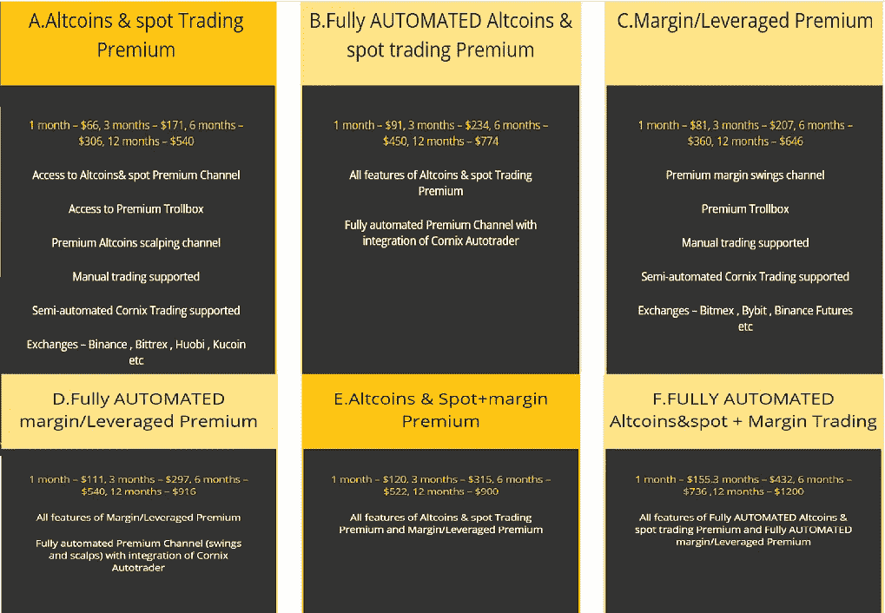

# 2023 年顶级加密电报频道列表-交易信号

> 原文：<https://medium.com/coinmonks/best-crypto-signals-telegram-5785cdbc4b2b?source=collection_archive---------0----------------------->

## 加密买入信号，帮助你扩大投资组合

找到合适的加密交易信号提供商需要努力。因此，在这篇文章中，我们将讨论交易者最好的 6 个密码电报通道。

> **请使用本文提供的官方链接，有很多冒充原创品牌的诈骗信号渠道，要警惕。为题乒**[**gaur av _ Zen**](https://t.me/gaurav_zen)**拍上电报。**

# 总结(TL；博士)

*   [加密交易信号](https://signals.coincodecap.com/)由专业交易员提供，他们通过基本面和技术分析来确定资产价格。
*   管理员在各自的电报频道发布关于市场机会的帖子，并提供完成交易的所有细节。
*   市场上有太多的加密信号提供商，其中不到一半是合法的。
*   我们通过我们为密码交易员提供的[**CoinCodeCap Classic**电报频道](https://t.me/coincodecap)为您提供市场上最好的密码信号。
*   另一个渠道[验证加密交易员](https://t.me/VCT_Subscription_bot?start=a121)或 VCT 因其基本的 YouTube 视频而闻名，其资深分析师拥有超过 30 年的经验。
*   多一个频道[通用加密信号](https://www.universalcryptosignals.com?ref=9113)为其服务提供最多样化的计划，你可以从六个可用的计划中选择任何一个。
*   无论是熟练的交易者还是新手，每个人都可以从平台的加密信号中受益。OnwardBTC 也和 Bybit 合作，给你免费的加密信号。

> *我们在 CoinCodeCap(CoinCodeCap)也是* [*在 Bybit*](https://coincodecap.com/go/coincodecap_page) *的主操盘手。在 Bybit 跟随我们，让我们为你交易。*

 [## 2023 年最佳免费加密交易机器人

### 2021 年币安、比特币基地、库币和其他密码交易所的最佳密码交易机器人。四进制，位间隙…

medium.com](/coinmonks/crypto-trading-bot-c2ffce8acb2a) 

# 什么是加密交易信号？

对于一个交易者来说，理解加密市场的本质可能需要几年时间。因此，存在着为你提供市场进出点的加密交易信号。

由有经验的密码交易员创建，信号为给定的资产提供进场、出场和止损。这些交易信号大多基于技术分析。

要了解更多，你可以阅读我们的文章[什么是加密交易信号](https://coincodecap.com/what-are-crypto-trading-signals#h-what-are-crypto-signals-telegram-channels)？如果你是加密交易的初学者，你可以通过我们的[指南来投资加密货币](https://coincodecap.com/crypto-investing-guide)。

# 加密交易信号是如何工作的？

在订阅计划时，你必须加入几个电报频道来接收包含交易机会的更新。更新将包含一个或多个进场价格、出场价格、止损和其他细节。这些频道的管理员定期发布市场机会的更新。

> 使用 code FREE 在 Cornix 上获得折扣。

# 交易者的最佳加密交易信号电报渠道

市场上有大量的加密交易信号提供商，其中几乎一半都是骗子。那么，你应该如何确定哪个渠道最适合你呢？嗯，我们已经准备了 6 个最好的加密交易信号提供商的名单。

> *请使用本文提供的官方链接，有很多冒充原创品牌的诈骗信号渠道，要警惕。*

# 1.CoinCodeCap 加密信号

我们最近开始向我们的[电报频道](https://t.me/coincodecap)的成员提供密码购买信号。我们是 [Coinmonks](https://medium.com/coinmonks) ，一个基于基本面和技术面分析提供信号的专业交易者团队。我们有超过 7000 篇关于加密货币的文章和指南。

CoinCodeCap

## CoinCodeCap 信号——它是如何工作的？

我们的基本面和技术专家讨论市场的本质，并为您提供准确的加密买入信号。管理员会定期在[CoinCodeCap Classic telegram channel](https://t.me/coincodecap)上发布有关市场更新的帖子，并提供所有必要的信息来下单。

## CoinCodeCap NFT 信号

我们的 NFT 信号识别最有利可图的翻转，跟踪最热门的趋势 NFT 等，然后根据这些发现采取行动。我们希望帮助我们所有的会员成为非常赚钱的交易者，为他们提供 NFT 交易信号，让您实时跟踪 NFT 收藏家和有影响力的人在模仿哪些项目。

此外，CoinCodeCap 为您选择正确的 NFT 集。你唯一要做的就是跟随我们的贸易信号。

## CoinCodeCap 信号—定价

由于我们最近推出了加密交易信号，您只需加入我们的 CoinCodeCap 经典电报频道。我们还有一个付费订阅计划，从每月 70 美元开始。要了解更多信息，请访问[我们的网站](https://signals.coincodecap.com/)。

## CoinCodeCap——利弊

CoinCodeCap Channel Pros and Cons

[**在电报上加入@ CoinCodeCap**](http://t.me/coincodecap)

> *请使用本文提供的官方链接，有很多冒充原创品牌的诈骗信号渠道，要警惕。*

# 2.经过验证的密码交易商

[经验证的加密交易员](https://t.me/VCT_Subscription_bot?start=a121)或者 VCT 以其现货交易信号和 [Youtube 视频](https://youtu.be/Yyom8YJdKrw)而闻名。该平台的分析师经验丰富，使用复杂的数学和模式来预测市场走势。

该平台由 telegram 运营，有三个频道和一组白金会员。该平台还允许你使用 Cornix bot 并完全自动化你的交易。

Verified Crypto Traders Telegram channel

## 经过验证的密码交易员——它是如何工作的？

管理员在各自的通道中发布加密买入信号，这取决于头皮交易或摇摆交易。

任何渠道中关于交易机会的特定帖子都带有买入范围、止盈、止损，以及一个使用 [Cornix bot](https://coincodecap.com/cornix-review) 直接跟踪信号的按钮。

## 认证加密交易商—定价

VCT 向其订户提供四种计划:每月一次、每季度一次、每两年一次和每年一次。每个计划的价格如下:

*   每月:99 美元
*   季刊:270 美元
*   两年一次:540 美元
*   年费:999 美元

## 经过验证的加密交易者——利弊

Verified Crypto Traders Pros and Cons

# 3.通用加密信号

通用加密信号在他们的公共加密信号电报频道中有超过 27k 的追随者。该平台于 2018 年开始提供加密信号，对[币安比特币交易](https://www.binance.com/en/register?ref=UARTH1S1)的准确率仍超过 96%。

Universal Crypto Signals

## 通用加密信号——它是如何工作的？

该平台使用各种密码信号电报通道运行。他们为你提供频繁的技术和基本面市场分析。无论是熊市还是牛市，他们的信号都会不断出现。你可以从他们的主页上了解更多关于平台运作的信息。

## 通用加密信号—定价

通用加密信号公司向其用户提供六种不同的方案。下表简要说明了其所有计划:

Universal Crypto Singals Pricing

有关每个计划及其功能的详细信息，请参考下图:

Universal Crypto Traders Plans

## 如何注册通用加密信号？

您可以访问[通用密码信号](https://www.universalcryptosignals.com?ref=9113)的官方网站，选择一个计划，并完成支付以加入他们的高级密码信号电报频道。您还可以加入免费的通用加密信号电报频道，并按照频道中提供的步骤进行操作。

# 通用加密信号——利弊

Universal Crypto Signals Pros and Cons

# 4.OnwardBTC

该平台向所有人提供加密信号，无论他们是专业交易者还是新手。 [OnwardBTC](https://t.me/OnwardBTCBot?start=a4) 甚至与 [Bybit](https://blog.coincodecap.com/go/bybit) 合作，为你提供一个月的免费加密信号。

OnwardBTC

平台上的所有信号都有技术分析的支持。此外，OnwardBTC 为您提供不同类型的[加密交易机器人](/coinmonks/crypto-trading-bot-c2ffce8acb2a)，全天候运行。你也可以看看他们的[性能表](https://docs.google.com/spreadsheets/d/1v2qFPqpR85xv-Sf5iMs28VxyxTQPiWvcYqyQfsFbJZ8/edit?usp=sharing)。

## OnwardBTC —它是如何工作的？

OnwardBTC 为密码交易员运营电报渠道，所有渠道都支持 cronix bot 来实现交易自动化。OnwardBTC 的团队专门从事杠杆交易，也是 Arya Signals 的合作伙伴。此外，你可以通过他们的高级电报组与专业人士互动。

## OnwardBTC —定价

你可以通过 bit 注册[并开始一个月的免费，或者你可以加入他们的公共电报频道，然后浏览固定消息以获得订阅。这些计划起价为每月 19.5 美元，其特点如下图所示:](/coinmonks/bybit-exchange-review-dbd570019b71)

OnwardBTC Pricing

# OnwardBTC —优点和缺点

OnwardBTC Pros and Cons

# **5。获利农民**

ProfitFarmers 是世界上唯一的一体化加密交易副驾驶。他们的算法产生数百个高概率交易信号，然后由他们的专业交易员团队进行审查。然后，他们让会员能够在平台内直接复制交易这些信号。因此，它的信号结合复制交易和先进的交易功能都在一个服务。

他们的免费电报组——[profit farmers Crypto Signals(Lite)](https://t.me/freepfsignals)——是为数不多的免费电报加密信号组之一，这些组实际上提供有用的、获胜的信号(*2021 年完成交易的胜率为 78)*。

任何对交易有足够了解的人都可以接受这些信号，并满怀信心地继续交易，因为他们很有可能 100%免费交易。

## 利润农民——它是如何工作的？

[ProfitFarmers 算法动态扫描市场，](https://www.profitfarmers.com/crypto-trading-signals/#a_aid=Coinc&a_bid=0e174f2e&chan=cryptosignalstg)考虑到人类可能忽略的十几个不同因素。这使它能够识别出典型的“人为”信号之外的概率极高的交易。

然后，他们的团队审查每个信号，确认这确实是一个好机会，并将最好的信号发送给他们的付费会员。

## 利润农民—定价

Telegram 组是 100%免费的，但是如果你想升级，整个平台包括信号和交易工具是 299 美元/月。

在这里阅读我们对 ProfitFarmers 的全面评论。

# 获利农民——利弊

## 赞成的意见

*   自由组提供高胜率信号，经专家审核
*   合法注册的公司，具有透明的领导和报告
*   频繁的信号(*通常每周 3-4 次)*
*   全平台提供信号加复制交易，自动交易，和先进的工具

## **缺点**

*   利润目标缺失
*   需要一些交易知识

# 哪个是最可靠的加密信号服务？

我们通过我们的 [CoinCodeCap 经典电报频道](http://t.me/coincodecap)提供市场上最可靠的加密信号服务之一。你也可以加入 VCT 电报频道，因为 VCT 电报集团的分析师是资深交易员，提供大量信息。

# 如何获得免费的加密信号？

你可以在 telegram 上搜索提供免费加密信号的频道。我们 CoinCodeCap 也通过我们的电报频道提供免费的加密信号。要了解更多，请阅读我们关于[最佳免费加密信号](https://coincodecap.com/free-crypto-signals)的文章。

# 密码电报聊天哪个最好？

你可以和我们一起分享一些[最佳加密交易信号](/coinmonks/top-3-telegram-channels-for-crypto-traders-in-2021-8385f4411ff4)。VCT 电报小组是新手的宝地，因为你可以和许多有经验的交易者交流。你也可以加入公牛或肥猪信号电报频道，因为它们服务于更多的观众。

# 哪些是最好的加密信号机器人？

几乎所有的平台都提供 Cornix 加密信号机器人，通过电报实现交易自动化。这些平台中的一些要求你为这个机器人支付月费。您也可以使用其他加密信号机器人提供商的服务，如 [Pionex](https://blog.coincodecap.com/go/pionex) 、 [Bitsgap](https://blog.coincodecap.com/go/bitsgap) 、 [CryptoHopper](https://blog.coincodecap.com/go/cryptohopper) 等。

# 交易员电报渠道:结论

既然你要付钱给信号提供商，你必须研究他们的服务。有些平台向你收取很高的费用，并且不提供高质量的信号。

因此，您可以加入我们的 [CoinCodeCap 经典电报频道](http://t.me/coincodecap)，获取市场上一些最好的加密信号。VCT 电报频道对初学者来说也是一个不错的选择，因为它的 YouTube 视频提供了一些最好的市场分析。

# 常见问题

**如何识别加密信号？**

主要有两个方面；一种是纯粹基于新闻的。例如，如果一个事件有利于市场，那么价格就会上涨，如果不利于市场，那么价格就会下跌。第二个方面可以是付费的加密信号提供商，他们利用基本面和技术面的分析来预测硬币的价格。你可以从我们关于[什么是加密交易信号的文章中了解加密信号提供商。](https://coincodecap.com/what-are-crypto-trading-signals#h-what-are-crypto-signals-telegram-channels)

**密码信号合法吗？**

市场上几乎一半的加密交易信号提供商都是骗子。因此，对于一些最好的市场机会，你可以加入我们的 [CoinCodeCap 经典电报频道](http://t.me/coincodecap)。

**有哪些好的信号组加密？**

[电报](https://telegram.org/)上有很多密码信号组或者不和谐。这些群体为你提供了进入和退出市场的机会。你也可以加入我们的 [CoinCodeCap 电报频道](https://t.me/coincodecap)，获得一些最好的加密信号。

*   [什么是加密交易信号？【解释 2021】](https://coincodecap.com/what-are-crypto-trading-signals)
*   [4 个最佳免费加密信号|顶级加密交易信号电报频道](https://coincodecap.com/free-crypto-signals)
*   [比特币闪电网概述](https://coincodecap.com/an-overview-of-bitcoin-lightning-network)
*   [Bitsgap 评论|加密期货交易机器人和套利](https://coincodecap.com/bitsgap-review)

**包含附属链接**

