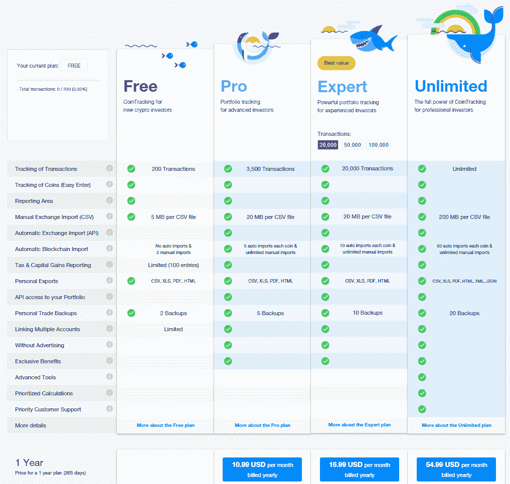
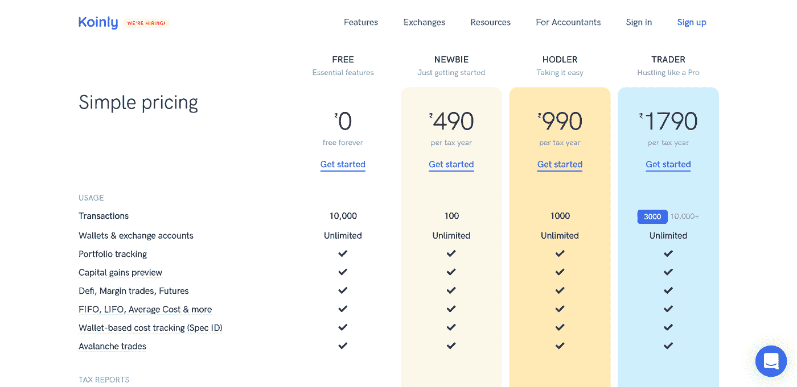
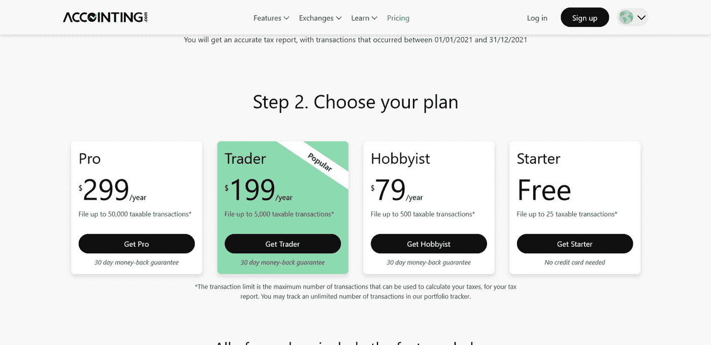
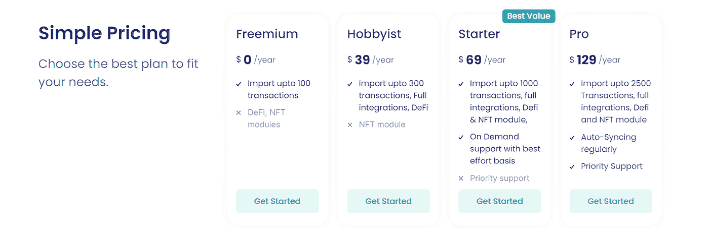
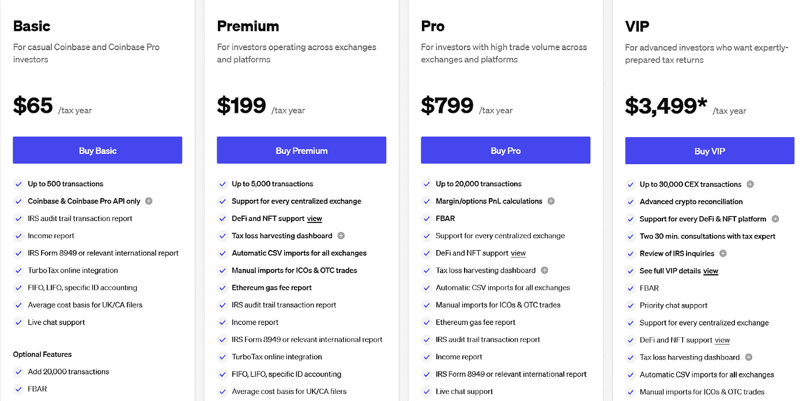
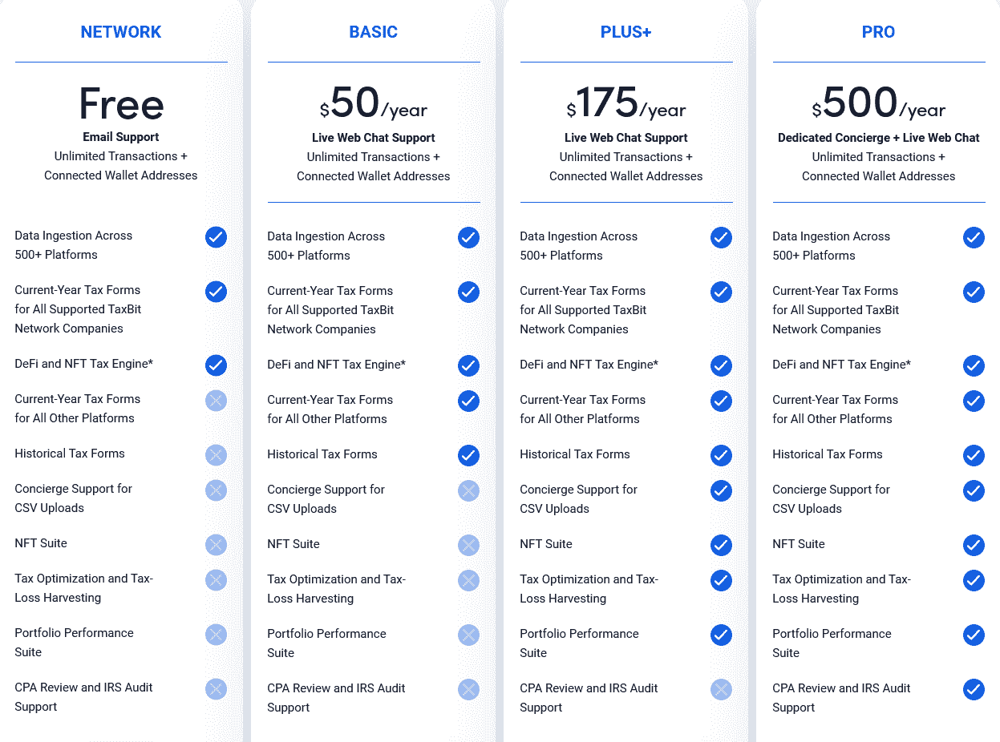
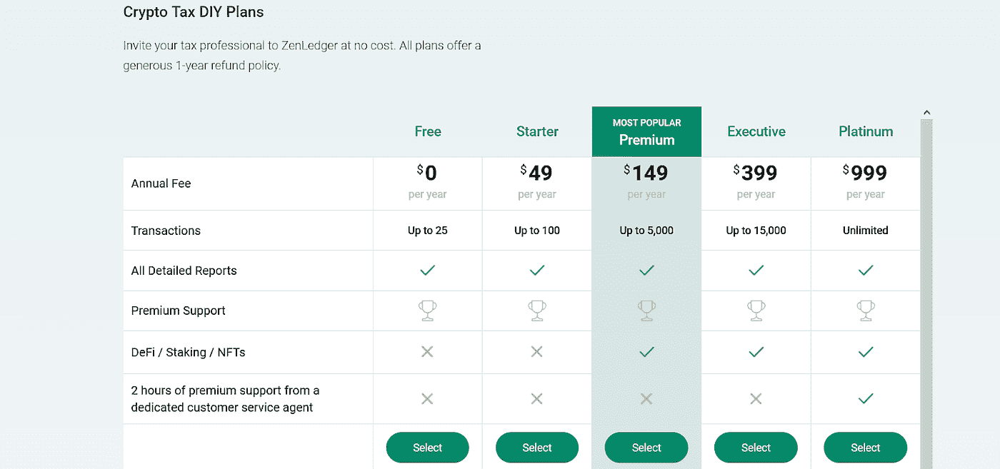
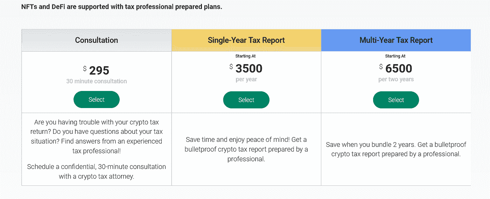
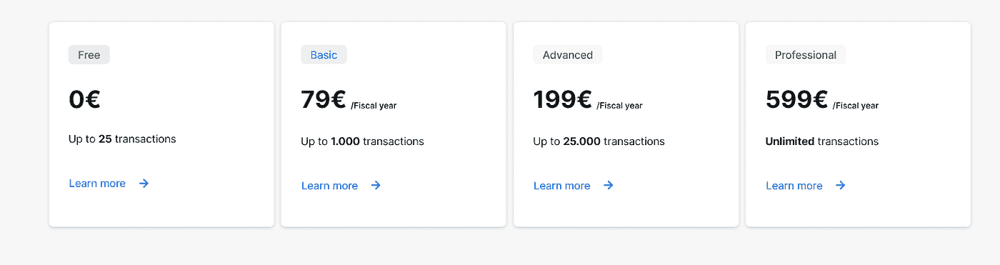

# 2023 年 9 款最佳免费加密税务软件

> 原文：<https://medium.com/coinmonks/best-crypto-tax-tool-for-my-money-72d4b430816b?source=collection_archive---------0----------------------->

## 比特币税务软件和加密货币报税软件

无论你是密码交易的初学者还是已经在这个领域呆了一段时间，你都需要交税。随着法规的生效，您必须正确计算加密税。加密税务软件允许你计算利润和损失，从你的加密交易，并采取扣除费用。因此，这篇文章列出了一些最好的加密税务软件，他们的主要功能，和一些关键的统计数据。

## 什么是加密税务软件？

加密税软件计算你的加密税和最简单的申报过程。这个软件已经被编程，所以对于没有技术知识的密码交易者来说，使用它和报税变得很容易。

此外，加密税务软件可以帮助您跟踪您的加密投资组合。这些功能允许您将交易分为收益和损失，这将自动转换为纳税申报。

## 在加密税务软件中寻找什么特征？

在选择加密税务软件为您的税务准备，你应该审查一些功能。下面提到了其中的一些功能:

1.  您选择的加密税务软件应该允许您无缝上传多个 CSV 文件和数据，并连接 API 和钱包。
2.  尝试寻找能确保你实际数据安全的税务软件。
3.  加密税务软件应该允许您将文件导出到所有主要的税务申报平台，如 TaxAct 或 TurboTax。
4.  这个软件应该可以帮助你追踪你的交易历史。
5.  它应该有助于您获得完整的审计支持。
6.  选择的加密货币税收软件应该提供研究加密硬币的工具和交易工具，如图表。

## 新手用什么税务软件最好？

一些对初学者来说最好的税务软件有 [**Koinly**](https://coincodecap.com/go/koinly) 、 [**CoinTracking**](https://coincodecap.com/go/cointracking) 和[**cryptax calculator**](https://coincodecap.com/go/cryptotaxcalculator)。

# 9 最佳加密税计算器[首选]

## 1. [CoinTracking](https://coincodecap.com/go/cointracking) —最适合通过移动应用程序准备税款

众所周知，CoinTracking 是世界上第一个[加密投资组合管理器](https://coincodecap.com/free-crypto-portfolio-trackers)和税务报告工具。它于 2013 年推出，旨在让加密爱好者的生活更加轻松。

此外，CoinTracking 还会分析您的交易，并生成关于损益、税收、已实现和未实现收益的硬币价值等实时报告。

***同样，阅读***[***coin tracking vs koin ly:简化你的加密税***](https://coincodecap.com/cointracking-vs-koinly)

**硬币跟踪功能**

1.  CoinTracking 税务软件允许您从 110 多个交易所导入数据，并支持与[区块链](https://coincodecap.com/what-is-blockchain-a-simple-guide-for-dummies)直接同步。此外，它将使您能够导出各种格式的文件，如 CSV、XML、PDF 等。
2.  该平台通过考虑收入、资本收益等各种因素，帮助您生成 100 多个国家的税务报告。
3.  您可以为您的所有交易和硬币使用 25 个可定制的加密报告和交互式图表。
4.  硬币追踪的最大优势在于，你拥有所有 10，914 枚硬币的完整历史记录，并能获得这些资产的最新价格。
5.  此外，您可以通过交易和交易量、硬币统计、趋势和分析来访问所有顶级硬币。

**共同追踪定价**

CoinTracking 的每个新投资者都可以获得一个多达 200 笔交易的免费计划，扩展功能的愿望鼓励投资者从下面提到的 3 个付费计划中进行选择。

**coin tracking 安全吗？**

是的，Cointracking 是安全的，并且已经在市场上存在了 12 年以上。它支持匿名注册，并提供完整的数据和 API 加密，也可以用 2FA 保护。

此外，Cointracking 无法访问您通过应用程序连接的交易所的提款权。他们只能看到你账户中的活动，这意味着即使在 Cointracking 受到黑客攻击的情况下，你的硬币在你储存它们的交易所/钱包中也是安全的。

## 2.[k 仅](https://coincodecap.com/go/koinly) —最适合自动化税务报告

Koinly 无疑是 2018 年创立的顶级加密税务软件之一。它会自动跟踪您的 exchange 帐户和钱包地址的加密交易。

此外，它可以有效地识别您的兑换账户/钱包内的转账，并在您兑换加密货币时保留原始购买成本的所有痕迹。

此外，该平台支持全球税务报告，允许您通过 API、CSV 文件、x/y/z pub 密钥导入数据，并生成可下载为 pdf 格式的报告。

此外，它支持各种会计方法，如先进先出(FIFO)、后进先出(LIFO)和共享池方法，并生成国际税务报告、附表 D 报告等，从而促进跨多个国家的服务。

**柯伊莉特色**

1.  Koinly 税务软件允许用户跟踪他们的加密投资使用实际投资回报率和投资菲亚特。此外，它提供了一个详细的收入概况，你的创收活动，如采矿，赌注等。
2.  该平台允许自动数据导入，并提供您整个交易活动的单独画面。
3.  Koinly 发布可靠的加密税务报告，并遵守全球所有适用的加密货币税法。
4.  此外，该平台允许您使用各种工具解决交易问题，包括双重分类账系统、突出显示由于不正确或缺失的交易导致的错误，以及自动导入验证。

***同样，阅读***[***coin tracking vs koin ly:简化你的加密税***](https://coincodecap.com/cointracking-vs-koinly)

**k 仅定价**

与其他平台相比，Koinly 提供了具有竞争力的价格。此外，它允许终身免费试用期，无需提交您的信用卡。

**ko inly 安全吗？**

是的，Koinly 完全可以安全使用，因为它在存储 API 密钥之前使用 aes-256-gcm 对它们进行加密。此外，所有服务和数据都托管在一个应用程序上，该应用程序在每一层都应用了一些安全检查，以保护客户免受威胁。

只有工作需要数据的授权员工才能访问客户数据。此外，Koinly 通过第三方安全工具执行笔测试和漏洞扫描。

Koinly 的其他安全检查包括每年对员工进行安全和意识培训、一套详细的安全政策、员工必须签署的保密合同等。

## 3.[会计](https://coincodecap.com/go/accointing)——最适合密码交易新手

Accointing 是一个优秀的一站式解决方案，为您所有的加密税务问题。此外，该平台提供了广泛的工具，帮助您以简单和用户友好的方式跟踪和管理您的加密税。

此外，Accointing 具有灵活的功能，允许您创建个性化的税务策略，包括自动分类和计算您的加密税的加密税计算器和跟踪您的加密投资组合的加密跟踪器。

**会计特征**

1.  众所周知，会计软件可以自动进行加密税款计算。
2.  它提供各种洞察工具，并毫不费力地管理您的[加密组合](https://coincodecap.com/crypto-portfolio-rebalancing)。此外，您会得到一个资产分配图表，该图表会建议您接下来应该购买什么加密资产。
3.  您还可以将您的交易所和钱包链接到平台，并自动导入数据。
4.  会计在一份综合报告中提供了所有交易的完整明细。

**记账定价**

Accointing 是一个提供市场上最容易获得的价格和免费交易报告的软件。它还包括交易功能。该平台提供 4 种方案。

**会计安全吗？**

是的，Accointing 可以安全使用。它通过 SSL 保护整个服务间或客户机/服务器间的通信。此外，它通过 OAuth 使用身份认证和管理，OAuth 是一种开放标准的授权协议，可以简化平台的复杂性。

您可以随时从平台中导出数据，没有任何限制。如果您决定删除您的帐户，您的所有数据都将从其数据库中删除。

## 4.[cryptax calculator](https://coincodecap.com/go/cryptotaxcalculator)——最适合复杂的税收计算

CryptoTaxCalculator 的工作方式是，它可以理解你的纳税义务。此外，他们的工具有助于准确、轻松地识别、组织和跟踪您在数百个交易所和区块链的所有加密活动。

此外，该平台于 2018 年进入市场，总部位于澳大利亚悉尼。此外，不要再纠结于 excel，使用加密税收计算器来获得可配置的税收设置。此外，它整合了重要的交易所、钱包和连锁店，并涵盖了 [NFTs](https://coincodecap.com/nft-marketplaces) 、DEX 和 [Defi trading](https://coincodecap.com/top-defi-protocols-to-watch-out-for-in-2022) 。

**密码计算器功能**

1.  该平台提供强大而准确的税务报告。它以高精度执行您的所有税务计算。此外，他们还仔细考虑所有复杂的情况，如 DEX 交易、[杠杆交易、](https://coincodecap.com/margin-trading)、[赌注回报、](https://coincodecap.com/best-crypto-staking-coins)、[违约贷款、](https://coincodecap.com/what-are-flash-loans-on-ethereum)以及汽油费。
2.  CryptoTaxCalculator 提供了每个计算的完整分类。它能让你很快明白你的税是如何计算的，以及它适用的规则。
3.  该平台支持 Defi 和 DEX 交易。
4.  CryptoTaxCalculator 受到重视准确和详细报告的行业领先会计师的信任。
5.  它集成了 500 多个交易所，包括所有主要的国际交易所。

**CryptoTaxCalculator 定价**

CrytoTaxCalculator [的定价结构](https://cryptotaxcalculator.io/en/pricing/personal)为您的账户提供了四种不同的方案。因此，要获得您的加密税务报告，您需要支付所需的计划。

此外，该平台的定价结构采用年度订阅方式，如果你不满意，所有计划都有 30 天的退款保证。

**密码计算器安全吗？**

CryptoTaxCalculator 是一款安全的产品，不会询问你的加密钱包的私钥。此外，所有的 API 密钥在传输和静止时都被安全地存储和加密。

此外，该平台通过了 SOC 2 Type 1 认证，具备安全机制来确保您的数据安全。同样，CryptoTaxCalculator 强制执行密码复杂性标准，以最大限度地提高用户的安全性，并且使用 salt + bcrypt 哈希函数存储所有凭证。

## 5.[Kryptoskatt](https://coincodecap.com/go/kryptoskatt)——最能减少你的加密税单

Kryptoskatt 是最好的加密税软件，如果你想在几分钟内计算出你的加密税的同时最大限度地节省你的税款。web3 应用程序为您提供了广泛的集成—支持 200 多种钱包和交换、50 多种区块链、1000 多种 DeFi 协议，以及对您的 NFTs 的专门支持。因此，无论你是在下注还是贷款，或者你的投资组合是否包括 DeFi 或 NFTs——Kryptoskatt 都能帮你搞定。

该平台的独特效用为币安孵化计划的第五季铺平了道路。我还需要说什么吗？

**Kryptoskatt 特性**

1.  该平台支持 1000 多种 DeFi 协议和 50 多种区块链，因此您可以自由计算所有加密资产的税收。
2.  您可以通过 API 自动同步您的所有数据，或者使用自定义 CSV 文件从 200 多个交易所和钱包导入您的交易数据。
3.  [Kryptoskatt 应用程序](https://coincodecap.com/go/kryptoskatt)具有智能检测能力，可根据特定变量对您的所有交易进行分类，以提供准确的分析
4.  您还可以获得专用的 DeFi 和 NFT 仪表盘来跟踪和管理您的数字资产组合
5.  您可以轻松生成符合当地法律的免费加密税务报告，轻松检测错误，并在一切正常后下载它们。
6.  该平台利用税收损失收集等智能节税策略，并自动将其用于适用的交易，为您节省数千英镑的加密税。
7.  除了应用程序的简单性和友好的 UI/UX，Kryptoskatt 脱颖而出的一点是它对 DeFi 交易和 NFTs 的大规模集成支持，这远远超过市场上任何其他竞争解决方案。

Kryptoskatt 定价

Kryptoskatt 拥有市场上最实惠的价格区间。所以，你不仅节省了税款，也节省了平台本身的费用。它还包括一个免费计划，因此您可以在选择之前轻松探索该平台。

克里普斯卡特安全吗？

是的，Kryptoskatt 完全可以安全使用。他们保持用户身份“伪匿名”，这意味着该平台只收集你的电子邮件 id，不收集其他个人数据。

他们不会收集您的私有密钥或具有写访问权限的 API 密钥(这意味着他们只能读取您的事务数据以用于计算目的)。所以，你所有的加密资金在任何时候都是绝对安全的。

此外，Kryptoskatt 使用加密来存储您的所有数据，并通过 SSL 保护所有客户端/服务器通信。为了维护所有的安全标准，该团队积极提供应用程序更新和错误修复。

## 6.[token tax](https://coincodecap.com/go/tokentax)——最适合与大众交易所整合

TokenTax 成立于 2017 年，是一家在 18 个国家提供服务的报税公司。该公司提供了一个独立的应用程序，可以有效地计算加密交易和全方位服务申报的税收。

此外，作为一个税收第一的公司，它专门从事税收最小化策略。该公司支持手动数据输入和从没有 API 连接的不同交易所上传 CSV。

**TokenTax 特性**

1.  TokenTax 与您的所有钱包和帐户同步，消除了手动数据输入，让您可以在一个位置查看所有数据。
2.  你可以跟踪和预览你的纳税义务，所以你永远不会措手不及。该公司的税务报告包括先进先出、后进先出、最小化和平均成本纳税义务计算、税收损失收集仪表板、采矿和赌注收入报告、以太坊燃气费报告和自定义企业报告。
3.  该软件会自动生成您完成申报所需的每一张税单——无论您是通过 TokenTax 还是其他提供商(如 TurboTax)进行申报。
4.  TokenTax 为具有更复杂会计需求的投资者提供由精通加密的税务专业人员提供的高级对账服务。他们能够很好地处理数据，包括:缺少成本基础或混乱的数据情况、高交易量、跨链交易和企业解决方案。

**代金税定价**

TokenTax 为加密交易者提供了独特的定价方案。首先，它提供两种类型的服务——一种专门用于加密税收计算，另一种处理您所有的纳税申报需求。

**token tax 安全吗？**

是的，TokenTax 是安全可靠的软件。它使用加密和只读访问来保证所有信息的安全。此外，公司通过多种形式的安全措施保护您的数据。

## 7. [TaxBit](https://taxbit.com/ref?fp_ref=up6nz) —最适合前期税务规划

TaxBit 是一个易于使用的加密税务解决方案，由注册会计师和税务律师创建。该软件自动从交易所 API 直接导入您的所有交易。它替你做所有的计算来做你的交易活动，而不是轻松的记账。

此外，Taxbit 是独一无二的，因为它不要求你在报税前准备税务表格。它支持计算以太坊、比特币、Ripple、Polkadot 和其他几种替代币的资本损益。此外，TaxBit 还可以帮助您根据实时汇率计算应税收入。

**TaxBit 功能**

1.  该软件支持 150 多家交易所和 2000 多种货币。
2.  它提供了一个仪表板，显示您的资产余额，税收状况，和未实现的利润/损失。
3.  TaxBit 提供税收损失收获和投资组合表现分析等功能。
4.  TaxBit 允许所有专业用户在申报前安排一次与注册会计师的年度电话会议，以审查他们的表格。

**TaxBit 定价**

TaxBit 的定价与市面上的其他加密税务软件颇为相似。有三个付费等级可供选择，您决定购买的每种类型的帐户都可以免费试用。

**tax bit 安全吗？**

是的，TaxBit 绝对是一款安全的加密税务软件。该公司已经获得了独立的 SOC 2 认证，这意味着它拥有出色的安全实践来保护用户信息的安全。

此外，TaxBit 使用 AWS RDS 托管的数据库服务器，所有数据在传输和静态时都使用 AES 256 加密。

## 8. [ZenLedger](https://coincodecap.com/go/zenledger) —税务专业人士的最佳选择

ZenLedger 加密税务软件最适合加密交易员和税务专业人士，他们需要一种方法来简化这一新的分散金融(Defi)浪潮中的加密税务会计流程。

此外，与市场上的许多其他加密追踪器类似，ZenLedger 与各种交易所和加密货币网络集成，为在这些动荡市场中运营的交易员提供全面覆盖。

**ZenLedger 功能**

1.  ZenLedger 提供了一个税收损失收获工具，它可以自动分析你的交易历史，并在每年 12 月 31 日的截止日期之前列出所有可以利用的税收节省机会。
2.  它很容易将您的交易数据与 TurboTax 桌面或在线集成。
3.  ZendLedger 在一个可读的电子表格中预览你的钱包和交易所的交易历史。
4.  这些平台提供带有税务顾问服务的计划，以指导和申报纳税。
5.  它支持 400 多个交易所、40 多个区块链和 20 多个 Defi 项目。
6.  该平台还提供免费和付费计划的按需客户服务团队。
7.  它支持美国税收遵从用户。

**ZenLedger 定价**

ZenLedger 为其加密税务会计平台提供了各种帐户类型，以确保他们能够为广泛的加密用户提供服务。

因此，无论你是最近才首次购买比特币，还是多年来一直在定期交易各种加密资产，ZenLedger 都会有一个符合你需求的账户层。

**曾莱杰安全吗？**

ZenLedger 是一个安全可信的平台，因为它只能只读访问您的所有交易。此外，该平台对客户数据进行加密，并尽可能避免所有个人身份信息，以增加其安全性。

## 9. [Blockpit](https://coincodecap.com/go/blockpit) —最适合简单交互的 UI

Blockpit 一直在处理比特币等数字货币的合规问题，并开发了一个结合所有数字货币来源的软件平台。这简化了复杂法规、反洗钱准则和税法带来的流程。

此外，它为其平台用户集成了有益的实时税务报告功能，并通过无缝集成到您的(加密)托管解决方案中，提高了合规性和反洗钱流程的效率。

**区块坑特征**

1.  Blockpit 帮助您构建合法合规的税务报告(德国、美国、瑞士、中国、美国、法国)。
2.  将您的 exchange/wallet 连接到 Blockpit 应用程序后，您将获得您所有资产的概览。所以，你可以看看自己整体一直做的怎么样。
3.  您可以通过手动输入或自动同步来导入交易，并将您的所有国家报告下载到一个文件中。
4.  在“报告”页面上，您可以查看计算出的已连接交易所/钱包的已实现损益。
5.  通过 API 密钥将您的交易所连接到 Blockpit 后，您可以启用自动同步，所有显示的信息都将是实时的。
6.  Blockpit 加密税务应用程序检查您的仓库，以确保您的报告是准确的。

**区块坑定价**

Blockpit 按纳税年度向用户收费。所以，选择一个最适合自己的方案。

**block pit 安全吗？**

是的，Blockfit 使用起来很安全，所有的交易所都是通过一个不允许取款的 API 密匙连接起来的。因此，你所有的资产都留在你的交易所里。

此外，就钱包而言，它们是通过一个公钥连接的，从来不需要你的私钥。

## 结论-最佳加密税务软件

交易加密货币需要缴税，出于上述目的，你需要能够准确计算你的资本损益的软件。因此，加密税务软件使这变得非常容易，并自动同步不同的[加密交易所](https://coincodecap.com/crypto-exchange)和钱包，在几分钟内为您提供税务报告。毫无疑问，CoinTracking 和 Accointing 是加密货币最好的税务软件。这两个软件管理你的加密投资组合，提供准确的税务报告，并支持不同的交易所和钱包。此外，这两个平台都是新手和专业交易者的理想选择。

## **对初学者来说最好的税务软件是什么？**

对于初学者来说，一些最好的税务软件是 Koinly、CoinTracking 和 Accointing。

## **在加密税务解决方案中需要寻找什么？**

如果您在使用加密税务解决方案之前寻求自动化数据输入、灵活性、定价、可靠性、功能、税务报告质量、客户支持和易用性，这将有所帮助。如果你是加密新手，避免在两种工具之间转换来管理你的加密投资组合和税收。

## **加密货币资本利得需要缴税吗？**

是的，您必须根据您的管辖范围对您的加密货币收益纳税。

## **如何避税？**

有一些方法可以让你从战略上和逻辑上避免秘密税。其中一些是:

*   将 crypto 投资于个人退休帐户、养老金或年金基金
*   用损失抵消收益
*   持有您的加密货币，并有资格获得长期资本收益率

## **如何申报加密税？**

使用上面提到的任何加密货币税计算器，一旦完成上述软件还与 CPAs 链接，这可以帮助您提交您的加密税。

此外，你可以阅读

*   [coin tracking Review——一款可靠的加密税务软件](https://coincodecap.com/cointracking-review-a-reliable-cryptocurrency-tax-software)
*   [CoinTracking vs Koinly:简化您的加密税](https://coincodecap.com/cointracking-vs-koinly)
*   [令牌税务审查:加密税务软件和会计服务](https://coincodecap.com/tokentax-review-bitcoin-tax-software-and-accounting)
*   [ko only 点评——它真的是一款好的税务软件吗？](https://coincodecap.com/koinly-review)
*   [会计审查-完整的加密税务解决方案](https://coincodecap.com/accointing-review-a-complete-crypto-tax-solution)