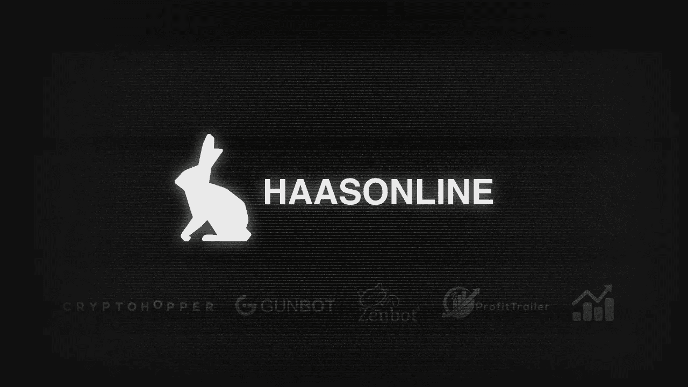
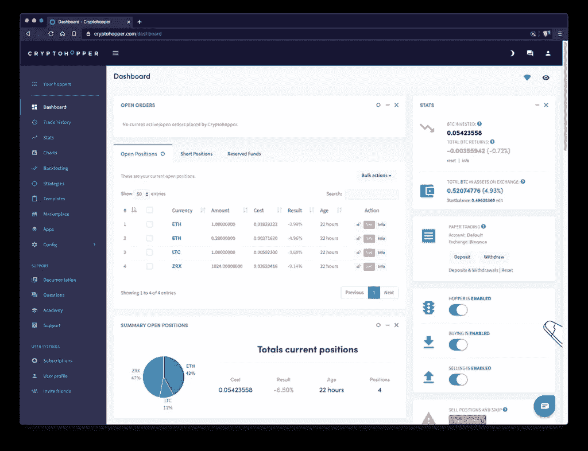
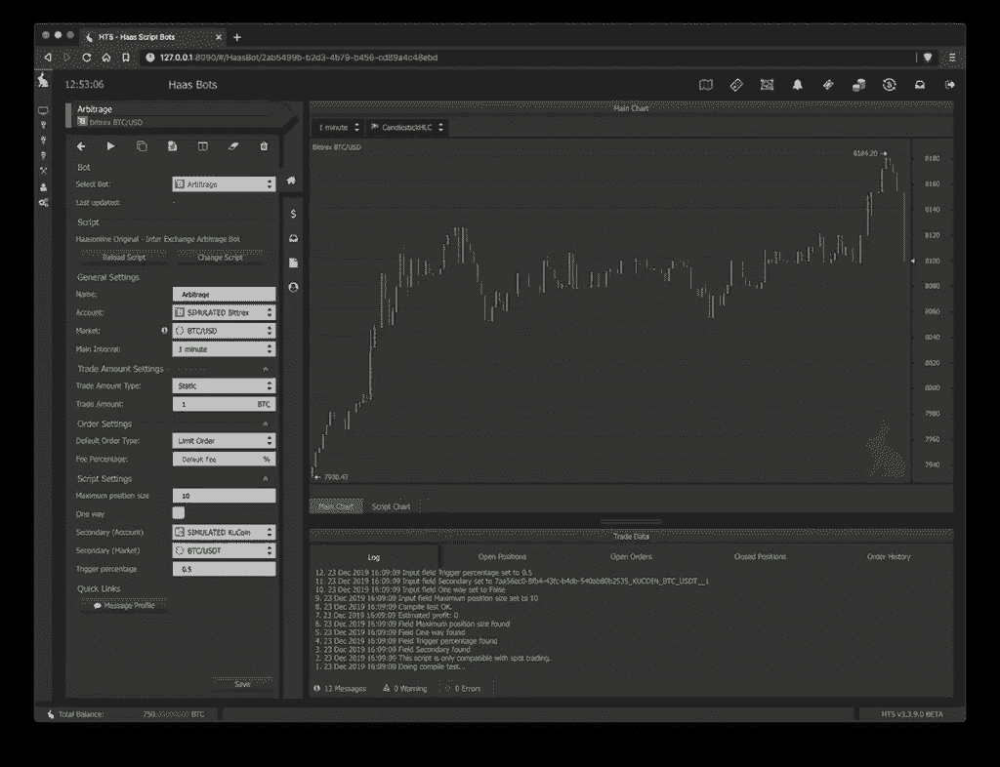
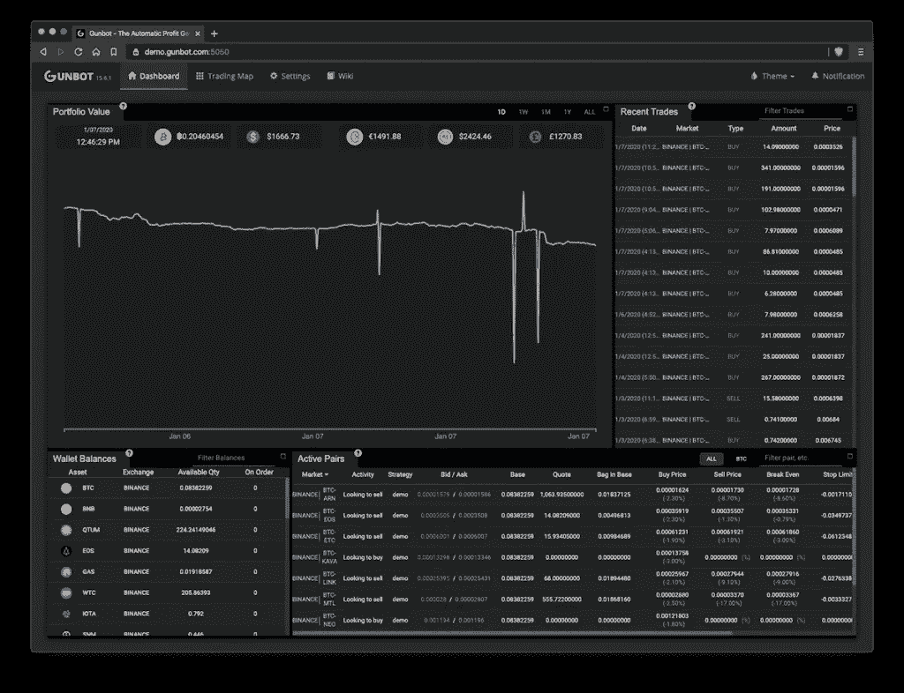
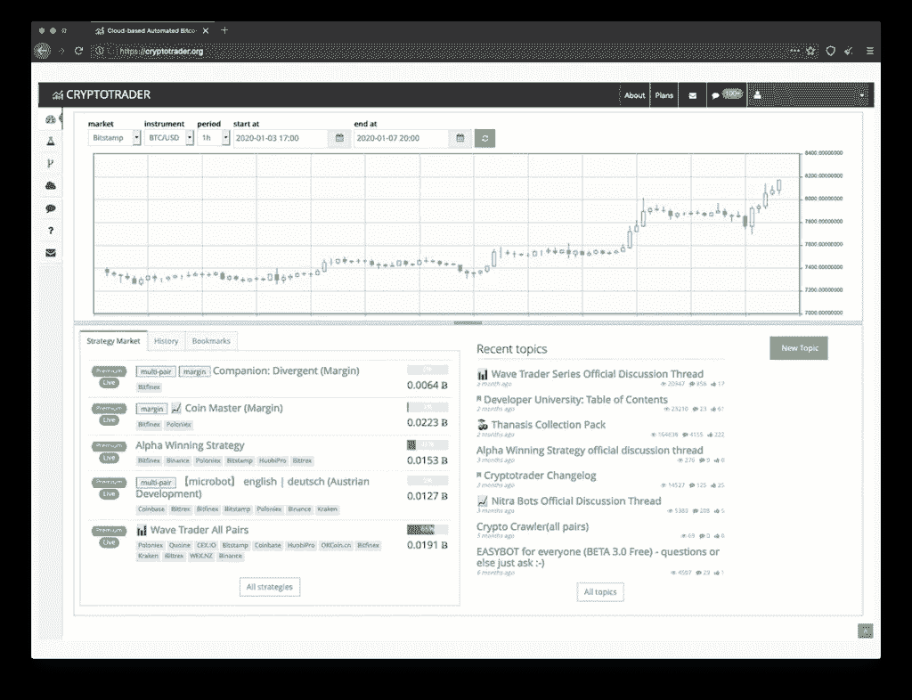
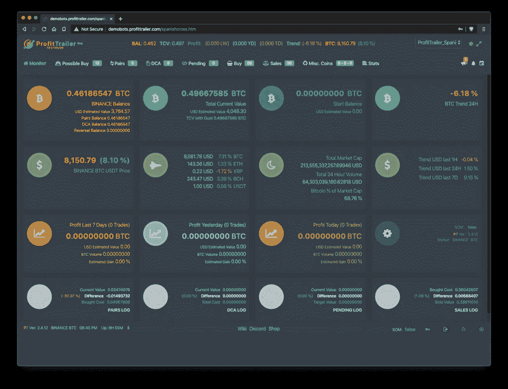

# 2020 年最佳加密交易机器人——五大比特币交易机器人回顾

> 原文：<https://medium.com/coinmonks/best-crypto-trading-bots-of-2020-top-5-bitcoin-trading-bots-reviewed-44e1f28e7c6c?source=collection_archive---------2----------------------->

# 密码交易机器人简介

众所周知，在外汇或股票等传统市场中，这些交易的很大一部分是由机构、日间交易员和其他实体管理的交易机器人执行的。

这些高频交易技术已经改变了金融科技的面貌，交易员和公司都在不断努力保持自己的优势。随着 2017 年末[比特币](https://medium.com/coinmonks/bitcoin/home)的爆发，这种前沿的交易方式在加密货币交易所迅速发展。

与传统交易所相比，数字资产交易所更加丰富，而且很少关闭。新时代的日内交易者必须适应并学会使用这些先进的交易自动化形式。

个人、组织和公司都在寻找创造性的方法来提高利润率和效率。

实现这一点的一个方法是自动化人工交易策略，这在历史上被证明是有利可图的。最基本的形式是，大多数[比特币](https://medium.com/coinmonks/bitcoin/home)交易机器人使用的平台允许用户配置脚本中存在的变量，这些变量通常是技术指标产生的值的阈值。交易机器人的其他功能可能包括复制交易、外部信号、脚本语言、图表等。

在我们的评论指南中，我们将看看 2020 年前 5 大比特币交易机器人，我们喜欢(或不喜欢)的功能，支持的交易所，以及日交易者在交易自动化方面发展新技能所需的其他功能。

# 什么是自动交易？

如前所述，自动交易已经存在了一段时间，有几个不同的名字，包括；算法交易、高频交易、系统交易、机械交易等等。自动加密交易允许交易者大规模复制人工交易策略。一旦交易者确定了一个或多个交易策略，他们可以将这些变量输入一个框架，让计算机代表他们进行交易。

据估计，大约 80%的美国股票交易来源于 T2 的自动交易软件。如果你在 2018 年之前在加密货币交易所交易，那么[很有可能是根据我们的自动化交易软件部署的交易策略](https://news.bitcoin.com/might-exchanging-bitcoin-trading-bots-not-even-know/)进行交易，因为这是唯一一个公众可以广泛使用的比特币交易机器人。

这些自动交易系统的复杂性各不相同，将从一个单一的技术指标产生信号，或使用几个与其他复杂的规则集相结合，可以根据市场运动启用或禁用新的交易策略。明智的做法是选择一个你有点力不从心的平台，可以学习利用更复杂的交易技巧。

> 也请阅读我们的[哈森在线评论](/coinmonks/haasonline-review-d8d1a3400419)

# 什么是加密交易机器人？

加密货币交易机器人是交易自动化软件的副产品，它们执行人工交易策略，通常集成到一个或多个加密货币交易所中。交易机器人已经存在于外汇等市场中，并一次又一次地证明了自己。有了[加密货币](https://medium.com/coinmonks/crypto/home)，这些交易机器人没有什么不同，能够以人工交易无法比拟的效率全天候利用市场。

这些交易机器人在价格、复杂性和可扩展性方面各不相同。我们花时间列出了初级、中级和高级加密交易产品(和我们一样)。也有免费和开源的选择提供给更坚定和精通技术的交易者。

# 加密交易机器人是如何工作的？

加密交易机器人能够按照其特定策略或脚本的定义执行买卖订单。通常，这些订单遵循传统交易市场上成功存在的成熟交易策略，包括乒乓、刷单、套利等。一旦交易机器人确定了买卖订单，它们就会在交易所的 API 上执行，从而产生高频自动交易。

根据你使用的产品，交易机器人的功能可以是设置限价单这样的基本功能，也可以是执行三角套利这样更复杂的功能。交易机器人将使用技术指标和其他信号的组合来计算你的自动化策略的买入或卖出订单。

一旦你用你想要的策略正确地配置了一个交易机器人，它通常会被一种叫做回溯测试的技术检查。这使用历史交易数据来确定你的交易策略是否有盈利的潜力。交易员还使用另一种方法，称为纸上交易或模拟交易，使用实时交易数据。回溯测试和模拟都有缺陷，但一般来说，这是一个很好的指标，可以预测你的交易机器人会有什么样的表现。

> 另请阅读:最佳加密交易机器人

# 选择交易平台时需要考虑什么

## **可靠性**

这是任何严肃的贸易自动化软件或产品开发者的首要任务。作为交易者，你相信第三方软件不仅能做广告上说的，而且可靠。大多数上市公司都有在加密货币交易所可靠执行成熟交易策略的记录。要确保这些公司开发的产品能够持续接收更新、新功能和 exchange 集成。

## **透明度**

你不应该感到惊讶，有人和公司愿意不择手段，不惜任何代价从你这里窃取。像 Bitconnect 这样的公司有庞氏骗局的所有迹象，然而许多人仍然被引诱投资这个项目，并最终获得回报。你应该能够识别公司的关键人物，并确定他们是否在创造长期值得信赖的产品。

## **安全**

谈到拣选交易自动化，有两种选择，即内部或基于云的选择。每种选择都有其独特的安全挑战。你是否相信存放你所有交易数据的基础设施是安全的，并能有效地对抗不良行为者？您是否有能力管理自己的虚拟专用服务器并实施安全措施来防止未经授权的访问？

## **盈利能力**

这似乎是一个显而易见的事情，但是你仍然经常看到有人发帖说他们几乎不赚不赔，或者有影响力的人说他们刚刚完成了一笔 9001%盈利的交易。对声称结果好得令人难以置信的公司或个人持怀疑态度，因为这些结果往往不尽人意。交易的首要规则是对你的交易方法要有耐心，并随着时间的推移不断完善。

# 2020 年五大比特币交易机器人

有越来越多的初学者友好的加密交易机器人平台，这些不会被列入我们的名单。下面提到的所有平台都有良好的记录，为自动交易提供可靠的解决方案，并参与真实的广告实践。

# 1.[隐漏斗](https://www.cryptohopper.com/?atid=14576)

[Cryptohopper](https://www.cryptohopper.com/?atid=14576) 是另一家伟大的荷兰科技公司，提供基于网络的自动化交易平台。它们于 2017 年年中推出，并迅速成为最负盛名的比特币交易机器人平台之一，面向初学者和中间交易者。

## **支持交易所**

*   币安
*   币安。美国
*   Bitfinex
*   比特雷克斯
*   比特瓦沃
*   比特币基地专业
*   火币
*   北海巨妖
*   库科恩
*   OKEx
*   波洛涅克斯

## **回测&模拟**

Cryptohopper 确实支持使用历史交易数据进行回溯测试。然而，蜡烛可以走的最短间隔是 5 分钟。像套利策略这样的高级交易也没有回溯测试或纸面交易支持。

## **脚本语言**

不支持使用像 [HaasScript](https://www.haasonline.com/features/haasscript/) 这样的脚本语言开发自动交易脚本。有一个市场确实包含付费和免费策略以及信号的选择，但是，没有办法检查隐藏的配置。

## **可视化算法设计器**

他们提供了一个基本的交易脚本设计器，允许你在创建自动交易策略时，将技术指标与买入或卖出信号拖放在一起。

## **高级订单类型**

根据他们的文档似乎， [**Cryptohopper**](https://www.cryptohopper.com/?atid=14576) ，策略将只允许您使用本地交换订单类型，如市价或限价订单，而不能创建自己的订单。

## **市场&外部信号**

Cryptohopper 提供了一个公共市场，用户可以购买和下载免费的模板、策略和租赁信号。我们觉得这是他们的服务真正闪光的地方，也是他们的社区真正热爱的地方。

## **优点**

*   基于云，易于设置
*   免费试用
*   圆滑的响应用户界面

## **缺点**

*   低质量外部信号
*   缺乏对高级交易策略的支持

# 2.[哈森在线](https://www.haasonline.com/?ref=11087)交易服务器

如果不提及我们的团队在过去六年中投入的辛勤工作，我们就不会认为这个列表是完整的。我们的旗舰产品 HaasOnline Trade Server 允许交易员部署高度复杂的加密交易机器人，这些机器人将在数十个交易所执行自动化交易策略，其精确度和可靠性已经得到了用户的信赖。

## 支持的交换

*   币安
*   币安期货
*   币安。美国
*   Bitfinex
*   比特梅克斯
*   比特熊猫阁
*   位戳
*   比特雷克斯
*   ByBit
*   CEX。超正析象管(Image Orthicon)
*   比特币基地专业
*   德里比特
*   双子星座
*   HitBTC
*   火币
*   离子体
*   北海巨妖
*   北海巨妖期货
*   库科恩
*   OKCoin
*   OKEx
*   OKEx 期货
*   波洛涅克斯

## 回溯测试和模拟

与其他平台相比，我们的回溯测试和模拟交易引擎无与伦比。我们提供多种方法来确定收盘价和详细的报告。进行回溯测试时，使用长达 56 周的一分钟蜡烛线历史市场数据。交易者还可以在纸上交易或模拟其交易机器人策略时使用我们准确的实时交易数据，以了解交易策略在真实场景中的工作情况。

## 脚本语言

我们开发了世界上最先进的脚本语言，专门用于创建高质量的自动化交易策略，以用于加密货币和加密交易机器人。 [HaasScript](https://www.haasonline.com/features/haasscript/) 允许交易者控制自动化交易策略的方方面面，包括复杂的计算、市场数据、外部钱包、内存管理等等。在这篇文章中肯定有太多的选项可以列出。

## 视觉和基于文本的加密算法编辑器

在使用 HaasScript 驱动的交易机器人时，您可以选择使用我们全新的拖放式可视化设计器来创建这种加密算法，该设计器允许您使用超过 600 个可视块，或者使用我们更新的基于文本的智能感知 IDE 来回归基础。

## 高级订单类型

我们的平台为交易者提供了修改和选择本地订单类型(如限价订单和市价订单)的能力。但是，使用 [**HaasOnline**](https://www.haasonline.com/?ref=11087) 您可以构建自己的高级订单类型，而交易所本身并不支持这些类型(即 25%的市价订单)，您的 HaasBots 将作为中介来执行它们。

## 外部信号和市场

HaasOnline Trade Server 可以接收来自 TradingView、Telegram 和 Discord 等第三方来源的外部信号。目前不支持公共市场产生的外部信号。应该注意的是，拷贝交易和公共市场的开发将在未来发布。

## 赞成的意见

*   非常适合中级和高级交易者
*   高度可配置的贸易自动化
*   大量可供选择的交易所

## 骗局

*   对初学者来说很难的平台
*   没有市场和有限的外部信号

> **亦读** [**哈森在线评论**](https://blog.coincodecap.com/haasonline-review)

# 3.冈西的冈博特

GunBot 是另一个加密货币交易软件选项，旨在安装在本地机器或虚拟专用服务器上，以获得最大的可靠性和性能。

## **支持的交易所**

*   币安
*   Bitfinex
*   比特梅克斯
*   比特雷克斯
*   CEX
*   Cobinhood
*   火币
*   IDAX
*   北海巨妖
*   库科恩
*   KuMex
*   波洛涅克斯

## **回测&模拟**

要用 Gunbot 对你的策略进行回溯测试，你需要购买他们的回溯测试插件，它利用了第三方基础设施。目前还没有对使用自定义策略的纸上交易或模拟交易的本地支持。

## **脚本语言**

他们的演示服务器上似乎没有任何形式的开源代码或配置，他们的大多数加密交易机器人完全依赖技术指标来生成买卖信号。

## **可视化算法设计器**

没有可视化算法设计器或基于文本的编辑器可用于查看、修改或创建新的自动加密交易脚本。

## **高级订单类型**

GunBot 支持来自 crypto exchange 的本地订单类型，但也允许用户利用几个预定义的自定义订单类型。自定义订单类型允许交易者创建更精细的加密交易机器人。

## **外部信号&市场**

GunBot 对外部信号的支持有限。但是，用户可以使用电报和交易视图警报作为买卖信号。也没有供用户购买、共享或租赁加密交易脚本的中央市场。

## **赞成者**

*   非常适合初级到中级交易者
*   时尚的用户界面

## **缺点**

*   受限交换使用
*   没有本地回溯测试或票据交易引擎

# 4.[密码交易商](https://cryptotrader.org/?r=3161)

CryptoTrader 已经存在了一段时间，它为用户提供了一个基于云的平台，与他们的交易社区和生态系统紧密相连。

## 支持的交换

*   币安
*   Bitfinex
*   位戳
*   比特雷克斯
*   比特币基地专业
*   火币
*   北海巨妖
*   OKCoin
*   波洛涅克斯

## 回溯测试和模拟

CryptoTrader 确实支持简单的回溯测试，对于所有受支持的交易，可以选择低至一分钟的时间间隔。它们还包括账户余额和交易费用等基本选项。它们不支持从 web 界面进行模拟票据交易。

## 脚本语言

您可以使用由社区开发的与 CryptoTrader 的 API 交互的各种包装器和框架。他们的脚本语言和语法似乎是基于 CoffeeScript 的。然而，对于一些需要额外解释的开发人员来说，找到关于 CryptoTraders API 的深入文档可能是一个问题。

## 可视化算法设计器

CryptoTrader 似乎没有在其平台上提供任何可视化编辑器。在回溯测试部分，只有一个古老的基于文本的编辑器，一些极简交易者可能会喜欢。

## 高级订单类型

因为您需要手工开发您的策略，所以您可以包含自己的订单类型函数。没有预定义的基于 web 的选项来创建具有任何特定交易策略的加密交易机器人。

## 外部信号和市场

[**CryptoTrader**](https://cryptotrader.org/?r=3161) 有一个成熟的市场，里面有社区生成的脚本可供下载或租赁。浏览特定策略或按排名似乎是有限的，但社区支持是存在的。

## 赞成的意见

*   基于云的
*   战略市场

## 骗局

*   有限的公司背景和团队信息
*   限制性交易限额
*   不适用于美国客户
*   需要资金帐户

# 5.利润预告

[ProfitTrailer](https://profittrailer.com/) 是另一个很好的自动化交易平台的例子，适合初学者学习，但是如果你是一个成长中的交易者，你可能会很快超越这个平台的功能。

## **支持的交易所**

*   币安
*   比特雷克斯
*   比特梅克斯
*   火币
*   库科恩
*   波洛涅克斯

## **回溯测试&模拟**

利润预告片确实提供回溯测试，但是应该注意的是，在文档中或通过演示服务器设置无法找到用于生成回溯测试结果的方法的详细信息。你也可以购买一个插件，为你的加密交易机器人提供纸上交易功能。

## **脚本语言**

利润预告片不提供任何形式的开源脚本语言来设计和开发交易策略或技术指标。他们提供的最接近的东西是可以共享或查看的配置文件。

## **可视化算法设计器**

这个自动化交易平台上没有可视化设计器或基于文本的编辑器，因为它是为那些只希望使用 Profit Trailer 预定义的交易策略和配置文件的交易者设计的。

## **高级订单类型**

看起来好像利润预告片只支持有限数量的本地订单类型与他们的加密交易机器人一起使用。

## **外部信号&市场**

利润预告片对来自少数选定提供商的外部交易信号的支持有限。它们还提供了一个公共统计页面，显示与信号提供商相关的历史数据。似乎没有一个供交易者交流或分享免费或付费加密交易策略的公开市场。

## **优点**

*   非常适合初学者
*   简单的用户界面
*   易于使用的美元成本平均法

## **缺点**

*   应用程序内有限的图表
*   基本交易机器人配置

# 开源加密交易机器人(Gekko 和 Zenbot)

这些免费的加密交易机器人是开源的，你可以将它们转化为自动交易应用程序。

## 赞成的意见

*   自由的
*   开源

## 骗局

*   对代码库的更新不一致
*   需要编程知识
*   没有专门的支持

# 加密交易机器人的优势

## **提高效率**

加密交易机器人能够同时分析具有数十个加密对的多个加密货币交易所，并根据这些生成的信号快速准确地执行交易。

对于这种规模交易，使用人工交易的智能效率不高，并且由于缺乏执行所需交易的能力，可能会导致更多的错失机会。这就是为什么交易机器人是一种更有效的规模化交易方式。

## **增加速度**

众所周知，计算机在实时产生复杂计算结果方面效率更高。这是我们人类无法复制的东西，我们无法通过一次处理几十个信号的结果，在交易所发出手动买卖订单。

在交易加密货币时，市场从不睡觉，它们非常不稳定，每一秒都很重要，特别是因为执行订单的延迟比传统市场大得多。

## **减少情绪交易**

使用自动交易系统有助于减少或消除情绪交易。这是因为你相信你的交易机器人会执行已知的可重复策略，这些策略在特定的市场条件下有盈利记录。

只有当技术指标信号被处理并达到或超过阈值时，交易才会被执行，而不是依靠情绪来触发买入或卖出。

## **创建交易系统**

任何盈利的交易者都会同意，你需要坚持一个胜算大于损失的加密交易策略。有了自动机器人交易，你就有工具来创造交易策略，在你想要的市场条件下赢得更多。一些平台，如 HaasOnline，将允许你的比特币交易机器人管理多种策略，因此随着市场的变化，你的交易风格也可以变化。

## **全天候交易**

使用加密交易机器人允许交易者在不在交易终端的情况下监控市场和部署自动化交易策略。这使得有能力的交易者可以在睡觉或处理日常事务时利用加密市场。

# 加密交易机器人的缺点

## **学习曲线**

根据您选择的加密货币交易自动化产品，您需要了解该平台的复杂性，并对交易基础有基本的了解。

一些专注于初学者的交易机器人提供了很好的预设交易配置，但不允许你随着经验的增加用更高级的技术重新配置。如果你作为初学者选择了一个先进的交易平台，那么你会很快意识到你已经脱离了舒适区，可能会感到不知所措。

如果你没有能力阅读和理解交易策略，如加密套利或加密倒卖，那么你应该重新考虑利用交易自动化，直到你理解基本知识。

## **需要维护**

你经常看到交易自动化是一种免维护的方式来产生被动收入，但这是不正确的。交易者需要通过优化当前市场条件和整体市场情绪来保持积极的策略。还有其他因素需要考虑，如硬件或服务器维护、宽带连接问题和其他技术问题。

## **安全&隐私**

最近有越来越多的提供商被黑客攻击，导致 API 密钥泄露、资金损失，在某些情况下还会导致大规模的交易操纵。

在使用基于网络的云产品(如上述产品之一)时，由于数以千计的交易者帐户和 API 信息集中存储在一个位置，因此存在更大的安全威胁风险。

与基于云的自动化交易平台相比，使用内部自我管理的解决方案，陷入大规模协同攻击的风险更小。这部分是由于安装是在不同的主机平台和网络上分别配置的。

安全提示:

*   永远不要使用需要完全帐户访问权限的平台
*   不要允许对您的 API 密钥进行撤销许可
*   对 API 密钥保密
*   使用内置的安全功能，如 2FA、IP 白名单和强密码

交易者的隐私也同样重要，一些集中交易平台监控用户的交易活动和策略。这些数据与第三方共享，通常用于制定营销策略或促销活动，以鼓励期望的行为。

# 总结我们的五大最佳比特币交易机器人

## **1。我应该使用免费的比特币交易机器人吗？**

人们应该对免费的比特币交易机器人持极度怀疑的态度，这些机器人以极低的风险推销高回报。有几个值得注意的例子，公司敲竹杠消费者寻找便宜或免费的替代贸易机器人以上列出。然而，开源加密交易机器人是免费的，对于寻找基础的有技术能力的交易者来说是一个很好的选择。

## **2。加密机器人合法吗？**

是的，加密交易机器人是合法的！大多数交易所为第三方开发者提供公共交易 API，以创建帮助交易者最大化时间和利润的工具。如果交易所不允许自动交易，对其基础设施的访问将被终止。

## **3。加密机器人真的有用吗？**

加密交易机器人在外汇等传统交易市场有着良好的记录，它与加密货币没有什么不同。有盈利的交易策略，往往转化为自动化交易策略。然而，使用加密交易机器人不是放手的经验，一个人应该了解基本的交易原则，并努力不断提高交易性能。

## 4.查看免责声明

在创建我们的前 5 名最佳比特币加密交易机器人的审查时，我们仅限于所有第三方应用程序的演示和试用账户。我们可能已经错过或完全弄错了一些更技术性的特征。如果是这样，请在下面留下评论或直接联系我们，我们将修改我们的编辑错误。

> [直接在您的收件箱中获得最佳软件交易](https://coincodecap.com/?utm_source=coinmonks)

