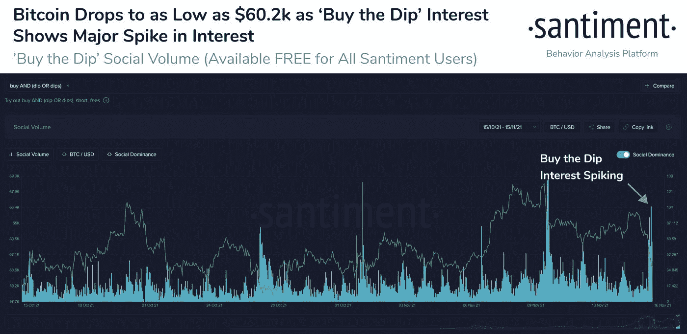
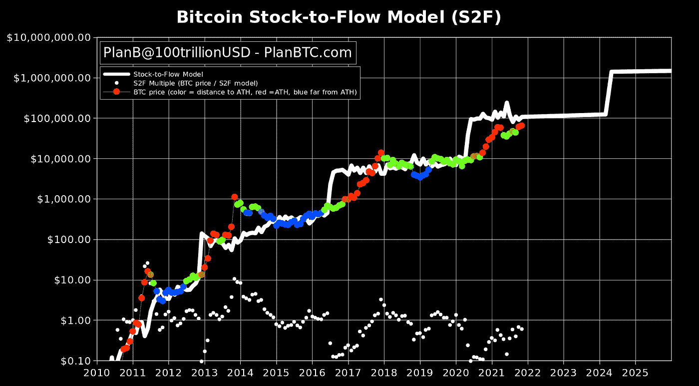
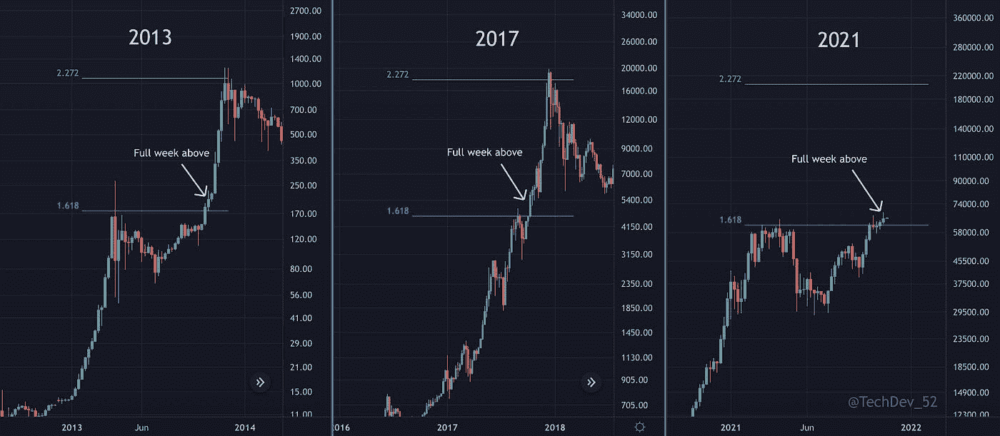
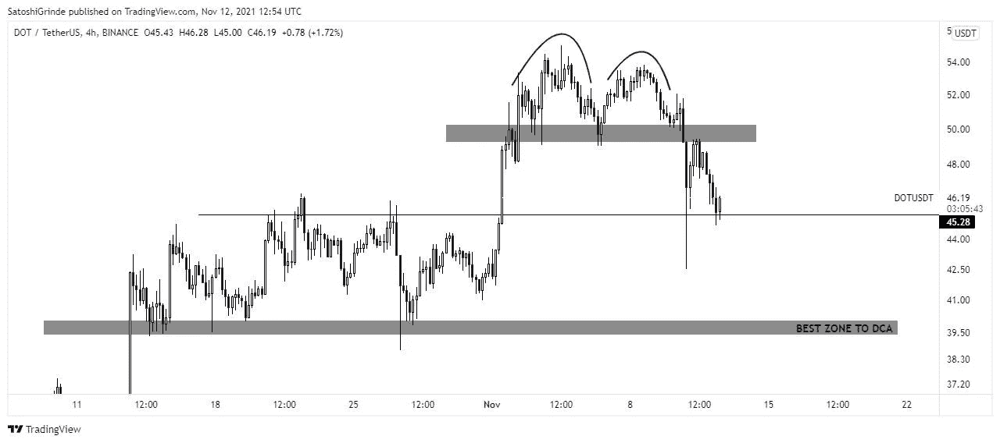
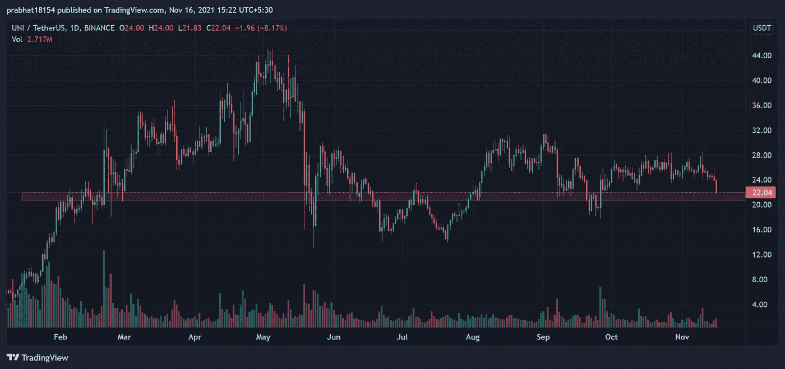
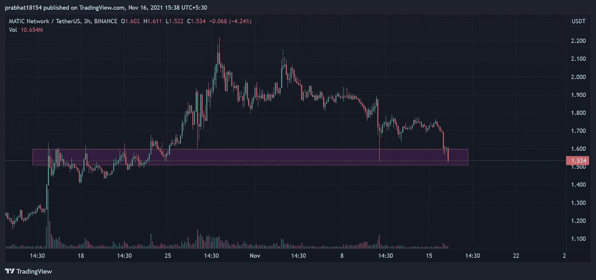

# 购买 dip 的最佳加密货币| 2021 年 11 月版

> 原文：<https://medium.com/coinmonks/best-cryptocurrencies-to-buy-the-dip-november-2021-edition-bc27c551c18f?source=collection_archive---------2----------------------->

## 比特币在大约 24 小时内从 66k 暴跌至 58k 左右，并拖累了许多替代币。然而，这给我们提供了一个 DCA 我们霍德林和 BTFD 的机会。

比特币一直在延续牛市，并出现了回调，为我们提供了积累更多的机会。此外，正如我们所知，由于大多数硬币或代币的价格取决于比特币的价格，因此当比特币下跌时，它们也会下跌。因此，在这里，我们将尝试讨论在这次下跌中你能买到的最好的加密货币。

除此之外，不仅仅是我们在考虑购买 dip。根据链上和市场分析行为平台 Santiment 的数据，比特币一暴跌，投资者就全跳进去买 dip，导致买 Dip 兴趣上升。

然而，根据 B 计划，从库存到流动的模式仍在发挥作用，我们预计到 11 月底每个 BTC 为 98，000 美元，到 12 月底每个 BTC 为 135，000 美元。此外，如果它继续运行，市场没有延迟，我们可能会在 12 月 13 日至 17 日之间看到这波牛市的顶峰。

现在来看看你现在能买到的硬币:这是一个列表！

# 1.比特币

它必须排在清单的首位，因为，拜托，你怎么能跳过唯一可以作为终极价值储存手段的资产。此外，比特币是推动整个市场的一种货币，所以买入比特币。我认为比特币很有可能不会回到这个价格，至少在本轮牛市中不会。而且，不仅仅是我这么说。据 TechDev 报道，比特币最近在 log 1.618 上方实现了周收盘，这在过去已被证明是一个转折点。

# 2.波尔卡多特

我最近发表了一篇关于今年秋天最值得购买的替代币的文章。我提到它是因为我在里面放了一张图表，我在下面也放了同样的图表。所以现在，我们正处于 Polkadot 的完美积累区，向前发展，因为我们已经看到了 55 美元的新 ATH，我们甚至可能打破它并走高。

# 3.Uniswap

我们都知道 Uniswap 是市场上最大的分散式交易所之一。然而，DeFi token UNI 最近并没有做什么。尽管如此，我相信 UNI 有很大的潜力，即使在经历了这一切之后，它也可以比以前的历史高点高得多。对，现在是在一个强支撑区，交易量适中。所以，开始买入，等待反弹再次开始。

# 4.马基奇

Polygon(以前的 Matic)一直在以前所未有的速度扩大其网络和采用。此外，从 0.005 美元的交易价到 2.7 美元的历史高点，matic 的涨幅超过了 500 倍。截至目前，它的交易价格在 1.5 美元左右，在我看来，鉴于该项目的通过，这可能是一个完美的买入区。

# 结束语

交易最重要的部分是纪律和耐心。因此，不要只是前进，并在我们上面讨论的硬币或代币上全押。然而，以上所有的硬币都可以是一个合理的投资，所以去买 dip 吧。

资金不足以购买 dip？获得免费的 Hi 美元，使用下面的按钮注册，每天获得 1 美元。

本文没有任何金融建议，你应该只投资于你认为适合你的投资组合的市场。此外，文章包含附属链接，点击它们，我可能会赚取佣金。

***与我接通，***

[**Twitter**](https://twitter.com/prabxat)**|**[**LinkedIn**](https://www.linkedin.com/in/praxhat/)

> [*比特币:中本聪时代*](/coinmonks/bitcoin-the-age-of-satoshi-nakamoto-fe58157e740d?source=user_profile---------0-------------------------------)

> [*2021 年 11 月购买排名前 5 的密码*](/coinmonks/top-5-crypto-to-buy-in-november-2021-b9c99c44a704?source=user_profile---------1----------------------------)
> 
> [*美元弗洛基争霸|我们要 0.01 美元吗？*](/coinmonks/the-floki-supremacy-are-we-going-to-0-01-6763d56b9734?source=user_profile---------1-------------------------------)
> 
> [*BTCST 刚 3 天涨了 5 倍|目标是 1000 美元吗？*](/coinmonks/btcst-just-went-5x-in-3-days-is-it-aiming-for-1-000-9dcba894c954?source=user_profile---------1----------------------------)

> [*银行会灭亡还是会适应？DeFi 的未来将会决定。*](/coinmonks/will-banks-perish-or-adapt-the-future-of-defi-will-decide-80f13284f76?source=user_profile---------1----------------------------)

> [*你钱包里的 100 元钞票，是钱，还是没有价值的东西？*](/coinmonks/is-the-100-bill-in-your-wallet-money-or-something-that-has-no-value-99263e8dfba6?source=user_profile---------0----------------------------)
> 
> [*2021 年底前比特币还在破 100K 的路上吗？*](/coinmonks/is-bitcoin-still-on-its-path-to-break-100k-before-the-end-of-2021-4716a56745ce?source=user_profile---------1----------------------------)
> 
> [*我是如何在大学本科阶段开始投资 Crypto 的？*](https://praxhat.medium.com/how-did-i-start-investing-in-crypto-as-a-college-undergrad-ac9635d9d6b3?source=user_profile---------2----------------------------)

这篇文章中所写的一切都是我所相信的，你的想法可能与我的不同(显然，我们是两个不同的人)。所以，把这篇文章当做闲书，如果不喜欢内容，就当没看过吧！

> *加入* [*币僧电报频道*](https://t.me/coincodecap) *学习密码交易和投资。*

**同样，阅读**

*   [币安 vs 北海巨妖](https://blog.coincodecap.com/binance-vs-kraken) | [美元成本平均交易机器人](https://blog.coincodecap.com/pionex-dca-bot)
*   [如何在印度购买比特币？](/coinmonks/buy-bitcoin-in-india-feb50ddfef94) | [WazirX 审核](/coinmonks/wazirx-review-5c811b074f5b) | [BitMEX 审核](https://blog.coincodecap.com/bitmex-review)
*   [比特币主根](https://blog.coincodecap.com/bitcoin-taproot) | [Bitso 评论](https://blog.coincodecap.com/bitso-review) | [排名前 6 的比特币信用卡](/coinmonks/bitcoin-credit-card-bc8ab6f377c6)
*   [双子座 vs 比特币基地](https://blog.coincodecap.com/gemini-vs-coinbase) | [比特币基地 vs 北海巨妖](https://blog.coincodecap.com/kraken-vs-coinbase) | [硬币罐 vs 硬币点](https://blog.coincodecap.com/coinspot-vs-coinjar)
*   [印度加密交易所](/coinmonks/bitcoin-exchange-in-india-7f1fe79715c9) | [比特币储蓄账户](/coinmonks/bitcoin-savings-account-e65b13f92451) | [Paxful 审核](/coinmonks/paxful-review-4daf2354ab70)
*   [杠杆令牌](/coinmonks/leveraged-token-3f5257808b22) | [最佳加密交易所](/coinmonks/crypto-exchange-dd2f9d6f3769) | [AscendEX 评论](/coinmonks/ascendex-review-53e829cf75fa)
*   [Godex.io 审核](/coinmonks/godex-io-review-7366086519fb) | [邀请审核](/coinmonks/invity-review-70f3030c0502) | [BitForex 审核](https://blog.coincodecap.com/bitforex-review) | [HitBTC 审核](/coinmonks/hitbtc-review-c5143c5d53c2)
*   [Crypto.com 费用](/coinmonks/binance-fees-8588ec17965) | [僵尸加密审查](/coinmonks/botcrypto-review-2021-build-your-own-trading-bot-coincodecap-6b8332d736c7) | [替代品](https://blog.coincodecap.com/crypto-com-alternatives)
*   [有哪些交易信号？](https://blog.coincodecap.com/trading-signal) | [比特斯坦普 vs 比特币基地](https://blog.coincodecap.com/bitstamp-coinbase)
*   [ProfitFarmers 点评](https://blog.coincodecap.com/profitfarmers-review) | [如何使用 Cornix 交易机器人](https://blog.coincodecap.com/cornix-trading-bot)