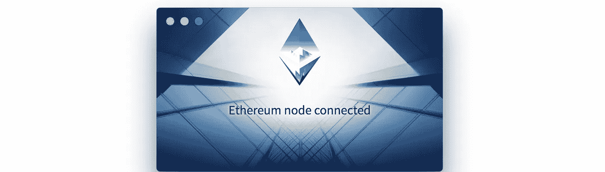

# 2018 年最佳 dapp 浏览器

> 原文：<https://medium.com/coinmonks/best-dapp-browser-of-2018-63a15ed1a2f9?source=collection_archive---------0----------------------->

我们处在分散式网络的西部，一切都是地盘——尤其是浏览器市场。在这篇文章中，我将回顾最流行的浏览器，并做一些安装、测试和处理这些浏览器的脏活——帮助你做出使用哪种浏览器的明智决定。

我将要评论的桌面浏览器是 **Mist，奇偶校验**和**元掩码**和**移动浏览器是 **Toshi，密码**和**信任**。**

> [发现并回顾最佳区块链软件](https://coincodecap.com)

我衡量他们的标准是:

*   设置
*   特征
*   购买一只密码猫和一枚代币
*   表演
*   用户体验

所有桌面浏览器都是在 Macbook Pro 上测试的，2,7 GHz 英特尔酷睿 i5，8 GB 内存。所有的移动浏览器都是在 iPhone 7 上测试的。

# Mist (Windows 和 Mac)

Mist 是官方以太坊浏览器，也是发布的第一款 dapp 浏览器，[最早可以追溯到 2015 年](https://github.com/ethereum/mist/releases/tag/0.2.6)。这是一款成熟的桌面浏览器，可以使用从分散式应用到谷歌和 YouTube 等常规网站的任何东西。

对于非技术人员来说，安装是不直观的，没有专门的登录页面。下载它的唯一方法是前往 GitHub 上的[发布页面。此外，您还必须确定为您的特定系统下载什么文件。在启动时，它将同步一个以太坊节点并连接到对等点——这在我的机器上从未完成过。这个项目似乎也充满了问题。作为一名开发人员，我知道新的和实验性的平台很难做好，但是对于 Mist 来说，目前尚未解决的问题实在是太多了。](https://github.com/ethereum/mist/releases)

在启动并运行浏览器后，它感觉很慢，不发达，不可用。我从来没有运行过像 AirSwap 或 CryptoKitties 这样的 dapps 也需要改进。我很想被证明是错的，但是现在我看不出迷雾除了是以太坊组织的一部分之外还有任何优势。

## 薄雾等级:1/5

# 奇偶校验(Windows 和 Mac)

Parity 有一个漂亮的[登陆页面](https://www.parity.io/),让你相信这个浏览器会比 Mist 更简单、更快捷。然而，事实并非如此，因为它运行一个完整的节点，您必须等待它在启动时同步。用户界面也必须单独下载——导致更多的混乱。正因为如此，我暂时转向了**平价 Chrome 插件**以获得更轻量级的浏览体验。至少我是这样认为的…

奇偶校验浏览器很难得到，所以我切换回本机桌面窗口，认为同步已经完成…

What does this all mean?

同步现在变成了“曲速恢复”,用户界面充满了破碎的图像和信息，感觉与用户无关。

奇偶校验需要用户测试(来自非技术领域)和有经验的设计师来将他们的产品发展成有吸引力的东西。在两次重启和等待企业号飞船完成“曲速恢复”10 分钟后，我认输了。

## 对等评级:0/5

# 元掩码(Windows 和 Mac)

Metamask 是 Chrome、Brave、Firefox 等浏览器的插件。它不需要你运行一个完整的节点，增加了 1000%的可用性。

Metamask logo, eerily reminiscent of another fox in the browser industry

通过 Chrome 网上商店安装很简单，在他们的[登陆页面](https://metamask.io/)上也有有用的下载链接。

就用户友好性而言，Metamask 网站提供了一个视频教程，它也可以包含在登机的开始屏幕中。用户界面是经过深思熟虑的，有清晰的动作调用，在 Chrome 中占用最小的屏幕空间。

终于成功安装了 dapp 桌面浏览器，我开始购买密码猫和交易代币！购买以太网来运行 dapps 非常简单，因为我在同一个浏览器中拥有我的比特币基地账户。我很自豪地说，Metamask 帮助我在使用后 3 分钟内就为猫获得了[这个精美的标本。](https://www.cryptokitties.co/kitty/602185)

接下来我想尝试交易代币，所以我去了一个分散代币交易平台 [Airswap](https://www.airswap.io/) 。Metamask 使得交易代币就像买一只数码猫一样简单，而且第一次尝试就完成了。

Metamask 速度快，使用简单，不碍事。在 Mist 和 Parity 粉碎了我对去中心化 web 可用性的信念之后，Metamask 恢复了它，让我再次相信了它。

## 元掩码评级:5/5

# Toshi (iOS 和 Android)

Toshi 是一款开源移动浏览器，于 2017 年 5 月首次为 iPhone 发布。我下载了 iOS 版本，安装非常容易。Toshi 是比特币基地的产品，所以在设计和易用性上投入了很多精力。它带有一个内置的 dapp 库和搜索引擎，这使得探索分散的网络比使用 Metamask 更容易，在 meta mask 中，你必须找到自己的 dapp 目录。

理解钱包的工作原理和购买 Cryptokitty 很容易。Toshi 的缺点是底部页脚不总是存在，导致 dapps 和钱包余额之间的不断切换。访问钱包也会关闭当前的 dapp。也许一个静态定位的“浮动菜单按钮”会是一个更好的选择。

还有 Toshi 的“聊天”功能，它为分散式网络带来了社交因素。通过聊天功能，您可以向其他 Toshi 用户发送和请求付款。尽管简单巧妙，但聊天功能仍有不足之处，因为你能与之互动的人很少，这让它变得毫无用处。

Robert asking me for money again

另一个特点是，钱包有一个“收藏品”部分，里面有我新买的 Cryptokitty。不是主要卖点，但确实让我的钱包更有意思了。

Toshi 非常容易使用，但在功能方面需要更多的改进。它最强的一点是内置的 dapp 目录和钱包 UI。缺点是聊天和浏览体验有点慢(我的 Airswap 从未通过，但这可能是由以太网中的临时问题引起的)。

## Toshi 评分:3/5

# 密码(iOS 和 Android)

Cipher 团队实际上似乎有一个具有营销敏感度的人，因为他们的[登录页面](https://www.cipherbrowser.com/)感觉像是一个经过打磨的产品。太多的浏览器链接到 GitHub 或者完全没有产品截图，但是 Cipher 肯定有明确的推广方面。

在 iOS 上安装很简单(感谢苹果！)而且 UI 也不需要过多解释。**开始屏幕有一个“开始”按钮，所有 dapp 浏览器都应该包含这个按钮。**这个市场是全新的，很多用户可能甚至不知道以太坊是什么——教育他们吧！

Cipher doing a lot of UX things right!

界面感觉信息丰富而不杂乱，核心功能位于页脚。Cipher 在这里胜过 Toshi，因为页脚总是存在，让你在 dapps、钱包和交易之间来回切换，而不会丢失状态。好样的。

Cipher 还使您可以使用触控 ID 来签署数据，这给人一种安全的良好印象。这是另一个使 Cipher 成为最佳移动浏览器的有力候选人和近乎完美的评级的特性。但是 Cipher 的缺点是，它的 dapp 目录很小——例如缺少 Cryptokitties 和 air swap——这使它不够完美。**在你的浏览器中拥有一个强大的 dapp 目录是留住新用户的关键，**因此我强调这一点。但是随着[比特币基地收购 Cipher](https://www.coindesk.com/coinbase-acquires-ethereum-wallet-startup-cipher-browser/) ，我确信我们会看到 Toshi 和 Cipher 合并，解决这些问题。

## 密码等级:4/5

# 信任浏览器(iOS 和 Android)

Trust 最初是一个钱包，但后来在 2017 年扩展到包括一个浏览器。安装简单，信任开箱即用，无需配置。

浏览器也很好地保持了用户体验的流畅，让我不用反复点击“打开”按钮就可以在 dapps 之间切换。

信任让购买 Cryptokitty 变得非常容易，我也在第一次尝试时在 Airswap 上交易了一些代币。这款浏览器感觉就像刚发布时的 Chrome，没有不必要的花里胡哨，只是完成了工作。

我能找到的唯一缺点是 dapps 目录不可搜索，钱包缺乏“用信用卡购买乙醚”的集成-但这只是把 Get ETH dapp 放在那里的问题。

信任在各方面都很有效，将成为我的手机浏览器选择。它又快又聪明，但执行起来很简单。钱包是一样好的密码和 Toshi 的，但更直观的大呼吁行动和飞行转换到菲亚特。

Trust wallet

## 信任浏览器评级:5/5

# 结论

对于桌面 dapp 的使用，除了 Metamask，没有必要尝试任何其他的浏览器/插件。Mist 和 Parity 看起来都像是技术含量很高的项目，很少关注用户体验。

另一方面，移动浏览器具有竞争优势，因为它们使用底层操作系统(Android 和 iOS)的原生 UI 组件，从而更容易创建流畅无缝的产品。我最初的直觉是，Cipher 将是最好的移动浏览器，但**信托只是做得稍微好一点点**。

