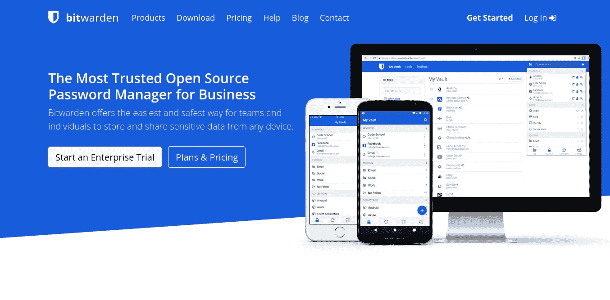
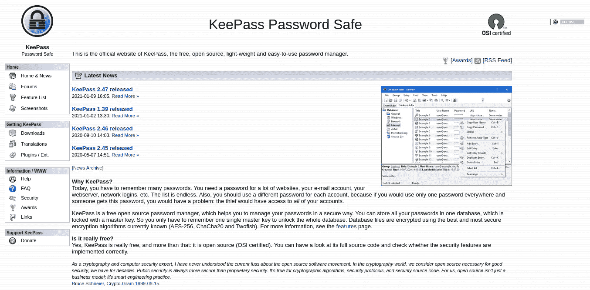
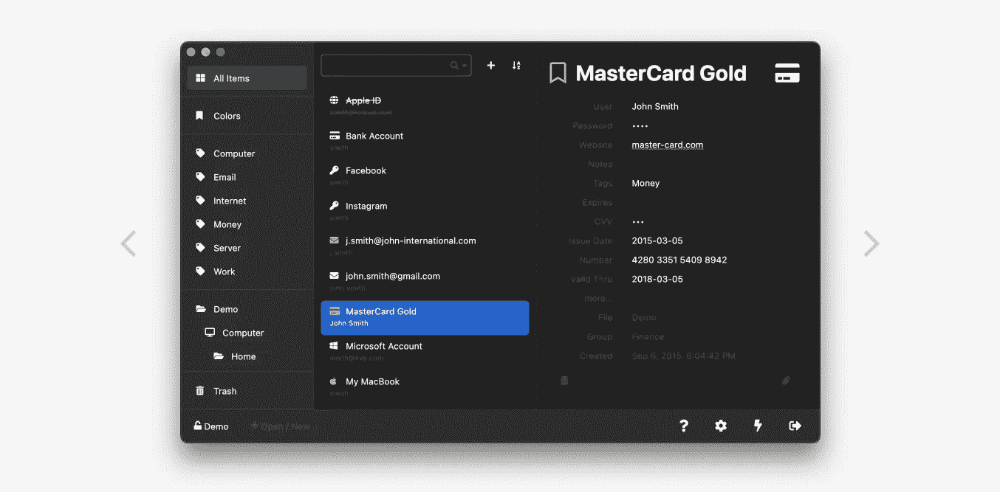
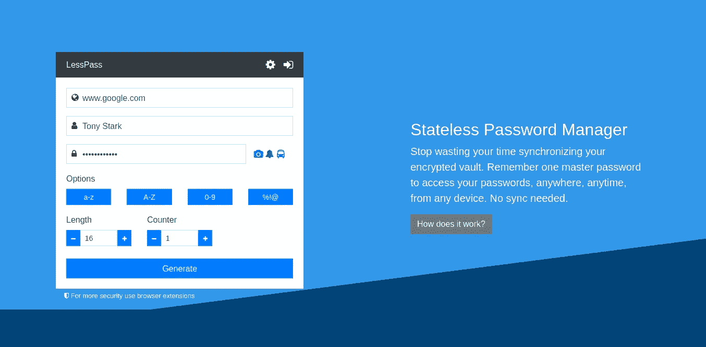
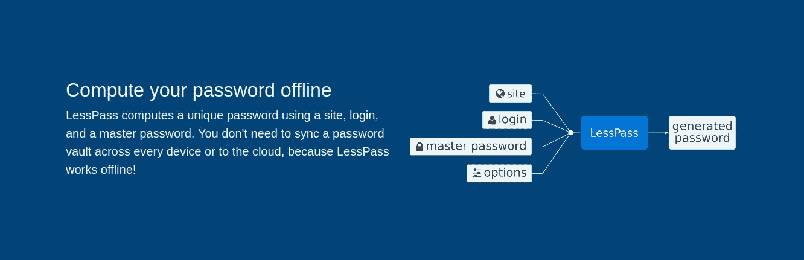
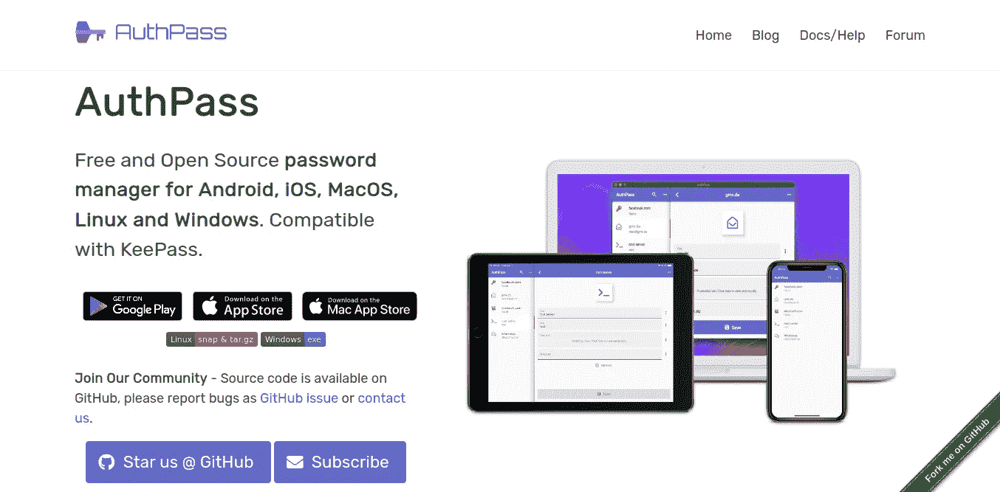
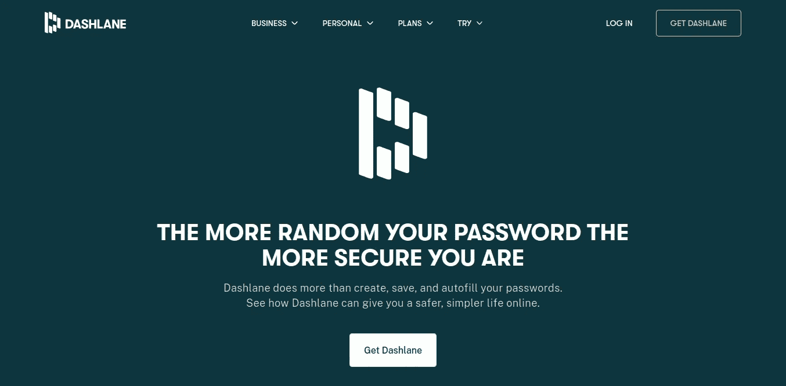

# 为你精心挑选的 2021 年最佳免费密码管理器

> 原文：<https://medium.com/coinmonks/best-password-managers-for-2021-9eed799d2020?source=collection_archive---------6----------------------->

## 技术

## LastPass 不是市场上唯一的密码管理器

Photo by [krakenimages](https://unsplash.com/@krakenimages?utm_source=medium&utm_medium=referral) on [Unsplash](https://unsplash.com?utm_source=medium&utm_medium=referral)

# 一个好的密码管理器的特点？

*   它应该是免费的(只要有可能)。
*   它应该是开源的(只要有可能),因为当你信任拥有密码等敏感信息的人时，你应该知道他们的源代码背后运行着什么。开源意味着你可以随时检查软件的源代码，并且可以确保没有任何秘密跟踪程序、脚本和代码等。
*   适用于所有操作系统。如果不是对 Android、iOS、Linux、Mac 和 Windows 都是如此，至少也是如此。
*   应该可以在大多数流行的浏览器上在线访问
*   应该由开发人员定期更新
*   应该尊重隐私。这意味着它不应该跟踪你，出售你的数据给第三方获利，或参与任何其他类似的活动
*   一个好的密码管理器能够为你生成超强的密码。大多数密码管理器可以做到这一点，但它生成的不应该只是随机数字和字母，而是使用高级算法生成的真正强大的密码。
*   最重要的是，你应该能够跨设备同步你的数据。

# bitwarden——大多数人的最佳选择

Bitwarden — free and open source password manager for all platforms

总的来说，Bitwarden 是一个了不起的密码管理器，也是 LastPass 的绝佳替代品。如果你从 LastPass 切换，那么 Bitwarden 是大多数普通用户的最佳选择。它拥有一个好的密码管理器应该拥有的所有功能。

它是开源的，免费的，并且适用于大多数操作系统。无论是极客还是业余爱好者，Bitwarden 都是不错的选择。它易于使用，有一个很好的界面。它把你的密码储存在一个加密的保险库里，这是 LastPass 所没有的。您可以轻松地在您的所有设备上免费同步它们。它还可以为您创建安全的密码。

Bitwarden 也有自己的主机版本，但大多数专业用户应该考虑使用它。作为开源软件，它比闭源软件更安全。它的源代码在 Github 上，任何人都可以查看、评论和投稿。

**开源:-** 是

**定价:-** 免费和付费选项，如果你想要额外的功能。

**适用于:-** 安卓、iOS、Mac、Linux、Windows。可在线访问。支持大多数流行的浏览器。用于 Linux、Mac 和 Windows 的命令行界面(CLI)。

 [## Bitwarden 开源密码管理器

### Bitwarden 是一个开源的密码管理器，可以很容易地为任何浏览器或应用程序生成和存储唯一的密码。

bitwarden.com](https://bitwarden.com/) 

# KeePass —也适用于黑莓

KeePass Password Manager

KeePass 是一个完全免费的开源密码管理器。任何人都可以查看它的完整源代码来检查它的安全措施，[如果你想这样做，请点击这里](https://keepass.info/download.html)继续。它还通过了 OSI(开放源代码倡议)的认证，并依靠捐赠来保持开发的活跃性。

除了存储您的密码，它还可以为您生成强密码。您可以将所有密码从一台设备传输到另一台设备，还可以将数据导出为各种格式- HTML、XML、TXT 和 CSV。导出的数据与大多数其他密码管理器兼容。

对于大多数普通用户来说，KeePass 拥有他们会用到的所有功能。如果你从任何其他密码管理器如 LastPass 切换，你不会有任何问题，因为它很容易使用。

我想指出的一点是，与几乎适用于所有平台的 Bitwarden 不同，KeePass 仅正式适用于 Windows。但是有很多非官方的 KeePass 版本可以用于几乎所有的操作系统，从 Android、iOS 到 Palm 操作系统和 Sailfish 操作系统。

**开源:-** 是，通过 OSI 认证

**定价:-** 免费依靠捐赠来保持发展活跃。

**适用于:-** 正式适用于 Windows。对于每一个操作系统，你可以想象 Linux、Mac OS、Android、iOS，甚至是不太流行的操作系统，比如 Palm OS、Sailfish OS、FreeBSD 等等。

 [## 保持密码安全

### KeePass 密码安全这是 KeePass 的官方网站，免费，开源，轻量级，易于使用…

keepass.info](https://keepass.info/) 

# kee web——KeePass 的酷哥

Free cross-platform password manager compatible with KeePass

如果 KeePass 有一个兄弟，它看起来就像 KeeWeb。KeeWeb 与 KeePass 兼容，也是免费开源的。

它有一个漂亮友好的界面。你可以在任何你喜欢的设备上使用它，你不会被收取一分钱或者被迫购买一个额外的计划(你知道不是每个人都是贪婪的)。

它几乎拥有任何其他优秀密码管理器(如 Bitwarden)的所有功能。数据可以很容易地在不同设备之间免费同步。它可以为您生成强密码。KeeWeb 也像 KeePass 一样接受捐赠支持。

KeeWeb 是一个真正的 LastPass 杀手，也是 BitWarden 的一个严重的挑战者。KeeWeeb 是一个了不起的密码管理器。它的开发者已经尽了最大努力使它在一个包中结合了 Bitwarden 和 KeePass。但是让我使用其他密码管理器的唯一原因是它不能用于移动设备。这是一个非常重要的考虑因素，也是 KeeWeb 唯一需要改进的地方，否则它就是一个非常棒的密码管理器。

**开源:-** 是的，基于 KeePass

**定价:-** 免费依靠捐赠来保持发展活跃。

**适用于:-** Mac、Linux 和 Windows，可轻松在线访问。支持大多数流行的浏览器。

 [## 基韦博

### 也可以直接在 GitHub 上赞助这个项目。网络版几乎拥有桌面版的所有功能…

keeweb.info](https://keeweb.info/) 

# LessPass(不是 last pass)——如果你想尝试新事物

Stateless open source password manager LessPass

LessPass 是一个开源的完全免费的密码管理器。LessPass 的工作方式不同于市场上所有其他的密码管理器。大多数密码管理器，如 LastPass、Bitwarden、KeePass、KeeWeb 和其他类似的工作方式。他们将你的数据加密并存储在他们的服务器上，只要你需要这些数据，你就可以将它们同步到你的设备上。

但 LessPess 采取了不同的方法，而不是在不同设备之间存储和同步数据。LessPass 处理纯函数，即给定相同参数的函数将始终给出相同的结果。

它是一个无状态的密码管理器。你只需要记住一个主密码。一切都是使用纯函数生成的，因此没有必要将数据存储在任何地方。要了解 LessPass 如何工作，请点击[此处](https://blog.lesspass.com/2016-10-19/how-does-it-work)或[此处](https://lesspass.com/)。

它的工作模式与众不同，但它仍然没有其他人拥有的那些很酷的功能。如果你是一个隐私狂，那么你会喜欢这个概念。

**开源:-** 是的

**定价:-** 免费

**适用于:-** iOS 和 Android。火狐和 Chrome 的扩展。主要在网络上工作，可以在大多数浏览器上轻松访问。也可以作为命令行界面使用。

 [## 莱斯帕斯

### 我们都知道网站有愚蠢的密码规则。用 LessPass 数据库跟踪他们。登录，加载或保存…

lesspass.com](https://lesspass.com/) 

# AuthPass —可在您的所有设备上使用

AuthPass — Password Manager based on Flutter for all platforms

AuthPass 是另一个免费的开源密码管理器。它支持 KeePass 格式。AuthPass 可以为您安全地生成和存储密码。它适用于大多数主流操作系统。您可以使用云同步(通过 Google Drive、Dropbox 等)来同步您的密码。

它的开发者创建了 AuthPass 来拥有一个既可以在手机上使用又可以在桌面上使用的应用程序，它运行速度快，界面也不错。

**开源:-** 是

**定价:-** 免费

**适用于:-** Android、iOS、Linux、Mac 和 Windows

 [## AuthPass -密码管理器| AuthPass.app 密码管理器

### 基于 Flutter 的兼容密码管理器。适用于移动设备和台式机。

authpass.app](https://authpass.app/) 

# dash lane——如果你有多余的现金

上面的大多数密码管理器都是免费和开源的，但是 Dashlane 是一个闭源的专有密码管理器。

免费你会得到体面的功能，你期望从密码管理器。但要释放它的真正力量，你必须购买一个高级计划。

使用 Daslane premium 计划，您将获得列表中其他人无法提供的超酷功能。Dashlane 既不开放也不支持捐赠。

Dashlane 最有趣的功能之一是暗网监控。Darkweb 是网络罪犯出售你的个人信息来赚钱的地方，但是如果你使用 Daslane，它会跟踪 dark web 以确保你是安全的，你的密码没有被泄露，如果被泄露，它会自动通知你。Dashlane 也有额外安全的 VPN。

**开源:-** 否

**定价:-** 免费计划的功能非常有限，最好免费使用任何其他密码管理器，而不是 Dashlane。但是如果你想付费的话，Dashlane 有一些非常酷的功能。

**适用:-** 安卓、iOS、Mac、Windows，可在线使用。

 [## 适用于家庭、移动、商业| Dashlane 的密码管理器应用程序

### 通过 Dashlane 过上更安全、更简单的在线生活:存储并填写您所有的密码、个人信息和…

www.dashlane.com](https://www.dashlane.com/)