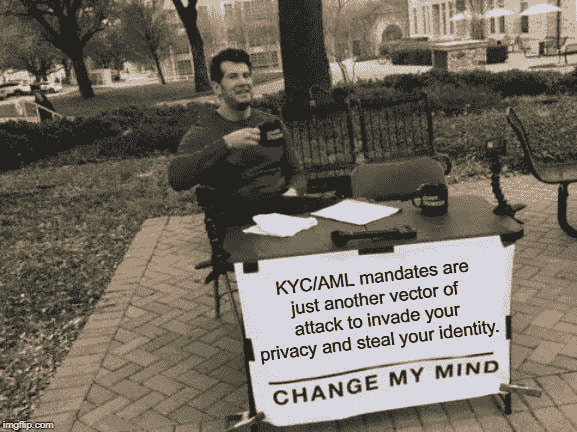

# 将伪匿名 BTC 变成真正匿名 BTC 的最佳实践

> 原文：<https://medium.com/coinmonks/best-practices-on-making-pseudo-anonymous-btc-into-real-anonymous-btc-737dc6e9445b?source=collection_archive---------18----------------------->

~dwulf

以真正匿名的方式将你的加密上线是很棘手的，因为加密的本质，特别是区块链本质上是一个往来于其他加密钱包上的其他哈希的交易分类帐。

积极的一面是对个人加密财富的 100%推送问责，并向公众开放公共分类账，识别区块链上的输入和输出哈希。这太棒了。并且准确地说是一种实时认证交易的准确方式，并且没有第三方中介干扰交易的完整性。

但这在隐私方面有一点小问题，因为这是一个向公众开放的公共账本，它标识了区块链上的输入和输出哈希。但它只能识别加密钱包的地址散列，而不能识别控制加密钱包的人的姓名、地址和社会保险号。

这就是为什么说加密是伪匿名的，它是从一个加密钱包所有者的身份转移。该身份必须有目的地链接并绑定到加密钱包，通常是通过绑定到中央监管交易所的热加密钱包，该交易所共享受损害的热钱包的私钥和个人身份的详细信息，这些信息是根据 KYC/AML 的要求获得的，根据法律规定，大多数中央加密交易所都必须拥有这些信息。

## 如果你想站在右边，就站在左边。

这就带来了加密钱包的伪匿名性问题，以及这些热门钱包与您的个人身份以及一个集中的、受监管的加密交易所的配对绑定问题。你把地址和你联系起来，做两件事，确认你知道什么是加密，并且你拥有并且仍然控制着一个你已经确认是你的钱包。

这是第一步失误，也是加密系统为任何加密用户设置的隐私陷阱。你的隐私的直接危害，以及向中央加密交换的准保管投降。

要想清楚并让自己真正匿名地进入加密生态系统，你需要先走到左边。不要向任何加密钱包的管理人员提供您的身份索引，不要交出 KYC 信息，如果您必须输入 KYC/反洗钱数据，或者这是您误导策略的一部分，那么请注意，在您提交 KYC/反洗钱的那一刻，您将成为目标和已知的加密用户。

## **百尺竿头，更进一步，P2P，加密自动取款机，Bisq，本地比特币**

有了干净的加密钱包，新鲜的和新创造的地址，尝试以下选项来匿名获得 BTC，

## **P2P**

(离线，irl)

一个策略是很好的老式实体会议，在 Meetups 或使用类似于 [Paxful](https://paxful.com/) 的点对点市场，通过按照地点、法定货币和你想要的比特币数量进行筛选，有可能找到一个卖家见面。当然，这需要买卖双方都有一定程度的信任，而在这类网站上，面对面的现金交易相对较少。

如果你碰巧认识一个比特币矿工，你也可以付费访问没有任何交易历史的新铸造的比特币，但他们可能会对新铸造的 BTC 收取溢价。

## **加密自动取款机**

(离线，irl)

如果你想购买比特币并保持匿名，一个选择是使用比特币 ATM 机。

像普通的自动取款机一样，你可以存入现金，在某些型号的加密自动取款机中可以接收现金，理想情况下，你可以购买比特币，同时保留你的隐私。

我没有遇到太多的现金在“购买限额”的限制下通过加密自动取款机获得 BTC。我见过一些，但不是很多，但我注意到一些提款限制，在达到一定金额阈值后，会标记或要求额外的身份证明。如果你需要获得一大笔 BTC，或者套现一大笔菲亚特，你可能需要寻求其他选择。

此外，您信任 CryptoATM 本身的硬件和软件，虽然总体而言，它可能是安全的，但交易本身仍然不受您的控制，并且可以肯定 CryptoATM 将记录加密钱包地址，用于其自己的日志。

## **在网上匿名购买比特币**

显然，线下策略只能带你到此为止；毕竟，加密产业的家在互联网上。好消息是，有很多方法可以减少比特币的数字足迹，包括点对点交换、保护隐私的浏览器和黑暗网络上的滚动服务。

## **点对点交流**

也被称为分散交易所，点对点交易所直接在用户之间安排交易，交易所本身不持有任何资金。Bisq 是一个流行的 P2P 分散式交换，它可能令人生畏，因为它对新手来说有点复杂，但源代码是可用的，并且它有一个强大的基础。

还有[本地比特币](https://localbitcoins.com/)，可能是世界上最大的点对点加密交易所；它可以让你单独联系买家和卖家，也可以选择你喜欢的支付方式。

底线是，通过使用一个点对点的交换，你可以确保没有一个集中的实体——易受黑客攻击的交换持有你的 KYC 数据。但是，为了完成交易并通过匿名确保更高的安全性，您将需要一些额外的工具。

## **更好的匿名工具和比特币酒杯**

## **TOR/VPN**

使用 [TOR，洋葱路由器](https://www.torproject.org/)。TOR 通过将您的数据发送到不同的服务器(又名。TOR 节点)，所有这些都是高度加密的。这让它变得难以置信的困难(但不是不可能。TOR 出口节点可能受损)以便有人识别您。在 TOR 上统一使用 VPN(虚拟专用网)也很重要，以防你通过 TOR 连接的第一台和最后一台机器是同一个人的。

## **尾巴**

接下来是 [Tails，或者失忆隐姓埋名直播系统](https://tails.boum.org/)，它可以也应该和 TOR 一起运行。Tails 强制您的计算机通过 TOR 本身进行所有的传入和传出连接，并自动阻止任何非匿名连接。

## **翻滚**

一旦你习惯了使用这些匿名工具，是时候考虑使用 Tor 来寻找比特币翻滚服务了。翻滚(也称为混合)涉及将您的比特币发送到一个翻滚服务，以便它在不同的地址返回给您，从而掩盖您的加密踪迹。

有许多比特币酒杯，但本着匿名的精神，最安全的是使用黑暗网络上的酒杯，如 BitMixer 或 Gram's Helix。至少，确保使用像 CashShuffle 这样的去中心化的 tumbler，这样你就不必把你的数据托付给一个中心化的实体。

由第三方操作的滚筒刷可能会有问题，虽然您可能不需要信任一个集中且受监管的交易所，但您会信任第三方软件。

值得注意的是，像 tumblers 这样的黑暗网络服务被洗钱者等不良行为者所利用，并且在过去受到了执法部门的严格审查。事实上，一个名为 Helix 的黑暗网络混合器被执法机关关闭了，哥伦比亚特区的美国检察官 Timothy J. Shea 评论说，

“对于那些试图使用基于暗网的加密货币转盘的人来说，这些指控应该提醒人们，执法部门通过合作和协作，将发现非法活动，并起诉那些对非法行为负责的人。”

## **外卖:**

1.  比特币不是匿名的。充其量是伪匿名；你可以很容易地隐藏你的真实身份，但任何人都可以在公共账本上追踪你的交易，并利用这些信息来发现你的真实身份。
2.  比特币是伪匿名；交易可以被追踪，集中的交易所掌握了解你的客户(KYC)的信息。KYC 信息是一个额外的攻击媒介，它会危及您的身份，并使攻击者能够对您进行更有效的鱼叉式网络钓鱼攻击。
3.  加密货币交易所掌握的了解你的客户(KYC)数据是黑客的主要目标，几个交易所甚至是币安和 [Coinsquare](https://decrypt.co/31103/coinsquare-hacker-reveals-cruel-plan-to-now-steal-bitcoin) 这样的庞然大物交易所近年来都遭到了黑客攻击，谁能忘记引发这一切的交易所黑客 Mount Gox。
4.  匿名购买和使用比特币的选项包括点对点交易所、比特币自动取款机和暗网不倒翁服务。

> 加入 Coinmonks [电报频道](https://t.me/coincodecap)和 [Youtube 频道](https://www.youtube.com/c/coinmonks/videos)了解加密交易和投资

## 也阅读

 [## 杠杆代币[多头代币]终极指南

### 杠杆化令牌是具有杠杆化风险敞口的 ERC20 令牌，不考虑保证金、要求、管理…

medium.com](/coinmonks/leveraged-token-3f5257808b22)  [## 最佳加密交易所| 2021 年十大加密货币交易所

### 编辑描述

blog.coincodecap.com](https://blog.coincodecap.com/crypto-exchange)  [## 2021 年最佳加密借贷平台| 6 大比特币借贷平台

### 获得比特币和其他加密货币的最佳贷款利率

medium.com](/coinmonks/top-5-crypto-lending-platforms-in-2020-that-you-need-to-know-a1b675cec3fa)  [## 2021 年最佳免费加密交易机器人

### 2021 年币安、比特币基地、库币和其他密码交易所的最佳密码交易机器人。四进制，位间隙…

medium.com](/coinmonks/crypto-trading-bot-c2ffce8acb2a)  [## 最佳 4 个加密交易信号电报通道

### 这是乏味的找到正确的加密交易信号提供商。因此，在本文中，我们将讨论最好的…

medium.com](/coinmonks/best-crypto-signals-telegram-5785cdbc4b2b)  [## 5 个最佳社交交易平台[2021] | CoinCodeCap

### 编辑描述

blog.coincodecap.com](https://blog.coincodecap.com/best-social-trading-platforms)  [## BlockFi 评论 2021:利弊和利率| CoinCodeCap

### 编辑描述

blog.coincodecap.com](https://blog.coincodecap.com/blockfi-review)  [## 如何在印度购买比特币？2021 年购买比特币的 7 款最佳应用[手机版]

### 如何使用移动应用程序购买比特币印度

medium.com](/coinmonks/buy-bitcoin-in-india-feb50ddfef94)  [## 加密税务软件——五大最佳比特币税务计算器[2021]

### 不管你是刚接触加密还是已经在这个领域呆了一段时间，你都需要交税。

medium.com](/coinmonks/best-crypto-tax-tool-for-my-money-72d4b430816b)  [## 存储比特币的最佳加密硬件钱包[2021] | CoinCodeCap

### 编辑描述

blog.coincodecap.com](https://blog.coincodecap.com/best-hardware-wallet-bitcoin)  [## Pionex 评论 2021 |免费加密交易机器人和交换

### Pionex 是为交易自动化提供工具的后起之秀。Pionex 上提供了 9 个加密交易机器人…

medium.com](/coinmonks/pionex-review-exchange-with-crypto-trading-bot-1e459d0191ea)