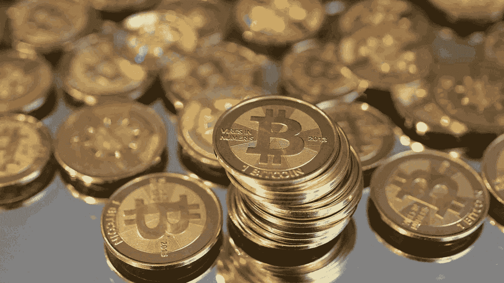

# 交易加密货币(替代硬币)的最佳实践

> 原文：<https://medium.com/coinmonks/best-practices-when-trading-cryptocurrencies-altcoins-de5470a0df45?source=collection_archive---------5----------------------->

推特: *@BluesCrypto*

****免责声明:这不是财务建议，这只是我对市场的看法和观点。一如既往，DYOR 在投资之前。***

大家好，通过这篇文章，我将谈论一些我想在交易/摆动/倒卖或投资 alts 时给社区的提示/建议。我没有涵盖每个方面，但我试图确定最重要的细节。

## 1-经常发生的错误是:过度多样化。

> (不适用于低面值硬币)

大多数情况下，如果你选择了 5-10 枚硬币并持有/交易它们，要比拥有 40 枚硬币却不知道它们的下落好得多，顺便说一下，失去注意力会导致利润损失。

示例:

—你只持有贷款，它上涨了 40%。

—你持有 LEND、Tron、OST，一个涨了 10%，另一个涨了 20%，最后一个涨了 40%。

结果几乎是一样的，但是你已经为照看三个硬币而不是一个硬币而筋疲力尽了。

## **1A。停止追逐水泵**

> 这会毁了你。

## 2-总是为那些有坚实基础的项目留一个月袋。

> 如果你想的话，你可以随意为每一枚硬币做这件事。

## 3-如何进入市场。

当市场具有流动性时，市场买入是没有问题的。但对于流动性差的市场，永远不要买卖市场，总是下单，然后等着它成交，如果成交了**:很棒，否则:你还有**比特币** ( **也很棒**)。**

## ****4- {Risky}你想获得可观的收益(改变人生的钱)？****

**重点关注 1 到 2 个低帽币，目标收益 100 倍。这是高风险的，但也是值得的，钱可以改变生活。当你感觉到的时候，不要害怕冒险。(不要只是说:“嘿，这个很便宜，我可能会在上面投 0.1 btc”这是 100%的赌博，至少做一些研究)**

## **5-试着有一个更大的画面。**

**在考虑获利之前，总是缩小图表，不要 FOMO，如果你看到上涨/下跌，先去检查社交媒体，看看是否有催化剂。它可以改变对某些硬币的看法和情绪(我们最近在 BAT 的公告中看到了这一点)。**

## **6-推特超先令**

**不要听信 Twitter 的过度宣传，它会扼杀你投资组合辛苦赚来的收益。**

## **随时了解 BTC 的最新情况。**

**跟随比特币价格、情绪和市场支配地位。保持领先地位。**

## **8-可靠的多元化计划**

**在我看来，一个好的多样化选择是挑选 1-2 个高面值硬币，3-5 个中面值硬币和一些低面值硬币(不需要用图表表示)。**