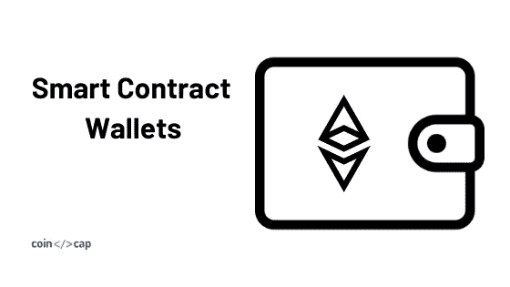
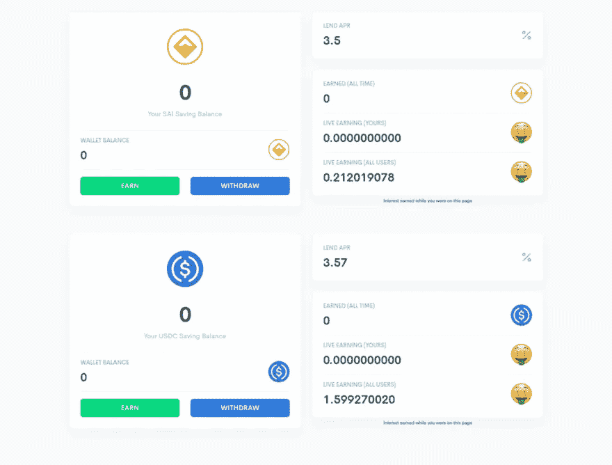
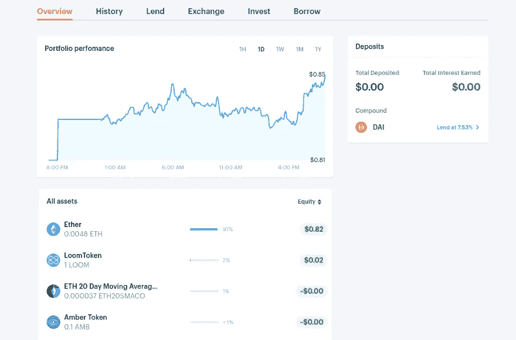
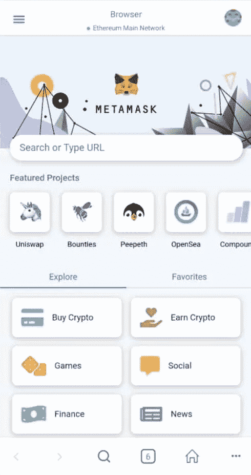
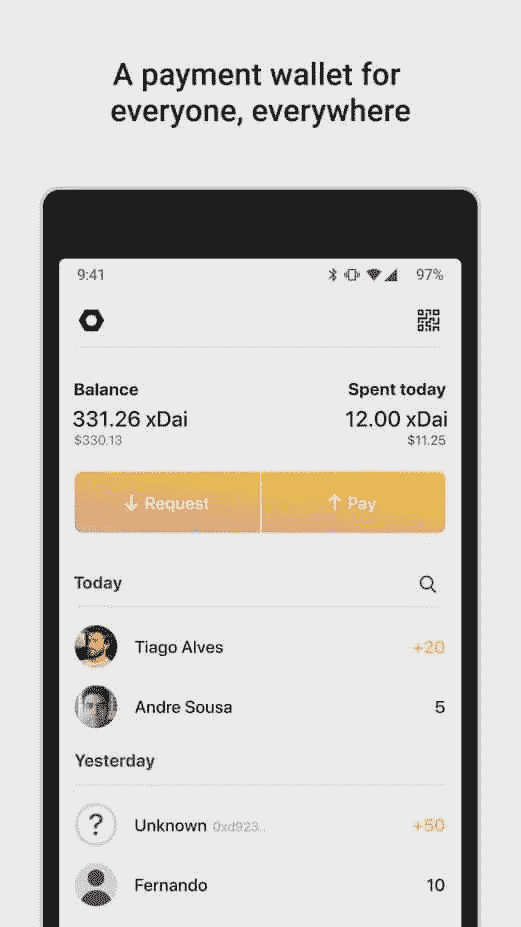
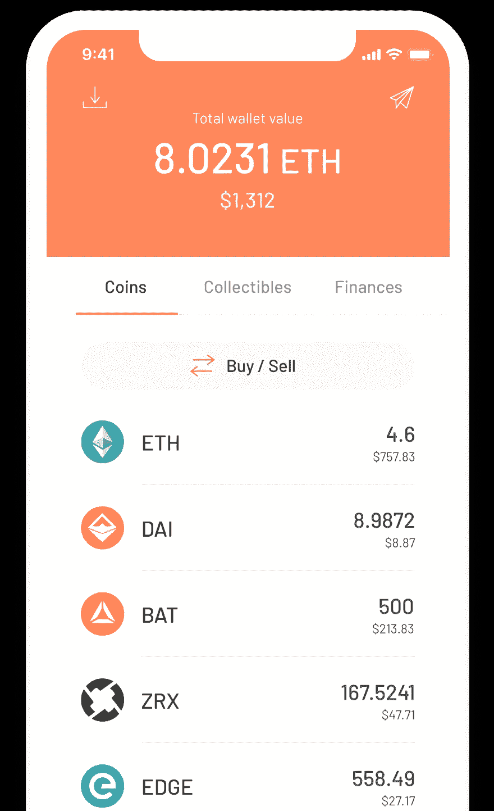

# 最佳智能合约钱包(DeFi 钱包)

> 原文：<https://medium.com/coinmonks/best-smart-contract-wallets-defi-wallets-218a461f2c9d?source=collection_archive---------0----------------------->

# 什么是智能合约钱包？

与智能合约交互的[加密钱包](https://blog.coincodecap.com/tag/crypto-wallet/)被称为智能合约钱包。换句话说，这些钱包支持不同类型的活动，例如购买或出售代币、代币交换、dapp 互动、交易、借贷等。

## **小心**

一些钱包使用智能合约在区块链上发送交易。许多加密交换和其他服务不支持智能合约交易。因此，在使用 DeFi 钱包或智能合约钱包时，请确保您的加密交换支持智能合约交易。

# 智能合约钱包的功能

## 智能合同交互

智能合约钱包中的用户账户通常由智能合约创建/控制，而不是拥有一个简单的以太坊账户。

## 功能

使用不同的货币协议借入和借出加密资产、代币出售、购买、交换或交易、与不同 Dapps 的交互等功能。

> 对一款[五金钱包](/coinmonks/the-best-cryptocurrency-hardware-wallets-of-2020-e28b1c124069?source=friends_link&sk=324dd9ff8556ab578d71e7ad7658ad7c)感兴趣？阅读我们的[最佳硬件钱包](/coinmonks/the-best-cryptocurrency-hardware-wallets-of-2020-e28b1c124069?source=friends_link&sk=324dd9ff8556ab578d71e7ad7658ad7c)指南。

# 顶级智能合约钱包

## #1 [InstaDApp](https://instadapp.io/?utm_source=coincodecap)

通过集成不同的货币协议，InstaDApp 允许您使用以太坊和其他加密资产进行借贷。此外，它还与 Uniswap exchange 集成，当您将代币添加到流动性池中时，您就可以获得收益。

**insta dapp 的特性**

*   借或借，以太坊或其他资产
*   通过增加 Uniswap exchange 的流动性来赚取利润
*   一键从 MakerDao 切换到 Compound 的协议桥
*   支持单担保品和多担保品戴
*   具有移动友好用户界面的网络钱包

## #2 [泽里昂](https://zerion.io/?utm_source=coincodecap)

Zerion 集成了多种协议，支持一些核心银行功能。除此之外，你可以用它来借贷、交换或投资你的资产。

**Zerion 的特点**

*   借还是借
*   使用 Uniswap 交换令牌
*   通过增加 Bancor 和 Uniswap 的流动性获得收益
*   可在网络和手机上使用
*   仪表板检查您的资产
*   您的财务往来历史

## #3 [元掩码](https://metamask.io/?utm_source=coincodecap)

除了保护你的加密货币，Metamask 钱包还允许你与不同的 Dapps 互动。例如，你可以使用这些 Dapps 来购买、借入、赚取或借出以太坊和其他代币。您还可以使用 Metamask 进行交易、交换不可替换的代币以及玩游戏。

**元遮罩的特征**

*   购买、借入、借出你的资产
*   与 Dapps 互动
*   象征性保管
*   手机版和 chrome 插件版

[***阿尔法钱包***](https://alphawallet.com/?utm_source=coincodecap.com) 和 [***比特币基地钱包***](https://wallet.coinbase.com/?utm_source=coincodecap.com) 提供与元掩码类似的功能。

## #4 [扑克现金](https://poketto.cash/?utm_source=coincodecap.com#/)

Poketto 是一款支付应用程序，你可以通过它向任何人发送和索取资金。然而，它使用 xDai 来降低交易费用并实现即时支付。它类似于 Venmo，你可以给你的联系人分配地址。Poketto 完全是[开源](https://github.com/pokettocash)。

**Poketto 的特点**

*   即时支付
*   使用 xDAI(戴 [stablecoin](https://blog.coincodecap.com/stablecoins-a-simple-overview) 的一个版本)
*   给联系人分配地址
*   在手机上可用

## #5 [银色](https://www.argent.xyz/?utm_source=coincodecap.com)

Argent 提供免费的 ENS 名称，并涵盖您所有交易的交易费。因此，这是非常有益的发送加密给你的朋友，因为每个银钱包得到一个可读的名称。

除了存储代币，你还可以使用 argent 从分散的交易所购买代币。

**银的特性**

*   象征性保管
*   自由交易
*   释放 ENS 名称以简化地址
*   使用分散式交易所买卖代币
*   通过向复合协议提供令牌获得利息
*   在手机上可用

# 智能合约钱包的利弊

## 赞成的意见

*   借入、借出和互换等功能
*   与 Dapps 互动
*   多签名钱包支持
*   与智能合同交互

## 骗局

*   许多交易所不支持与智能合约钱包之间的转账
*   通常，只支持一个区块链

# 结论

随着加密生态系统的增长，我们将看到智能合约钱包将拥有更多功能。目前，大多数钱包只支持以太坊协议，看到这些钱包支持多种智能合约协议将会很有趣。

# 常见问题

**问**什么是智能合约钱包？

与智能合约交互的[加密钱包](https://blog.coincodecap.com/tag/crypto-wallet/)被称为智能合约钱包。换句话说，这些钱包支持不同类型的活动，例如购买或出售代币、代币交换、dapp 互动、交易、借贷等。

**问:**智能合约可以用来做什么？

**答:**您可以使用智能合同，通过不同的货币协议、代币出售、购买、交换或交易以及与不同 Dapps 的交互来借入和借出加密资产。

**问**元掩码支持智能合约吗？

**答:**是的，您可以使用 Metamask 与智能合约和 dapps 进行交互。

**问**unis WAP 的最佳钱包？

**答**你可以使用 Metamask 与 Uniswap 交互，这是与 Dapps 交互的最佳智能合约钱包。

**同样，阅读**

*   [顶级 DeFi 项目](/coinmonks/defi-future-10-promising-projects-in-the-defi-world-ff2b697ab006)
*   最佳加密交易机器人
*   最好的比特币[硬件钱包](/coinmonks/the-best-cryptocurrency-hardware-wallets-of-2020-e28b1c124069?source=friends_link&sk=324dd9ff8556ab578d71e7ad7658ad7c)
*   最好的[加密税务软件](/coinmonks/best-crypto-tax-tool-for-my-money-72d4b430816b)
*   [最佳加密交易平台](/coinmonks/the-best-crypto-trading-platforms-in-2020-the-definitive-guide-updated-c72f8b874555)
*   [unis WAP 最佳钱包](/coinmonks/best-wallets-to-use-uniswap-e91a6385d9e8)

> [直接在您的收件箱中获得最佳软件交易](https://coincodecap.com?utm_source=coinmonks)

*原载于 2020 年 1 月 27 日 https://blog.coincodecap.com***。**