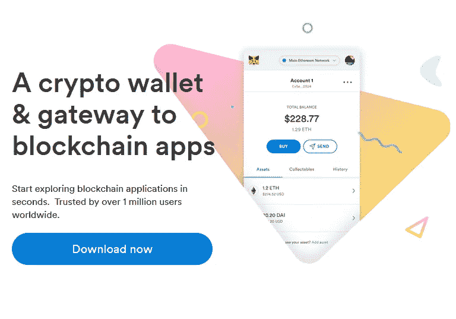

# Uniswap 的最佳钱包

> 原文：<https://medium.com/coinmonks/best-wallets-to-use-uniswap-e91a6385d9e8?source=collection_archive---------0----------------------->

## 让我们分析一下使用 Uniswap 的最佳钱包以及相关的池和交换部分。

现在，我们已经了解了 [Uniswap 分散式交易所(DEX)](/coinmonks/cex-vs-dex-how-does-uniswap-work-8ff2ef89e558) 的功能，并深入解释了其[治理令牌](/coinmonks/here-is-uni-the-uniswap-dex-token-bf5908cb7c71)的用途，是时候分析一下**平台上使用哪些钱包最好了**。在以太坊生态系统中**有许多数字钱包**，你可以在其中保存任何类型的资产，从以太(ETH)到 ERC20 代币和 NFT 或收藏品。简而言之，**以太坊钱包是允许用户与他们的账户**互动的应用，在区块链的世界中创建互联网银行应用，显然没有银行和中介。

**Uniswap 平台接受不同的数字钱包**，通过它们与定义池和掉期的智能合约进行交互。让我们看看哪一个在特性、简单性和可靠性方面最好。

> 在 CryptoRank 上检查 [Uniswap 图表](https://cryptorank.io/exchanges/uniswap)

# **元掩码**

Metamask 无疑是世界上最著名和最常用的以太坊钱包，它为多浏览器和几个月前发布的移动应用程序提供了扩展。它有能力**持有以太坊世界中的任何资产**并且有一个直观的界面，不介意为专家用户输入数据。用 Metamask 开户非常简单，只需几分钟。KYC 不是必需的，只是在忘记密码的情况下保存钱包恢复的种子。要将 Metamask 连接到 Uniswap，只需输入密码，您就可以立即访问您的资金。毫无疑问，对于那些想尝试 DEX 和 Uniswap 的人来说，这是最好的选择。

# WalletConnect

WalletConnect 是一个**开源协议，通过扫描二维码将分散的应用程序链接到移动钱包**。用户可以从他们的移动电话安全地与任何 DApp 交互，即 Uniswap 而不是 MakerDAO Compound 等，使 WalletConnect 钱包成为安全可靠的选择。**二维码大大简化了钱包**的使用和短时间内与 Uniswap 平台的连接。

# 比特币基地钱包

**这个钱包是官方的**世界上最著名的交易所之一**比特币基地**。它有各种支持的硬币，包括比特币、比特币现金、Ethereum、Ethereum Classic、Litecoin 以及 DeFi 世界的各种 ERC20 代币。**安全由安全飞地和生物识别认证**提供。通过使用用户名而不是 Blockchain 地址**向人们发送资金和金钱是非常容易的。这是一个有趣的产品，搁置用户隐私来改善 UX。在这里，与 Uniswap 的连接也很简单，这要归功于使用二维码来建立连接，并立即获得所有可用资金。此外，请阅读我们的[比特币基地钱包评论](https://blog.coincodecap.com/coinbase-wallet-review-the-best-bitcoin-wallet)。**

# Fortmatic

Fortmatic 无疑是分散式金融世界中最有趣的钱包之一，因为与普通钱包相比，它试图让 UX 变得更简单、更直观，即使对该行业消息不灵通的人来说也是如此。要订阅该服务，您可以同时使用**电子邮件和手机**，这大大简化了一些典型的钱包流程。对于私钥的管理， **Fortmatic 团队使用了委托密钥管理的概念**:它将加密和解密操作委托给第三方服务，例如 **Amazon Web Services (AWS)和 Cognito** 。通过平台开发的密码和界面，与 Uniswap 的连接非常简单。如果您刚接触以太博物馆世界，这是一个不错的选择。

# Portis

**关注界面简单**和资金安全的另一款数字钱包。Portis 是一款非托管钱包，它为用户提供了一种非常类似于任何现代应用程序中通过电子邮件和密码登录的体验。私钥在客户端是自存储和加密的，但可以从任何设备访问。**平台中的 KYC 非常小，世界各地都可以使用信用卡和借记卡。**除了 DeFi 世界，它还提供与其他区块链游戏的互动，如比特币、EOS 等。与平台的连接遵循前面的连接，非常简单有效。

您认为 Ethereum 和 DeFi 世界的最佳钱包是什么？

跟我来看加密和块链世界的其他文章！

> 加入 Coinmonks [电报频道](https://t.me/coincodecap)和 [Youtube 频道](https://www.youtube.com/c/coinmonks/videos)获取每日[加密新闻](http://coincodecap.com/)

## 另外，阅读

*   [密码电报信号](http://Top 4 Telegram Channels for Crypto Traders) | [密码交易机器人](/coinmonks/crypto-trading-bot-c2ffce8acb2a)
*   [复制交易](/coinmonks/top-10-crypto-copy-trading-platforms-for-beginners-d0c37c7d698c) | [加密税务软件](/coinmonks/crypto-tax-software-ed4b4810e338)
*   [网格交易](https://coincodecap.com/grid-trading) | [加密硬件钱包](/coinmonks/the-best-cryptocurrency-hardware-wallets-of-2020-e28b1c124069)
*   [最佳加密交易所](/coinmonks/crypto-exchange-dd2f9d6f3769) | [印度最佳加密交易所](/coinmonks/bitcoin-exchange-in-india-7f1fe79715c9)
*   开发人员的最佳加密 API
*   最佳[密码借贷平台](/coinmonks/top-5-crypto-lending-platforms-in-2020-that-you-need-to-know-a1b675cec3fa)
*   杠杆代币的终极指南
*   [加密交易的最佳 VPN](https://coincodecap.com/best-vpns-for-crypto-trading)
*   [最佳加密分析或链上数据](https://coincodecap.com/blockchain-analytics) | [Bexplus 评论](https://coincodecap.com/bexplus-review)
*   [NFT 十大市场造币集锦](https://coincodecap.com/nft-marketplaces)
*   [AscendEx Staking](https://coincodecap.com/ascendex-staking)|[Bot Ocean Review](https://coincodecap.com/bot-ocean-review)|[最佳比特币钱包](https://coincodecap.com/bitcoin-wallets-india)
*   [Bitget 回顾](https://coincodecap.com/bitget-review) | [双子 vs 区块链](https://coincodecap.com/gemini-vs-blockfi) | [OKEx 期货交易](https://coincodecap.com/okex-futures-trading)