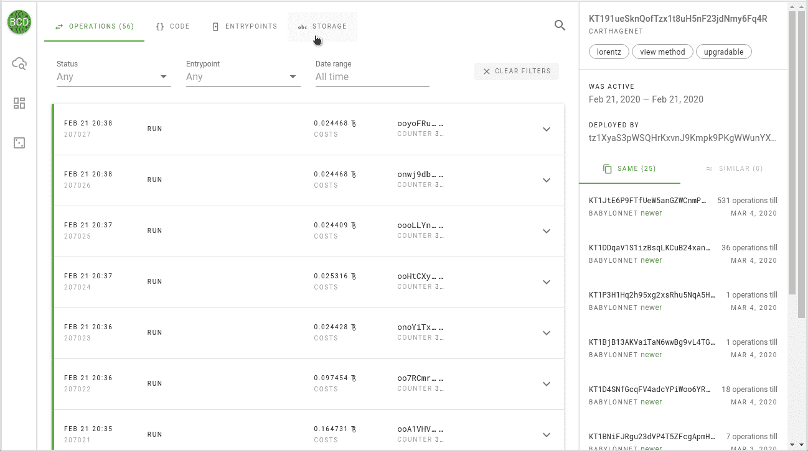
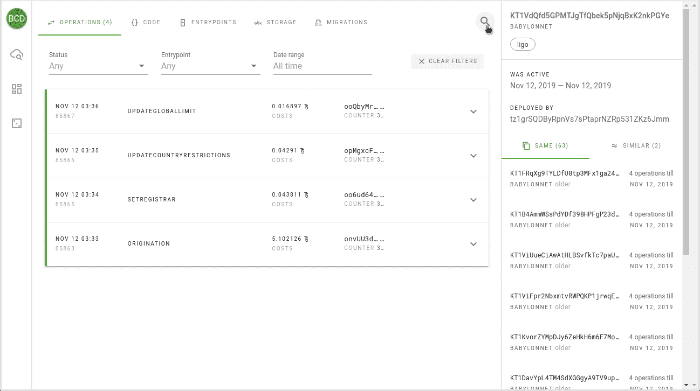

# 最好打电话给开发人员 2:有什么新消息

> 原文：<https://medium.com/coinmonks/better-call-dev-2-whats-new-587e94111a6e?source=collection_archive---------0----------------------->

## 续订的 Tezos 合同浏览器概述

几周前，我们发布了 Better Call Dev 2 的[测试版](https://you.better-call.dev/)——Tezos 智能合同浏览器的继任者。我们仍在开发一些功能，然而，我们决定公开，以便收集更多的反馈，并在切换到主域之前尽可能多地捕捉 bug。

[https://you.better-call.dev/mainnet/KT1PWx2mnDueood7fEmfbBDKx1D9BAnnXitn](https://you.better-call.dev/mainnet/KT1PWx2mnDueood7fEmfbBDKx1D9BAnnXitn)

**旧版本会怎样** - 所有到旧版本的链接都会被 BCD2 正确处理；
-之前的版本将继续在 GitHub 页面上运行；
-但是，它将不会被维护，并且可能会被即将到来的协议更改所破坏。

**新版本** 有什么根本的不同——一切都从头重写，增加了一个后端；
- BCD2 有自己的专门针对合同和合同调用的索引器(非通用)；
- BCD2 由 Elasticsearch 引擎提供支持，因此允许对合同代码、存储和运营数据进行高级查询；
-通过社交账户认证的用户可以使用个性化功能。

# 各种改进和错误修复

先说从上一版本移植过来的功能，有哪些改进。

## 随机选择

我们的“我感觉很幸运”按钮现在将你重定向到真正随机的合同，而不是从预定义的列表中选择一个。此外，无论您在哪个选项卡上，它都可以在左侧的控制面板中找到。这是一种在 Tezos dApp 空间冲浪的完美方式。

## 操作选项卡

首先，我们将操作的基本信息放在标题中，并且在加载页面时不扩展第一个操作的细节。这可以节省大量空间，并提供活动概览。其次，我们增加了每页的操作次数，增加了无止境滚动。
操作总结和颜色编码便于发现所需的事件并做出初步结论，甚至无需扩展细节。

## 内存池

好消息！BCD 现在显示来自内存池的挂起和拒绝的操作，和 TzKT 一样。

## 操作过滤器

除了压缩操作头之外，我们还添加了按入口点、按状态和按日期(或时间段)过滤的功能。注意，可能的状态列表是用特定于内存池的值扩展的:`pending`、`lost`、`refused`和`branch_refused`。

## 操作细节

我们稍微改进了操作细节的显示，还增加了一个新的字段“烧毁”,该字段显示由于存储大小变化或新帐户分配而销毁的硬币数量。另一个特性取自 [TzKT](https://tzkt.io) — raw RPC viewer，一个不可替代的调试工具。

## 值检查器

有时，操作参数或存储差异太大，以至于无法显示在屏幕上。或者，例如，您想要复制一个字符串或地址。为此，我们特别添加了一个值检查器——只需单击树视图的某个节点。

## 盲目开箱

有时开发人员必须以打包的形式存储数据，甚至可能是代码片段。我们试图解开所有可以解开的东西，并以人类可读的形式展示出来。

## 代码选项卡

带有代码的选项卡也发生了变化，现在源代码被规范地格式化，突出显示，可以下载代码作为`.tz`文件，以及在游牧实验室的[迈克尔逊沙箱](https://try-michelson.tzalpha.net/)中运行合同。
对于用`smartpy`编写的合同，显示一个到 SmartPy explorer 的链接。

也有机会取消扩展宏，以使代码更具可读性。由于缺乏优化，该功能目前被禁用，但不久将会上线。

## 存储选项卡

在 storage 选项卡上，我们添加了在树形视图和 Micheline 之间切换的功能。此外，您可以复制没有换行符和缩进的 Micheline 表达式，例如传递给 tezos-client 或 try-michelson playground。

# 全新功能

## 单一网络空间

你可能已经注意到，我们从不同的网络查看合同，而不用在它们之间切换，这在区块链探险者中是常见的情况。这是单一网络空间 BCD2 的基石之一。它允许您在一个位置管理所有部署。此外，BCD 的自托管版本可以附加到任意数量的本地沙箱网。

## 即时搜索

如上所述，BCD2 由 Elasticsearch 提供支持，因此我们可以通过合同、运营和大地图(即将推出)进行全文搜索。只要打开主页，就可以进行即时搜索。您可以粘贴整个地址或操作组哈希，或者按单词甚至单词的一部分进行搜索。

以下是搜索中使用的数据源列表:

*   契约:
    -别名(已知的契约名称)
    -标签(从代码中派生)
    -入口点
    -失败字符串(错误消息)
    -高级语言(由启发法确定)
    -注释
    -委托(如果委托的话)
    -硬编码地址(如果有的话)
    -部署者
    -契约地址(通过符号搜索)
*   操作:
    -入口点
    -错误消息(如果失败)
    -错误 id(如果失败)
    -操作哈希(按符号搜索)
    *-参数(即将推出)*
    *-结果存储(即将推出)*
*   *大地图(即将推出)*

无论在哪里，您都可以访问即时搜索—它隐藏在放大镜图标后面。

如果没有结果，或者您找不到想要的内容，请按“Enter”并尝试高级搜索。

## 高级搜索

高级搜索提供了每一个找到的项目的更多细节，你也可以通过无休止的滚动加载所有的结果。在搜索结果中区分一个合同与另一个合同是相当困难的，所以我们试图在结果卡上放置最具表现力和最有意义的标志。

在工具栏上，您可以选择使用哪个索引进行搜索，或者在所有地方进行搜索。此外，您可以按时间、网络和合同语言过滤结果。我们可能会在未来增加更多的选项。

## с合同汇总和差异

您可能会注意到合同页面上名称为“相同”和“相似”的选项卡，并且“相同”合同的数量会显示在高级搜索结果中。如果契约共享相同的代码，我们称之为相同的契约。

如果经过训练的 ML 模型告诉我们，我们称契约**类似**(我们将在另一篇文章中解释它是如何工作的)。基本上，我们试图把一个项目(dApp)的不同版本放在一起。到目前为止，它工作得足够好，但有许多假阳性的情况，我们将继续提高准确性。

为了更加清晰，我们增加了在熟悉的并排视图中查看不同版本之间变化的能力。

# 这只是开始！

这远远不是一个完整的功能列表:一部分在测试中，一部分仍在开发中。其中，我们将很快推出以下功能:

*   代码迁移 *你知道合同代码是可以更改的吗？迁移选项卡将显示代码逻辑改变时的所有事件。*
*   大地图查看器
*   按参数和存储进行搜索操作
*   通过关键字和值搜索大地图条目
*   所有项目列表(潜在 dapp)
    *在当前上下文中，项目是一组共享相似或相同代码的合同。这样的列表允许您删除一个项目的重复和不同版本，从而显示更真实的画面。*
*   开发者仪表板
    *登录后，您可以管理合同订阅(类似于 GitHub 中的“观察”)，查看订阅的事件提要，以及推荐。*

## 自托管版本

对于合同开发者来说，这是一个好消息——很快就可以启动 BCD2 的本地实例，并设置要索引的网络，包括任意数量的沙盒网络。

## 敬请期待

在 [GitHub](https://github.com/baking-bad) 上跟踪我们的进展，在我们的 [Twitter](https://twitter.com/tezosbakingbad) 频道上获取最新更新，保重！

你的，[烤坏了](https://baking-bad.org/docs)队

*最初发表于 2020 年 4 月 10 日*[*https://baking-bad.org*](https://baking-bad.org/blog/2020/04/10/tezos-smart-contract-explorer-better-call-dev-what-is-new/)*，在那里你可以找到文章的完整版本。*

> [直接在您的收件箱中获得最佳软件交易](https://coincodecap.com/?utm_source=coinmonks)

