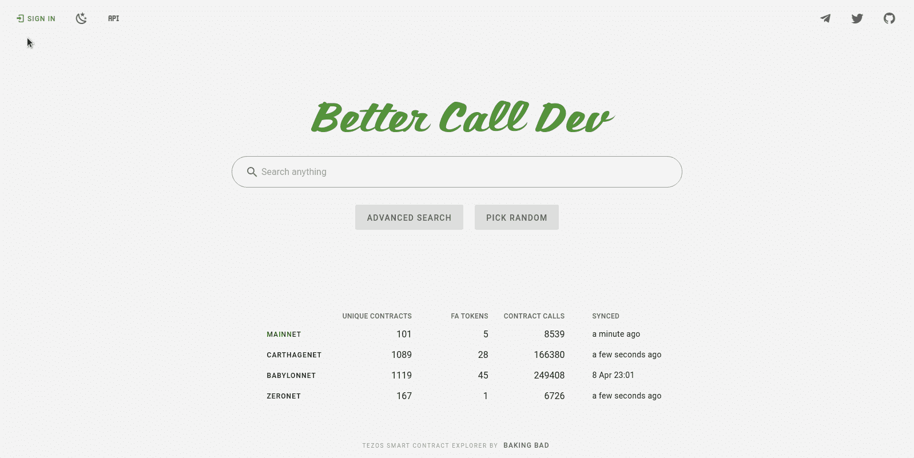
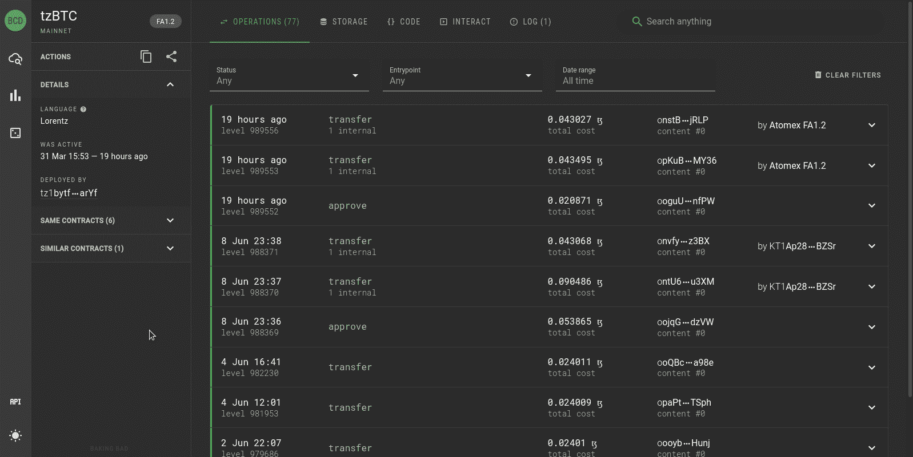
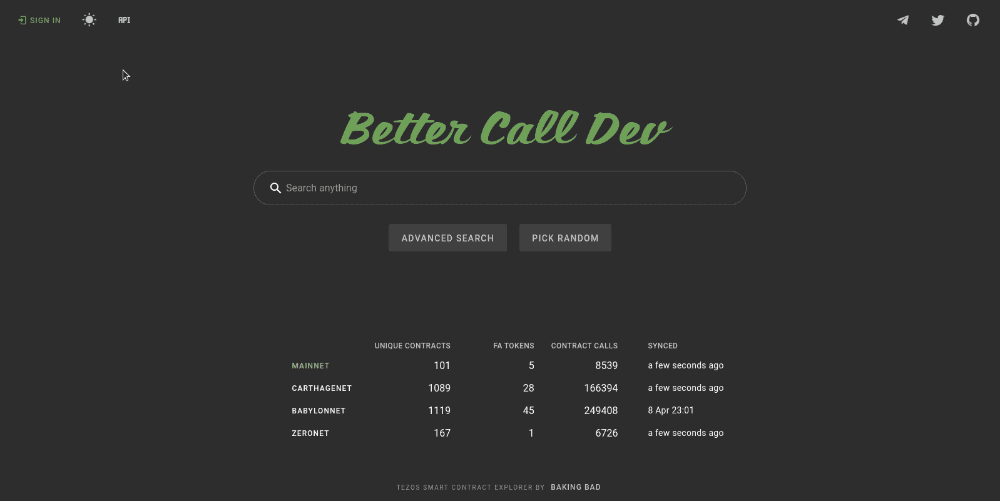
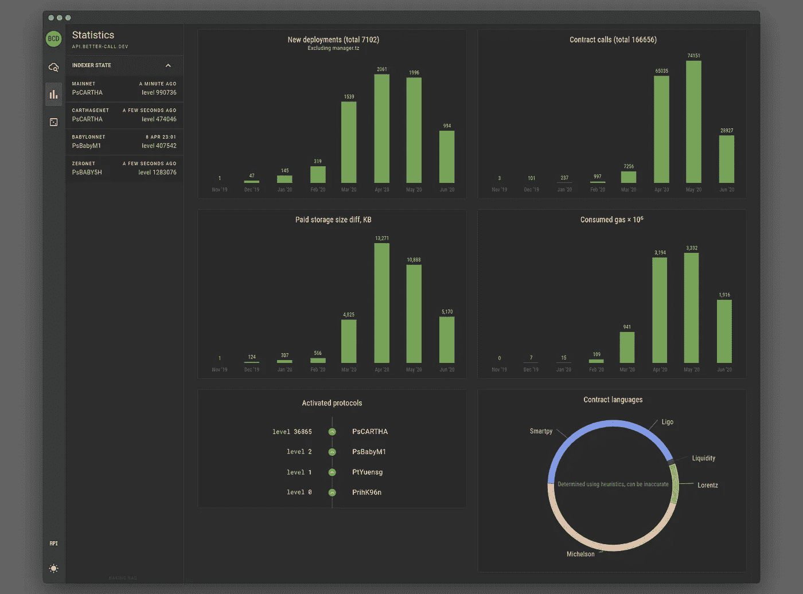
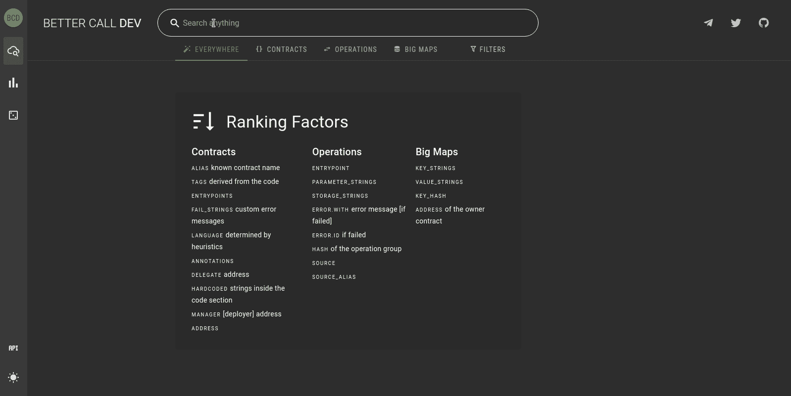
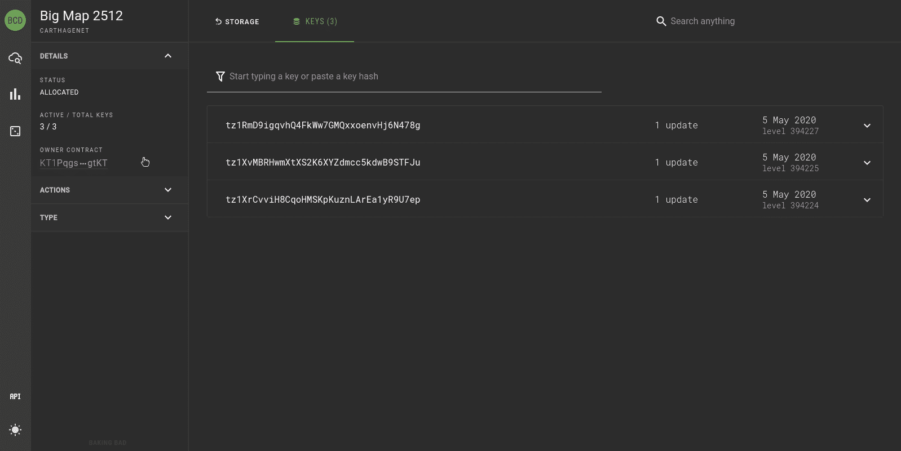
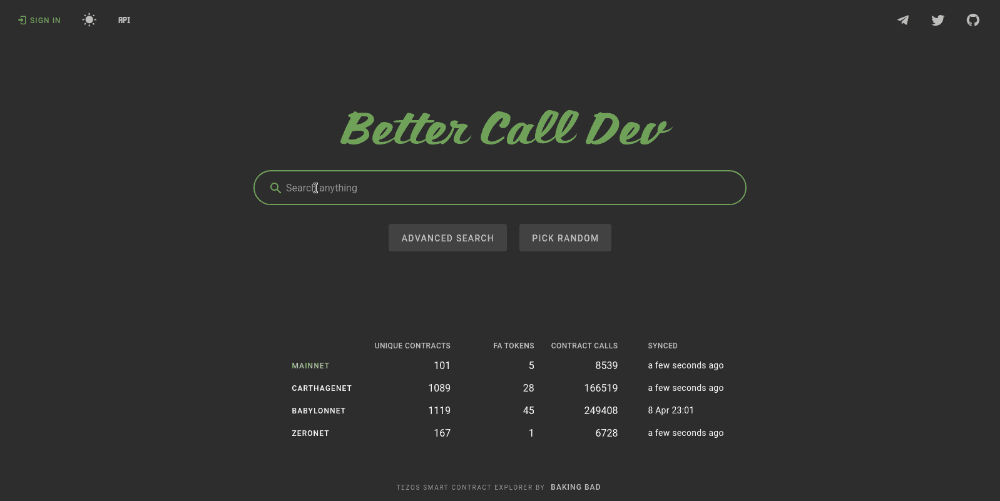
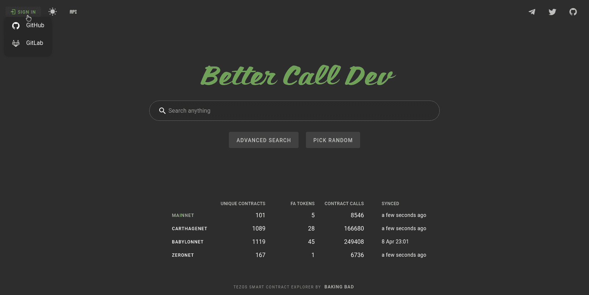

# 最好再打电话给 Dev strikes！

> 原文：<https://medium.com/coinmonks/better-call-dev-strikes-again-b7fd784f7396?source=collection_archive---------2----------------------->

## 新布局，黑暗主题，公共 API，仪表板，等等

昨天，我们发布了一个主要的 BCD 更新，我们迫不及待地想告诉大家我们添加的所有新的酷功能！

**鸣谢** 我们要感谢 Tezos 基金会对这个项目的支持，以及所有帮助我们使 BCD 变得伟大的活跃用户！
特别感谢路易斯、马特伊、罗曼和雅各布😉

# 在开始之前

我们想弄清楚不同的 BCD 版本。

## [老而精的开发](https://old.better-call.dev)

第一个在客户端运行的版本，可以连接到您的本地沙盒节点。

## [you.better-call.dev](http://you.better-call.dev)

在下一个版本中，你可以看到新的东西。它不是稳定的，也可以在任何时候重置(完整的索引需要几个小时)。

## [better-call.dev](https://better-call.dev)

当前稳定版本。

## [bbbox](https://github.com/baking-bad/bbbox)

用于本地开发的可定制 BCD 设置，它与公共版本略有不同，并适应沙盒环境。

# 界面的变化

首先，我们终于关灯了！很多人抱怨在 VSCode 和 BCD 之间切换对眼睛来说很痛苦，所以我们把它放在了优先位置。你仍然可以切换回灯光主题，现在也不是那么明亮。

基本上，我们完全重新设计了布局和导航，并统一了视图。更好的调用开发越来越像 IDE，所以我们需要处理复杂性，但不损失功能。回答关于移动视图的问题:BCD 目前在横向模式下看起来不错，我们目前没有计划将其用于纵向模式(毕竟，你没有在我们的手机上使用 VSCode，对吗？).然而，在下一个大版本中，我们将推出新功能，不太科技，并针对更广泛的受众，我们将确保在智能手机上的良好体验。

# API 文档

我们的 API 对公众开放使用，你可以在我们的 Swagger 门户上找到文档并使用端点。目前没有速率限制，也没有认证，所以请负责任地使用(否则会有🍌🍌🍌).
我们强烈建议您启动自己的实例——BCD 是麻省理工学院许可的，并且是公开开发的，因此一旦有了新的更新和补丁，您将立即获得它们。

# 网络统计

我们喜欢漂亮的图表，而且我们有很多结构化数据，所以我们试图用易于理解的指标来表达 Tezos DApp 生态系统的动态。

BCD 显示:

*   合同正本数量(包括副本，不包括 *manager.tz*
*   合同呼叫数(也不包括 *manager.tz*
*   总消耗气体
*   总分配存储量

# 新的搜索因素

我们对 SERP 做了一些改进，但最重要的是增加了几个新的因素:

*   操作*源*和*源 _ 别名*允许搜索由特定地址/已知账户发送的所有交易
*   BigMap *address* 将最近更改的`big_map`记录添加到搜索结果中

排名算法也进行了调整，以确保最相关的结果在顶部。

# 大地图查看器

合同开发人员不可替代的工具，允许探索 Big_map 键(甚至已删除)并浏览每个键的值历史。而且，可以追溯大 _ 图复制历史。

# 代码警报

有几种类型的上下文状态改变在没有额外计算的情况下不能被检索。这包括:

*   智能合同源于协议激活期间(如授权合同)
*   协议更新(迁移)期间智能合同代码更改
*   我们还将 lambda 表达式写入契约存储的所有操作(所谓的可升级模式)挑选到一个单独的组中，因为它会导致业务逻辑的变化

# 合同互动

这是 Tezos 契约的一个亮点:您可以探索特定入口点的类型，或者使用常规形式生成参数，甚至检查执行的结果。

# 仪表盘

我们向全功能开发人员仪表板迈出了第一步，这是一个可定制的事件监控。使用其中一个社交帐户登录后，您可以订阅任何合同，并指定您想要接收的特定事件。目前，您可以从以下集合中选择:

*   操作错误
*   应用的合同调用
*   代码逻辑的变化
*   内存池操作

如果您的合同副本(或类似的合同)被部署到公共网络，或者您的合同产生了内部发起(您可能也想订阅发起的合同)，BCD 也会通知您。

# 单用户模式(沙箱)

最后，我们为我们的沙盒用户创建了一个特殊的模式——单用户模式。他们正在自动登录，dashboard 现在是他们的主页，有两个预定义的订阅(您可以在 bbbox 设置中更改)Alice 和 Bob(在 [Flextesa](https://gitlab.com/tezos/flextesa) 沙箱中的默认帐户)。您将在仪表板中看到 Alice 或 Bob 拨打的所有部署/合同电话，无需使用搜索。
如果您正在运行完整的 bbbox 设置，您还会看到一个额外的 Jupyter 按钮，该按钮指向本地生成的交互式笔记本服务器。

# 下一步是什么

在下一个系列中，我们将分享我们关于下一个大更新的计划。剧透:它将专注于 CI/CD 集成、合同维护和监控，以及我们自己的 DApp 评级！

## 敬请期待

在 [GitHub](https://github.com/baking-bad) 上跟踪我们的进展，在我们的 [Twitter](https://twitter.com/tezosbakingbad) 频道上获取最新更新，保重！

你的，[烤坏了](https://baking-bad.org/docs)队。

*最初发表于 2020 年 6 月 10 日*[*https://baking-bad.org*](https://baking-bad.org/blog/2020/06/10/better-call-dev-strikes-again/)*，在那里你可以找到文章的完整版本。*

> [直接在您的收件箱中获得最佳软件交易](https://coincodecap.com/?utm_source=coinmonks)

