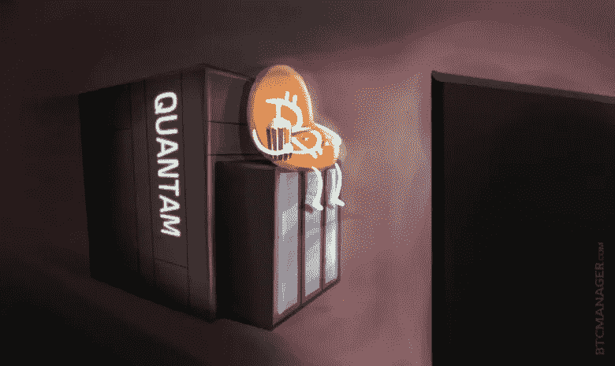
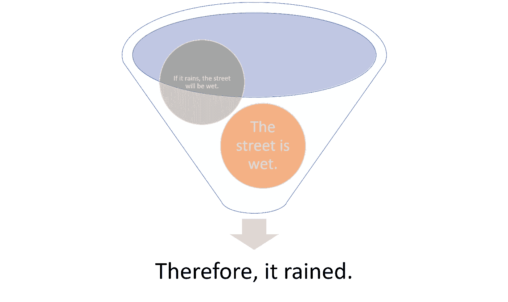

# 超越 BS:量子位协议以及为什么量子技术不会对加密货币构成威胁

> 原文：<https://medium.com/coinmonks/beyond-the-bs-the-qubit-protocol-and-why-quantum-technologies-are-not-an-existential-threat-to-4d1d862decc7?source=collection_archive---------2----------------------->

昨天是奇怪的一天，在几个小时内，我被拉进了两个不同的讨论，讨论的是对区块链科技公司量子计算攻击的担忧。那么，随着量子计算的出现，所有这些区块链不都变得无关紧要了吗？一个朋友问我。具有讽刺意味的是，我的朋友在区块链科技方面非常聪明和有才华，但是，谁能责怪他呢？他的观点反映了我们在主流科技媒体上发现的预测加密货币行业量子末日的文章类型。只要在谷歌上快速搜索一下，其中一些文章就会浮出水面:

[量子计算如何威胁区块链](https://www.nationalreview.com/2018/02/quantum-computing-blockchain-technology-threat/)

[量子计算机已经解锁加密货币兑换钱包了吗？](https://steemit.com/cryptocurrency/@jerrybanfield/have-quantum-computers-already-unlocked-cryptocurrency-exchange-wallets)

[量子计算如何对加密货币造成破坏](https://thenextweb.com/contributors/2018/04/14/quantum-computing-wreak-havoc-cryptocurrency/)

这个名单还在继续。大多数文章都在淡化一个论点，大概是这样的:

这个推理是一个叫做*形式谬误*的哲学论证的例子，它解释了一种基于缺乏结构而导致错误结论的推理模式。我们都听说过像下面这样的推理形式的形式谬误笑话:

回到量子计算和加密货币，争论并不在于 PoW 区块链容易受到量子攻击，而是这些风险被媒体大大夸大了，这些媒体决定在没有任何数学严谨性的情况下提出论点，以便成为引人注目的头条新闻。几个月前，我读了一篇研究论文，这篇论文最终详细论证了区块链战俘遭受量子攻击的真实风险。

# 对战俘区块链的真正量子攻击

这篇题为[“对比特币的量子攻击，以及如何防范它们”](https://arxiv.org/pdf/1710.10377.pdf)的论文详细描述了随着量子计算的出现，当前一代区块链技术可以看到的两种(而不是两千种)潜在攻击。第一种攻击侧重于使用 Grover search 等量子算法来胜过矿工。从技术上来说，量子计算机可以通过执行比经典计算机所需的哈希数少四分之一的哈希来执行哈希运算，因此我们可以在理论上创造出比网络其他部分以指数速度解决密码难题的矿工，对吗？没那么快。虽然理论上的论点是合理的，但研究人员着眼于未来 10 年量子计算机的预计时钟速度，并将其与传统硬件的可能能力进行比较。他们的结论是，大多数挖掘都是由英伟达(Nvidia)等公司制造的专用集成电路(ASICs)完成的。这种硬件很可能在未来 10 年左右保持对量子计算机的速度优势。

第二种攻击集中在战俘区块链使用的散列算法上。像 Btcoin 这样的技术，是使用基于 secp256k1 曲线的椭圆曲线数字签名算法制作的。该系统的安全性基于椭圆曲线离散对数问题的困难性。虽然这个问题仍然被认为是经典的难题，但有迹象表明量子算法应该能够有效地解决它。这也是一个坚实的理论论点，但当研究人员进行一些摩尔定律计算时，结果表明，区块链哈希应该至少在未来 20 年内保持量子电阻。

# 量子比特协议和对量子天启的明显反驳

每当我听到对量子攻击加密网络的夸大恐惧时，我就无法避免想到一个明显的反驳理由:*如果量子计算将变得无处不在，以至于可以用来攻击比特币等网络，我们难道不应该假设我们将使用同样的计算能力创建抗量子的工作证明或利益证明协议吗？对我来说，这似乎是一个很好的论据😉*

为了不让加密货币网络中的量子攻击风险碰运气，参与论文的一些研究人员最近发起了一项名为[量子位协议](https://www.qubitprotocol.com/)的倡议，该协议使用一种分散模式来为推进区块链网络中的量子技术的项目做出资金决策。量子位协议可以概括为这样的东西:

利用区块链技术推进量子研究，保护区块链网络免受量子攻击。讽刺的是，这是一个很好的例子😉