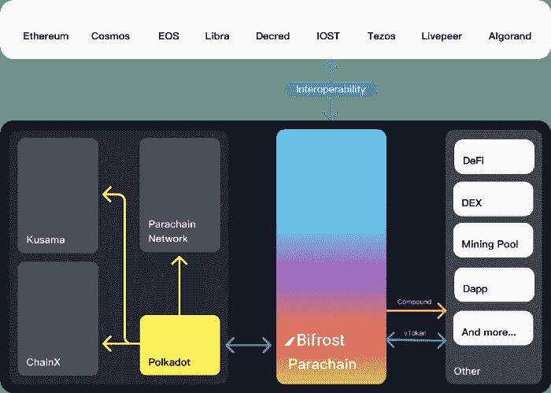
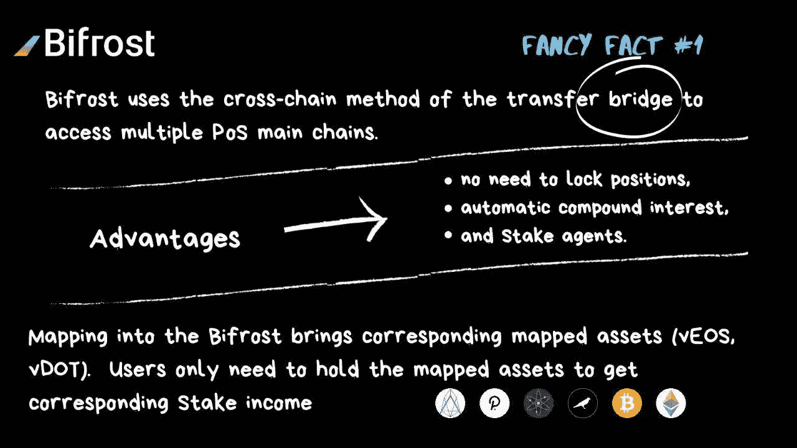
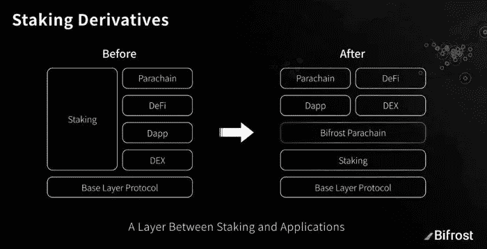
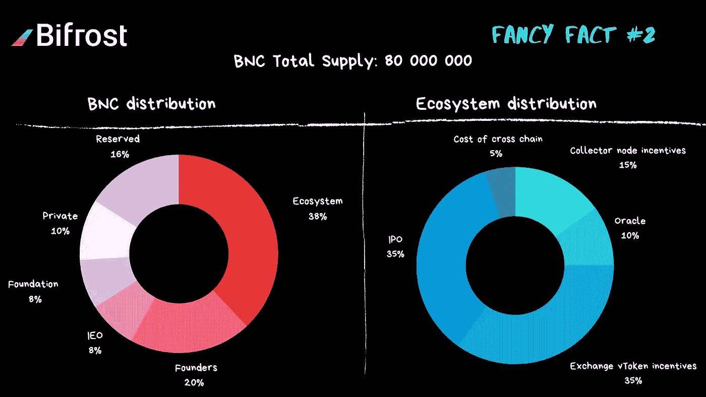
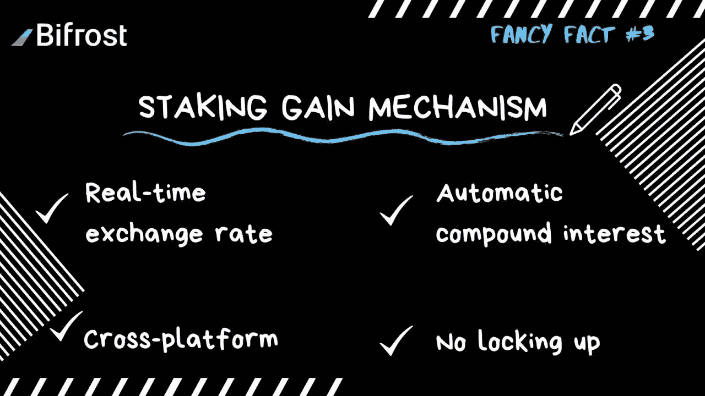
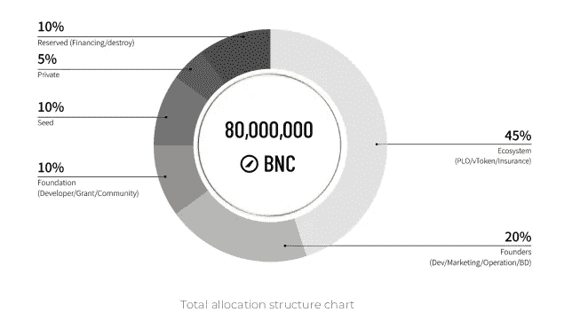

# 彩虹桥——波尔卡多特的流动性赌注

> 原文：<https://medium.com/coinmonks/bifrost-liquidity-staking-on-polkadot-178ca0a0fbe2?source=collection_archive---------2----------------------->

Bifrost 是基于基质的 DeFi 项目，将作为 Polkadot parachain 运行。Bifrost 的目标是在整个 Polkadot 生态系统内，为利益相关项目的证明释放利益相关基金的流动性

# 为什么是液体打桩？

在深入探讨流动性赌注本身之前，我们先来谈谈赌注。利害关系证明让用户有机会绑定他们的令牌，并因使网络更加安全而获得奖励。赌注在加密货币用户中变得非常流行，因为它允许他们持有硬币，同时赚取利息。最受欢迎的 PoS 货币，如 Polkadot、Tezos 或 Cardano，可以提供高达 15%的[APY](https://www.investopedia.com/terms/a/apy.asp)——与你用法定货币在传统金融系统中获得的收益相比，这是一个很大的数字。

然而，赌注并不是唯一能让你获得兴趣的方法。在 DeFi 的世界里，你可以投资于贷款 dApps，实践产量农业，在预测市场上竞争，或者为交易所提供流动性。这些服务通常比你从赌注中得到的收益更高。因此，问题是如何让人们参与进来(我们需要大量的代币来为网络提供安全保障)，并适当补偿他们失去的投资机会成本。

关于绑定还有另一个大问题——许多项目迫使用户经历一个解除绑定的时期。例如，在波尔卡多特上，这个时间段是 28 天。让我们想象一下，今天网络价格上涨了 20%,你决定卖掉你的基金，但是你不能！您可以解除它们的绑定，但是您仍然需要等待 28 天才能解锁令牌。

欢迎使用液态铆接，这一新趋势将在 DeFi 和铆接之间建立共生关系，并解决上面列出的所有难题。

# 什么是液态铆接？

流动赌注是一种想法，你可以将你的代币绑定到网络上，并且仍然可以随意使用代币，用于交易、DeFi 或任何其他目的。同时，你可以决定在任何时候解除绑定，你将立即收到你的令牌。

如您所见，这为 PoS 项目及其用户带来了巨大的机会。创建各种 PoS 项目的团队不必再担心低赌注率和不安全的网络。与此同时，想要下注的人不必支付机会成本来从网络中获得下注回报。

# 彩虹桥——整个波尔卡多特生态系统的流动性

Bifrost 是一个项目，其目的不亚于为所有 PoS 项目提供赌注流动性，这些项目将作为 Polkadot 顶部的副链运行。通过使用彩虹桥下注，用户将绑定他们的代币，并获得新铸造的 vTokens 作为回报。例如，当您绑定您的点时，您将收到一个 vDOT，您可以进一步交易。

以下是 Bifrost 可以提供的功能列表

*   流动性赌注
*   老虎机拍卖流动性
*   投票权市场
*   基于平衡器和 Uniswap 的索引

让我们逐一探索所有这些特性。

## 流动性赌注

原理非常简单——用户将他们的代币绑定到 Bifrost，随后将收到新铸造的代币，用户可以用这些代币交换其他类型的代币。例如，如果您用彩虹桥下注 100 点，您将获得 100 vDOT 回报。然后，这些点可以在 Bifrost DEX 上进行交易，Bifrost DEX 将成为通往 Polkadot 生态系统其余部分及其 DeFi 功能的门户——别忘了，将会有通往 ETH 的桥梁，因此您甚至可以将其交换到 ETH 或任何 ERC-20 令牌。

让我们来看一个它是如何工作的例子。

1.  用户想用彩虹糖在 Polkadot 上下注 10 点
2.  当时，**代币造币价格**是 0.01
3.  Bifrost 将粘合点，铸造 1000 vDOT 并将其交给用户
4.  一周后，用户将获得 0.5 点的奖励，但该奖励不会导致铸造新的代币。相反，象征性的铸币价格被提高到 0.0105
5.  此时，用户可以兑换 10.5 点，因为代币的铸币价格已经改变

这个过程非常透明和简单，获得的奖励越多，你得到的代币面值就越大。

## 副链槽拍卖流动性

我将简要解释如何 parachain 槽拍卖工作。因为副链位置数量有限，所以必须有一种方法来竞争它们。因此，Polkadot 提供了一个拍卖系统，用户可以对自己喜欢的项目进行投标。拍卖可能会失败(所有抵押代币会立即返还给所有者)或成功

**拍卖成功**

*   项目将获得多达 4 个副链槽(1 槽是 6 个月)，
*   所有绑定到拍卖的代币在该时间段内被锁定
*   用户通常会以项目的本机令牌的形式获得机会成本补偿

正如你所看到的，第二点对一些用户来说确实是个问题。想象一下，你用 100 个点为你最喜欢的项目投标，这些点将被锁定长达 2 年。

所以彩虹桥来拯救我们了！您实际上可以通过 Bifrost 协议出价，如果项目成功，Bifrost 将铸造 vDOT，您可以交易该 vDOT，同时从您投票支持的项目中获得奖励。

## 投票权市场

Bifrost 提供的一个独特功能是投票权市场。任何想要在 PoS 网络中下注的人都需要找到验证器或赌注池，他将把他的代币绑定到该验证器或赌注池。然而，这对于许多用户来说并不容易，因为找到值得信任的验证者可能是一项困难的任务。

因此，Bifrost 将引入竞价机制，这样用户就可以为具有最佳结果的验证器投票，这些验证器将标记它们的令牌——所有这一切都以透明和简单的方式进行。

## 分散交换

Bifrost 将根据平衡器的代码提供自己的 DEX 来交易名为 **vTokenSwap** 的 vTokens。vTokens 是所谓的衍生资产，这意味着它们的价值基于基础资产的价值——例如我们在流动赌注例子中提到的关系点- > vDOT。

DEX 的第一次迭代将仅支持各种 vtoken 的交换，在下一阶段，他们计划与其他 CEX 或 DEX 交换合作，这将为 vtoken 带来 DeFi 功能和更多用例。

# 竞争

在提供赌注流动性方面，还有其他项目在竞争。我们将在这里提到其中一些，并描述一些不同之处

## 阿卡拉

Acala 最出名的是将抵押稳定硬币引入生态系统，但他们也计划提供流动性赌注。但是，它将仅限于 DOT 和 KSM，并且不会为 parachain 拍卖提供流动性解决方案或启用投票权市场。

## Stafi(赌注金融)

Stafi 已经有自己独立的 mainnet 在运行，而且近期没有参与 parachain 拍卖的计划。因此，他们负责链的安全。

液体打桩与 Bifrost 提供的非常相似。但同样，这个解决方案并不复杂，不足以包括副链拍卖流动性或投票权交易市场。

## 咒符刀

MantraDAO 将支持 PoS 项目的非托管打桩服务。他们将主要关注波尔卡多特及其生态系统，但他们最终计划增加对阿达、XTZ 或 ELA 等硬币的支持。

Mantra 还将奖励用户使用其原生 OM 令牌下注，他们目前正在开发多种贷款产品。这个开发过程分为三个阶段

1.  开发到现有平台(如 Compound)的桥梁
2.  使用第三方贷款服务提供商，他们将插入 Mantra 后端代码
3.  基于衍生资产创建自己的借贷平台(类似于 Bifrost 的计划)

MantraDAO 是流动性赌注行业的一个重要竞争对手，但同样，彩虹桥仍然只是为副链拍卖提供流动性的项目之一。

# 经济学

彩虹桥也有自己的本土标志，叫做 BNC。初始总供应量将为 80，000，BNCs。令牌将服务于网络中的各种目的

*   交易费用——实际上所有费用都被送到了财政部
*   削减抵押品——用于弥补验证者削减造成的任何潜在损失的储蓄
*   治理——公投、节点选举或委员会中的投票
*   获取赌注奖励——产生的奖励的一部分将用于回购一些 BNC 代币回到国库

# 结论

我们相信，彩虹桥将在波尔卡多特生态系统中发挥非常重要的作用。通过向市场注入隐藏在 PoS 协议中的大量流动性，流动性赌注将最终释放 DeFi 的真正力量。这还不是全部，parachain 拍卖将需要从人们那里收集大量的代币——您是愿意将您的点锁定 2 年还是使用 Bifrost 从拍卖中获得奖励，同时仍有可能使用您的代币参加 DeFi？

***敬请关注关于 Polkadot 生态系统项目的更多信息，在我们的*** [***推特频道 Polkadotters***](https://twitter.com/Polkadotters1)***以及我们的*** [***脸书 Polkadot 非官方组！***](https://www.facebook.com/groups/993729051100217)

## 另外，阅读

*   最佳加密交易机器人
*   [Deribit 审查](/coinmonks/deribit-review-options-fees-apis-and-testnet-2ca16c4bbdb2) |选项、费用、API 和 Testnet
*   [FTX 密码交易所评论](/coinmonks/ftx-crypto-exchange-review-53664ac1198f)
*   [Bybit 交换评论](/coinmonks/bybit-exchange-review-dbd570019b71)
*   最好的比特币[硬件钱包](/coinmonks/the-best-cryptocurrency-hardware-wallets-of-2020-e28b1c124069?source=friends_link&sk=324dd9ff8556ab578d71e7ad7658ad7c)
*   [密码本交易平台](/coinmonks/top-10-crypto-copy-trading-platforms-for-beginners-d0c37c7d698c)
*   最好的[加密税务软件](/coinmonks/best-crypto-tax-tool-for-my-money-72d4b430816b)
*   [最佳加密交易平台](/coinmonks/the-best-crypto-trading-platforms-in-2020-the-definitive-guide-updated-c72f8b874555)
*   最佳[加密借贷平台](/coinmonks/top-5-crypto-lending-platforms-in-2020-that-you-need-to-know-a1b675cec3fa)
*   [莱杰 Nano S vs 特雷佐 one vs 特雷佐 T vs 莱杰 Nano X](https://blog.coincodecap.com/ledger-nano-s-vs-trezor-one-ledger-nano-x-trezor-t)
*   [block fi vs Celsius](/coinmonks/blockfi-vs-celsius-vs-hodlnaut-8a1cc8c26630)vs Hodlnaut
*   Bitsgap 评论——一个轻松赚钱的加密交易机器人
*   [Quadency Review](/coinmonks/quadency-review-a-crypto-trading-automation-platform-3068eaa374e1) -为专业人士打造的加密交易机器人
*   [PrimeXBT 评论](/coinmonks/primexbt-review-88e0815be858) |杠杆交易、费用和交易
*   HaasOnline 评论享受九折优惠
*   [埃利帕尔泰坦评论](/coinmonks/ellipal-titan-review-85e9071dd029)
*   [SecuX Stone 评论](https://blog.coincodecap.com/secux-stone-hardware-wallet-review)
*   [BlockFi 评论](/coinmonks/blockfi-review-53096053c097) |赚取高达 8.6%的加密利息
*   [开发人员的最佳加密 API](/coinmonks/best-crypto-apis-for-developers-5efe3a597a9f)
*   [最佳区块链分析工具](https://bitquery.io/blog/best-blockchain-analysis-tools-and-software)
*   [加密套利](/coinmonks/crypto-arbitrage-guide-how-to-make-money-as-a-beginner-62bfe5c868f6)指南:新手如何赚钱
*   顶级[比特币节点](https://blog.coincodecap.com/bitcoin-node-solutions)提供商
*   最佳[加密制图工具](/coinmonks/what-are-the-best-charting-platforms-for-cryptocurrency-trading-85aade584d80)
*   了解比特币的[最佳书籍有哪些？](/coinmonks/what-are-the-best-books-to-learn-bitcoin-409aeb9aff4b)

> [直接在您的收件箱中获得最佳软件交易](/coinmonks/newsletters/coinmonks)

