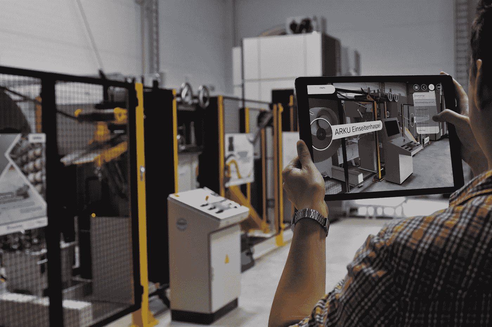
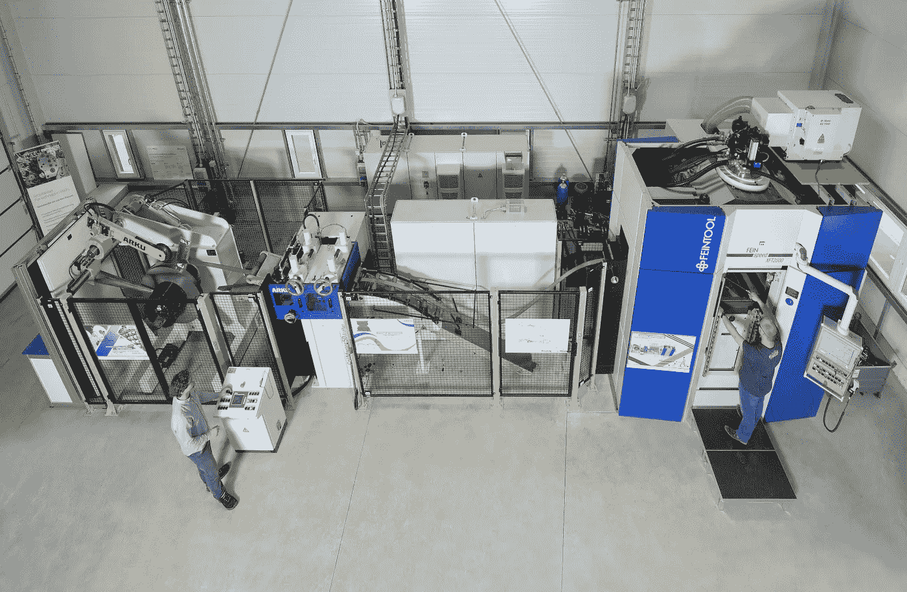
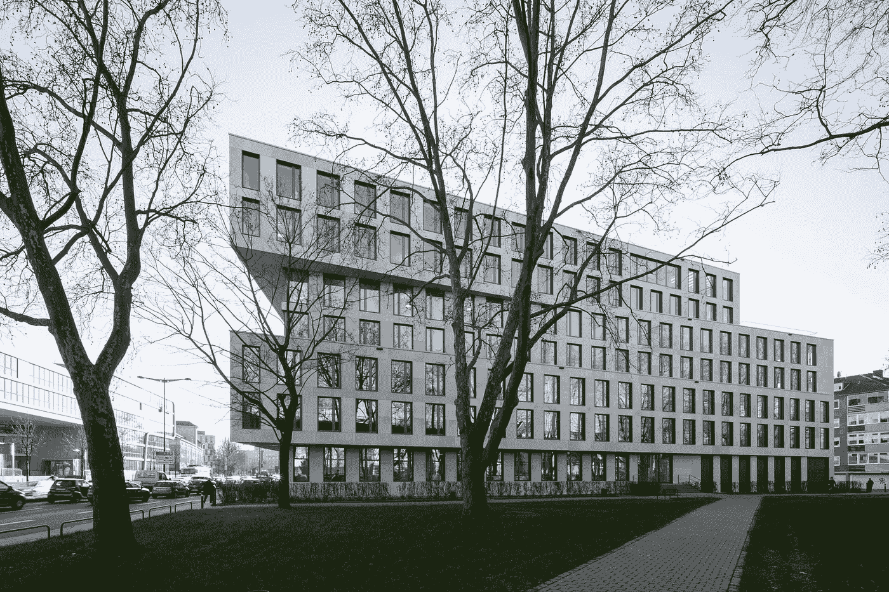

# 大数据、IOTA 及其在机床工程中的巨大应用

> 原文：<https://medium.com/coinmonks/big-data-iota-and-a-great-application-in-machine-tool-engineering-1b6210cf5129?source=collection_archive---------2----------------------->

亚琛工业大学机床与生产工程实验室(WZL)目前正在研究“生产互联网”——工业物联网的核心，为未来的生产时代铺平道路。几周前，WZL 制造技术主席的总工程师，ing 博士。Daniel Trauth 与来自公共 IOTA 项目的 Markus Gebhardt 讨论了在精密冲裁中使用 IOTA 的流程和前景。大家还一致认为,“公共 IOTA 项目”将在未来继续围绕这一真正的 IOTA 应用程序。

## 大数据概述

由于生活所有领域的逐步数字化，尤其是通信、科学和互联网，每天都会产生无数数据，尤其是先进工业过程中的测量会产生大量数据。处理这些大数据是迈向工业 4.0 和物联网的重要一步。

Fineblanking machine at WZL

## 精密冲裁中的大数据

具体来说，亚琛工业大学的 WZL 目前正在研究精密冲裁机的应用。在精冲中，首先将金属从金属板卷上开卷。之后，开卷的材料被送入矫直系统，在那里板材被压平。然后，精冲压力机对压平的材料进行加工。每秒钟从展平的材料上切下多达四个零件。精冲非常适合安全关键部件的大规模生产，如制动器支架。目标是所有部分都相同。然而，事实并非如此，因为材料、工艺甚至周围环境的不确定性会导致不同的模辊和轮廓。然而，由于最终所有部件都必须相同，因此需要昂贵的后处理步骤，这是人们希望避免的。工程师们试图用某些工艺参数的公式来描述这些关系，但它们包含必须通过实验确定的常数。因此，该方法是从过程中捕获尽可能多的数据，并在精冲中首次将基于物理的方法和数据驱动的方法结合起来。

Fineblanking machine at WZL

数据直接从机器、附加的自附着力传感器、图像和视频馈送、材料特性传感器(板材从来不是均匀的)或声学、振动、温度传感器读取。这导致数据速率高达 10 Gbit / s(理论值),其中 WZL 希望在第一步中保存尽可能多的数据。他们的机器中有一个功能强大、内存充足的服务器，所以他们可以存储数据，然后用机器学习方法来处理这些数据。目的是发现单个测量系列和隐藏在常数公式中的扰动参数之间的新的相关性。然后，视觉看到一个自我管理的“自主”机器，它像“自动驾驶”一样控制自己，并优化过程。

## 有了 IOTA，愿景变成了真正的应用

仅这个案例就已经包括了几个建筑工地(数据采集、数据集成、分布式网络，一般是“大数据”和机器学习的大部分领域)，但 WZL 现在希望致力于分布式账本技术，如 tangle 和区块链，并以测试数字供应链的形式。在这种情况下，现在与 IOTA 一起使用的数字价值链以这样的方式呈现，即对于精冲机生产的每个部件，过程状态、生产步骤和部件属性被数字地映射在网络化价值链中。凭借 DLTs 不可更改的能力，以及为 IOTA 的独特数据流/数据集付费的能力，IOTA 的 Tangle 为数字连接价值链提供了一个有希望的基础。

## 与 grandcentrix 合作并支持 public IOTA

我们最近在报纸上看到:未来，WZL 将依赖与 grandcentrix 的合作，grand centrix 是该地区最现代化的物联网产品和智能产品专业系统公司之一。作为合作伙伴，grandcentrix 当然是一个很好的选择，无论如何都会受到欢迎。这种合作应该能够实现生产互联网的愿景，该领域的专家拥有独特的专业知识和方法，能够提供端到端的服务，从电子设计到云和数字账本。grandcentrix 的管理合伙人 Ralf Rottmann 最近加入了 IOTA 基金会的董事会，这进一步让该团队能够直接进入 IOTA 领域。

Headquarters grandcentrix

WZL 和“公共 IOTA 项目”之间之前非常好的交流应该在未来继续并深化。公共 IOTA 将继续在机床制造中实施这一 IOTA 应用的非凡过程。

我们将在未来几周内在我们的公共 IOTA 网站上记录这个和许多其他 IOTA 项目。

## 你对公共 IOTA 的支持

请记住，我们是一个独立的小团体，没有财务空间。我们感谢对这个项目的任何财政和其他援助。

如果你喜欢我们的项目，我们很乐意得到支持！T

IOTA 地址:uvyf 9 zkexcroioayregpgqnlyiiyfeskhoxtkrgdwndwmgsxcgrfu 9 ivpozvuqtltktm 9 uxrgutloryecwmleyliclb

“公共 IOTA 项目”不是 IOTA 基金会的一部分，也不与任何其他方式相联系，它是一个支持 IOTA 及其应用的独立项目。

联系人:info@publiciota.com

