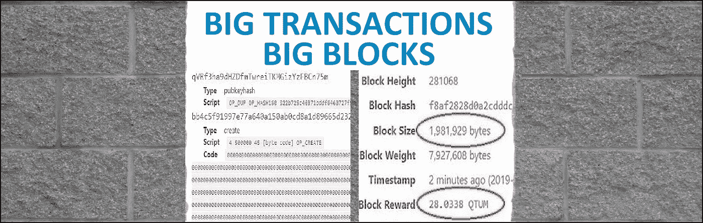
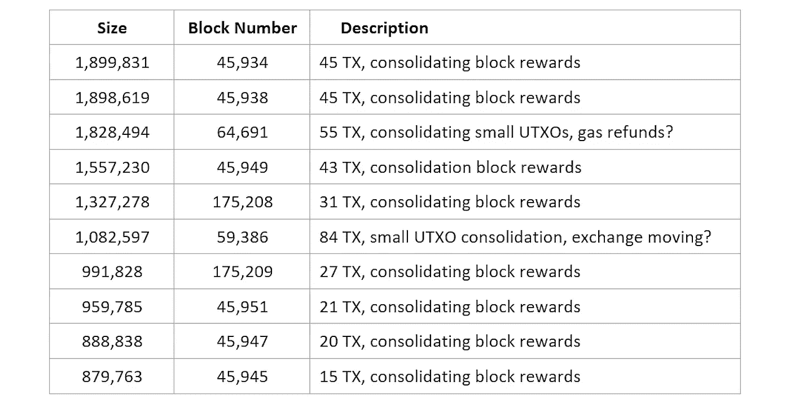
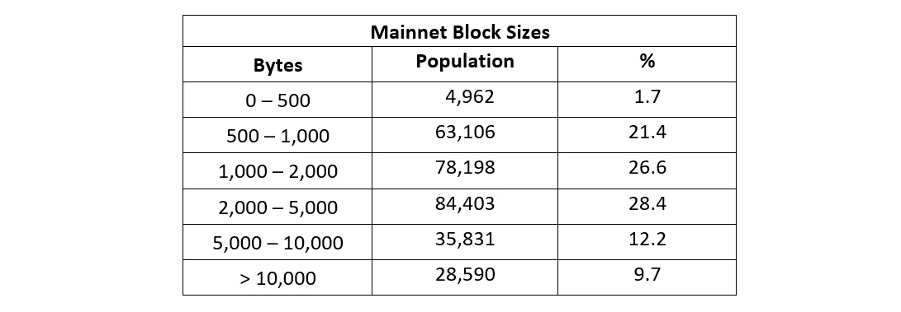
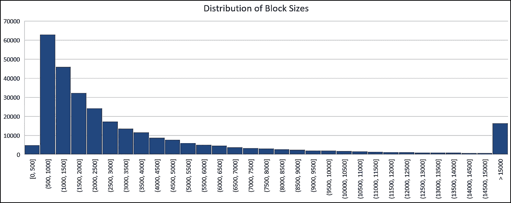
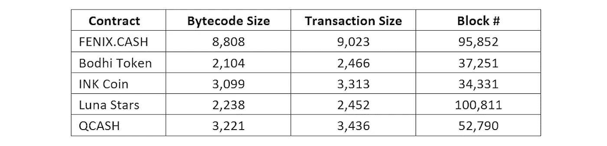
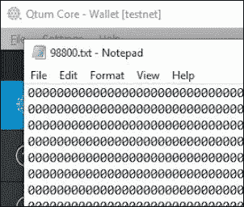
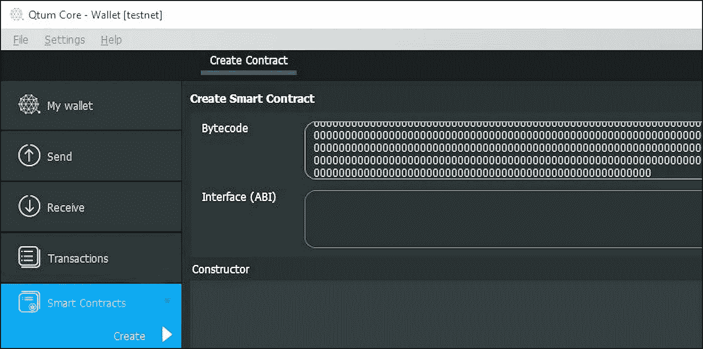
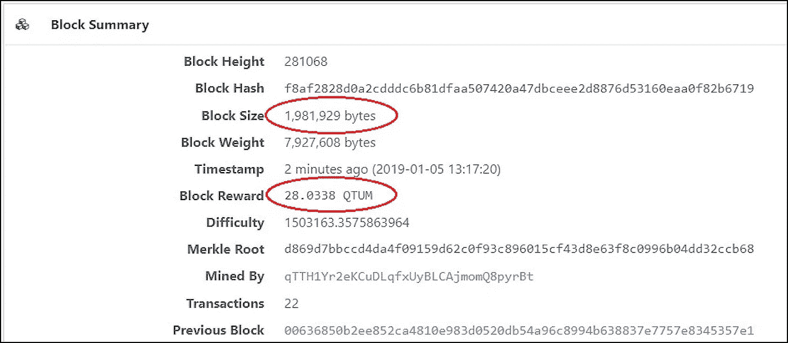

# 大宗交易—大宗交易

> 原文：<https://medium.com/coinmonks/big-transactions-big-blocks-42d04b3b635b?source=collection_archive---------1----------------------->

这篇博客关注 Qtum 块大小:事务和块有多大，我们如何发布一些真正大的块？Qtum 是一个独立的区块链，结合了比特币的 UTXO 交易模型和智能合约 EVM(以太坊虚拟机)，这两个功能都在本博客中进行了练习。

**TL，DR**:Qtum 块大小为 2.0 MB(2mb 或 200 万字节)，通过查看自发布以来的所有 Mainnet 块，有一些块接近这个大小。我们回顾了各种事务的一些典型大小、历史数据块大小，并尝试发布一个真正大的 2.0 MB 数据块。

# **简介**

新用户有时会询问块大小和 TPS(每秒事务数)。在这篇博客中，我们深入探讨这些问题，基本上是“它有多大，有多快？”

Qtum 目前使用 2.0 MB 的块大小，这个块大小可以使用链上 DGP(分散治理协议)在 0.5 到 32 MB 之间动态调整。与其他一些区块链相比，比特币和莱特币的块大小为 1.0 MB。比特币现金 ABC(可调块大小上限)最近升级到 32 MB，比特币现金 SV (Satoshi Vision)有 128 MB。以太坊块的大小是可变的，并基于气体限制，但平均在 20k-30k 字节范围内，XRP 没有块。

块大小部分地决定了区块链的 TPS。下面我们会考虑如何计算理论 TPS，但是决定 TPS 的因素有很多。注意，Qtum 是一个完全分散的区块链，其他具有更集中架构的区块链架构可以有更快的 TPS。

考虑 TPS 的一个复杂因素是交易本身，因为单个交易可能有数百次硬币/代币转移，我们将在下面看到这些大型交易的一些示例。

理论上的 TPS 就是块大小除以块间距，再除以事务大小[参考文献 1]。

# **实际块大小**

要查看实际的块大小，请使用一个 [Python 脚本](https://github.com/JB395/Qtum-Block-Ripper)来获取 Qtum Mainnet 区块链前 16 个月的大小(从 1 到 294，000 的块)。最小的块在 620 到 880 字节之间，大多数 genesis 块(我最喜欢的)重约 330 字节。

[Block 45，934](https://qtum.info/block/45934?page=1) 最大，为 1，899，831 字节，有 45 个事务，主要是将数百个输入合并为单个输出，看起来像一些鲸鱼赌注钱包在清理它们的 Block 奖励。大多数其他大块显示了相同的模式，有数百个输入的事务(参见块 [64，691](https://qtum.info/block/64691) ，单个事务中有 600 多个输入)。

十个最大的区块是:

对于自 2017 年 9 月 Qtum Mainnet 推出以来的 294，000 个块，块大小的分布如下所示:

第一组小程序块位于 genesis 程序块中(快速执行以创建 QTUM 初始供应的工作程序块的证明)。这些早期的块也是我发现的最大的事务的所在地，一些起源块内务处理，这个事务[在块 3038 中](https://qtum.info/tx/25ecf11302897aecfa84f3a32662e704e48617adb7dcd52bb284fe495524519e)，大小为 94981 字节。

此直方图显示了大小范围为 500 的组中的块数。

# **垃圾邮件时间**

我想通过在 Mainnet 上发布一个比目前为止看到的更大的块来研究块大小，并尝试在区块链上推一个 2.0 MB 的块。Qtum Testnet 是这种滥用的理想平台，因为免费的 Testnet Qtum 可以从用于 gas 的 [Testnet 水龙头](http://testnet-faucet.qtum.info)获得，并且各种 QTUM 钱包可以很容易地设置为在 Testnet 上操作。

要创建一个 2.0 MB 的块，wallet 必须发出许多事务，这些事务在内存池中等待，直到它们在下一个块中被发布。

对于这种情况，什么样的交易是好的选择？一个简单的硬币发送事务有 226 个字节，因此需要大约 8，800 个字节来填充一个块，这似乎令人生畏(令人生畏=太难尝试)。使用低级命令可以构建更大、更复杂的事务，但这种方法也令人望而生畏。

最好的候选似乎是创建合同的交易。为了在 Qtum 上创建智能合约，Solidity 编程语言被编译成字节码(以太坊虚拟机的低级“机器”指令)。这个字节码必须在“契约创建”事务中发送，并且应该进行大型事务。

为了检验这种方法，下面是一些已发布合同的实际字节码大小:

这将需要 200 多个 FENIX 大小的交易。获得高达 2.0 MB 的现金。没那么令人生畏，但是如果我们可以做一个超大规模的合同交易呢？

a “dumb” contract

.

为了完成这笔大交易，我使用了一个字节码为 98，800 字节的智能合约交易，这接近 Qtum Core wallet 可以接受的最大值。编译成 98.8k 字节码需要大量的可靠性代码，所以我直接进入字节码，写了 98，800 次 STOP 命令(hex 00)。

这将创建一个 99，904 字节的事务。这些事务中的 20 个，加上启动每个块的 coinbase 和 coinstake 事务，应该非常接近 2.0 MB 的最大值。

getting ready to publish 30 big contracts

这些契约不需要 ABI(应用程序二进制接口)——没有人会调用它们！这个合同需要 448，200 gas 来创建，所以我将 gas 金额设置为 500，000，gas 价格设置为 0.0000045，为每笔交易支付 1.2 Testnet QTUM 的总费用。

挑战将是在发布下一个块之前，手动将 20 个这样的事务(再加上 10 个，以确保填满一个块)发送到内存池中。由于核心钱包“发送”按钮的速度限制为 3 秒钟，因此快速点击鼠标将需要大约 3 分钟才能发送 30 笔交易。为了提高在发布下一个块之前将所有这些事务放入内存池的几率，我选择了块可能运行缓慢的时间(这是未来博客的主题)。

在一些试运行之后，事务序列正好在 Testnet 块 [281，068](https://testnet.qtum.info/block/281068) 之前被发送，该块清除了其中的 20 个事务(如预期的那样)并发布了 1，981，929 字节的块。请注意，该区块的区块回报为 28.0338，这意味着发送的气体加上交易费用为 24.0338 Testnet QTUM。

Testnet block [281,068](https://testnet.qtum.info/block/281068)

总之，我们查看了历史块大小，找到了 Qtum Mainnet 上最大的块和事务，并弄清楚了如何在 Qtum Testnet 上发布 1.98 MB 的块[参考文献 2]。

我希望你所有的交易都有适当的规模，并在网上保持安全。

Jackson Belove 是一名独立研究员，社交媒体主持人，偶尔写博客，感谢 Qtum 团队的技术建议，并喜欢讨论区块链技术。如果你有关于这个话题的问题、评论或更正，请在社交媒体上让他知道。

# **参考文献**

1.  理论 TPS:

当然，您的里程可能会有所不同。我将把填充了半大小 SegWit 事务的 32 MB DGP 块的 TPS 计算作为一个练习。

2.在撰写这篇博客的研究中，没有区块链人受到伤害。

3.查看以前的博客，主题如下:

[Qtum 新用户十大问题](/@jb395official/top-10-qtum-new-user-questions-december-8-2018-fed45b18bf5e)，Qtum 新用户答案(更新)，发布于 2018 年 12 月 8 日

[钱包导入格式](/@jb395official/wallet-import-format-3497f670b6aa)，钱包如何处理私钥，2018 年 11 月 12 日发布

[网络权重](/@jb395official/network-weight-october-31-2018-35795dc5bebd)，网络权重如何作用，第一年如何变化，发表于 2018 年 10 月 31 日

[钱包和钥匙](/@jb395official/wallets-and-keys-july-23-2018-92abf2a2d2bf)，钱包如何使用私钥以及在钱包之间移动私钥，2018 年 7 月 25 日发布

[孤儿街区](/@jb395official/orphan-blocks-june-16-2018-a8f4799dcc2c)(重访)，2018 年 6 月 16 日出版

[QRC20 代币更新](/@jb395official/qrc20-token-update-may-28-2018-45e2e259b891)，设置发送 QRC20 代币的气限和气价，发布于 2018 年 5 月 28 日

[Qtum 对等连接](/@jb395official/qtum-peer-connections-may-21-2018-ba12bda71e4f)，详细介绍了现在 Qtum 节点与其他节点的连接、传出/传入连接以及一些用于监控流量的工具，于 2018 年 5 月 21 日发布

[Qtum 新用户十大问题](/@jb395official/top-10-qtum-new-user-questions-april-22-2018-307a65dad83f)，以及针对 Qtum 新用户的回答，发布于 2018 年 4 月 22 日

[网络散列率](/@jb395official/network-hash-rates-april-4-2018-d4159365df19)，比特币、以太坊、Qtum 的网络散列率对比，数字可能会让你大吃一惊[，](/@jb395official/network-hash-rates-april-4-2018-d4159365df19)发表于 2018 年 4 月 6 日

[新手钱包](/@jb395official/newbie-wallets-april-1-2018-26ea7a06489c)，对块奖励获奖钱包和新中国节点的分析，于 2018 年 4 月 1 日发布

[调试日志，虚拟机日志](/@jb395official/the-debug-log-the-virtual-machine-log-march-13-2018-76ddbe568f2)，debug.log(和虚拟机日志)是你的朋友，如何找到并阅读调试日志，p2018 年 3 月 13 日发布

QTUM 上限供应——减半, QTUM 的供应有上限吗，还会有多少？QTUM 的 cap,“减半”如何工作，以及 2018 年 3 月 4 日发布的新浏览器

[QRC20 令牌报告](/@jb395official/qrc20-token-report-february-25-2018-ff397a1ac070)，QRC20 令牌，BOT airdrop，发布于 2018 年 2 月 25 日

[一个 Qtum PoS 模拟器](/@jb395official/happy-new-year-qtum-mainnet-performance-february-9-15-a696e8e8396e)，发布于 2018 年 2 月 16 日

[Testnet](/@jb395official/testnet-and-qtum-mainnet-performance-january-1-8-e7af03a5d430) ，Qtum 测试网络，发布于 2018 年 1 月 7 日

[虚拟专用网络(VPN)](/@jb395official/qtum-mainnet-results-december-25-31-891680ee5a52)，利用 VPN 进行跑马圈地，发布于 2017 年 12 月 31 日

[交易费用](/@jb395official/qtum-mainnet-results-december-18-24-8e43e51aca3b)，发布于 2017 年 12 月 24 日

[密码短语](/@jb395official/qtum-mainnet-results-dec-11-17-d5548947fa1f)，密码短语和密码短语猜测脚本，发布于 2017 年 12 月 17 日

[内存池(mempool)](/@jb395official/qtum-mainnet-results-dec-4-10-2d4bc438062d) 《内存池与未确认交易的处理》，2017 年 12 月 10 日发布

[孤儿区块](/@jb395official/qtum-mainnet-results-nov-27-dec-3-327c1e9bc59c)，发布于 2017 年 12 月 3 日

[qtum . explorer . io 合同页面](/@jb395official/qtum-mainnet-results-november-20-26-ebde2cd0139)，发布于 2017 年 11 月 26 日

[sha 256 哈希算法及难度](/@jb395official/qtum-mainnet-results-november-13-19-bfbf45d0c153)，2017 年 11 月 20 日发布

[2017 年 11 月 12 日发布的](/@jb395official/qtum-mainnet-results-november-6-12-f59dd373ff3)奖金分配

[sha 256 哈希算法，目标和难度](/@jb395official/qtum-mainnet-results-october-30-november-5-d58164b811db)，2017 年 11 月 5 日发布

[股权挖掘 Qtum 证明介绍——一个赛车故事](/@jb395official/an-introduction-to-qtum-proof-of-stake-mining-a-racing-story-f11a3f48009f)，一个关于 PoS 挖掘的 ELI5 故事，2017 年 10 月 29 日出版

> [直接在您的收件箱中获得最佳软件交易](https://coincodecap.com/?utm_source=coinmonks)

