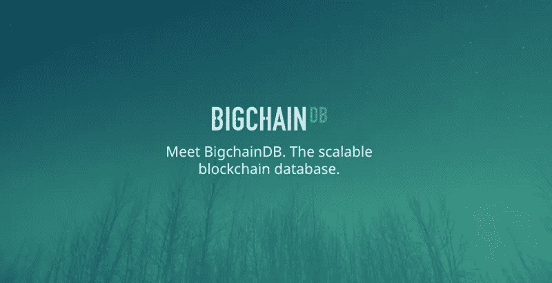
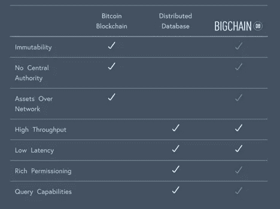

# 大链数据库，一个关于区块链类固醇的数据库

> 原文：<https://medium.com/coinmonks/bigchaindb-a-database-on-blockchain-steroids-fb52f3cd0d56?source=collection_archive---------1----------------------->



区块链生态系统中的许多人可能会批评，甚至讨厌 BigchainDB 声称*“它不是一个真正的区块链”*，他们可能是对的，但 Hyperledger Fabric 也不是。从我诚实的观点来看，BigchainDB 这是一项值得了解的技术，特别是如果您是**计划在企业环境中部署分散或分布式系统的话。**

BigchainDB 是一个开源分布式存储系统，其目标是**将“传统”NoSQL 数据库的主要优势与区块链技术的优势**(有点像 AWS 最近宣布的[QLDB—quantity Ledger Database)](https://aws.amazon.com/qldb/)。我在 BignchianDB 看到的主要好处之一是能够使用生产就绪型技术部署类似区块链的分散系统。让我解释一下，在企业环境中部署区块链系统的主要问题之一是当前技术的不成熟。但是等等，我们已经在现有系统中部署了 NoSQL 数据库，对吗？BigchainDB 基于生产就绪型数据库，这一事实使得它在生产中的部署非常有吸引力，而不必等待区块链平台的其余部分赶上来并被企业大量采用。



BigchainDB shares the main benefits of blockchain technology and distributed databases.

BigchainDB 是从企业就绪型数据库节点的联合构建的，比如 MongoDB 实例，它们以同步的方式存储关于资产的各种信息。**通过执行嫩薄荷的 BFT 共识算法**，存储在网络中的数据在所有节点之间传播和同步，确保其完整性。简而言之， **BigchainDB 是一个 MongoDB 数据库，它使用嫩薄荷来获得其区块链特征。**

根据实体对系统的访问权限，BigchainDB 网络可以是公共的、私有的或许可的。在公共 BigchainDB 中，任何参与者都应该能够访问网络或部署他们自己的 MongoDB+嫩薄荷节点，并将其连接到数据库联盟；虽然许可的 BigchainDB 可以由一个联盟或一个管理实体来管理，其中该联盟的每个成员都管理着自己在网络中的节点，没有许可任何人都不能加入(类似于其他许可的区块链技术)。

BigchainDB 中的基本信息结构是资产。**资产在 MobgoDB** 中被“物理地”表示为 JSON 文档。这些资产由系统中的用户拥有，他是唯一有权对其进行更改的人。为了创建、转移或修改资产，必须向 BigchainDB 网络发送一个事务。这将触发 Tendermint 的共识算法，负责处理交易，验证交易，同步所有节点，并将资产的相应更改存储在网络的每个 MongoDB 节点中。

BigchainDB 的交易模型类似于一个比特币，在某种意义上，资产交易接收*资产输入*，然后将其转换为*输出*，该输出可在未来用作新交易的*输入*。资产输出只能作为交易的输入使用一次。BigchainDB 中有两种类型的事务:

*   **创建事务**在系统中生成一个新的资产(在 MongoDB 中为 JSON 文档)，里面有两类信息:**资产信息**，资产一旦创建就不可修改；**元数据**，可以通过后续转账交易修改。
*   **转移交易**允许资产所有权的转移，或者元数据的修改。唯一有权对资产进行交易的是其所有者。这些事务使用资产的一个未使用的*输出*作为*输入*，结果生成一个新的*输出*，并进行相应的修改(所有权或元数据的变化)。如上所述，资产输出不能两次用作转移交易的*输入*。

**BigchainDB 资产可能代表任何东西**。从自行车到汽车、政府债券、代币、知识产权或不可替代的资产。

在这个简短的概述之后，你可能想知道，*我如何开始使用 BigchainDB？我想检查它是否值得我关注，或者它只是一个在区块链生态系统中没有价值的无用的新项目。最简单的方法是去 BigchainDB 的官方网站尝试入门部分。这将通过 BigchainDB 的 testnet 直接发布一条消息。*

对于更有经验和冒险精神的人(那些真正想了解技术的人)**我会建议他们在本地部署自己的 BigchainDB 网络。**如果你安装了 Docker 和 Docker Compose，这可以通过克隆 BigchainDB 的 github 并执行`make run`命令来轻松完成。(如果您更喜欢在后台运行它，请尝试`make start`)。

```
git clone [https://github.com/bigchaindb/bigchaindb.git](https://github.com/bigchaindb/bigchaindb.git)
cd bigchaindb
make run
```

我们已经准备好了 BigchainDB，我们如何创建我们的第一个资产呢？我将向您展示如何使用 Nodejs(Java 和 Python 中也有官方驱动程序)来做到这一点。首先，**让我们下载 JS-driver** `npm install bigchaindb-driver.`

一旦我们的基础设施和 JS 驱动程序准备就绪，就应该在系统中创建一个新的身份，并连接到相应的 BigchainDB 端点:

```
**// Require JS driver
const** driver = require('bigchaindb-driver')**// Create an identity key pair
const** myIdentity = **new** driver.Ed25519Keypair()**//Connect to the BigchainDB test network
const** conn = **new** driver.Connection('https://test.bigchaindb.com/api/v1/')**//Connect or our local infrastructure
const** conn = **new** driver.Connection('http://localhost:9984/api/v1/')
```

我们在系统中的身份通过非对称密钥对来表示。作为资产的所有者，我们将使用我们的私钥签署所有资产交易。为了创建一个新的资产，我们需要构建一个新的事务，用我们的私钥对其进行签名，并将其发送到网络，以便 **Tendermint 可以为我们完成剩余的工作并创建资产**:

```
**// Create a new CREATE transaction (new output)
const** tx = driver.Transaction.makeCreateTransaction({ name: 'My Asset', immutable_attr1: "bla bla" },{ metadata1: "here goes", metadata2: "my metadata attributes"},[ driver.Transaction.makeOutput(driver.Transaction.makeEd25519Condition(myIdentity.publicKey))],alice.publicKey)**//Sign the transaction
const** txSigned = driver.Transaction.signTransaction(tx, myIdentity.privateKey)**//Send it to the network** conn.postTransactionCommit(txSigned)
```

一旦交易被验证，并且 Tendermint 回合已经完成，我们应该在网络中看到新的资产。如果我们使用我们的个人 BigchainDB 网络，**我们将看到在我们的 MongoDB 节点中，一个新的资产是如何神奇地出现的。**此外，如果我们的网络中有不止一个 BigchainDB 实例(即 MongoDB 联盟中的不止一个节点)，我们应该看到我们的新资产是如何在网络的每个节点中同时创建和存储的。

另一方面，如果我们使用 BigchainDB 的测试网络，我们可以使用驱动程序来查询基础设施，以查看我们的资产是否已经成功创建，如下所示:

```
**//Search asset** conn.searchAssets('My Asset').then(assets => console.log('Found assets with name My asset:', assets))**//Search metadata** conn.searchMetadata('here goes').then(metadata => console.log('Found asset metadata with metadata1 here goes:', metadata))
```

最后，这里是创建资产的所有代码(只是为了复制粘贴的目的)。

```
**// Require JS driver
const** driver = require('bigchaindb-driver')**// Create an identity key pair
const** myIdentity = **new** driver.Ed25519Keypair()**//Connect to the BigchainDB test network
const** conn = **new** driver.Connection('https://test.bigchaindb.com/api/v1/') **// Create a new transaction
const** tx = driver.Transaction.makeCreateTransaction({ name: 'My Asset', immutable_attr1: "bla bla" },{ metadata1: "here goes", metadata2: "my metadata attributes"},[ driver.Transaction.makeOutput(driver.Transaction.makeEd25519Condition(myIdentity.publicKey))],alice.publicKey)**//Sign the transaction
const** txSigned = driver.Transaction.signTransaction(tx, myIdentity.privateKey) **//Send it to the network** conn.postTransactionCommit(txSigned)**//Search asset** conn.searchAssets('My Asset').then(assets => console.log('Found assets with name My asset:', assets))**//Search metadata** conn.searchMetadata('here goes').then(metadata => console.log('Found asset metadata with metadata1 here goes:', metadata))
```

很简单，对吧？这是一个介绍性的帖子，这就是为什么我只指导你完成一个非常简单的创建事务(我讨厌帖子太多)。在下面的文章中，我们将介绍 BigchainDB 的传输事务和更复杂的功能。尽管如此，**如果你只是喜欢这项技术，并且可以等待那一刻的到来，你可以直接进入** [**BigchainDB 的文档页面**](https://docs.bigchaindb.com/en/latest/) **了解更多细节。**最后一件事，你是否很想知道 BigchainDB 在企业界正在做什么样的项目？随时关注我的 [**Twitter**](https://twitter.com/adlrocha) 或 [**Linkedin**](https://www.linkedin.com/in/adlrocha/) 保持更新。

> [直接在您的收件箱中获得最佳软件交易](https://coincodecap.com/?utm_source=coinmonks)

[](https://coincodecap.com/?utm_source=coinmonks)[](http://bit.ly/2G71Sp7)

[**Click to read today’s top story**](http://bit.ly/2G71Sp7)