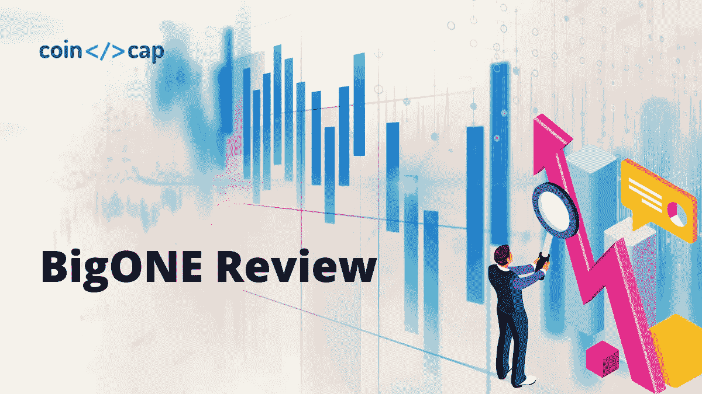
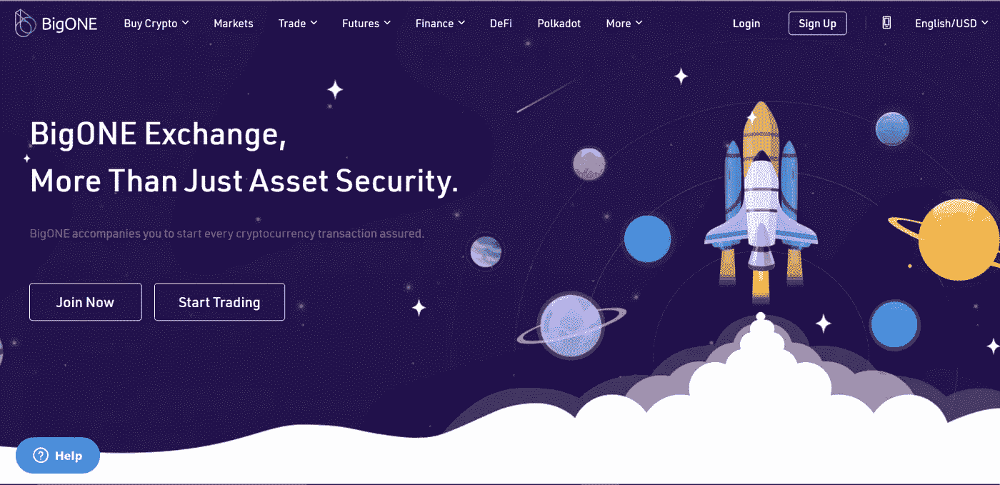
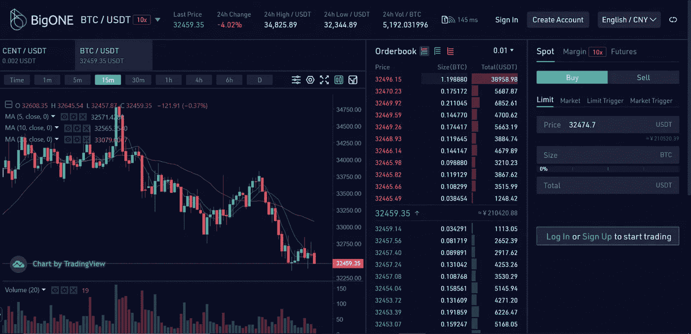
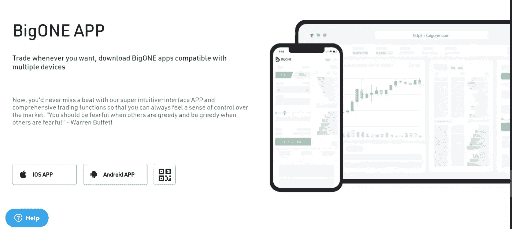
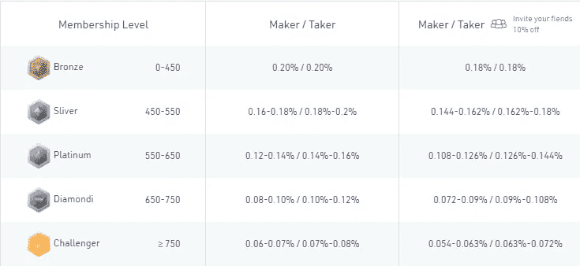
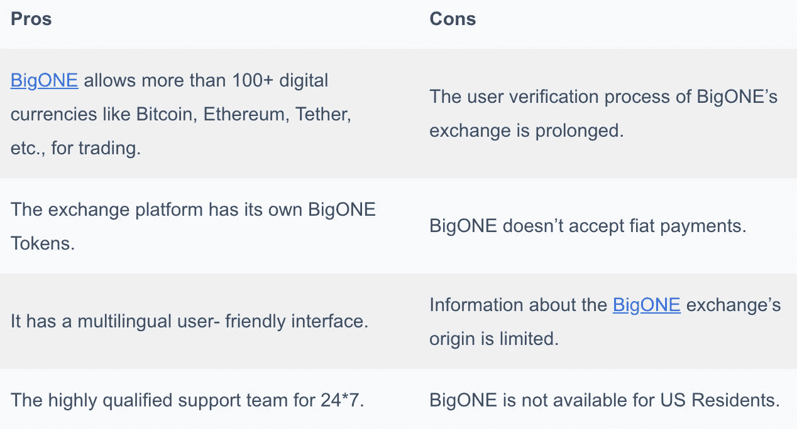

# BigONE 交易所评论 2021:它是骗局还是合法的？

> 原文：<https://medium.com/coinmonks/bigone-exchange-review-64705d85a1d4?source=collection_archive---------8----------------------->

加密交易所是交易者和投资者进入加密世界的门户。 [**BigONE**](https://bigone.com/users/start?code=DLROPOK6) 是 2017 年推出的一个加密对加密交换平台。今天，我们将回顾 BigONE exchange 及其优点、缺点和其他功能。

# 总结(TL；博士)

*   [**BigONE**](https://bigone.com/users/start?code=DLROPOK6) 是 2017 年推出的一个加密对加密交换平台。然而，它的确切起源不得而知。
*   该平台的网站有一个用户友好的交易界面，使您可以轻松浏览网站。
*   一家名为区块链的区块链投资公司支持 BigONE。
*   这个交易平台提供了多种加密资产和众多的加密货币交易对，如 BTC、瑞士联邦理工学院、EOS 和 QRU。
*   BigONE 支持[保证金交易](https://coincodecap.com/margin-trading)和永续期货。
*   该平台不接受固定支付。
*   首先，参观 BigONE。注册并登录帐户。此外，在您的验证过程结束之前，不要开始存款。
*   此外，在选择交换的时候，看看它的图表，确定它是否适合你。
*   下载 [BigONE app](https://play.google.com/store/apps/details?id=one.big&hl=en_US&gl=US) 想在哪里交易就在哪里交易。此外，移动应用程序兼容多种设备。
*   为确保最高安全措施，设置 [T+1](https://www.investopedia.com/terms/t/tplus1.asp) 用于场外取款。
*   每次下单，BigONE 向你收取 0.20%的交易费。然而，没有存款费，但每提取一笔 BTC 存款要收取 0.0005 BTC 的取款费。
*   BigONE 支持冷钱包和热钱包，以安全地存储客户的数字资产。

# 什么是 BigONE？

BigONE 是 2017 年推出的加密对加密交换平台。然而，它的确切起源不得而知。这个交易平台使您能够在全球范围内买卖 100 多种数字货币。

BigONE 的网站有一个用户友好的交易界面，使您可以轻松地浏览网站。此外，一家名为 [INBlockchain](https://www.inblockchain.com/) 的区块链投资公司支持 [**BigONE**](https://bigone.com/users/start?code=DLROPOK6) 。因此，这个交换平台提供了多种加密资产，如 BTC，瑞士联邦理工学院，EOS 等，ZEC 等。此外，该交易平台还提供了众多加密货币交易对——BTC、瑞士联邦理工学院、瑞士银行和 QRU。

BigONE Exchange Review

交换平台拥有基于以太坊 [ERC20 标准](/coinmonks/future-proofing-erc20-tokens-7b8c27acedfb)的 BigONE 令牌。您可以使用 BigONE 令牌在平台上进行交易。此外，如网站所述， [BigONE 的 VIP 计划](https://bigone.com/users/start?code=DLROPOK6)有助于监控用户的成长。由于这是一个加密到加密的交换，BigONE 不接受固定支付。

虽然 BigONE 是一个全球交易所，但它不支持美国居民。交易平台也将客户的安全放在第一位。该网站拥有一支高素质的支持团队，可全天候为您提供帮助。此外，在选择交换时，看看它的图表，确定它是否适合你。平台通过 [TradingView](https://www.tradingview.com/?offer_id=10&aff_id=24152) 支持图表和技术工具。

BigONE Exchange Review: Charts

# 如何在 BigONE 开始交易？

## 1:创建一个帐户

*   访问 [**BigONE**](https://bigone.com/users/start?code=DLROPOK6) 网站。
*   使用您的手机号码或电子邮件 ID 注册一个新帐户
*   设置密码。

## 2:验证

*   使用您的密码和电子邮件再次登录。
*   输入 Google 发送到您电子邮件的验证码。
*   等到 KYC 进程(了解你的客户进程)结束。

## 3:开始交易

*   一旦平台完成您的 KYC 验证，您就可以开始您的交易之旅。
*   根据 **BigONE** 的规定，在您完成验证过程之前，您不得进行任何存款。
*   BigONE 交易所使用“柜台”交易(OTC)来提取和存放资金。OTC 使用[支付宝](https://intl.alipay.com/)和[微信](https://www.wechat.com/)购买加密货币。

## 4.BigONE 撤销

*   首先，登录您的 BigONE 帐户，从标题中的“资产”下拉选项卡转到“取款”部分。
*   其次，选择您希望提取的资产，并输入提取地址。
*   最后，把你的资金转到目的地地址。
*   但是， [BigONE](https://bigone.com/users/start?code=DLROPOK6) 只允许在完成 KYC 验证后提款。

# BigONE Exchange 评论:移动应用程序

下载 [BigONE app](https://big.one/downloads) ，想在哪里交易就在哪里交易。这款手机应用兼容多种设备。BigONE 的移动应用程序可供 android 和苹果用户使用，您可以通过 Google Play 或 Apple Store 下载。

BigONE Mobile App Review

# BigONE Exchange 的特点

*   **/**[**保证金交易**](https://blog.coincodecap.com/go/margin-trading) : BigONE 支持 BTC、ETH、BCH、140+溢价代币现货交易。而 BTC、ETH、BCH、EOS 的加密货币也支持[保证金交易](https://blog.coincodecap.com/bitcoin-margin-trading-exchange)。
*   **永续期货** : BigONE 将永续期货杠杆提升至 100 倍。
*   **菲亚特交易**:为确保最高安全措施，设置 T+1 为场外撤单。此外，也欢迎信用卡。
*   **BigONE Earn** : BigONE 通过 **BigONE 的**理财产品产生 AROR，帮助用户实现代币价值最大化。
*   **贷款**:速批 10000 USDT 贷款，日息 1 USDT
*   **PoS 矿池** : BigONE 提供超过 14 种矿池产品，供用户获得行业最高护甲。

# BigONE 费用

*   **交易费用:**每次下单，BigONE 向您收取 0.20%的交易费用。通常，许多交易所在买家和做市商之间分配费用。接受者是那些从订单簿中“接受”现有订单的人。制造商是那些增加他们的订单的人。由于 BigONE 不收取固定费用，制造商和买家都必须支付 0.20%的交易费。BigONE 还根据您的会员级别提供交易费折扣。级别越高，交易费用越低。有关更多详细信息，请参考下表。

BigONE Trading fee

*   提款费: BigONE 对您每一笔 BTC 提款收取 0.0005 BTC 的提款费。
*   **押金费用:**平台不收取任何押金费用。

# BigONE 评论:客户支持

[BigONE](https://blog.coincodecap.com/go/bigone) exchange 有一个 365*24*7 可用的支持团队。

*   **实时聊天:**实时聊天选项位于网站左上角的蓝色聊天气泡内。
*   **文章:**各种常见问题解答、文章和新闻更新都列在蓝色聊天气泡内。
*   **提交请求:**在网站的“支持”部分，您可以提交请求。此外，该平台在同一页面上列出了新闻更新和指南。

# BigONE 安全吗？

BigONE交易所将安全放在第一位。

*   首先，交换平台有冷钱包和热钱包来安全地存储客户的数字资产。此外，BigONE 将您 98%的数字资产存储在冷钱包中。另外 2%的客户数字资产存放在热门钱包中进行交易。
*   其次，为了防止身份盗窃，启用了“了解您的客户”政策(KYC)。
*   此外，该平台还具有双因素身份认证(2FA ),可防止第三方访问客户的帐户。

# BigONE 评论:利弊

# BigONE Exchange 审查:结论

密码交易所为用户提供必要的信息，支持和交易工具，以确保您的密码交易成功。于 2017 年推出的[**BigONE**](https://bigone.com/users/start?code=DLROPOK6)exchange 是一个加密到加密的交换平台，提供现货交易、菲亚特交易等功能，费用非常低。

每个人都有不同的交易风格。如果 BigONE 满足了你所有的交易需求，那就去做吧。否则，请查看[最佳 10 家加密货币交易所](https://coincodecap.com/crypto-exchange)了解其他选项。

# 常见问题

**使用 BigONE 安全吗？**

是的，BigONE 是一个安全的加密交换平台。对于帐户验证，您将验证您的电子邮件 ID 并启用双因素身份验证(2FA)。还有，取款前你得出示身份证件。您也可以选择设置 PIN。所以，它提供了一层额外的保护。也存放在冷热钱包里。

**BigONE 交易所有转账限制吗？**

BigONE 在其官网上没有说明任何提现限额。

BigONE Exchange 接受哪些付款方式？

[BigONE](https://bigone.com/users/start?code=DLROPOK6) 只接受加密货币转账，不接受法定存款。

我的资金多长时间可用？

因为取款和存款是自动进行的。资金的可用性取决于您想要的加密货币的网络状态。

**美国人可以用 BigONE exchange 吗？**

BigONE 加密交易交易所不对美国投资者开放。

> 加入 Coinmonks [电报频道](https://t.me/coincodecap)和 [Youtube 频道](https://www.youtube.com/c/coinmonks/videos)了解加密交易和投资

## 另外，阅读

*   [3 商业评论](/coinmonks/3commas-review-an-excellent-crypto-trading-bot-2020-1313a58bec92) | [Pionex 评论](https://coincodecap.com/pionex-review-exchange-with-crypto-trading-bot) | [Coinrule 评论](/coinmonks/coinrule-review-2021-a-beginner-friendly-crypto-trading-bot-daf0504848ba)
*   [莱杰 vs n rave](/coinmonks/ledger-vs-ngrave-zero-7e40f0c1d694)|[莱杰 nano s vs x](/coinmonks/ledger-nano-s-vs-x-battery-hardware-price-storage-59a6663fe3b0) | [币安评论](/coinmonks/binance-review-ee10d3bf3b6e)
*   [Bybit Exchange 审查](/coinmonks/bybit-exchange-review-dbd570019b71) | [Bityard 审查](https://coincodecap.com/bityard-reivew) | [Jet-Bot 审查](https://coincodecap.com/jet-bot-review)
*   [3 commas vs crypto hopper](/coinmonks/3commas-vs-pionex-vs-cryptohopper-best-crypto-bot-6a98d2baa203)|[赚取秘密利息](/coinmonks/earn-crypto-interest-b10b810fdda3)
*   最好的比特币[硬件钱包](/coinmonks/hardware-wallets-dfa1211730c6) | [BitBox02 回顾](/coinmonks/bitbox02-review-your-swiss-bitcoin-hardware-wallet-c36c88fff29)
*   [block fi vs Celsius](/coinmonks/blockfi-vs-celsius-vs-hodlnaut-8a1cc8c26630)|[Hodlnaut 审核](/coinmonks/hodlnaut-review-best-way-to-hodl-is-to-earn-interest-on-your-bitcoin-6658a8c19edf) | [KuCoin 审核](https://coincodecap.com/kucoin-review)
*   [Bitsgap 审查](/coinmonks/bitsgap-review-a-crypto-trading-bot-that-makes-easy-money-a5d88a336df2) | [Quadency 审查](/coinmonks/quadency-review-a-crypto-trading-automation-platform-3068eaa374e1) | [Bitbns 审查](/coinmonks/bitbns-review-38256a07e161)
*   [密码本交易平台](/coinmonks/top-10-crypto-copy-trading-platforms-for-beginners-d0c37c7d698c) | [Coinmama 审核](/coinmonks/coinmama-review-ace5641bde6e)
*   [印度加密交易所](/coinmonks/bitcoin-exchange-in-india-7f1fe79715c9) | [比特币储蓄账户](/coinmonks/bitcoin-savings-account-e65b13f92451)