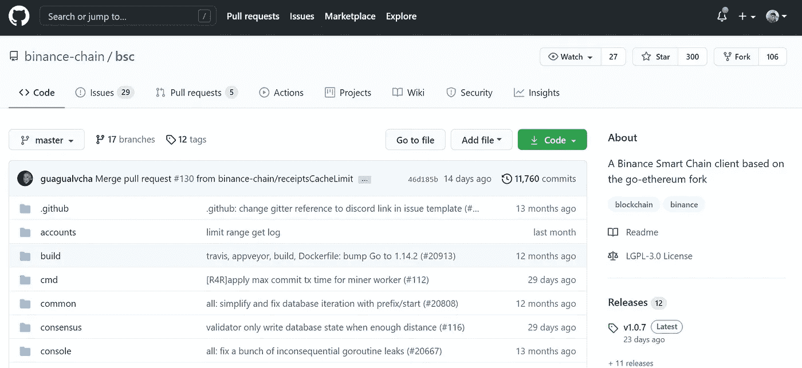
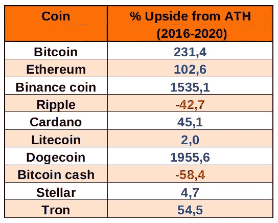
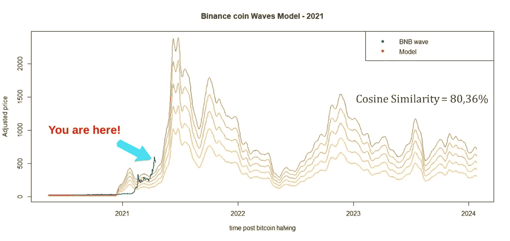

# 币安·柯恩:过去是什么，现在是什么，将来可能会是什么

> 原文：<https://medium.com/coinmonks/binance-coin-what-was-what-is-and-what-probably-will-be-6879d64ad8eb?source=collection_archive---------1----------------------->

## **简介**

下一个在博客中介绍的明星硬币也是在牛市中表现出巨大利润的硬币，不可思议的币安硬币(BNB)。这枚硬币是我的妻子送给我的，因为她的昵称是比娜，她买了一些硬币，因为这个名字很好听。
事实上，币安币不仅仅是一个好听的名字。在该项目的背后，有一枚硬币保证了按交易量计算最大的加密货币交易所币安链的治理，该交易所维护着为智能合约构建的区块链网络，每天运行着 500 万笔交易[1]，币安智能链，最后，它通过推出特斯拉令牌(TSLA)将股票市场带入加密世界。
相比之下，社区对分散项目的索赔，因为一类主要的安全问题，权限控制问题[2]，其中如果管理员的私钥被盗，很容易造成巨大的损失。分散项目是一个有争议的主题[3]。目前，这一集的目标只是为初学者介绍币安硬币的过去、现在和可能的未来。

**币安硬币是什么？**

币安硬币协议由币安加密货币交易所创建，最初在区块链以太坊使用令牌 ERC-20，最终成为管理币安区块链币安链的本地货币。这是一个私有的区块链，只有成员才能在 Github 上看到谁是这个组织的一部分[4]。然而，可以检查存储库是否正在接收新的实现。

**什么是币安币？**

目前，币安硬币负责治理所有币安生态系统，包括币安链和币安智能链[5]，币安 DEX(分散交易所)，币安慈善机构，以及其他。
币安智能链(BSC)是一个围棋以太坊的分支(图 1)，是以太坊知识库的副本[6]。这个项目的目标是实现一个权威证明(PoSA)共识，引入新闻作为短封锁时间和较低的费用[7]。

Figure 1\. Binance Smart Chain on Github.

由于投资者、企业家和公众对 BNB 创新的巨大兴趣，这枚硬币给其所有者带来了自上一个周期(2016-2020)的历史高点(ATH)以来+1500%的收益(表 1)。

Table 1\. Top cryptocurrency growth since the historic all-time high of the last cycle.

币安硬币可能是什么？

尽管数字社区更喜欢分散的项目，但我对完全分散的世界持怀疑态度。在现实世界中，总会有一些伟大想法的大项目被集中管理。然而，我也更喜欢分散的项目，其原因在引言中已经探讨过了。
最后，将 *Altcoin Waves* 模型应用于下一次币安币浪潮(图 2)，根据该模型预测 2020 年比特币减半后价格可能达到 1024 美元至 2390 美元之间，余弦相似度 80.36%。

Figure 2\. Binance Coin Waves model (orange) and real data (dark cyan) projected in 2021.

可以看出，由于 BNB 是一个相对较新的硬币和数据稀缺(2017 年 7 月)，币安硬币波动是一个脆弱的模型，事实上，它是对 BNB 市场一般洞察力的简单预测。

**结论**

最后，币安币提出了一个伟大的进化，特别是迫使其他基础设施和互操作性系统开发人员考虑费用，可伸缩性，通货膨胀等。相信我，你知道谁会赢得这场编程大战吗？我们，人民。

如果您喜欢这些内容，请考虑以下建议:

BTC:BC 1 qljlmuwq 9 gyvn 7 uhvwwypsj 4x 8 hcetuzhw 9 quh 0

BNB:bnb 159am 7 huy 53mg 7 sygnklrtxkahkdk 2 qxzmnk 0 GW

BUSD:bnb 159am 7 huy 53mg 7 sygnklrtxkahkdk 2 qxzmnk 0 GW

**致谢**

作者感谢、Hal Finney、Nick Szabo、赵昌鹏、Sabrina Moraes、Fernando Ulrich、André Fauth、Criptomaníacos 和 Vela Trader。

**参考文献**

1.[https://www.binance.com/zh-CN/news/top/3138931](https://www.binance.com/zh-CN/news/top/3138931)

2.[https://www.mdpi.com/2079-9292/9/2/255](https://www.mdpi.com/2079-9292/9/2/255)

3.[https://doi.org/10.1016/j.physa.2020.124759](https://doi.org/10.1016/j.physa.2020.124759)

4.[https://github.com/binance-chain](https://github.com/binance-chain)

5.[https://academy.binance.com/en/articles/what-is-bnb](https://academy.binance.com/en/articles/what-is-bnb)

6.[https://edgarmaraes . medium . com/ether eum-what-was-what-was-what-was-was-what-was-was-was-what-was-was-was-what-was-was-was-what-was-and-what-possible-was-was-9559 ab 4 e 22 EC](https://edgarmoraes.medium.com/ethereum-what-was-what-is-and-what-probably-will-be-9559ab4e22ec)

【https://github.com/binance-chain/bsc】

> 加入 coin monks[Telegram group](https://t.me/joinchat/PmKOYQ9NNKZlZGNl)学习加密交易和投资

## 另外，阅读

*   [什么是融资融券交易](https://blog.coincodecap.com/margin-trading) | [美元成本平均法](https://blog.coincodecap.com/dca)
*   最好的[密码交易机器人](/coinmonks/crypto-trading-bot-c2ffce8acb2a) | [网格交易机器人](https://blog.coincodecap.com/grid-trading)
*   [3 商业评论](/coinmonks/3commas-review-an-excellent-crypto-trading-bot-2020-1313a58bec92) | [Pionex 评论](/coinmonks/pionex-review-exchange-with-crypto-trading-bot-1e459d0191ea) | [Coinrule 评论](/coinmonks/coinrule-review-2021-a-beginner-friendly-crypto-trading-bot-daf0504848ba)
*   [AAX 交易所评论](/coinmonks/aax-exchange-review-2021-67c5ea09330c) | [德里比特评论](/coinmonks/deribit-review-options-fees-apis-and-testnet-2ca16c4bbdb2) | [FTX 交易所评论](/coinmonks/ftx-crypto-exchange-review-53664ac1198f)
*   [n 零审核](/coinmonks/ngrave-zero-review-c465cf8307fc) | [Phemex 审核](/coinmonks/phemex-review-4cfba0b49e28) | [PrimeXBT 审核](/coinmonks/primexbt-review-88e0815be858)
*   [Bybit Exchange 审查](/coinmonks/bybit-exchange-review-dbd570019b71) | [Bityard 审查](/coinmonks/bityard-review-7d104239be35) | [CoinSpot 审查](https://blog.coincodecap.com/coinspot-review)
*   [3 commas vs crypto hopper](/coinmonks/3commas-vs-pionex-vs-cryptohopper-best-crypto-bot-6a98d2baa203)|[赚取加密利息](/coinmonks/earn-crypto-interest-b10b810fdda3)
*   最好的比特币[硬件钱包](/coinmonks/the-best-cryptocurrency-hardware-wallets-of-2020-e28b1c124069?source=friends_link&sk=324dd9ff8556ab578d71e7ad7658ad7c) | [BitBox02 回顾](/coinmonks/bitbox02-review-your-swiss-bitcoin-hardware-wallet-c36c88fff29)
*   [莱杰 vs Ngrave](/coinmonks/ledger-vs-ngrave-zero-7e40f0c1d694) | [莱杰 nano s vs x](/coinmonks/ledger-nano-s-vs-x-battery-hardware-price-storage-59a6663fe3b0) | [币安评论](/coinmonks/binance-review-ee10d3bf3b6e)
*   [密码本交易平台](/coinmonks/top-10-crypto-copy-trading-platforms-for-beginners-d0c37c7d698c) | [Coinmama 审核](/coinmonks/coinmama-review-ace5641bde6e)
*   [CoinLoan 评论](/coinmonks/coinloan-review-18128b9badc4) | [YouHodler 评论](/coinmonks/youhodler-4-easy-ways-to-make-money-98969b9689f2) | [BlockFi 评论](/coinmonks/blockfi-review-53096053c097)
*   最好的[加密税务软件](/coinmonks/best-crypto-tax-tool-for-my-money-72d4b430816b) | [CoinTracking 评论](/coinmonks/cointracking-review-a-reliable-cryptocurrency-tax-software-5114e3eb5737)
*   最佳[加密借贷平台](/coinmonks/top-5-crypto-lending-platforms-in-2020-that-you-need-to-know-a1b675cec3fa) | [杠杆代币](/coinmonks/leveraged-token-3f5257808b22)
*   [block fi vs Celsius](/coinmonks/blockfi-vs-celsius-vs-hodlnaut-8a1cc8c26630)|[Hodlnaut 点评](/coinmonks/hodlnaut-review-best-way-to-hodl-is-to-earn-interest-on-your-bitcoin-6658a8c19edf) | [KuCoin 点评](https://blog.coincodecap.com/kucoin-review)
*   [Bitsgap 审查](/coinmonks/bitsgap-review-a-crypto-trading-bot-that-makes-easy-money-a5d88a336df2) | [Quadency 审查](/coinmonks/quadency-review-a-crypto-trading-automation-platform-3068eaa374e1) | [Bitbns 审查](/coinmonks/bitbns-review-38256a07e161)
*   [埃利帕尔泰坦评论](/coinmonks/ellipal-titan-review-85e9071dd029) | [赛克斯斯通评论](/coinmonks/secux-stone-hardware-wallet-review-15-discount-coupon-2020-7577032faa6e)
*   [本地比特币审核](/coinmonks/localbitcoins-review-6cc001c6ed56) | [加密货币储蓄账户](https://blog.coincodecap.com/cryptocurrency-savings-accounts)
*   最佳[区块链分析](https://bitquery.io/blog/best-blockchain-analysis-tools-and-software)工具| [赚比特币](/coinmonks/earn-bitcoin-6e8bd3c592d9)
*   [加密套利](/coinmonks/crypto-arbitrage-guide-how-to-make-money-as-a-beginner-62bfe5c868f6)指南| [如何做空比特币](/coinmonks/how-to-short-bitcoin-568a2d0b4ae5)
*   最佳[加密制图工具](/coinmonks/what-are-the-best-charting-platforms-for-cryptocurrency-trading-85aade584d80) | [最佳加密交易所](/coinmonks/crypto-exchange-dd2f9d6f3769)
*   [如何在印度购买比特币？](/coinmonks/buy-bitcoin-in-india-feb50ddfef94) | [WazirX 审核](/coinmonks/wazirx-review-5c811b074f5b)
*   [印度比特币交易所](/coinmonks/bitcoin-exchange-in-india-7f1fe79715c9) | [比特币储蓄账户](/coinmonks/bitcoin-savings-account-e65b13f92451)
*   [CoinDCX 评论](/coinmonks/coindcx-review-8444db3621a2) | [加密保证金交易交易所](https://blog.coincodecap.com/crypto-margin-trading-exchanges)