# 币安费用 2021 |完整指南(适用于美国币安和币安)

> 原文：<https://medium.com/coinmonks/binance-fees-8588ec17965?source=collection_archive---------0----------------------->

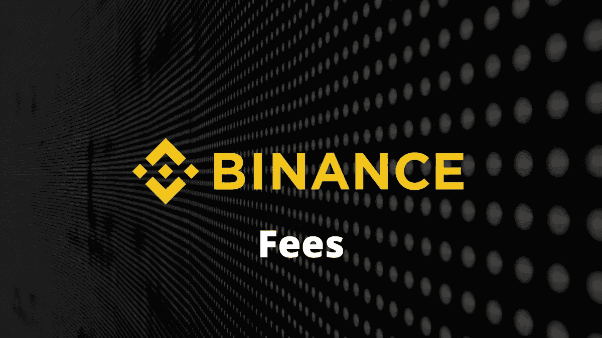

[**【币安】**](https://blog.coincodecap.com/go/binance)是[全球最大的加密货币交易所](https://blog.coincodecap.com/crypto-exchange)，由赵昌鹏于 2017 年创立。

他们的总部设在中国，但由于中国政府的限制，现在他们的总部设在马耳他。

该平台每秒执行超过 1，400，000 次交易，日交易量超过 20 亿次。

在本文中，我们将讨论[币安](https://blog.coincodecap.com/go/binance)和[币安美国](https://www.binance.us/)的费用。

## 币安存款和取款费用

在币安存款完全免费。

取款费用和最低取款额由区块链网络决定。因此，它们不是固定的，并且取决于网络拥塞。

比如提现[比特币](https://blog.coincodecap.com/a-candid-explanation-of-bitcoin)，可以使用以下任意一种网络。每个网络都有不同的最低取款和取款费用。

你可以点击查看完整列表[。](https://www.binance.com/en/fee/depositFee)

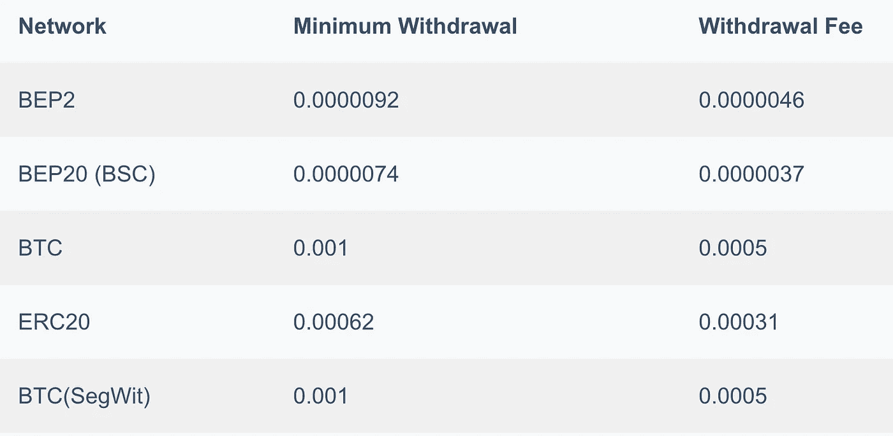

## 币安交易费

[**币安**](https://blog.coincodecap.com/go/binance) 遵循一种创造者-接受者模式。根据 30 天内的交易量和 BNB 余额，费用分为 11 个级别。因此，您的交易费用将由您的 VIP 级别决定。

UTC 时间每天凌晨 0:00，您的交易量(BTC)超过 30 天，BNB 余额更新。等级级别和制定者-接受者 is 费用在世界协调时 2:00 左右更新

如果你的账户里有 BNB，那么默认情况下，交易费会从你的 BNB 账户里扣除，给你 25%的交易费折扣。此外，在推荐你的朋友时，你将获得 20%的折扣。

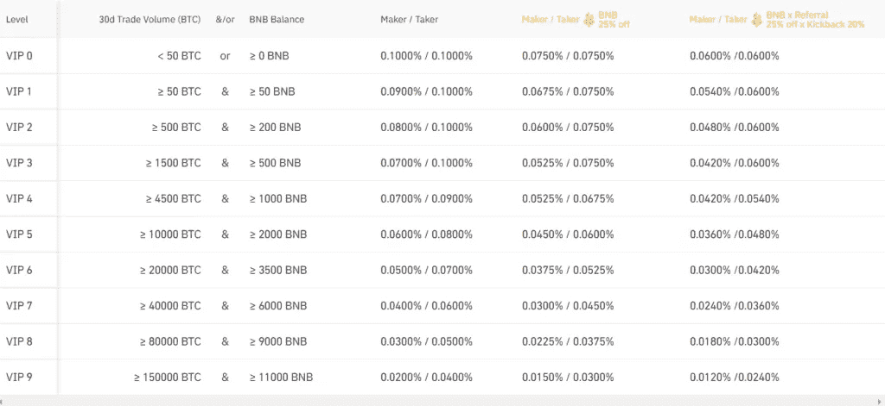

## 币安保证金借款利率

融资融券利率取决于您的 VIP 级别。每种加密货币都有不同的利率。

你可以点击查看整个名单。

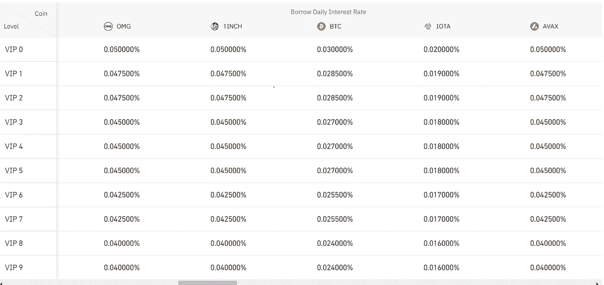

## usdⓢ-m 币安期货交易利率

usdⓢ-m 期货交易利率提供永久和季度交易，杠杆高达 125 倍。此外，使用 BNB 可以享受 10%的折扣。

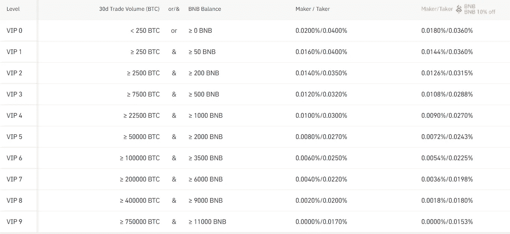

## 币安硬币-M 期货交易利率

Coin-M 期货允许你以高达 125 倍的杠杆进行永久和季度交易。Coin-M 期货的交易价格如下。

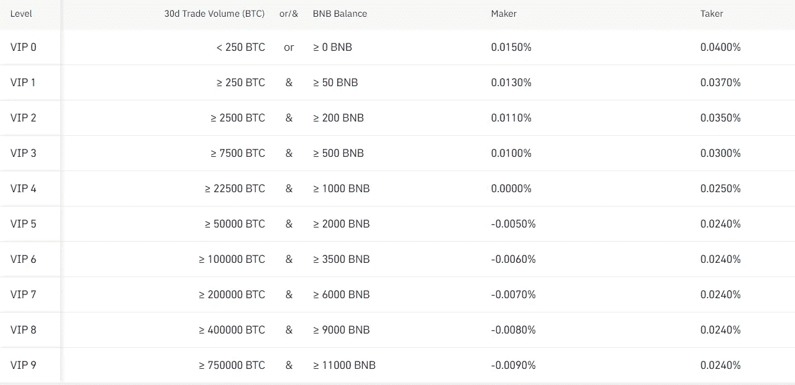

## 币安交叉抵押利率

**币安支持 BTC、ETH、EUR、BUSD 四种担保币。每日利率、宽限期和借款限额根据 VIP 级别和借款硬币而有所不同。**

**当借入硬币为 BUSD 时，BTC 的交叉抵押利率如下所述。您可以在此查看其余三个[的价格。](https://www.binance.com/en/fee/futuresLoanRate)**

**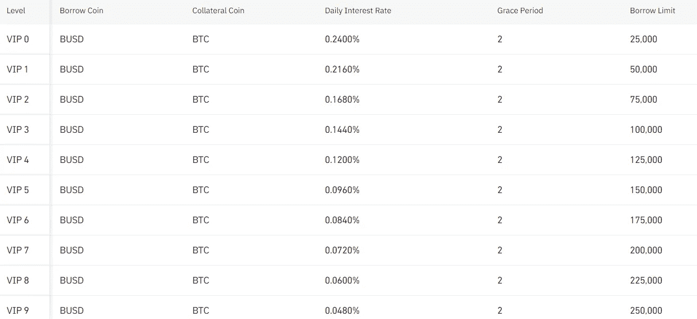**

## **币安美国存款和取款费用**

**在美国币安存款也完全免费。**

**提取限额取决于您完成的验证级别。**

**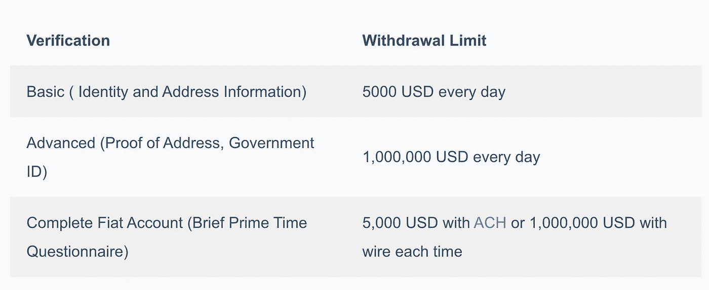**

**对于美元，费用取决于您选择完成付款的方式。**

**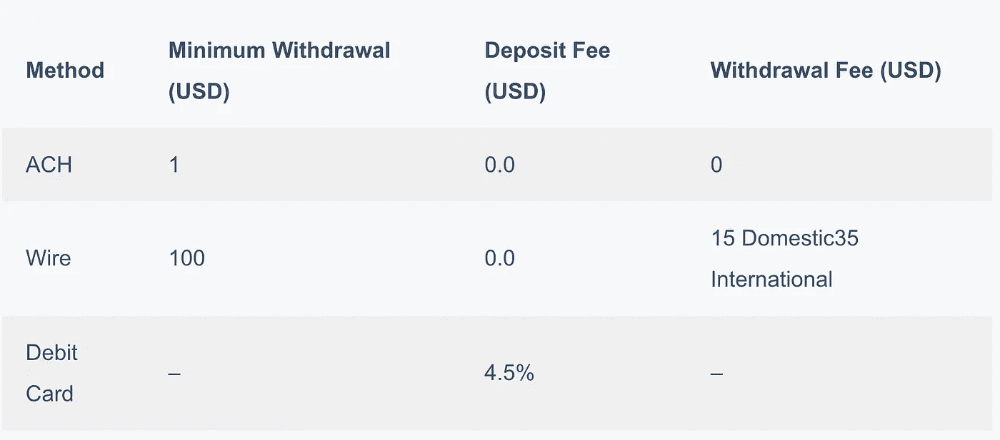**

**提现费用和提现限额根据您选择的加密货币而有所不同。下表显示了一些流行的加密货币的费用和限额。**

**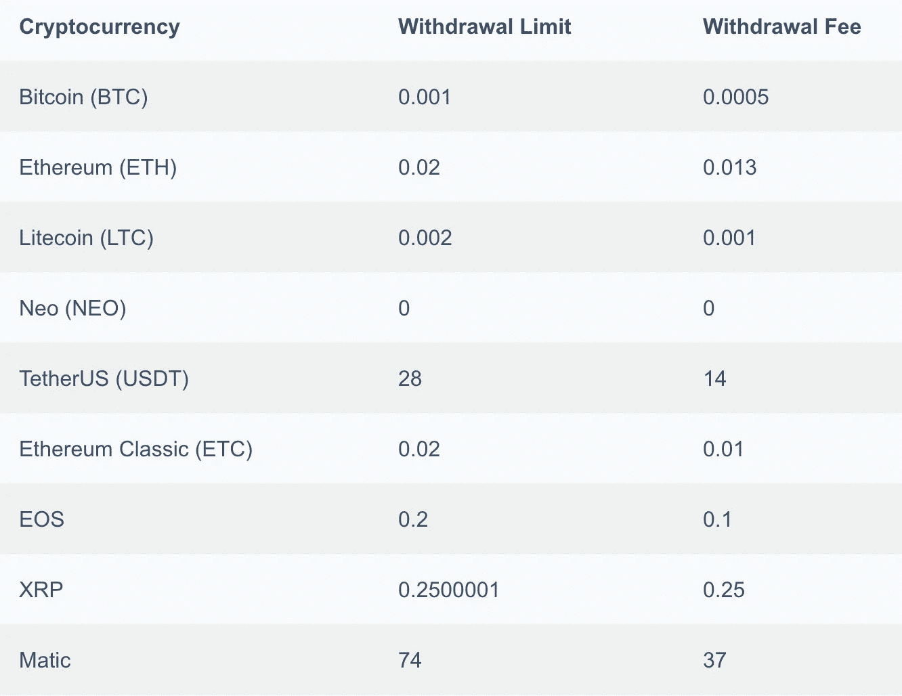**

**你可以点击查看完整列表[。](https://www.binance.us/en/fee/schedule)**

## **币安美国交易费**

**币安美国公司也遵循一种制造商-接受者模式。根据 30 天内的交易量和 BNB 余额，费用分为 11 个级别。因此，您的交易费用将由您的 VIP 级别决定。**

**美国东部时间每天凌晨 0 点，你的交易量(美元)超过 30 天，BNB 平衡更新。等级和制造者费用在美国东部时间凌晨 1:00 左右更新。**

**如果您的账户中有 BNB，那么交易费将默认从您的 BNB 账户中扣除。此外，如果您使用 BNB 支付，您的交易费将享受 25%的折扣。**

**默认情况下，你是 VIP 0 级。**

**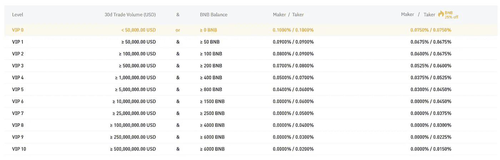**

**您可以在此查看所有加密货币对[的交易限额。](https://www.binance.us/en/trade-limits)**

## **币安费用:结论**

**币安提供有竞争力的价格。不同类型交易的定价结构根据您的 30 天交易量和 BNB 余额分为不同的级别。此外，如果你使用 BNB，他们提供折扣。**

*   **[为币安智能链设置元掩码](https://blog.coincodecap.com/metamask-for-binance-smart-chain)**
*   **[币安保证金交易 2021 |你需要知道的一切](https://blog.coincodecap.com/binance-margin-trading)**
*   **[币安链家 vs 币安智能链家](https://blog.coincodecap.com/binance-chain-vs-binance-smart-chain)**
*   **[2021 年如何在币安购买比特币？](https://blog.coincodecap.com/buy-bitcoin-binance)**
*   **[最佳加密钱包【2021】](https://blog.coincodecap.com/best-crypto-wallets-app)**

> **加入 Coinmonks [电报集团](https://t.me/joinchat/EPmjKpNYwRMsBI4p)，了解加密交易和投资**

## **另外，阅读**

*   **[什么是融资融券交易](https://blog.coincodecap.com/margin-trading)**
*   **最好的[密码交易机器人](/coinmonks/crypto-trading-bot-c2ffce8acb2a) | [网格交易](https://blog.coincodecap.com/grid-trading)**
*   **[3 商业评论](/coinmonks/3commas-review-an-excellent-crypto-trading-bot-2020-1313a58bec92) | [Pionex 评论](/coinmonks/pionex-review-exchange-with-crypto-trading-bot-1e459d0191ea) | [Coinrule 评论](/coinmonks/coinrule-review-2021-a-beginner-friendly-crypto-trading-bot-daf0504848ba)**
*   **[AAX 交易所评论](/coinmonks/aax-exchange-review-2021-67c5ea09330c) | [德里比特评论](/coinmonks/deribit-review-options-fees-apis-and-testnet-2ca16c4bbdb2) | [FTX 交易所评论](/coinmonks/ftx-crypto-exchange-review-53664ac1198f)**
*   **[n ave 零点回顾](/coinmonks/ngrave-zero-review-c465cf8307fc) | [Phemex 回顾](/coinmonks/phemex-review-4cfba0b49e28) | [PrimeXBT 回顾](/coinmonks/primexbt-review-88e0815be858)**
*   **[Bybit Exchange 审查](/coinmonks/bybit-exchange-review-dbd570019b71) | [Bityard 审查](/coinmonks/bityard-review-7d104239be35) | [CoinSpot 审查](https://blog.coincodecap.com/coinspot-review)**
*   **[3 commas vs crypto hopper](/coinmonks/3commas-vs-pionex-vs-cryptohopper-best-crypto-bot-6a98d2baa203)|[赚取加密利息](/coinmonks/earn-crypto-interest-b10b810fdda3)**
*   **最好的比特币[硬件钱包](/coinmonks/the-best-cryptocurrency-hardware-wallets-of-2020-e28b1c124069?source=friends_link&sk=324dd9ff8556ab578d71e7ad7658ad7c) | [BitBox02 回顾](/coinmonks/bitbox02-review-your-swiss-bitcoin-hardware-wallet-c36c88fff29)**
*   **[莱杰 vs n ave](/coinmonks/ledger-vs-ngrave-zero-7e40f0c1d694)|[莱杰 nano s vs x](/coinmonks/ledger-nano-s-vs-x-battery-hardware-price-storage-59a6663fe3b0)**
*   **[密码本交易平台](/coinmonks/top-10-crypto-copy-trading-platforms-for-beginners-d0c37c7d698c)**
*   **[CoinLoan 评论](/coinmonks/coinloan-review-18128b9badc4) | [YouHodler 评论](/coinmonks/youhodler-4-easy-ways-to-make-money-98969b9689f2) | [BlockFi 评论](/coinmonks/blockfi-review-53096053c097)**
*   **最好的[加密税务软件](/coinmonks/best-crypto-tax-tool-for-my-money-72d4b430816b) | [硬币追踪评论](/coinmonks/cointracking-review-a-reliable-cryptocurrency-tax-software-5114e3eb5737)**
*   **最佳[加密借贷平台](/coinmonks/top-5-crypto-lending-platforms-in-2020-that-you-need-to-know-a1b675cec3fa) | [杠杆代币](/coinmonks/leveraged-token-3f5257808b22)**
*   **[block fi vs Celsius](/coinmonks/blockfi-vs-celsius-vs-hodlnaut-8a1cc8c26630)|[Hodlnaut 评论](/coinmonks/hodlnaut-review-best-way-to-hodl-is-to-earn-interest-on-your-bitcoin-6658a8c19edf)**
*   **[Bitsgap 审查](/coinmonks/bitsgap-review-a-crypto-trading-bot-that-makes-easy-money-a5d88a336df2) | [Quadency 审查](/coinmonks/quadency-review-a-crypto-trading-automation-platform-3068eaa374e1) | [Bitbns 审查](/coinmonks/bitbns-review-38256a07e161)**
*   **[埃利帕尔泰坦评论](/coinmonks/ellipal-titan-review-85e9071dd029) | [赛克斯斯通评论](/coinmonks/secux-stone-hardware-wallet-review-15-discount-coupon-2020-7577032faa6e)**
*   **[本地比特币审核](/coinmonks/localbitcoins-review-6cc001c6ed56) | [加密货币储蓄账户](https://blog.coincodecap.com/cryptocurrency-savings-accounts)**
*   **最佳[区块链分析](https://bitquery.io/blog/best-blockchain-analysis-tools-and-software)工具| [赚比特币](/coinmonks/earn-bitcoin-6e8bd3c592d9)**
*   **[加密套利](/coinmonks/crypto-arbitrage-guide-how-to-make-money-as-a-beginner-62bfe5c868f6)指南| [如何做空比特币](/coinmonks/how-to-short-bitcoin-568a2d0b4ae5)**
*   **最佳[加密制图工具](/coinmonks/what-are-the-best-charting-platforms-for-cryptocurrency-trading-85aade584d80) | [最佳加密交易所](/coinmonks/crypto-exchange-dd2f9d6f3769)**
*   **[如何在印度购买比特币？](/coinmonks/buy-bitcoin-in-india-feb50ddfef94) | [WazirX 审核](/coinmonks/wazirx-review-5c811b074f5b)**
*   **[印度比特币交易所](/coinmonks/bitcoin-exchange-in-india-7f1fe79715c9) | [比特币储蓄账户](/coinmonks/bitcoin-savings-account-e65b13f92451)**
*   **[CoinDCX 评论](/coinmonks/coindcx-review-8444db3621a2) | [加密保证金交易交易所](https://blog.coincodecap.com/crypto-margin-trading-exchanges)**

> **[直接在您的收件箱中获得最佳软件交易](/coinmonks/newsletters/coinmonks)**

****

***原载于 2021 年 3 月 29 日 https://blog.coincodecap.com**T21*[。](https://blog.coincodecap.com/binance-fees)**