# 币安保证金交易——你需要知道的一切

> 原文：<https://medium.com/coinmonks/binance-margin-trading-c9eb5e9d2116?source=collection_archive---------1----------------------->

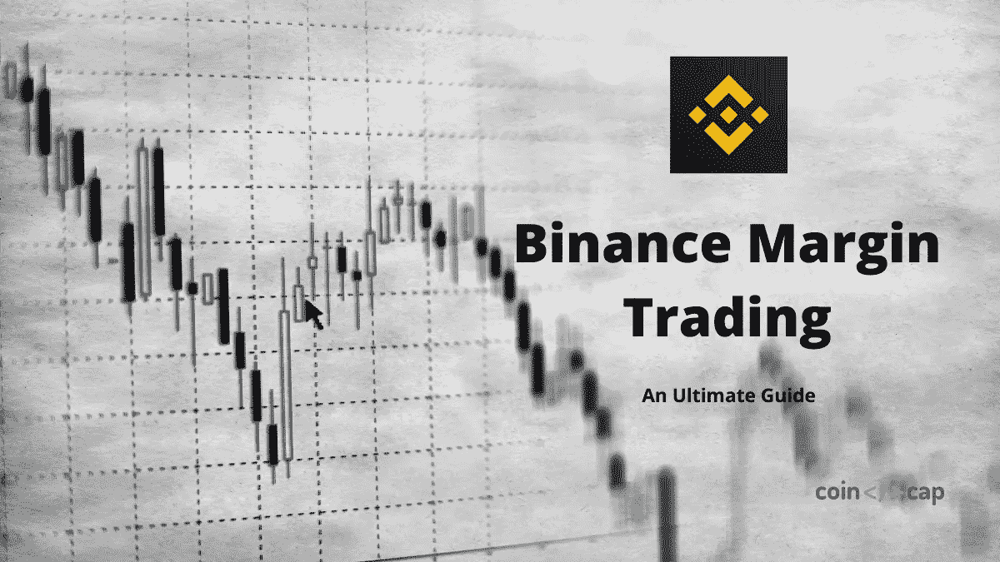

**币安是全球交易量最大的加密交易平台。[币安](https://blog.coincodecap.com/go/binance) [保证金交易](https://blog.coincodecap.com/go/margin-trading)有很多特点，我们将在本文中一一介绍。**

# **总结(TL；博士)**

*   ****币安** [保证金交易](https://blog.coincodecap.com/go/margin-trading)允许你下单的价值高于你的资金。**
*   **[币安](https://blog.coincodecap.com/go/margin-trading)[的保证金交易](https://blog.coincodecap.com/go/binance)有许多特点和不同层次的杠杆。**
*   **在[币安](https://blog.coincodecap.com/go/binance)可以选择交叉和隔离保证金交易。**
*   **烛台图表为用户提供了三种不同的图表视图和一个移动平均线。**
*   **[保证金交易](https://blog.coincodecap.com/margin-trading)有多种功能，如止损限价、OCO、计算器、保证金水平等。**
*   **您可以根据自己的颜色选择和查看选项定制保证金交易窗口。**
*   **[**币安**](https://blog.coincodecap.com/go/binance) 向较低 VIP 级别用户收取高额交易费。(使用 **X8FX10NT** 邀请链接获得交易费优惠)。**
*   **另外，请阅读我们的[币安评论](/coinmonks/binance-review-ee10d3bf3b6e)**

# **什么是币安保证金交易？**

**币安保证金交易允许你在加密市场用借来的资金交易资产。你可以用最低保证金限额和适用的杠杆开仓。你所有的保证金订单都是放在现货市场，并据此执行。**

# **币安的保证金交易是如何运作的？**

**在 [**币安**](https://blog.coincodecap.com/go/binance) ，你用你的资金和你希望购买的资产数量开仓。然后，交易所会根据最大适用杠杆自动借给你建仓所需的资金。**

**类似地，在平仓时，交易所自动扣除偿还金额和其他费用。**

# **币安的交叉保证金交易**

**在[交叉保证金交易模式](https://www.binance.com/en/trade/BTC_USDT?type=cross)中，所有未平仓头寸共享全部保证金余额，以防止平仓。在这里，一个头寸的正回报可以帮助接近平仓的头寸。**

**然而，在平仓的情况下，你有失去全部保证金余额和所有未平仓头寸的风险。**

**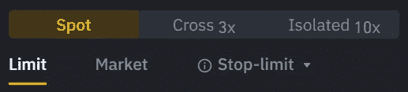**

# **币安的独立保证金交易**

**隔离保证金交易允许你通过给保证金分配不同的头寸来限制风险。因此，在平仓的情况下，你不会失去你的全部保证金余额，你只是失去了那个特定头寸的单独保证金余额。**

## **隔离保证金交易中的分层杠杆**

**独立保证金交易的杠杆是动态的，会根据你借入的资金自动调整。[点击此处](https://www.binance.com/en-IN/support/faq/7fbadf3c75914efc90e8b831709b644f)可以查看分级杠杆的风险比率。**

# **保证金交易中提供的杠杆**

****提供交叉保证金交易普通账户 3 倍、主账户 5 倍的最高杠杆。与此同时，隔离保证金交易的杠杆高达 10 倍。****

# ****币安 UI:保证金交易窗口****

****[币安](https://blog.coincodecap.com/go/binance)的融资融券交易窗口可以分为四个部分。保证金交易窗口的这些不同部分包括许多特征。所以让我们一个一个来看看:****

****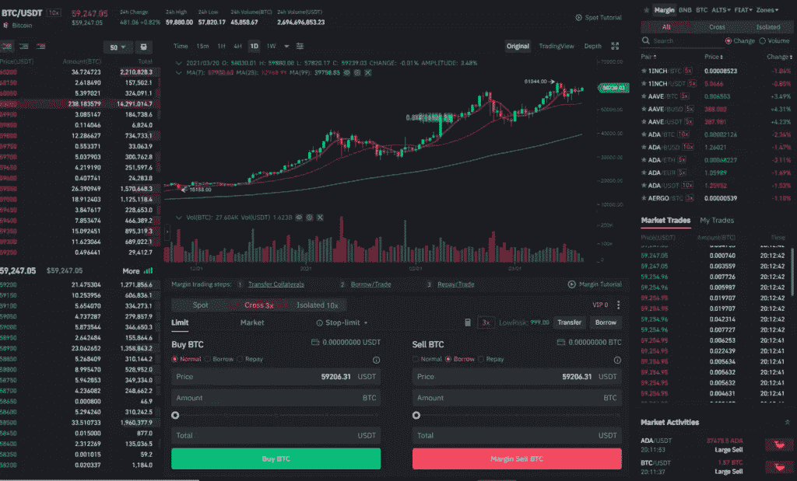****

# ****币安订单清单****

****您可以在融资融券交易窗口左侧**找到指令簿。订单簿是特定资产不同价格的订单列表，用于确定订单的执行。******

# ****支持的贸易对列表****

****您将在屏幕右侧的**处找到支持交易对列表。您可以根据 BNB、区域、交叉利润、独立利润等对列表进行排序。******

# ****蜡烛图****

****中间的烛台交易图可以展开，您可以通过三种主要形式查看它:****

*   ****原始图表****
*   ****[交易视图](https://blog.coincodecap.com/go/tradingview)****
*   ****深度****

****该图表还带有许多功能，如斐波纳契回撤，趋势线，连续绘图模式等。****

****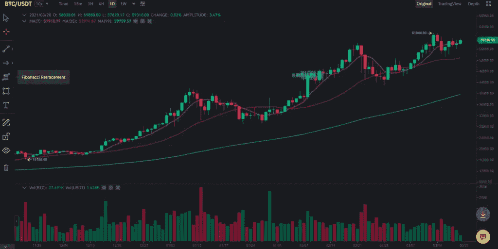****

# ****保证金交易标签****

****你可以在蜡烛图下面找到这个标签。窗口的这一部分允许打开/关闭一个位置，并拥有许多功能。让我们来看看这些:****

## ****转让抵押品 c****

****融资融券交易需要资金开仓。通过点击“转移抵押品”，您可以从您的[币安](https://blog.coincodecap.com/go/binance)钱包中向您的保证金交易账户添加资金。****

****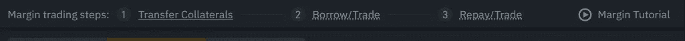****

## ****限制****

****限价允许你以自己选择的价格下单。当市场满足您的订单要求时，限价单将被执行。在找到更好的价格时，你甚至可以在执行前更改或取消订单。****

****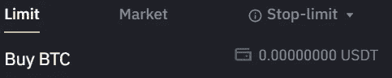****

## ****市场****

****在下达市价单时，您以资产的实时市价开仓/平仓。****

## ****限价止损单****

******止损价格:**当资产价值达到止损价格时，您以给定限价买入/卖出资产的订单被执行。****

****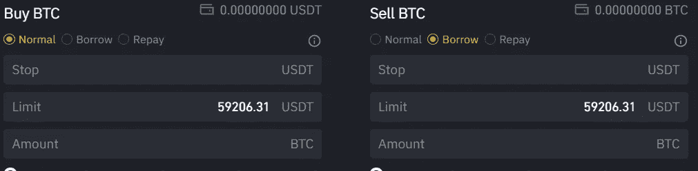****

******限价:**是止损限价执行的价格。****

## ****一方取消另一方****

****OCO 订单是限价单和止损单的组合，数量相同，位于同一侧。如果其中一个订单执行，止损价格触发，另一个订单自动取消。****

****同样，如果你取消其中一个交易对，那么整个交易对都会取消。****

****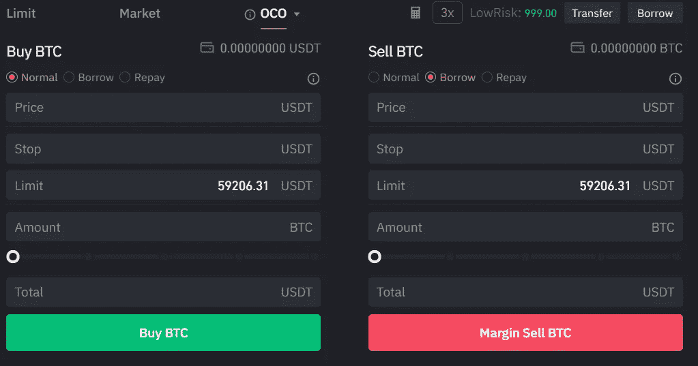****

## ****币安保证金交易:借入资金****

****通过借款模式下订单时，币安会自动借入资金以代表您完成订单。****

****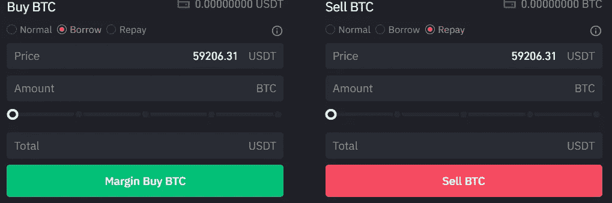****

## ****币安保证金交易:偿还资金****

****您可以使用偿还模式来清除贷款金额。通过偿还模式完成交易后，**币安将自动使用您收到的资产偿还您的债务。******

******但是，您也可以通过单击此窗口上的借入按钮或从基金部分手动借入/偿还基金。******

******假设市场横盘，现在你负债了。在这种情况下，系统不会自动从用户帐户中扣除金额。用户将不得不手动偿还债务。******

## ******币安利润数据******

******你可以通过点击屏幕上的三个垂直点来查看单独交易和交叉交易中所有资产的保证金数据。******

******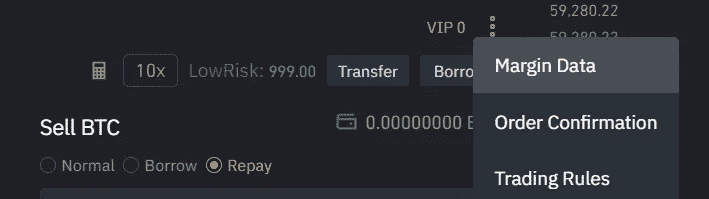******

## ******VIP 级别******

******[**币安**](https://blog.coincodecap.com/go/binance) 采用等级制，根据你的 VIP 等级收取交易费用和利率。******

## ****计算器图标****

****停限下拉菜单旁边有一个非常小的计算器图标。它可以帮助你计算目标价格、清算价值、PNL 和 ROE %。****

******PNL** (损益)****

****PNL 告诉你通过平仓一个特定价值的资产可以获得多少回报。****

****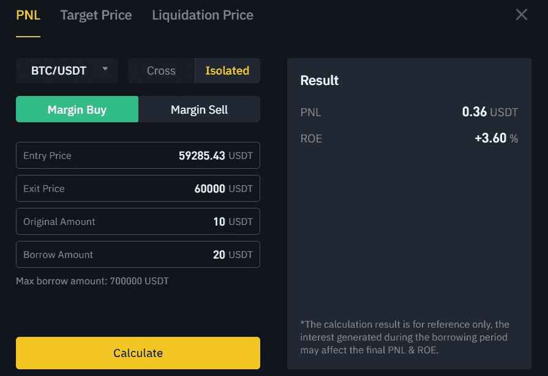****

******净资产收益率**(股本回报率)****

****股本回报率(ROE)是指你完成一笔特定价值的交易所获得的回报百分比。****

****但是，请记住，PNL 和 ROE 的值是一个估计值，可以根据平仓时的兴趣而变化。****

******目标价******

****您可以输入 ROE 值和其他详细信息，并有一个近似的价格来完成交易，以获得一定的回报。****

******清算价格******

****您的头寸及其价格指数用于计算您的平仓价格。您可以输入您的进场价格、金额和余额，以获得清算价格的估计值。****

## ****维修范围****

****维持保证金是维持交易的最低账户余额。如果你遭受损失，你的信用低于这个水平，那么要么你必须增加更多的资金，要么遭受清算。****

# ****利润水平****

****您可以从页眉的 wallet 下拉菜单访问 margin 窗口来查看您的 margin 级别。这个指标代表了你借钱的风险程度。****

****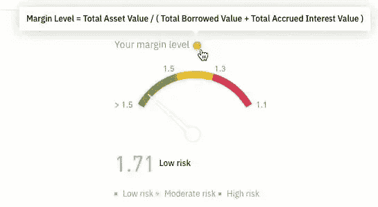****

## ****币安保证金清算****

****在上面的表上，如果你的风险水平超过 1.1，那么交易所将自动清算你的头寸。****

# ****定制保证金交易窗口****

****您可以通过窗口右上角的亮度按钮自定义保证金交易窗口。**允许你改变方案，使用亮/暗模式，改变图表的数量，以及顺序模式。******

******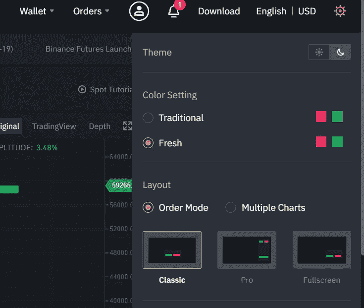******

# ******币安保证金交易指南******

******我们可以将币安的**保证金交易的步骤总结为三个大的小标题，它们是:********

# ****创建帐户****

****您可以按照以下步骤在 [**币安**](https://blog.coincodecap.com/go/binance) 创建保证金账户:****

1.  ****访问币安的官方网站，点击注册。****
2.  ****现在输入您的电子邮件和密码，并验证您的电子邮件。****
3.  ****现在，将鼠标悬停在标题中的“交易”上，即可访问“保证金交易”选项卡。****
4.  ****向下滚动并点击激活保证金账户。****
5.  ****现在你可以转移资金开始交易。****

****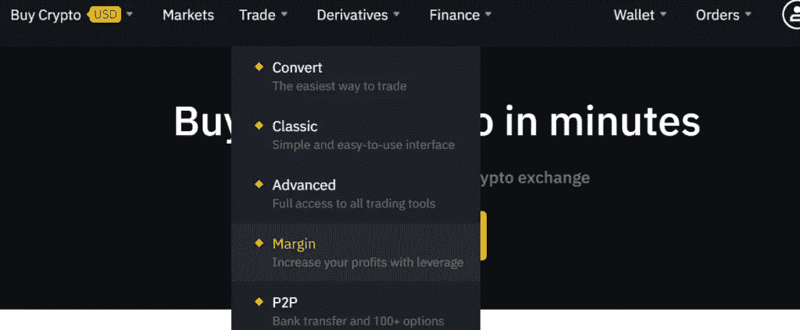****

# ****存款基金****

****现在，你需要将资金存入你的保证金交易账户。您可以按照以下步骤将资金存入您的币安保证金账户:****

1.  ****将鼠标悬停在标题中的钱包选项卡上，然后单击菲亚特和现货存款选项。****
2.  ****单击您首选资产的存款按钮。****
3.  ****现在，扫描二维码或复制钱包地址，将资金转移到您的币安钱包。****
4.  ****您也可以使用 Visa/ Mastercard 信用卡/借记卡从购买加密部分购买加密资产。****
5.  ****现在，把你存入/购买的密码转到你的保证金交易账户。****
6.  ****点击标题中钱包部分的利润按钮。****
7.  ****在下一个窗口中，单击您的首选资产前面的转账。****

****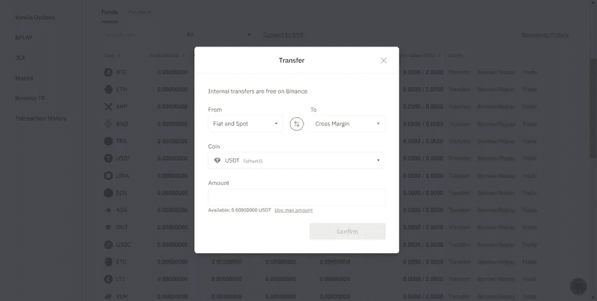****

# ****定购****

****现在，您可以按照以下步骤提交您的保证金交易订单:****

1.  ****从标题中的交易选项卡访问保证金。****
2.  ****现在在单独保证金和交叉保证金交易之间做出选择。****
3.  ****现在定制最适合你的一切。****
4.  ****输入所有细节，如价格、金额等。，并相应地点击买入/卖出按钮。****
5.  ****您可以在屏幕底部查看您的空缺职位的状态。****

****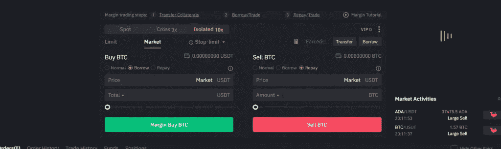****

# ****收取币安费用和利息****

******不收取资产保证金；但是，您需要为资产的提取支付费用。******

******币安向用户收取分层交易费。您可以查看您的 VIP 等级，并在下表中找到您的交易费用:******

******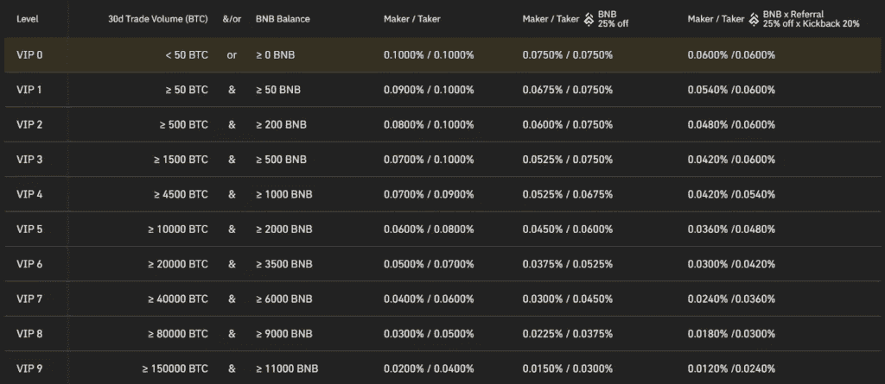******

******币安对你借的资金收取每小时的利息(T5)。你可以通过[点击这里](https://www.binance.com/en/fee/marginFee)来记录利息。******

******如果你使用 BNB 支付你的交易费，那么你会得到 25%的折扣。还可以使用 **X8FX10NT** 推荐代码获得费用折扣。******

# ****币安保证金交易的风险****

****无论保证金交易看起来多么有吸引力，它都伴随着风险。涉及的一些风险和需要考虑的要点如下:****

1.  ****保证金交易风险很高，因为加密市场波动很大。****
2.  ****使用杠杆会增加清算的风险。****
3.  ****如果您的互联网连接很弱，您的请求到达交易所的时间可能会稍晚一些。到那时，价格可能会大幅下降。****
4.  ****你可以利用交叉保证金交易来变现你所有的资本。****
5.  ****你不应该离开你的屏幕，因为事情可能会在眨眼之间发生变化。****
6.  ****交易者可以练习套期保值，防止损失过大。****

# ****币安保证金交易:利与弊****

****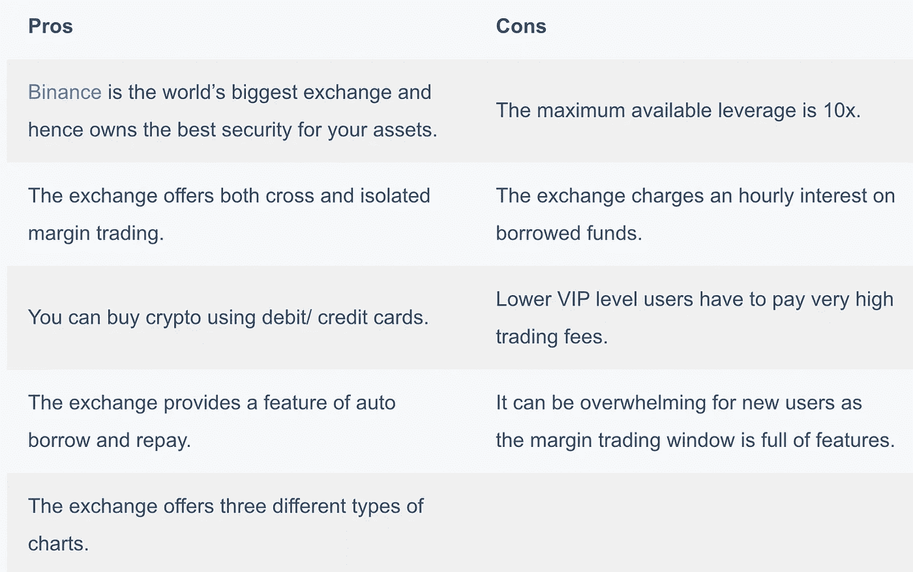****

# ****最后****

****[**币安**](https://blog.coincodecap.com/go/binance) 是为数不多的同时提供交叉和隔离保证金交易的平台。它提供了很多在保证金交易中非常方便的功能。然而，对于新手来说，这些特性可能有点难以理解。总体而言，币安是融资融券交易的最佳交易所之一。****

# ****常见问题****

******你能在币安对替代硬币使用杠杆吗？******

****[币安](https://blog.coincodecap.com/go/binance)提供最通用的保证金交易平台之一。你不仅可以在流行的数字资产上使用杠杆，也可以在高度不稳定的替代货币上使用杠杆。****

******3x 在币安是什么意思？******

****这意味着你在保证金交易中使用了 3 倍的杠杆。假设你建仓 30 USDT，资金 10 USDT。通过使用杠杆，交易所持有你的 10 USDT 作为抵押，并为你提供额外的 20 USDT 来建仓。****

****我如何从币安取钱？****

****您可以转到“取款”选项卡，然后点击您喜欢的货币前面的“取款”。然后提取菲亚特到你的银行账户。****

****把 crypto 留在币安安全吗？****

****币安是世界上最受欢迎的交流平台。因此，它是储存你的在线数字资产的最佳场所。****

> ****加入 Coinmonks [电报频道](https://t.me/coincodecap)和 [Youtube 频道](https://www.youtube.com/c/coinmonks/videos)获取每日[加密新闻](http://coincodecap.com/)****

## ****另外，阅读****

*   ****[复制交易](/coinmonks/top-10-crypto-copy-trading-platforms-for-beginners-d0c37c7d698c) | [加密税务软件](/coinmonks/crypto-tax-software-ed4b4810e338)****
*   ****[网格交易](https://coincodecap.com/grid-trading) | [加密硬件钱包](/coinmonks/the-best-cryptocurrency-hardware-wallets-of-2020-e28b1c124069)****
*   ****[密码电报信号](http://Top 4 Telegram Channels for Crypto Traders) | [密码交易机器人](/coinmonks/crypto-trading-bot-c2ffce8acb2a)****
*   ****[有哪些交易信号？](https://coincodecap.com/trading-signal) | [比特斯坦普 vs 比特币基地](https://coincodecap.com/bitstamp-coinbase)****
*   ****[ProfitFarmers 回顾](https://coincodecap.com/profitfarmers-review) | [如何使用 Cornix Trading Bot](https://coincodecap.com/cornix-trading-bot)****
*   ****[如何在势不可挡的域名上购买域名？](https://coincodecap.com/buy-domain-on-unstoppable-domains)****
*   ****[印度的加密税](https://coincodecap.com/crypto-tax-india) | [altFINS 审核](https://coincodecap.com/altfins-review) | [Prokey 审核](/coinmonks/prokey-review-26611173c13c)****
*   ****[最佳加密交易所](/coinmonks/crypto-exchange-dd2f9d6f3769) | [印度最佳加密交易所](/coinmonks/bitcoin-exchange-in-india-7f1fe79715c9)****
*   ****[开发人员的最佳加密 API](/coinmonks/best-crypto-apis-for-developers-5efe3a597a9f)****
*   ****最佳[密码借贷平台](/coinmonks/top-5-crypto-lending-platforms-in-2020-that-you-need-to-know-a1b675cec3fa)****
*   ****[杠杆代币终极指南](/coinmonks/leveraged-token-3f5257808b22)****