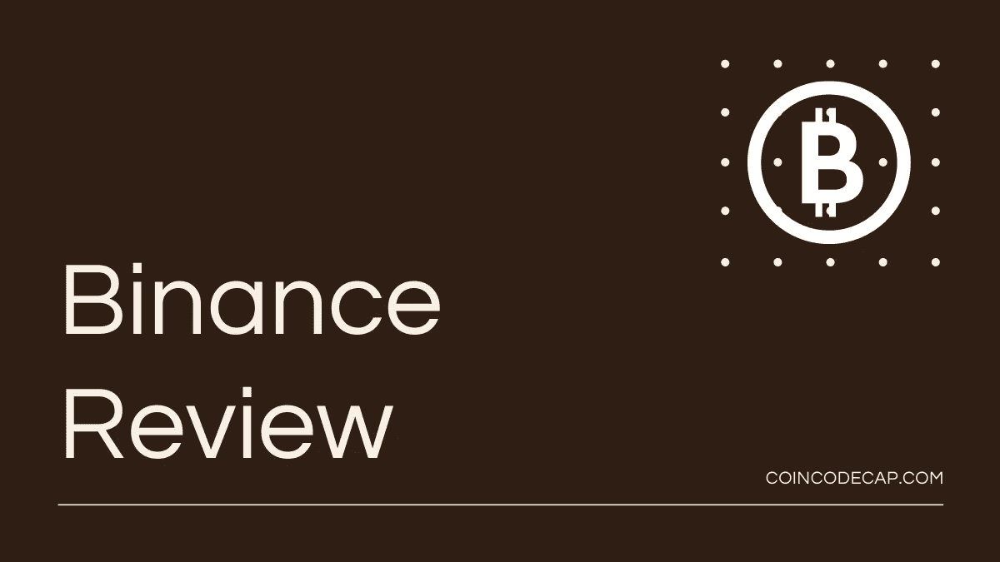
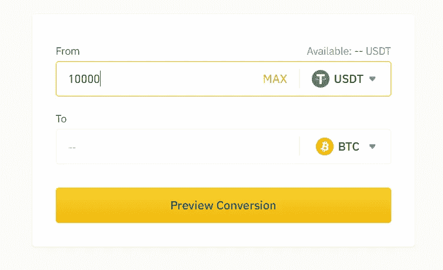
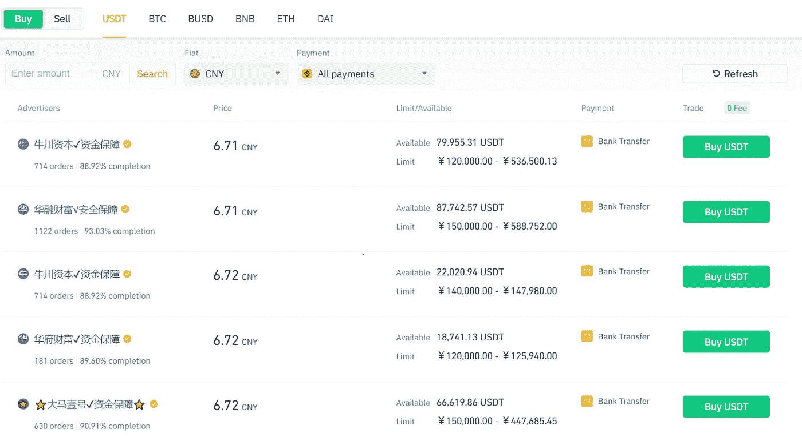
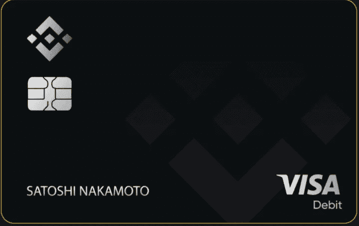
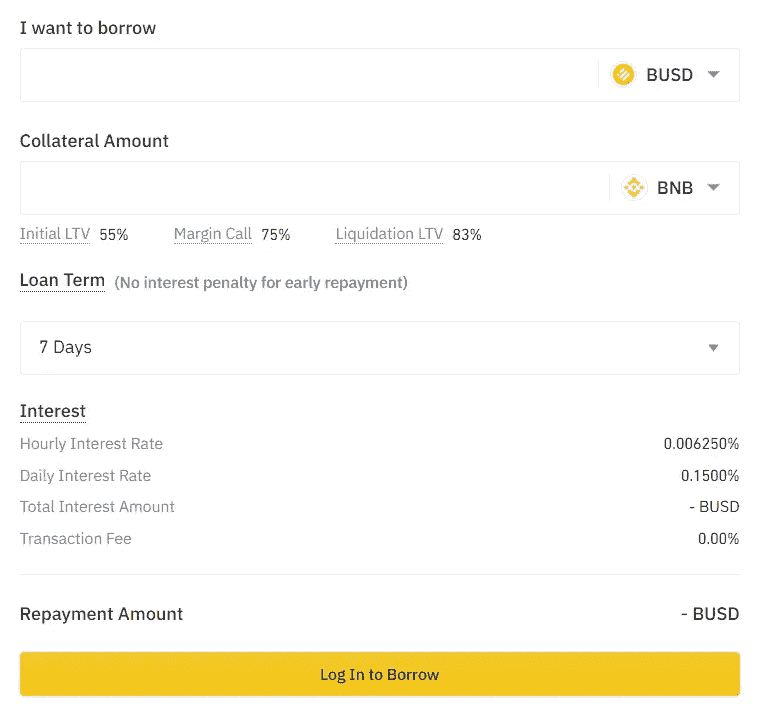
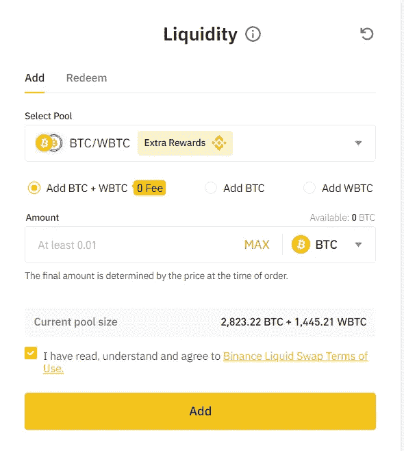
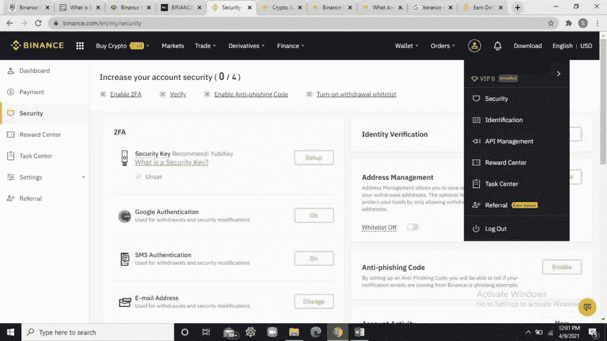
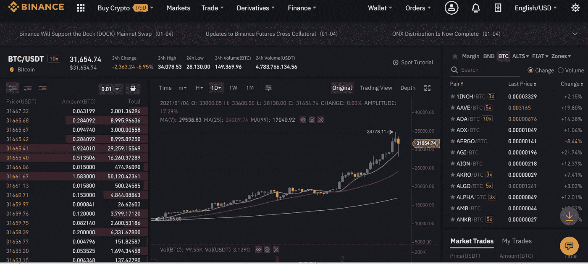

# 币安评论|你需要知道的一切

> 原文：<https://medium.com/coinmonks/binance-review-ee10d3bf3b6e?source=collection_archive---------5----------------------->

## 什么是币安？

本文我们就来回顾一下 [**币安**](https://blog.coincodecap.com/go/binance) 是由长鹏造(又名 CZ)于 2017 年 7 月创立的全球领先的[加密货币交易所](https://blog.coincodecap.com/crypto-exchange)。它最初位于中国；然而，由于中国严格的加密货币法律，它后来从那里搬走了，目前总部设在马耳他。自开发以来，它取得了惊人的成功，今天它每秒钟可以处理 140 万笔交易。

# 币安评论:摘要(TL；博士)

*   [**币安**](https://blog.coincodecap.com/go/binance) 是全球领先的[加密货币交易所](https://blog.coincodecap.com/go/crypto-exchange)，成立于 2017 年。
*   它们支持各种方法来存入、提取和交易加密货币。支持多种法定货币，如英镑、欧元、美元等。
*   [币安](https://blog.coincodecap.com/go/binance) Convert 可以让你瞬间将一种加密货币转换成另一种。
*   他们根据你的交易经验提供经典和高级的[交易终端](https://blog.coincodecap.com/atani-review)。
*   [币安](https://blog.coincodecap.com/go/binance)点对点允许你直接与其他用户买卖加密货币。
*   [币安](https://blog.coincodecap.com/go/binance)提供 usdⓢ-m 期货、硬币期货、杠杆代币和普通期权合约。
*   币安赚允许你借出你的资金，赌注你的 PoS(服务证明)硬币，或者通过币安将你的资金存入一个 [DeFi](https://blog.coincodecap.com/the-ultimate-guide-to-defi-decentralized-finance) 服务来[赚取你的密码的利息](https://blog.coincodecap.com/cryptocurrency-savings-accounts)。
*   币安池帮助你赚取被动收入。
*   币安 Visa 卡是一种加密货币卡，其工作原理与任何其他具有附加功能的借记卡一样。
*   币安加密贷款通过使用你的数字资产作为抵押来帮助你获得加密贷款。
*   币安流动性掉期通过向币安的流动性池提供流动性，使您能够获得非凡的年度利润。
*   币安支持 150 多种加密货币。
*   币安是完全安全的，并使用各种措施来保护平台，如反钓鱼措施，KYC，YubiKey，白名单地址，跟踪登录活动和设备。
*   币安 ICO Launchpad 允许您在完成 ICO 后立即列出新货币。
*   他们提供全天候的客户支持。

# 如何使用币安？

你必须遵循四个步骤来创建一个**的币安账户。**

1.  **打开币安主页，然后点击“注册”**
2.  **现在输入您的电子邮件地址，并选择一个强密码。**
3.  **通过输入在您输入的电子邮件 ID 上收到的验证码来验证输入的电子邮件地址。您现在已经创建了一个币安帐户。它将引导您进入如下所示的屏幕:**
4.  **点击“转到仪表板”通知将询问您是否要设置双因素身份验证。选择所需的安全验证以增强您帐户的安全性。您可以输入您的手机号码并完成帐户设置过程，以启用电话验证。**

**现在，您可以存入资金并开始交易！**

# **币安评论:存款和取款**

**[**币安**](https://blog.coincodecap.com/go/binance) 允许您存入、提取和交易加密货币。他们支持菲亚特。接受的付款方式包括:**

*   **外部钱包**
*   **银行汇款**
*   **像 Visa 和 MasterCard 这样的信用卡和借记卡**
*   **通过 Banxa 和 Simplex 等组织进行第三方支付**

# **币安贸易特点**

**币安提供以下交易平台:**

## **转换和场外交易**

**[币安转换](https://www.binance.com/en/support/faq/e8c7579382ea403aa4a4a6eec469659d)可以让你在几秒钟内将一种加密货币转换成另一种。您可以轻松转换平台上的资产，而无需担心交易费用和订单簿等复杂事宜。这个平台提供更快的交易和更好的价格。**

****

## **经典的**

****币安经典**是一个标准的传统平台，为交易者提供图表访问。这个平台很简单，有一个易于使用的界面。它允许你用 OCOs，止损单，市价单或限价单交易。它让交易者可以访问各种加密货币配对。这个平台有一个独特的功能，“一个取消另一个”，如果限价订单和限价止损订单同时发出，其中一个就会被执行。相比之下，另一个自动取消。这也将导致 OCO 对的取消。**

## **先进的**

****币安高级**更适合高级交易者，因为它允许他们查看更详细的统计数据。它提供了传统平台提供的所有功能。此外，它还提供图表来帮助交易和技术分析。**

## **边缘**

**[币安融资融券](https://blog.coincodecap.com/binance-margin-trading)允许交易者借入资金进行[杠杆交易](https://blog.coincodecap.com/margin-trading)。币安[保证金交易](https://blog.coincodecap.com/go/margin-trading)支持隔离保证金模式和交叉保证金模式。**

## **P2P(点对点交换)**

**[币安 P2P](https://p2p.binance.com/en) 允许您直接与 P2P 平台上的其他用户[买卖加密货币](https://blog.coincodecap.com/crypto-exchange)。它为买方和卖方提供了微不足道的管理费用。收取的交易费用为零。它提供了一百多种支付方式来购买和出售密码，如贝宝，现金，M-Pesa，银行转账和多个电子钱包。币安 P2P 允许你以你喜欢的价格交易。你也可以创建你的贸易广告来设定你的价格。与银行或信用卡转账不同，P2P 交易所不会收集买方或卖方的任何信息。**

****

# **币安衍生品**

**币安衍生品为您提供以下交易选项:**

1.  ****usdⓢ-m 期货:**币安期货允许你交易杠杆高达 125 倍的永久和季度 usdⓢ-m 期货。它没有到期日，也不是反向契约。这些合约有明确的定价规则，并在 BUSD 或 USDT 结算。**
2.  ****Coin 期货:**可以交易永续和季度 COIN-M 期货，杠杆高达 125 倍。这些令牌可能有到期日期，也可能没有。**
3.  ****杠杆代币:** [币安杠杆代币](https://blog.coincodecap.com/leveraged-token)是一种衍生产品，为您提供增强的杠杆作用，无需平仓或提供任何抵押品的风险。你可以在现货市场上交易这些代币。它们让你在不维持保证金水平的情况下获得杠杆头寸。**
4.  ****普通期权合约:****允许你买卖[普通期权](https://www.binance.com/en/support/faq/bee2427f6a594741858d51e91a67e30d)。这些是欧式期权，作为交易者，你有权以特定的价格卖出或买入某种商品。从开始时间到期权被行使之前，你可以直接买入或卖出。****

****如果你购买期权合约，你没有义务结算你的头寸。如果你是一个购买者，并且持有一个到期日的期权，你可以选择是行使还是放弃这个权利。但是，如果你是期权的卖方，你必须与买方匹配。****

****有两种类型的普通选项:****

*   ******看跌期权**:这些期权允许你在未来以特定的价格和时间框架出售特定数量的特定商品。****
*   ******买入期权**:这些期权允许你在未来以特定的价格和时间购买特定数量的特定商品。****

1.  ******战役:**在币安战役中，你可以开仓并与其他交易者竞争以获得点数。如果你预计 5 分钟后价格会上涨，选择“做多”，如果你预计价格会下跌，选择“做空”。详细了解步骤，可以查看[这里](https://www.binance.com/en-IN/support/faq/d514c39d76394792b2b99c241d53f8b9)。****

# ****币安·欧文****

****[币安挣](https://www.binance.com/en/support/faq/bc076f0eb7fb4ae182de6c5eb8968dec)允许你[借出你的密码获取利息](https://blog.coincodecap.com/top-5-crypto-lending-platforms)，下注你的 PoS(服务证明)硬币，或者通过**将你的密码存入 DeFi 服务。它通过对预期回报、时间范围和风险状况进行假设，提供了多种选择。******

*   ********灵活储蓄:**该功能允许您为存入的加密货币资金赚取每日利息。你可以随时提取你的资金。它使用起来毫不费力，并提供了灵活性。您认购灵活储蓄产品后的第二天开始计息。你可以在这里查看利率。******
*   ******Launchpool:** [币安 Launchpool](https://www.binance.com/en/blog/421499824684900950/Everything-You-Need-to-Know-About-Binance-Launchpool-How-to-Farm-Tokens-Calculate-APY--More) 源于投放 IEO(首次交易所发售)和收益耕作(或流动性挖掘)。它允许您通过下注现有资产和赚取每小时更新的新代币奖励来培育新资产。你可以随时提取你的存款，这是一个很好的被动收入来源。****
*   ******BNB 金库:**[币安 BNB 金库](https://www.binance.com/en/blog/421499824684901172/Introducing-BNB-Vault-OneClick-Earning-for-Your-BNB-Holdings)让您只需轻轻一点，就能从您的 BNB 资产中赚取并最大化您的收入潜力。投资 BNB 金库将使您能够轻松整合集中和分散的币安金融产品。****
*   ******固定储蓄:** [固定储蓄](https://www.binance.com/en/support/faq/bc076f0eb7fb4ae182de6c5eb8968dec)存取资金的灵活性较低，但利息回报较高。与灵活储蓄不同，你将不得不把你的资金存一段预定的时间来获得利息。它们仅适用于 USDT、BUSD 和 USDC。利率根据天数而不同。你可以点击查看完整列表[。](https://www.binance.com/en/savings#lending-fixeddeposits)****
*   ******活动:**这些是独特的下注机会，会不时出现。它们提供的回报甚至比固定储蓄更高，而且需要很快被认购，因为它们的供应量有上限。****
*   ******锁定赌注:**可以通过赌注加密货币资产获得奖励。您可以订阅[锁定赌注](https://www.binance.com/en/support/faq/bc076f0eb7fb4ae182de6c5eb8968dec)服务，并在一定的解锁期后兑换这些奖励。只需在您的现货钱包中放入 PoS 硬币，就可以在您的资产上赢得赌注奖励。如果您的 PoS 硬币被锁定 7-90 天，它可以产生更高的回报。****

# ****币安池****

****币安池是一个帮助你增加收入的平台。它允许你通过自动切换散列率来用相同的算法挖掘不同的货币，从而获得更高的利润。它提供以下功能:****

*   ****安全:它保护你的账户信息和密码。哈希速率在币安池上可见。****
*   ******稳定收益**:平台让你获得定期收益，避免波动。你可以使用即时结算和每股支付(PPS)，每股全额支付(FPPS)模式来实现这一点。****
*   ******综合服务**:辅助结束采矿和贸易之间的缺口，增加你的收入。****

# ****币安 Visa 卡****

****[币安 Visa 卡](https://www.binance.com/en/blog/421499824684900479/Introducing-the-Binance-Card-Shop-and-Pay-With-Crypto-Anywhere-in-the-World)是由**推出的加密货币借记卡。它得到了 200 个地区和领地的 4600 万商家的支持。******

******该卡支持使用币安美元(BUSD)、币安币(BTC)、[比特币](https://blog.coincodecap.com/a-candid-explanation-of-bitcoin) (BTC)、Swipe 的 SXP 令牌和以太坊(ETH)进行支付。******

******它的工作原理和其他具有附加功能的借记卡一样。你可以通过币安卡应用程序以加密货币或法定货币的形式向你的卡存款。这个过程就像把一种加密货币从一个钱包转移到另一个钱包。卡用这些资金作为支付，支付后费用不断扣除。它还可以用于常规购物活动，如购买杂货或礼品，而无需出售加密货币进行支付。创建币安卡的目的是让整个加密货币体验更加便捷、更加无缝。******

******币安卡提供以下优惠:******

*   ********最低费用:**币安不对币安卡收取任何额外的处理或管理费用。但是，可能会收取一些第三方费用。******
*   ******安全性:**卡是高度安全的，保护您的账户信息和资金。****
*   ******返现:**信用卡为每笔符合条件的购买提供高达 8%的返现。****
*   ******持有资金:**该卡可以在币安卡钱包中持有加密货币，只有在支付时才需要进行兑换。****

********

# ****加密贷款****

****币安加密贷款是一项服务，提供给贸易商，以满足他们的资金需求，对币安。您可以通过币安订单页面提前偿还所借贷款，利息按实际天数收取。****

****要在 [**【币安】**](https://blog.coincodecap.com/go/binance) 借加密贷款，你可以用你的数字资产做抵押。贷款期限可以是七天、十四天、三十天和九十天。如果贷款逾期，7 天或 14 天贷款和 30 天或 90 天贷款的逾期期限分别为 3 天和 7 天。在此期间，收取的利息是原利息的三倍。如果逾期后贷款仍未支付，抵押将被清算以偿还贷款。****

********

# ****币安液体互换****

****[币安流动性互换](https://www.binance.com/en/support/faq/bc076f0eb7fb4ae182de6c5eb8968dec)是基于流动性池的原理。它通过在**币安向流动性池提供流动性，使您能够获得非凡的年度利润。您可以与流动性池中的其他交易者交换您的加密货币。您可以随时从池中移除资产；然而，如果你打算只交换一项资产，就需要手续费。******

******币安流动性掉期具有以下优势:******

*   ******手续费低******
*   ******低滑动******
*   ******稳定的价格******
*   ******大额交易费用更低******
*   ******为联营提供利息******

************

# ******币安评论:加密货币支持******

******[**币安**](https://blog.coincodecap.com/go/binance) 支持几乎所有的主流加密货币，其中包括比特币(BTC)、莱特币(LTC)、以太坊(ETH)等知名币，以及 ZCoin (XZC)、UNI WAP(UNI)等不太受欢迎的币。******

****大量受支持的加密货币是币安惊人的受欢迎程度和成功背后的主要原因之一。****

# ****币安评论:安全****

****[**币安**](https://blog.coincodecap.com/go/binance) 安全性高，使用**加密货币安全标准** (CCSS)保护注册账户。它保护客户的私人信息和用户资产。交易平台包括以下安全措施，使其成为一个全面的安全套件:****

*   ******反网络钓鱼措施**:币安允许你设置反网络钓鱼代码，这将区分网络钓鱼企图和币安电子邮件。****
*   ****为您提供了以下交易、取款和安全性修改的身份验证措施:****
*   ****电子邮件地址认证****
*   ****短信认证****
*   ****双因素身份验证(2FA)****
*   ****YubiKey(硬件设备)在您的币安帐户上用作 2FA 措施，以提高帐户安全性。****
*   ****币安要求在设置您的用户帐户时进行 KYC 验证。****
*   ****它让用户为每个取款地址保存并写下记录。**还为您提供了一个白名单选项，帮助您只允许向白名单中的地址取款。******
*   ******您可以点击“管理”来查看有权访问您的帐户的设备。您也可以从这里删除不需要的设备。******
*   ******您可以使用此选项查看您的登录活动和安全活动。******

******要更改任何安全设置，请从您的帐户下拉菜单中选择“安全”选项，如下所示。******

************

# ******币安评论:用户体验******

********提供了一个易于使用的界面，支持明暗模式。该平台支持多种语言，如英语、中文、日语、韩语、西班牙语和许多其他语言。********

******桌面应用支持 [Windows](https://ftp.binance.com/electron-desktop/windows/production/binance-setup.exe) 、 [macOS](https://ftp.binance.com/electron-desktop/mac/production/binance.dmg) 、 [Linux deb](https://ftp.binance.com/electron-desktop/linux/production/binance-amd64-linux.deb) 和 [Linux rpm](https://ftp.binance.com/electron-desktop/linux/production/binance-x86_64-linux.rpm) 。此外，他们还有一个支持 Android 和 iOS 平台的移动应用程序。******

************

# ******币安费用******

******币安和美国币安有不同的费用结构。查看我们关于币安费用结构的详细[指南。](https://blog.coincodecap.com/binance-fees)******

## ******附加属性******

1.  ********币安发射台:** [**币安**](https://blog.coincodecap.com/go/binance) 受到了许多加密货币公司的好评，因为它们一完成 ICO 就上市新货币。它帮助你获得曝光率、流动性和代币分销。此外，他们还提供咨询、上市后和营销支持。******
2.  ******奖品:**币安交易所的普通交易者可以获得奖品。到目前为止，这些奖品包括本体(ONT)和 Waves(海浪)等免费加密货币，甚至还有一辆玛莎拉蒂汽车。交易者可以赚取赌注密码的回报，他们甚至可以通过保存密码赚取利息。****
3.  ******币安 API:** 币安 API 让您可以轻松地将自己的交易应用程序与币安集成。你也可以查看[文档](https://binance-docs.github.io/apidocs/spot/en/#change-log)。****

# ****币安评论:客户支持****

****[**币安**](https://blog.coincodecap.com/go/binance) 提供广泛的客户支持。他们提供实时聊天功能。****

****你可以通过各种社交媒体渠道与他们联系。****

*   ****Youtube 频道——他们分享有用的指南和教程。****
*   ****[推特](https://twitter.com/binance)****
*   ****电报频道有中文[和英文](https://t.me/BinanceChinese)两种。此外，他们还有一个不同的渠道发布[公告](https://t.me/binance_announcements)。****

# ****币安评论:利弊****

## ****赞成的意见****

1.  ****[**币安**](https://blog.coincodecap.com/go/binance) 是一个用户友好的平台，提供大量的教程和支持让你熟悉平台。****
2.  ****它支持 150 多种加密货币。****
3.  ****平台为你提供高交易量，从而带来更大的流动性。****
4.  ****币安是最实惠的[密码交易平台](https://blog.coincodecap.com/go/crypto-exchange)之一。****
5.  ****它支持使用加密货币和法定货币进行取款和存款。****
6.  ****这个平台非常安全。****
7.  ****它允许你赚取利息和奖励储蓄或赌注加密货币。****
8.  ****币安兼容桌面和移动，这有助于您在旅途中管理您的帐户。****
9.  ****币安的交易费用很低。****

## ****骗局****

1.  ****由于币安有很多选择，有时会让初学者不知所措。****
2.  ****只有币安期货平台提供 t，其他平台都没有。****
3.  ****虽然一些用户认为 KYC 认证是积极的，但是寻求匿名的用户认为是消极的。****

# ****币安评论:结论****

******是[最大的加密货币交易所](https://blog.coincodecap.com/crypto-exchange)。这是一个一站式商店，几乎可以满足您在加密货币交易中的任何需求。您可以在一个平台上获得加密贷款、赚取利息、流动互换、直接与同行买卖加密货币、通过币安卡进行支付、列出您的加密货币，等等。******

******它们为加密交易提供了一个易于使用的安全界面。他们不断增加更多的加密货币、支付方式和创新产品。******

# ******常见问题******

******币安安全吗？******

******币安是完全安全的，并使用各种措施来保护平台，如反钓鱼措施，KYC，YubiKey，白名单地址，跟踪登录活动和设备。******

******币安位于哪里？******

******币安最初位于中国；然而，由于中国严格的加密货币法律，它后来从那里搬走了，目前总部设在马耳他。******

********什么是币安发射台？********

****币安 ICO Launchpad 允许您在 ICO 结束后立即列出新货币。它帮助你获得曝光率、流动性和代币分销。此外，他们还提供咨询、上市后和营销支持。****

******什么是币安卡？******

****币安 Visa 卡是一种加密货币卡，其功能类似于任何其他借记卡，并具有额外的功能。你可以通过币安卡应用程序以加密货币或法定货币的形式存款。您可以使用它进行定期支付，而无需出售加密货币，使您的整个体验无缝衔接。****

****币安和美国币安有什么不同？****

****由于美国的严格监管，币安推出了一个单独的币安美国平台。与币安相比，美国币安支持的加密货币和交易功能较少。除此之外，这两个平台几乎完全相同。****

******什么是 BNB？******

****BNB 是币安的本地加密货币令牌。这有助于你获得交易费折扣。你也可以用币安卡在 BNB 购物。****

*   ****[2021 年如何在币安购买比特币？](https://blog.coincodecap.com/buy-bitcoin-binance)****
*   ****[币安保证金交易 2021 |你需要知道的一切](https://blog.coincodecap.com/binance-margin-trading)****
*   ****[币安链家 vs 币安智能链家](https://blog.coincodecap.com/binance-chain-vs-binance-smart-chain)****
*   ****[Pionex vs 币安 2021 |交易、费用和机器人](https://blog.coincodecap.com/pionex-vs-binance)****
*   ****[币安费用:完整指南(适用于美国币安和币安)](https://blog.coincodecap.com/binance-fees)****

> ****加入 Coinmonks [电报集团](https://t.me/joinchat/Trz8jaxd6xEsBI4p)，了解加密交易和投资****

## ****另外，阅读****

*   ****[什么是融资融券交易](https://blog.coincodecap.com/margin-trading)****
*   ****最好的[密码交易机器人](/coinmonks/crypto-trading-bot-c2ffce8acb2a) | [网格交易](https://blog.coincodecap.com/grid-trading)****
*   ****[3 商业评论](/coinmonks/3commas-review-an-excellent-crypto-trading-bot-2020-1313a58bec92) | [Pionex 评论](/coinmonks/pionex-review-exchange-with-crypto-trading-bot-1e459d0191ea) | [Coinrule 评论](/coinmonks/coinrule-review-2021-a-beginner-friendly-crypto-trading-bot-daf0504848ba)****
*   ****[AAX 交易所评论](/coinmonks/aax-exchange-review-2021-67c5ea09330c) | [德里比特评论](/coinmonks/deribit-review-options-fees-apis-and-testnet-2ca16c4bbdb2) | [FTX 交易所评论](/coinmonks/ftx-crypto-exchange-review-53664ac1198f)****
*   ****[n ave 零点回顾](/coinmonks/ngrave-zero-review-c465cf8307fc) | [Phemex 回顾](/coinmonks/phemex-review-4cfba0b49e28) | [PrimeXBT 回顾](/coinmonks/primexbt-review-88e0815be858)****
*   ****[Bybit Exchange 审查](/coinmonks/bybit-exchange-review-dbd570019b71) | [Bityard 审查](/coinmonks/bityard-review-7d104239be35) | [CoinSpot 审查](https://blog.coincodecap.com/coinspot-review)****
*   ****[3 commas vs crypto hopper](/coinmonks/3commas-vs-pionex-vs-cryptohopper-best-crypto-bot-6a98d2baa203)|[赚取加密利息](/coinmonks/earn-crypto-interest-b10b810fdda3)****
*   ****最好的比特币[硬件钱包](/coinmonks/the-best-cryptocurrency-hardware-wallets-of-2020-e28b1c124069?source=friends_link&sk=324dd9ff8556ab578d71e7ad7658ad7c) | [BitBox02 回顾](/coinmonks/bitbox02-review-your-swiss-bitcoin-hardware-wallet-c36c88fff29)****
*   ****[莱杰 vs n ave](/coinmonks/ledger-vs-ngrave-zero-7e40f0c1d694)|[莱杰 nano s vs x](/coinmonks/ledger-nano-s-vs-x-battery-hardware-price-storage-59a6663fe3b0)****
*   ****[密码本交易平台](/coinmonks/top-10-crypto-copy-trading-platforms-for-beginners-d0c37c7d698c) | [Coinmama 审核](/coinmonks/coinmama-review-ace5641bde6e)****
*   ****[CoinLoan 评论](/coinmonks/coinloan-review-18128b9badc4) | [YouHodler 评论](/coinmonks/youhodler-4-easy-ways-to-make-money-98969b9689f2) | [BlockFi 评论](/coinmonks/blockfi-review-53096053c097)****
*   ****最好的[加密税务软件](/coinmonks/best-crypto-tax-tool-for-my-money-72d4b430816b) | [CoinTracking 评论](/coinmonks/cointracking-review-a-reliable-cryptocurrency-tax-software-5114e3eb5737)****
*   ****最佳[加密借贷平台](/coinmonks/top-5-crypto-lending-platforms-in-2020-that-you-need-to-know-a1b675cec3fa) | [杠杆代币](/coinmonks/leveraged-token-3f5257808b22)****
*   ****[block fi vs Celsius](/coinmonks/blockfi-vs-celsius-vs-hodlnaut-8a1cc8c26630)|[Hodlnaut 审核](/coinmonks/hodlnaut-review-best-way-to-hodl-is-to-earn-interest-on-your-bitcoin-6658a8c19edf)****
*   ****[Bitsgap 审查](/coinmonks/bitsgap-review-a-crypto-trading-bot-that-makes-easy-money-a5d88a336df2) | [Quadency 审查](/coinmonks/quadency-review-a-crypto-trading-automation-platform-3068eaa374e1) | [Bitbns 审查](/coinmonks/bitbns-review-38256a07e161)****
*   ****[埃利帕尔泰坦评论](/coinmonks/ellipal-titan-review-85e9071dd029) | [赛克斯斯通评论](/coinmonks/secux-stone-hardware-wallet-review-15-discount-coupon-2020-7577032faa6e)****
*   ****[本地比特币审核](/coinmonks/localbitcoins-review-6cc001c6ed56) | [加密货币储蓄账户](https://blog.coincodecap.com/cryptocurrency-savings-accounts)****
*   ****最佳[区块链分析](https://bitquery.io/blog/best-blockchain-analysis-tools-and-software)工具| [赚比特币](/coinmonks/earn-bitcoin-6e8bd3c592d9)****
*   ****[加密套利](/coinmonks/crypto-arbitrage-guide-how-to-make-money-as-a-beginner-62bfe5c868f6)指南| [如何做空比特币](/coinmonks/how-to-short-bitcoin-568a2d0b4ae5)****
*   ****最佳[加密制图工具](/coinmonks/what-are-the-best-charting-platforms-for-cryptocurrency-trading-85aade584d80) | [最佳加密交易所](/coinmonks/crypto-exchange-dd2f9d6f3769)****
*   ****[如何在印度购买比特币？](/coinmonks/buy-bitcoin-in-india-feb50ddfef94) | [WazirX 评论](/coinmonks/wazirx-review-5c811b074f5b)****
*   ****[印度比特币交易所](/coinmonks/bitcoin-exchange-in-india-7f1fe79715c9) | [比特币储蓄账户](/coinmonks/bitcoin-savings-account-e65b13f92451)****
*   ****[CoinDCX 评论](/coinmonks/coindcx-review-8444db3621a2) | [加密保证金交易交易所](https://blog.coincodecap.com/crypto-margin-trading-exchanges)****

*****原载于 2021 年 4 月 12 日 https://blog.coincodecap.com**的* [*。*](https://blog.coincodecap.com/binance-review)****