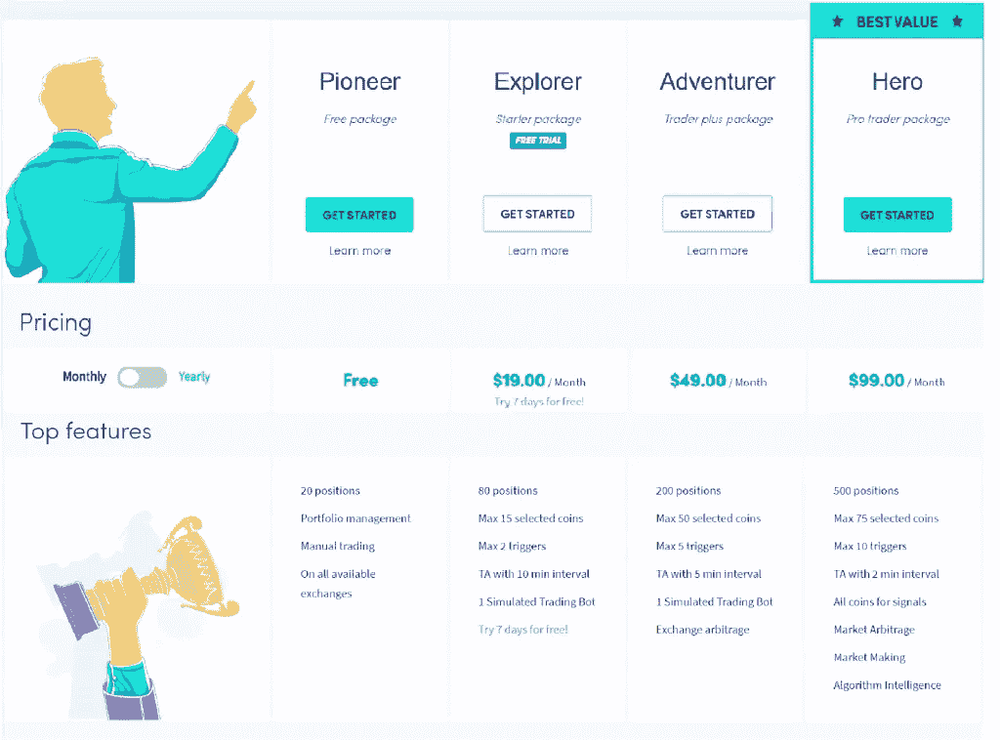

# 五大币安交易机器人

> 原文：<https://medium.com/coinmonks/binance-trading-bots-d0d57bb62c4c?source=collection_archive---------4----------------------->

就交易量而言， [**【币安】**](https://www.binance.com/en/register?ref=UARTH1S1) 是[最大的加密交易所之一](https://coincodecap.com/crypto-exchange)，在币安实现交易自动化会耗费你大量的时间。此外，这篇文章将涵盖五个最好的币安交易机器人。

# 总结(TL；博士)

*   加密交易机器人是帮助你自动化加密交易策略的计算机程序。
*   币安是全球最大的交易平台之一。
*   币安最好的五个交易机器人提供商是 Bitsgap、CryptoHero、Quadency、CryptoHopper 和 HaasOnline。
*   Bitsgap 提供加密信号，一个[网格交易机器人](https://coincodecap.com/grid-trading)，以及一个新的 Bitsgap 币安期货交易机器人。
*   [CryptoHero](https://pro.cryptohero.ai/referral?ref=IOGEYN) 尤其以其 AI 优化的机器人和免费版本的订阅计划而闻名。
*   此外， [Quadency](https://quadency.com/?r=ea20aa360c45d1f5ad47a19a) 提供了一个交易机器人列表，如[网格交易机器人](https://coincodecap.com/grid-trading)、做市商机器人、[交易视图](https://www.tradingview.com/?offer_id=10&aff_id=24152)机器人等。
*   你也可以带着 [**CryptoHopper**](https://www.cryptohopper.com/?atid=15596) 去发现它的市场，同时享受各种交易机器人，包括电报加密信号机器人。
*   最后， [HaasOnline](https://www.haasonline.com/?ref=11087) 是历史最悠久的加密交易机器人提供商，其加密脚本语言名为 HaasScript。
*   所有交易所都使用 API 密匙连接到您的交易平台，并且不能处理从您的交易交易所的提款。

> 几乎所有的交易机器人提供商都向他们的用户提供付费服务。然而， [Pionex](https://www.pionex.com/offers/#/grid-4?r=BI2UEarX) ，一个密码交易机器人提供商和密码交易所。
> 
> 获取 [Pionex](https://www.pionex.com/offers/#/grid-4?r=BI2UEarX) ！只需为您的订单支付交易费，即可终身享受**免费** 交易机器人。

# 什么是加密交易机器人？

加密交易机器人仅仅是帮助你自动执行交易策略的计算机代码。你可以通过编程你的交易策略来创建你的主要交易机器人。然而，各种平台提供这种付费订阅的服务。因此，如果你对编码不感兴趣，并且希望自动化你的交易策略，那么继续读下去。

# 交易机器人是如何工作的？

专业程序员和市场专家聚在一起，通过编写交易策略来创建交易机器人。此外，如果遇到市场机会，这些机器人会代表你自动建仓和平仓。交易机器人不受人类情感的影响。换句话说，他们只是遵循预先计划好的策略。

# 什么是币安？

就交易量而言，币安是全球最大的交易平台。因此，该平台提供了几乎所有你可能在密码交易所搜索到的服务，例如[保证金交易](https://coincodecap.com/binance-margin-trading)、[赌注](https://coincodecap.com/crypto-lending)、[借贷](https://coincodecap.com/crypto-lending)、launchpad、密码贷款等。

了解更多阅读，[币安评论](https://coincodecap.com/binance-review)。此外，币安也提供其加密卡；阅读[币安卡评论](https://coincodecap.com/binance-card-review)了解更多信息。

# 5 款最佳币安交易机器人

你可能是最好的交易者；然而，没人能在睡觉时关注市场。由于加密资产太不稳定，睡在你的杠杆头寸上是不小心的。这就是加密交易机器人的用武之地；如果市场符合你的策略，他们会自动获得回报。此外，如果它违背你的策略，他们会减少你的损失。

因此，以下是币安最好的加密交易机器人，你可能会感兴趣。

# bits gap——第一个币安交易机器人

## 什么是 Bitsgap？

Bitsgap 是市场上最受欢迎的交易机器人之一。而且。支持 25+个交易平台，包括[比特币基地](https://coinbase-consumer.sjv.io/7mbkNg)、[币安](https://www.binance.com/en/register?ref=UARTH1S1)、[波洛涅克斯](https://poloniex.com/signup?c=EHQ2B4GV)、[北海巨妖](https://r.kraken.com/e44GD1)、 [Bitfinex](https://www.bitfinex.com/?refcode=7P5O4Dyt2) 等。，因此，可以满足您可能使用的几乎所有平台的需求。此外，该平台允许客户在市场上花费任何真金白银之前，以演示模式测试机器人。

此外，Bitsgap 最近推出了一个[币安期货交易机器人](https://coincodecap.com/bitsgap-futures-bot)，它能以最小的风险自动化你的期货交易。

Binance Trading Bots: Bitsgap

## 币安期货交易机器人

Bitsgap 币安期货交易机器人的创建是为了从上涨和下跌的市场中获利。由于机器人利用杠杆优势，它创造回报的速度可能比现货市场快 1000 倍。

Bitsgap 机器人完全自动化期货交易。然而，由于它涉及到杠杆，运行期货交易机器人存在潜在的风险。例如，它既能带来丰厚的利润，也能带来巨大的损失。要了解更多信息，请阅读 Bitsgap 期货交易机器人。

## 交易终端

Bitsgap 交易终端提供了几乎所有必要的交易工具。大多数加密交易所不会给你提供这样的机会，因为他们专注于为你提供最好的流动性。阅读 [Bitsgap 评论](https://coincodecap.com/bitsgap-review)了解更多信息。

## Bitsgap 演示

位于[**Bitsgap**](https://bitsgap.com/?ref=2cb1231&utm_source=coincodecap&utm_medium=article&utm_campaign=promo)**的团队使用机器学习来研究历史数据，并分析已被证明能够最大化盈利的机器人。因此，使用 Bitsgap 演示模式，您可以从交易对列表中进行选择，其中的机器人已被证明是非常成功的。之后，你就可以不用投入任何真金白银去尝试那些机器人了。**

## **网格交易机器人**

**Bitsgap 网格交易机器人允许交易者设置投资的范围和限制，然后在该范围内自动开仓和平仓。此外，该机器人在多头和空头策略中都可以工作，并在卖出/买入指令执行时发出买入/卖出指令。**

## **Bitsgap 信号**

**该平台还提供市场信号或价格异常，这些信号或价格异常可能会转化为潜在的市场机会。 [Bitsgap](https://bitsgap.com/?ref=2cb1231&utm_source=coincodecap&utm_medium=article&utm_campaign=promo) 允许您搜索特定的加密资产，或者根据您使用的资产/交易对它们进行排序。**

## **Bitsgap 定价**

**该平台主要向其用户提供三种具有高级功能的计划。此外，您可以从 14 天的免费试用开始，然后选择以下计划之一:**

****

## **Bitsgap 合法吗？**

**你所有的资产都安全地保存在你的密码交易所的钱包里。之所以如此，是因为该机器人通过 API 密钥将您的交易平台连接到 Bitsgap，并且无权代表您进行提款。再者，平台建议使用 2FA，如果错误登录次数过多，账号会被锁定。**

## **Bitsgap:专业设计**

****

# **3Commas:币安的第二个交易机器人**

## **什么是 3Commas？**

**3Commas 是一个在线平台，帮助个人使用自动化机器人进行加密货币交易。这是需要更多金融技术背景或股票市场经验的个人的首选。**

**要了解更多信息，请阅读[3 商业评论](https://www.bing.com/ck/a?!&&p=57f5fc355b9719d1JmltdHM9MTY3MTQwODAwMCZpZ3VpZD0zMTMwOTAxMC04MmRmLTZjOGYtMjk0MS04MjJiODNkOTZkYjQmaW5zaWQ9NTE4NA&ptn=3&hsh=3&fclid=31309010-82df-6c8f-2941-822b83d96db4&psq=3commas+review+coincodecap&u=a1aHR0cHM6Ly9jb2luY29kZWNhcC5jb20vM2NvbW1hcy1yZXZpZXctYW4tZXhjZWxsZW50LWNyeXB0by10cmFkaW5nLWJvdA&ntb=1)。**

## **3 个逗号功能**

*   **作为一个网络托管平台，它可以从任何设备访问。**
*   **3comma smart trade 针对具体策略有不同的交易机器人。更重要的是，用户可以使用独特的交易位置对其进行定制。**
*   **这些机器人只能在特定时间运行，或者 24 小时不间断运行。**
*   **3commas API 的止损功能确保，如果超过了用户设置的亏损百分比，它会立即出售资产。**

## **3 商品定价**

****

## **3Commas 安全吗？**

**是的，3Commas 是安全的。资金实际上并不在平台上持有，交易机器人也不能从你的挂钩交易所账户中提款。**

**交易机器人通过 API 与交易所的账户相连，然后在相连的交易所进行自动交易。这个过程不需要用户向外部账户进行任何现金或加密转账，只需要他们的交易所生成的供应 API 密钥。反过来，这些密钥为交易机器人提供对用户账户的受限访问，并且不授予机器人任何提款权。**

**关于贸易数据，服务条款有点含糊不清。3Commas 确实会收集用户的策略和收益信息。需要澄清这些数据的个性化程度；也许是聚合的数据，但也可以是个体的。公司使用这些信息的方式需要在网站上说明。**

## **3 常见利弊**

****

# **CryptoHopper:币安的第三个交易机器人**

## **什么是隐漏斗？**

**[**CryptoHopper**](https://www.cryptohopper.com/?atid=15596) 是一个集交易机器人、交易所套利、[复制交易](/coinmonks/top-10-crypto-copy-trading-platforms-for-beginners-d0c37c7d698c)、回溯测试、策略设计器等服务于一体的交易平台。此外，该平台提供不同种类的交易机器人，包括一个用于电报频道上的[加密信号的机器人。隐漏斗最重要的特征是它的市场。](https://coincodecap.com/cryptohopper-telegram-bot)**

**要了解更多信息，请阅读 [CryptoHopper 评论](https://coincodecap.com/cryptohopper-review#h-cryptohopper-review-features)。**

## **做市商 bot**

**CryptoHopper 是为数不多的做市机器人之一。这种机器人帮助做市商从买卖差价中获利，这种差价被称为价差。此外，他们立即买卖资产以获取回报。然而， [**CryptoHopper**](https://www.cryptohopper.com/?atid=15596) 做市机器人对不同的市场趋势使用不同的策略。要了解更多信息，请观看下面的视频:**

**CryptoHopper Market Making**

## **套利工具**

**市场上有很多套利交易机器人。然而， [**CryptoHopper**](https://www.cryptohopper.com/?atid=15596) 套利机器人从两个交易所之间的资产差价中获取回报。此外，它还搜索单一交易所中某项资产的价格差异。要了解更多信息，请参考[加密套利指南](https://coincodecap.com/crypto-arbitrage-guide-how-to-make-money-as-a-beginner)。**

## **战略设计师**

**CryptoHopper 的策略设计器允许您使用各种技术指标来制定交易策略。您可以通过选择 CryptoHopper 上的指示器并将其与您的 [TradingView](https://www.tradingview.com/?offer_id=10&aff_id=24152) 设置相匹配来实现。当你最终完成时，你可以回测你的交易策略。此外，在成功的结果上，你可以根据你的交易策略运行一个交易机器人。要了解更多信息，请观看下面的视频。**

**CryptoHopper Strategy designer**

## **票据交易模式**

**纸上交易模式或回溯测试模式可以帮助你在投入任何真钱之前测试你的交易策略和机器人。非常建议交易者不要把钱投在不熟悉的平台上。例如，使用[**CryptoHopper**](https://www.cryptohopper.com/?atid=15596)**票据交易，你将假资金存入你的账户，用它们进行交易，直到你准备好投入真钱。****

## ****密码漏斗信号电报机器人****

****CryptoHopper Telegram bot 堪比聊天机器人。此外，它们还能帮助您实现交易自动化，让您只需点击一下鼠标就能跟踪加密信号。除了你的加密交换 API 密钥，这些机器人通过电报操作，不需要第三方应用。****

****了解更多阅读， [CryptoHopper 信号电报机器人](https://coincodecap.com/cryptohopper-telegram-bot)。****

## ****市场****

****市场是投资密码的新手的天堂。此外，它还提供模板、交易策略、密码信号和应用程序。你可以在[crypto hopper market place](https://blog.coincodecap.com/go/cryptohopper-marketplace)的一系列服务提供商中进行选择。然而，MarketPlace 上的服务通常由第三方服务提供商提供。****

****要了解更多信息，请阅读 CryptoHopper 评论。****

## ****密码漏斗定价****

****CryptoHopper 主要有四种不同的订阅计划，如下所示。您可以从探索者计划开始，并获得免费试用。此外，您还可以选择年度会员，并获得每月收费的折扣。****

********

## ****CryptoHopper 安全吗？****

****该平台已经运行了三年多，没有出现任何导致客户损失的严重问题。此外， [CryptoHopper](https://www.cryptohopper.com/?atid=15596) 使用 API 密钥，因此无权处理从您的交易交易所提款。****

****请注意，在极端的市场条件下，使用像漏斗这样的自动化机器人进行交易是危险的。因此，不要冒你无法承受的风险。****

## ****隐跳虫:利与弊****

********

# ****第四代币安交易机器人****

## ****什么是 Quadency？****

****[**Quadency**](https://quadency.com/?r=ea20aa360c45d1f5ad47a19a) 通过支持 15 种以上的交易策略和 35 种以上的加密交易，帮助您实现加密交易策略的自动化。Quadency 还提供投资组合分析、高级图表选项和行业专家的市场研究。了解更多阅读，[四季复习](https://coincodecap.com/quadency-review-a-crypto-trading-automation-platform)。****

****如果你使用它的一个官方交易伙伴进行交易，Quadency 还免费提供它的专业版。要了解更多信息，您可以访问 Quadency。****

****Binance Trading Bots: Quadency****

## ****网格交易机器人****

****Quadency 的网格交易机器人遵循网格策略，在指定的网格中下达买卖订单。随着价格的上下波动，订单得到履行，机器人相应地发出新订单。****

****要尝试不同类型的网格交易机器人，请阅读 [5 款最佳网格交易机器人](https://coincodecap.com/grid-trading)。****

## ****做市商 bot****

****该机器人遵循做市策略，自动发出两个限价单，一个买入，另一个卖出。基本原则是低买高卖，一旦两个订单都被执行或止损被击中，机器人就会创建两个新的限价单。****

## ****投资组合再平衡者****

****投资组合再平衡通过按比例分配你的资金来帮助你的投资组合多样化。因此，每当特定资产的价格变动时，bot 会根据您的投资组合配置自动清算并购买这些资产。要了解更多信息，请阅读[加密组合的再平衡策略](https://coincodecap.com/crypto-portfolio-rebalancing)。****

## ****交易视图机器人****

****您也可以使用 [Webhooks](https://en.wikipedia.org/wiki/Webhook) 将您的 [TradingView](https://www.tradingview.com/?offer_id=10&aff_id=24152) 账户与 Quadency 连接。因此，您可以根据您的 TradingView 帐户中的信号创建警报条件，从而将您独特的策略付诸实施。****

## ****四元定价****

****[**Quadency**](https://quadency.com/?r=ea20aa360c45d1f5ad47a19a) 提供三种计划的服务，免费、专业和无限制。购买年度套餐可以享受 20%的折扣。您也可以通过 Quadency partnered exchange 免费获得专业版。此外，您可以在下面找到每个计划的详细信息:****

********

## ****Quadency 合法吗？****

****Quadency 是一家值得信赖的纽约加密交易机器人提供商。此外，Quadency 使用 API 密匙连接你的交易平台和机器人。平台还为你提供 2FA。****

## ****优势:优势和劣势****

********

# ****CryptoHero:币安的第五个交易机器人****

## ****什么是 CryptoHero？****

****[**CryptoHero**](https://pro.cryptohero.ai/referral?ref=IOGEYN) 使用 AI 提供加密交易机器人。此外，你可以很容易地注册 CryptoHero，并在投入任何真钱之前尝试纸上交易模式。该平台还允许您在许多选项中定制机器人，如长/短策略、资金分配等。此外，您可以指定包括技术指标在内的进场条件和出场条件，其中包括止盈、止损和指标触发。****

********

## ****人工智能优化的机器人****

****所有在 [**的交易机器人 CryptoHero**](https://pro.cryptohero.ai/referral?ref=IOGEYN) 使用技术指标和预先指定的条件进出市场。此外，当所有指定的条件都满足时，机器人会使用人工智能自动进入市场。最后，当满足任一条件时退出。****

## ****仪表板上的热门机器人****

****仪表板上的这一部分为您提供了在所选持续时间内性能最佳的机器人列表。你可以简单地点击机器人图标，复制所有的设置来创建一个特定市场的机器人。****

## ****回溯测试****

****假设您不希望在试用该平台之前采用订阅计划。在这种情况下，您可以简单地注册[**CryptoHero**](https://pro.cryptohero.ai/referral?ref=IOGEYN)**，然后使用回溯测试功能。因为回溯测试允许你运行你的机器人，执行你的策略，而不需要在你的交易中投入任何真金白银。******

## ******CryptoHero 推荐计划******

******您可以通过电子邮件注册并获得您的唯一链接来参与 CryptoHero 推荐计划。然而，根据用户的要求，CryptoHero 的推荐程序正在修改。新修订的转诊计划将于 2021 年 7 月出台。******

## ******密码英雄定价******

******CryptoHero 向其用户提供三种计划，其中一种是免费的。此外，如果你选择年度订阅，你可以获得两个月的免费服务。您可以在下面的 CryptoHero 查看订阅计划的额外福利:******

************

## ******CryptoHero 安全吗？******

******CryptoHero 支持十多个交易平台，包括 [Gate.io](https://www.gate.io/ref/3674014) 、[比特币基地 Pro](https://coinbase-consumer.sjv.io/7mbkNg) 、 [Kucoin](https://www.kucoin.com/ucenter/signup?rcode=rJ45SVB) 、[币安](https://www.binance.com/en/register?ref=UARTH1S1)等。CryptoHero 使用 API 密钥将交易机器人连接到这些平台。因此，机器人只能代表你下订单，不能处理提款。******

## ******CryptoHero:利弊******

************

# ******哈森在线:币安最佳交易机器人第六名******

## ******什么是 HassOnline？******

******[**HaasOnline**](https://www.haasonline.com/?ref=11087) 是历史最悠久的密码交易机器人提供商之一。该平台允许您根据自己的交易策略轻松创建交易机器人。你甚至可以回测你的交易机器人，只有当你确定机器人的回报时，你才能投入真正的钱。******

****要了解更多信息，请阅读[哈森在线评论](https://coincodecap.com/haasonline-review)。您还可以使用优惠券" **COINCODECAP** "在 HaasOnline 上享受九折优惠。****

****Binance Trading Bots: HaasOnline****

## ****贸易服务器****

****HaasOnline TradeServer 专为从外汇等传统市场转向加密货币市场的经验丰富的交易者而设计。TradeServer 是本地托管的，允许你用 [**HaasOnline**](https://www.haasonline.com/?ref=11087) 连接二十多个交易平台。你也可以使用 HaasOnline 预先构建的交易机器人。****

## ****哈森在线云管理****

****备受期待的 HaasOnline 云功能将于 2021 年 6 月上线。HaasOnline Cloud 将让您不必担心安装新的软件更新，跟踪来自各种第三方提供商的信号，支持授权交易商的副本交易，并在任何设备上进行交易。因为它还没有上市，你可以加入[哈森在线云管理](https://www.haasonline.com/haasonline-cloud/)的候选名单。****

********

## ****哈斯脚本****

****HaasOnline 允许你创建自己的交易机器人。因此，该平台提出了它的加密脚本语言 HaasScript，它支持 600 多个命令。它将使你能够编码你的交易机器人，创建和解释信号等。****

## ****回溯测试****

****该平台允许您在通过回溯测试投入任何实际资金之前，使用高质量的历史或实时数据来测试您的交易策略。您可以使用 HaasOnline 回溯测试功能来防止不必要的损失。****

## ****哈森在线定价****

****HaasOnline 提供三种不同的订阅计划，初级、简单和高级。此外，您可以选择 3 个月、两年和一年的计划期限。但是，你必须在 BTC 支付订阅费用，而且你还可以享受年度订阅计划的折扣。要了解更多有关功能的信息，请参考 HaasOnline 或下图:****

********

## ****哈森琳安全吗？****

****[HaasOnline](https://www.haasonline.com/?ref=11087) 是鹿特丹历史最悠久的交易机器人提供商之一。它的平台是沈煜伦·德·哈斯、乔希·贝克尔和拉斯蒂姆·罗达经验的产物。最重要的是，他们知道自己在做什么，即提供最安全的交易机器人软件。随着 HaasOnline 云管理的推出，该平台将变得更加安全和高效。****

## ****哈森林:赞成和反对****

********

# ****Altrady —第 7 个币安交易机器人****

****Altrady 独特的自动化加密交易工具每天都有成千上万的交易者使用，通过自动化交易来实现回报最大化。该公司提供几种类型的机器人，包括网格和信号机器人，为有经验的交易者提供了一种简单的方法，让他们在没有任何知识或技能的情况下，在快节奏的市场中占据优势。****

******Altrady 为每种类型的加密交易提供完整的工具集:******

*   ****在多个交易所和交易所账户进行交易****
*   ****单个交易所的多个账户****
*   ****实时盈亏平衡计算****
*   ****离线价格和订单提醒****
*   ****图表上的可视交易反馈****
*   ****独特的集成市场扫描仪****
*   ****交易自动化，带止盈和止损****
*   ****带有 tradingview webhook 或基于加密的扫描器信号的信号机器人****
*   ****上下拖动的网格机器人****
*   ****具有子账户的投资组合管理****
*   ****交易分析****

****值得一提的是，他们正在不断改进他们的功能集，在 2022 年第 3-4 季度的简短路线图中，他们将添加:****

*   ****新的移动应用****
*   ****具有外部钱包支持的投资组合****
*   ****Dex 集成****
*   ****票据交易****

****利用你的知识和技能与最先进的交易平台:Altrady 14 天免费****

# ****如何设计一个币安交易机器人？****

****要设计一个币安交易机器人，你需要把你的币安账户和你想要使用的交易机器人连接起来。此外，您还可以使用您的币安帐户的 API 密钥来完成此操作。您可以从用户部分转到 API 管理，然后通过完成 2FA 创建一个新的 API。然后将 API 密匙粘贴到您的交易机器人提供者，您就可以自动完成交易了。****

****然而，假设你想逃离这种喧嚣，使用一个免费的币安交易机器人 ，前往 [**Pionex**](https://www.pionex.com/offers/#/grid-4?r=BI2UEarX) 。在这种情况下，该平台为你提供免费的交易机器人，你不需要使用 API 密匙来连接你的币安账户。****

# ****币安 API 交易机器人的规则是什么？****

****[币安](https://www.binance.com/en/register?ref=UARTH1S1)为期货 API 交易提供了一套量化规则。您可以在下表中遵守这些规则。然而，违反这些规则中的任何一条，你都可能被限制增加你的头寸，甚至违反规则建立新的资产头寸。****

********

****本系统利用 10 分钟指示周期的追溯计算来禁止高于某个阈值的特定订单。要了解指标定义，请前往[币安支持](https://www.binance.com/en/support/faq/4f462ebe6ff445d4a170be7d9e897272)。****

# ****贸易机器人支持币安****

****如果你的交易机器人遇到任何问题，首先联系你的机器人供应商，向他们澄清所有细节。然而，如果他们那边没问题，那么你可以去币安的 FAQ 部分找到问题的根源。此外，如果您仍然不满意，您可以前往[币安聊天室](https://www.binance.com/en/chat)提交请求。****

# ****币安交易机器人:结论****

****总之，本文中几乎所有的币安交易机器人提供商都因这样或那样的事情而出名。首先， [**Bitsgap**](https://bitsgap.com/?ref=2cb1231&utm_source=coincodecap&utm_medium=article&utm_campaign=promo) 有一个特定的 Bitsgap 币安期货交易 bot，每天开仓和平仓数百个。其次， [CryptoHero](https://pro.cryptohero.ai/referral?ref=IOGEYN) 提供人工智能优化的机器人，它们使用预先指定的条件进入和退出市场。****

****第三， [Quadency](https://quadency.com/?r=ea20aa360c45d1f5ad47a19a) 提供各种交易机器人，如电网交易机器人、做市商机器人、[交易视图](https://www.tradingview.com/?offer_id=10&aff_id=24152)机器人等。 [**CryptoHopper**](https://www.cryptohopper.com/?atid=15596) 的主要吸引力在于其提供多种交易策略、密码信号等的市场。最后，HaasOnline 是技术上最先进的加密交易机器人之一。随着 [HaasOnline](https://www.haasonline.com/?ref=11087) 云管理的推出，它的目标是对初学者友好。****

# ****常见问题****

****什么是开源币安交易机器人？****

****一个开源的币安交易机器人允许你自由地自动化你的加密交易。此外，你可以在 Github 上找到许多开源交易机器人项目，如 [Freqtrade](https://github.com/freqtrade/freqtrade) 。****

****你也可以注册 [Pionex](https://www.pionex.com/offers/#/grid-4?r=BI2UEarX) ，一个提供 ***免费币安交易机器人*** 的平台。此外，要开始在 Pionex 进行交易，您只需将资金存入您的 Pionex 账户。****

****我可以免费试用 HaasBot 吗？****

****为了测试 HaasBot 交易机器人及其软件的其他元素， [HaasOnline](https://www.haasonline.com/?ref=11087) 提供免费托管的 HTS 版本。这些将是公共服务器，可能会有大量的流量，所以不要利用个人信息。
公共服务器:
[演示服务器#1](http://demo.haasonline.com:8090/)
[演示服务器#2](https://demo05.haasonline.com/) (SSL)
凭证:
用户名:showme
密码:进化****

****如何制作一个币安交易机器人？****

****你可以使用 [HaasOnline](https://www.haasonline.com/?ref=11087) 编写你的币安密码交易机器人。该平台允许你使用 HaasScript 从头开始创建交易机器人。此外，您可以前往 [**Pionex**](https://www.pionex.com/offers/#/grid-4?r=BI2UEarX) ，选择他们预先存在的一个机器人，并根据您的交易策略进行定制。****

******bits gap 有手机 app 吗？******

****目前没有 android 或 iOS [Bitsgap](https://blog.coincodecap.com/go/bitsgap) 应用；然而，它提供了一个完全动态的网站，你可以在移动浏览器上看到。****

******如何帮助新手交易者？******

****您可以使用 [Quadency](https://blog.coincodecap.com/go/quadency) Grid trading bot 简单地买卖特定范围内的资产。或者，你可以使用一个四元界面在几个市场进行交易。****

> ****加入 Coinmonks [电报频道](https://t.me/coincodecap)和 [Youtube 频道](https://www.youtube.com/c/coinmonks/videos)了解加密交易和投资****

## ****另外，阅读****

*   ****[Bookmap 评论](https://coincodecap.com/bookmap-review-2021-best-trading-software) | [美国 5 大最佳加密交易所](https://coincodecap.com/crypto-exchange-usa)****
*   ****[最好的卡达诺钱包](https://coincodecap.com/best-cardano-wallets) | [Bingbon 副本交易](https://coincodecap.com/bingbon-copy-trading)****
*   ****[印度最佳 P2P 加密交易所](https://coincodecap.com/p2p-crypto-exchanges-in-india) | [柴犬钱包](https://coincodecap.com/baby-shiba-inu-wallets)****
*   ****[八大加密附属计划](https://coincodecap.com/crypto-affiliate-programs) | [eToro vs 比特币基地](https://coincodecap.com/etoro-vs-coinbase)****
*   ****[最佳以太坊钱包](https://coincodecap.com/best-ethereum-wallets) | [电报上的加密货币机器人](https://coincodecap.com/telegram-crypto-bots)****
*   ****[交易杠杆代币的最佳交易所](https://coincodecap.com/leveraged-token-exchanges) | [购买 Floki](https://coincodecap.com/buy-floki-inu-token)****
*   ****[3Commas 对 Pionex 对 Cryptohopper](https://coincodecap.com/3commas-vs-pionex-vs-cryptohopper)|[Bingbon Review](https://coincodecap.com/bingbon-review)****
*   ****[加密复制交易平台](/coinmonks/top-10-crypto-copy-trading-platforms-for-beginners-d0c37c7d698c) | [如何在 WazirX 上购买比特币](/coinmonks/buy-bitcoin-on-wazirx-2d12b7989af1)****
*   ****[CoinLoan 评论](https://coincodecap.com/coinloan-review)|[Crypto.com 评论](/coinmonks/crypto-com-review-f143dca1f74c)****
*   ****[如何在加拿大购买加密货币？](https://coincodecap.com/how-to-buy-cryptocurrency-in-canada)****
*   ****[百无聊赖的猿游艇俱乐部(BAYC)评论](https://coincodecap.com/bored-ape-yacht-club-bayc-review)****
*   ****[5 款最佳加密交易终端](https://coincodecap.com/crypto-trading-terminals) | [最佳 DeFi 应用](https://coincodecap.com/best-defi-apps)****
*   ****[最佳网上赌场](https://coincodecap.com/best-online-casinos) | [币安评论](/coinmonks/binance-review-ee10d3bf3b6e) | [BitMEX 评论](https://coincodecap.com/bitmex-review)****
*   ****[麻雀交换评论](https://coincodecap.com/sparrow-exchange-review) | [纳什交换评论](https://coincodecap.com/nash-exchange-review)****