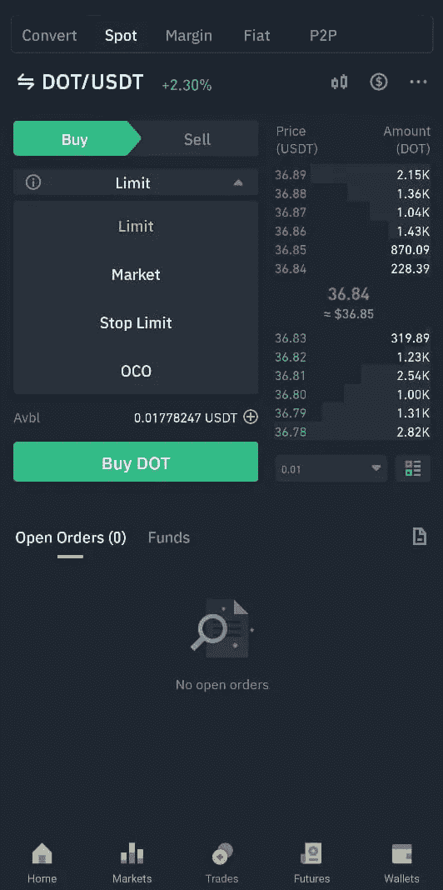

# 初学者币安教程

> 原文：<https://medium.com/coinmonks/binance-tutorial-for-beginners-bca861addc83?source=collection_archive---------2----------------------->

Photo by [Vadim Artyukhin](https://unsplash.com/@vademann?utm_source=medium&utm_medium=referral) on [Unsplash](https://unsplash.com?utm_source=medium&utm_medium=referral)

如果你正在读这篇博客，那么你已经知道币安是什么了。

币安是全球领先的加密货币交易平台。读完这篇博客后，你会对如何在币安交易有很深的理解。

# **应用概述**

Binance Home Screen

这是您登录后将看到的屏幕。**为了使用币安的所有功能，我们从币安精简版切换到币安专业版。**点击个人资料图标，然后点击币安建兴切换按钮。

这是币安专业版的主屏幕。首先，我们看到不同的横幅，显示所有正在进行的活动，单击它们将引导您进入不同的屏幕，显示有关活动的更多详细信息。

除了交易，币安还提供许多其他功能。在横幅下方，我们看到不同的图标，如存款、推荐、网格交易等。

在这些图标下面，我们看到 P2P 交易选项和一个信用卡/借记卡按钮。P2P 交易意味着直接从/向另一个人购买/出售，信用卡/借记卡选项允许您使用您的卡购买。参考 https://p2p.binance.com/en了解更多 p2p 交易。

然后，我们看到前三种加密货币的价格及其价格波动以百分比(%)显示。在这下面，我们看到了涨幅居前、跌幅居前以及加密货币趋势的列表。

## 基本术语

1.  绿色表示价格上涨，红色表示价格下降。
2.  每种加密货币都有一个符号名。比如卡尔达诺的符号名是 ADA，比特币是 BTC，以太坊是 ETH。
3.  在买卖时，我们会看到用“/”分隔的不同货币对。比如 BTC/USDT 买入时表示你想用你的 USDT 换 BTC( USDT 等价 BTC)，BTC/USDT 卖出时表示你想用你的 BTC 换 USDT( BTC 等价 BTC)。用 USDT 交换 BTC。建议您使用 UDST、BUSD、USDC 等稳定的加密货币进行交易。虽然币安支持与瑞士联邦理工学院，BTC，BNB，稳定硬币等交易。

## 理解图中的蜡烛。

在图表中，我们看到红色和绿色的蜡烛。理解图中的蜡烛非常重要。

在上图中，我们可以看到单根蜡烛的最高价、收盘价、开盘价和最低价。币安为您提供了从 1 分钟到 1 个月的蜡烛持续时间设置。下面是一个 15 分钟蜡烛图的例子。

这是蜡烛持续时间为 15 分钟的圆点(dot)加密货币的图表。在图中，你可以看到两条白色细线的交叉点，显示了我点的蜡烛，在左侧，我们看到一个小表格，显示了一些信息。表格显示，2021/09/14 18:00 至 18:15，开盘价为 35.79 美元，收盘价为 36.71 美元，最高价为 36.97 美元，最低价为 35.77 美元。

**在购买之前，你应该确保你有足够的余额来兑换加密货币。**

**在买卖时，你会看到 4 个选项**

1.  **极限**
2.  **市场**
3.  **停止限制**
4.  **Oco**

所有这些选项都有不同的功能，理解它们很重要，这样我们才能享受币安提供的所有功能。

1.  **极限值**

限价意味着，在价格越过用户设定的限制后，进行所需的操作(买入/卖出)。一旦用户设置了限价单，订单将自动执行，无需用户干预。因此，用户不需要经常检查价格。

**2。市场**

如果你想以当前市场价格买入/卖出，那么选择市场选项。因为价格是实时的当前价格，所以这个订单将被立即下。

**3。停止限制**

当你想最小化你的损失时，你设置了止损点。选择停止限制选项时，需要输入两个值，一个是停止值，另一个是限制值。例如，如果我以 10 美元的价格购买了一种加密货币，并且我不能承受超过 20%的损失，那么在止损字段中我将输入值 9 美元，在限价字段中我将输入值 8 美元。因此，每当价格低于 8 美元时，订单将自动执行，但如果价格低于 9 美元，并在触及 8.5 美元后开始上涨，订单将不会执行。

**4。奥科**

让我们考虑这样一种情况，你不确定市场会上涨还是下跌。，但是你要安全。在这种情况下，我们可以设置一个止损限价(第 3 点中提到的)和一个卖出限价(第 1 点中提到的)，但遗憾的是，我们不能分别设置两个订单。这是 Oco 图，代表一个抵消另一个。在 oco 中，您可以将止损限价和限价订单放在一起，但是如果一个订单被执行，另一个订单将被取消，这意味着如果止损限价订单被执行，那么限价订单将被取消，反之亦然。

您也可以通过单击订单图标来查找您的订单历史记录。

如果你还没有在币安注册，你可以使用我的推荐代码 116882399。

感谢阅读！

> 加入 Coinmonks [电报频道](https://t.me/coincodecap)和 [Youtube 频道](https://www.youtube.com/channel/UCbyDhTbOiKh2iUMKBi4-4Zg)了解加密交易和投资

## 也阅读

 [## 最佳加密交易所| 2021 年十大加密货币交易所

### ICON _ PLACEHOLDEREstimated 预计阅读时间:28 分钟加密货币交易所的加密交易需要知识…

blog.coincodecap.com](https://blog.coincodecap.com/crypto-exchange)  [## 2021 年 10 大最佳加密贷款平台| CoinCodeCap

### 当谈到加密货币贷款时，大量因素等同于良好的收入状况。此外，借款的一部分…

blog.coincodecap.com](https://blog.coincodecap.com/crypto-lending)  [## 2021 年最佳免费加密交易机器人

### 2021 年币安、比特币基地、库币和其他密码交易所的最佳密码交易机器人。四进制，位间隙…

medium.com](/coinmonks/crypto-trading-bot-c2ffce8acb2a)  [## 最佳 4 个加密交易信号电报通道

### 这是乏味的找到正确的加密交易信号提供商。因此，在本文中，我们将讨论最好的…

medium.com](/coinmonks/best-crypto-signals-telegram-5785cdbc4b2b)  [## BlockFi 评论 2021:利弊和利率| CoinCodeCap

### 今天，我们提出了一个全面的 BlockFi 评论，这是一个成立于 2017 年的加密贷款平台，拥有其…

blog.coincodecap.com](https://blog.coincodecap.com/blockfi-review)  [## 如何在印度购买比特币？2021 年购买比特币的 7 款最佳应用[手机版]

### 如何使用移动应用程序购买比特币印度

medium.com](/coinmonks/buy-bitcoin-in-india-feb50ddfef94)  [## 加密税务软件——五大最佳比特币税务计算器[2021]

### 不管你是刚接触加密还是已经在这个领域呆了一段时间，你都需要交税。

medium.com](/coinmonks/best-crypto-tax-tool-for-my-money-72d4b430816b)  [## 存储比特币的最佳加密硬件钱包[2021] | CoinCodeCap

### 保管您的数字资产很容易，但找到正确的存储方式却是一项繁琐的任务。在线钱包有一个风险…

blog.coincodecap.com](https://blog.coincodecap.com/best-hardware-wallet-bitcoin)