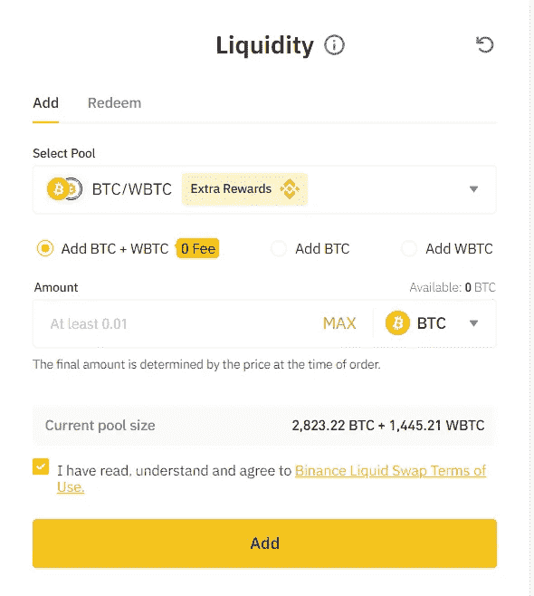
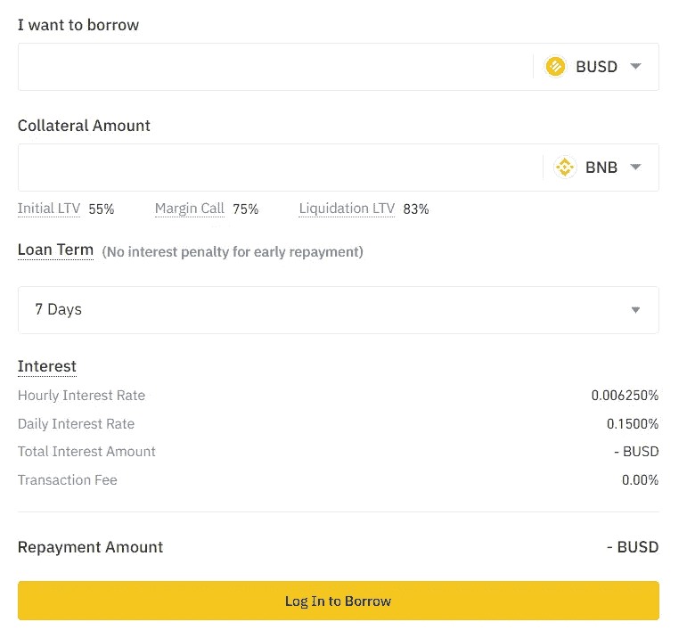

# 币安 vs 比特币基地|哪个最好？[2021]

> 原文：<https://medium.com/coinmonks/binance-vs-coinbase-42343437625a?source=collection_archive---------6----------------------->

[**比特币基地**](https://blog.coincodecap.com/go/coinbase) 是一家由 Brian Armstrong 和 Fred Ehrsam 创办的美国公司，运营一个[加密货币交易所](https://blog.coincodecap.com/go/crypto-exchange)平台。他们的目标是建立一个由密码支持的公平、可访问、高效和透明的金融系统的密码经济。他们在 100 多个国家拥有 5600 万经过验证的用户、7000 个机构和 115000 个生态系统。

**由赵昌鹏创立，最初是一家总部位于中国的公司，现在总部位于马耳他，提供各种加密货币的交易平台。该公司的使命是成为区块链生态系统的基础设施服务提供商。它是世界领先的加密货币交易所之一，日均交易量为 20 亿英镑，每秒交易量超过 140 万笔。180 个国家的用户可以在币安上交易。**

# **总结(TL；博士)**

*   **[比特币基地](https://blog.coincodecap.com/go/coinbase)和[币安](https://blog.coincodecap.com/go/binance)流行[加密货币交易所](https://blog.coincodecap.com/crypto-exchange)。他们在一个平台上提供各种加密产品。**
*   **[比特币基地](https://blog.coincodecap.com/go/coinbase)提供现货交易，[币安](https://blog.coincodecap.com/go/binance)提供现货交易，[保证金交易，](https://blog.coincodecap.com/margin-trading)期货交易，期权，[杠杆代币](https://blog.coincodecap.com/leveraged-token)。**
*   **与比特币基地相比，币安的交易费用更低。**
*   **币安比比特币基地支持更多的加密货币。**
*   **你可以在比特币基地通过观看信息丰富的加密视频、下注、授权和做小的比特币基地钱包任务来获得加密。**
*   **他们使用各种措施来确保他们的交易平台和产品是完全安全的。**
*   **币安允许你通过[出借你的密码](https://blog.coincodecap.com/top-5-crypto-lending-platforms)，下注，以及在币安金库持有 BNB 来赚钱。**
*   **交易终端是用户友好的。两家交易所都支持安卓和 iOS 系统的移动应用。此外，币安还提供桌面应用程序。**
*   **币安和 coinbase 提供加密货币卡。**
*   **比特币基地和币安提供 API 来连接使用不同编程语言的第三方应用程序。**
*   **此外，coinbase 还提供[比特币基地钱包](https://blog.coincodecap.com/coinbase-wallet-review-the-best-bitcoin-wallet)，比特币基地云和比特币基地托管。**
*   **币安还提供币安液体掉期、币安池和加密贷款。**

# **比特币基地 vs 币安:现货交易**

**[**比特币基地**](https://blog.coincodecap.com/go/coinbase) 为三种类型的订单提供现货交易——市价、限价和止损。默认订单类型设置为限价订单。**

## **比特币基地专业**

*   **它是一个先进的加密货币交易平台。**
*   **比特币基地专业工程对一个连续的先来先服务的订单簿。收到的订单按价格-时间优先级执行。**
*   **比特币基地专业版禁止自我交易。**
*   **进入美国的比特币交易所。**
*   **用于测试 API 连接和网络交易的公共沙箱**

**要了解更多关于比特币基地 Pro 的信息，请查看其[文档](https://docs.pro.coinbase.com/)或阅读我们的[比特币基地评论](https://blog.coincodecap.com/coinbase-review)。**

****币安支持不同类型的订单，如限价单、市价单、限价单、止损单、跟踪止损单和一单取消另一单。币安的默认订单类型是限价订单。****

****你还可以详细阅读[限价止蚀单](https://blog.coincodecap.com/spot-limit-order-binance)以及如何在币安下单。****

********

****[币安支持单独保证金和交叉保证金模式的保证金交易](https://blog.coincodecap.com/binance-margin-trading)。你可以在这里了解模式、保证金水平、[、保证金交易](https://blog.coincodecap.com/go/margin-trading)窗口以及更多[。](https://blog.coincodecap.com/binance-margin-trading)****

****它们提供高达 125 倍杠杆的季度期货和保证金期货。令牌的利用率在 1.25 倍到 4 倍之间。****

****此外，币安还提供选项，允许您在有限的风险下利用不同时间范围内的价格变动。****

# ****比特币基地 vs 币安:赚取加密****

## ****比特币基地****

1.  ****[**比特币基地**](https://blog.coincodecap.com/go/coinbase) 让你在学习密码的同时[获得密码](https://blog.coincodecap.com/go/earn-bitcoin)。你可以[赚取](https://www.coinbase.com/earn)不同的加密货币，并通过试用获得少量相同的货币。观看视频后，您将收到一份测验，测试您所学的内容。您完成的每项测验都会在您的比特币基地钱包中收到加密。****
2.  ****你可以通过下注赚取高达 6.0%的加密年利率。奖励将根据加密货币定期存入您的账户。****
3.  ****比特币基地允许你授权给 12 个企业级验证者并获得奖励，同时通过 Bison Trails 帮助保护网络。Bison Trails 是一套易于使用的基础设施产品和服务，适用于多个区块链。委托代币帮助您赢取奖励。你可以用这些奖励的一小部分来支付服务费。代币可以随时解除绑定。****

****此外，您还可以获得参与奖励。企业级验证器包括:****

*   ****塞洛****
*   ****宇宙****
*   ****Crypto.org 链****
*   ****边缘器皿****
*   ****流动****
*   ****草间****
*   ****直播同行****
*   ****近的****
*   ****绿洲****
*   ****本体论****
*   ****波尔卡多特****
*   ****索拉纳****
*   ****土地****

1.  ****[比特币基地钱包](https://blog.coincodecap.com/coinbase-wallet-review-the-best-bitcoin-wallet)允许你通过在社区中回答问题和解决奖金来赚取加密货币。****

## ****币安****

1.  ****币安赚允许你借出你的资金或存款给任何通过币安的服务来赚取利息。你可以根据你对回报、期限和所涉风险的选择来选择任何选项。关于[选项](https://www.binance.com/en/support/faq/bc076f0eb7fb4ae182de6c5eb8968dec)，可以详细查看。****
2.  ****币安提供锁定赌注和挑战赌注来赢取奖励。锁定桩的估计 APY 速率大于定义桩。你可以赚取高达 46.67%的 APY。对于锁定赌注，你必须持有加密货币十五天、三十天、六十天或九十天。此外，还有一个最低锁定金额。锁定期内，既不能撤单，也不能交易。在 DeFi staking 中，没有锁定期，你可以随时交易。****
3.  ****币安金库为 BNB 控股公司提供一键收益。金库是一个资本保证的投资产品，帮助您最大限度地提高您的 BNB 的收入潜力。此外，通过投资金库，您可以轻松整合来自**的集中式和分散式金融产品。******

# ******比特币基地 vs 币安:安全******

## ******比特币基地******

1.  ******[**比特币基地**](https://blog.coincodecap.com/go/coinbase) 提供其[数字钱包](https://blog.coincodecap.com/best-crypto-wallets-app)用于存储加密货币，该货币受密码保护并具有生物识别访问控制。就像数字钱包一样，它有一个加密的 12 字恢复短语来保护您的资产。******
2.  ****为了增强安全性，您可以通过 Google Authenticator 应用程序使用[双因素认证(2FA)](https://en.wikipedia.org/wiki/Multi-factor_authentication) 。****
3.  ****他们不支持匿名，政府颁发的 ID 验证平台中的所有用户。****
4.  ****他们将 98%的客户资金存放在冷库中。****
5.  ****美元存款由联邦存款保险公司承保。****
6.  ****加密货币金库进一步保护数字资产，防止欺诈性取款。您还可以在提取资金之前设置多个用户审批。****
7.  ****使用 AES-256 加密存储钱包和私钥。网站流量是 SSL 加密的。****
8.  ****您的应用程序凭据与数据库和代码库分开存储。****

## ****币安****

1.  ******币安提供了多层次的安全系统架构。******
2.  ******大部分资金都存放在冰冷的钱包里。******
3.  ******它没有自己的数字钱包。因此，它使用信任钱包。这种钱包通过 PIN、生物识别访问、加密密钥以及 12 个字的恢复短语来保护用户的资产。******
4.  ******地址白名单限制访问您的地址簿中的地址。******
5.  ******通过 SMS 或 Google Authenticator 应用程序进行双因素身份验证。******
6.  ******高级验证是解锁更多平台访问权限所必需的。为了完成验证，用户必须上传政府颁发的带照片的身份证和他们的照片。******
7.  ******他们拨出利润的 10%作为用户的资产基金，以弥补意外情况下的损失。******
8.  ******您可以设置反网络钓鱼代码来增强帐户的安全性。******

# ******比特币基地 vs 币安:用户体验******

******[**比特币基地**](https://blog.coincodecap.com/go/coinbase) 提供了支持 16 种语言的用户友好界面。它支持黑暗模式。移动应用程序支持安卓系统和 iOS 系统。******

********

****[**币安**](https://blog.coincodecap.com/go/binance) 为新手和高级交易者提供不同的交易界面。该平台支持超过 15 种语言。此外，它还支持黑暗模式。****

****桌面应用可用于— [Windows](https://ftp.binance.com/electron-desktop/windows/production/binance-setup.exe) 、 [macOS](https://ftp.binance.com/electron-desktop/mac/production/binance.dmg) 、 [Linux deb](https://ftp.binance.com/electron-desktop/linux/production/binance-amd64-linux.deb) 和 [Linux rpm](https://ftp.binance.com/electron-desktop/linux/production/binance-x86_64-linux.rpm) 。这款移动应用可在 Android 和 iOS 平台上使用，帮助你在旅途中管理你的账户。****

********

# ****币安 vs 比特币基地:存款和取款****

******币安支持以下支付方式存取加密货币。他们支持菲亚特。******

*   ******银行汇款******
*   ******外部钱包******
*   ******像 Visa 和 MasterCard 这样的信用卡和借记卡******
*   ******通过 Banxa 和 Simplex 等组织进行第三方支付******

******您可以使用以下支付方式在 [**【比特币基地】**](https://blog.coincodecap.com/go/coinbase) 存入和提取加密货币。此外，他们支持菲亚特。******

*   ****银行转账(SEPA、ACH 转账、电汇)****
*   ****信用卡和借记卡****
*   ****贝宝****

# ****比特币基地 vs 币安:费用****

****对于购买/出售交易，费用根据支付方式和您的位置而有所不同。与比特币基地专业版相比，标准版 Coinabase 平台的费用更高。****

****根据产品的不同，还有额外的比特币基地费用。可以查看详细的[费用结构](https://help.coinbase.com/en/coinbase/trading-and-funding/pricing-and-fees/fees)。****

****比特币基地专业版根据过去 30 天的交易量将其费用结构分为 11 个级别。它采用了一种创造者-接受者模式。****

********

****[**币安**](https://blog.coincodecap.com/go/binance) 采用的是制造者-接受者模式。汇率取决于过去三十天的交易量和 BNB 余额。****

****三十天的 BNB 余额和交易量每天在世界标准时间凌晨 0:00 更新。世界协调时 2:00 更新了层级和制定者-接受者费用****

****默认情况下，交易费用会从您的 BNB 余额中扣除，交易费用有 25%的折扣。通过介绍你的朋友去币安，你可以得到额外的 20%的折扣。****

****要了解更多信息，请阅读我们关于[币安费用结构](/coinmonks/binance-fees-8588ec17965)的文章。****

********

# ****比特币基地 vs 币安:加密货币卡****

****[比特币基地卡](https://www.coinbase.com/card)是 visa 借记卡。这有助于你在任何地方在线或离线消费加密货币，就像普通法定货币一样。****

********

****您可以使用比特币基地卡应用程序轻松切换加密货币。所有的交易收据和消费摘要都在应用仪表板中。卡是完全安全的，你的资金是安全的。****

****这款应用在安卓系统和 T21 系统上都可以使用。****

********

****币安 Visa 卡是币安的一种加密货币卡。全球有 4600 万商家支持通过币安卡进行支付。****

****它的工作原理类似于借记卡，但具有额外的功能。您可以使用币安卡应用程序将资金(加密货币或法定货币)存入您的卡中。你可以在日常生活中用它购物，买礼物和杂货。您也可以在币安卡钱包中存放资金。****

******不收取额外费用，但可能会扣除一些第三方费用。此外，他们还可以提供高达 8%的返现。******

************

# ******比特币基地对币安:API******

******[比特币基地 API](https://developers.coinbase.com/api/v2) 提供了一个强大的 rest API，可以轻松地将[比特币](https://blog.coincodecap.com/a-candid-explanation-of-bitcoin)、[比特币现金、](https://bitcoincash.org/) [莱特币](https://litecoin.com/)和[以太坊](https://ethereum.org/en/)集成到您的应用中。要了解更多关于 API 的细节，你可以查看它的[文档](https://developers.coinbase.com/api/v2#2017-08-07)。******

******币安 API 允许交易者通过几种编程语言连接到币安的服务器。可以提取数据并与外部应用程序交互。******

******交易者可以查看他们当前的钱包和交易数据，执行交易，并在第三方程序中存入和提取资金。******

******你也可以查看它的[文档](https://github.com/binance-exchange/binance-official-api-docs/blob/master/rest-api.md)了解更多细节。******

# ******比特币基地和币安:附加功能******

## ******比特币基地钱包******

******[比特币基地钱包](https://blog.coincodecap.com/coinbase-wallet-review-the-best-bitcoin-wallet)是一款安全的应用程序，可将您所有的数字资产存储在一个地方。它支持多种硬币和数字收藏品。你可以很容易地发送和接收密码。该应用在[安卓](https://play.google.com/store/apps/details?id=org.toshi)和 [iOS](https://apps.apple.com/app/coinbase-wallet/id1278383455?ls=1) 上都可以使用******

## ******比特币基地云******

******比特币基地云允许你通过轻松地将应用集成到比特币基地 API 中来构建应用。你可以接触到超过 4000 万的客户和可靠的基础设施。******

*   ******该应用将能够以完全分散的方式接受加密货币支付。******
*   ******您可以连接到多个区块链。******
*   ******安全地管理和运行节点群集，以加入二十多个分散式网络。******
*   ******将您的应用程序与 Rosseta、Query & Transact (QT)、数据索引器、WalletLink 和 USDC 连接起来。******

## ******比特币基地监护权******

******比特币基地保管是独立的冷库，用于安全地存放您的资产。他们像传统监管一样运作。外部公司定期进行财务和安全审计。它们由纽约金融服务局监管。您可以查看支持的[资产](https://custody.coinbase.com/assets)列表。******

## ******币安液体互换******

******[**币安**](https://blog.coincodecap.com/go/binance) 结合了集中式和[分散式金融](https://blog.coincodecap.com/the-ultimate-guide-to-defi-decentralized-finance)服务的优势，通过向币安平台上的流动性池提供流动性，让用户获得非常高的年收益。它包含了流动性池的原则。******

********

## ****币安池****

****[币安池](https://pool.binance.com/en)通过获得更高的利润来帮助你增加收入。它允许你自动切换散列率，以相同的算法挖掘不同的货币。它终止了交易和采矿之间的差距，增加了你的收入。为了获得稳定的收益，你可以使用每股全付(FPPS)或每股付费(PPS)模式。****

## ****币安加密贷款****

****您可以使用币安加密贷款优惠交易商在**满足他们的资金需求。你也可以提前还贷，利息只按你使用该金额的天数收取。******

******你的数字资产将被用作抵押品。你可以选择贷款期限为七天、十四天、三十天或九十天。十四天贷款中的七天的逾期贷款期限是三天，其余的规定期限是七天。如果你在逾期期间无法偿还，币安也会清算你的抵押品。******

************

## ******币安发射台******

******一旦新的加密货币的 ICO 结束，你就可以使用币安 ICO Launchpad 上市。它有助于您的加密货币获得流动性、曝光度和令牌分发。他们还提供咨询、上市后和营销支持。******

# ******比特币基地 vs 币安:客户支持******

******[比特币基地帮助中心](https://help.coinbase.com/)有一个所有常见问题的列表。它们被归类在比特币基地提供的不同产品下。还可以提高[支持票](https://help.coinbase.com/en/contact-us)。你也可以在推特上和他们联系。******

******如果您因可疑活动而想要锁定您的帐户，您可以致电******

*   ******+1 888 908–7930(美国/国际)******
*   ******0808 168 4635(英国)******
*   ******1800 200 355(爱尔兰)******

******[**币安**](https://blog.coincodecap.com/go/binance) 在其平台上提供 24×7 实时聊天选项。你可以通过不同的社交媒体渠道与他们联系。******

*   ****[推特](https://twitter.com/binance)****
*   ****[Youtube 频道](https://twitter.com/binance)****
*   ****中文[和英文](https://t.me/BinanceChinese)[的](https://t.me/BinanceExchange)和的电报社区，有不同的渠道发布[公告。](https://t.me/binance_announcements)****

********

# ****比特币基地对币安:结论****

****[**比特币基地**](https://blog.coincodecap.com/go/coinbase) 和币安是全球最安全的[加密货币交易所](https://blog.coincodecap.com/crypto-exchange)之一。他们在各自的套房里提供各种产品和交易终端。它们之间的主要区别是加密货币支持、费用和交易功能，其中****领先。尽管如果你想在他们的套件下使用一个特定的加密产品，你可以根据你的需要使用他们中的任何一个。********

# ******常见问题(FAQ)******

********coin base 合法吗？********

****根据 CoinMarketCap 的数据，比特币基地是一个安全、受监管的交易所，目前在全球排名第二。他们拥有来自 100 多个国家的 5600 万认证用户。现在也是上市公司了。****

******比特币基地 Pro 比比特币基地好吗？******

****比特币基地和比特币基地专业版的主要区别是前者非常适合新手，而后者适合高级交易者。比特币基地专业版提供更低的交易费用，无限的交易金额，以及额外的交易功能。****

******什么是 coinbase 托管？******

****比特币基地保管是独立的冷库，用于安全地存放您的资产。他们像传统监管一样运作。外部公司定期进行财务和安全审计。它们受纽约金融服务局(NYDFS)监管。****

****什么是币安发射台？****

****一旦新的加密货币的 ICO 结束，你就可以使用币安 ICO Launchpad 上市。它有助于您的加密货币获得流动性、曝光度和令牌分发。他们还提供咨询、上市后和营销支持。****

****币安和美国币安有什么不同？****

****由于美国的严格监管，币安推出了一个单独的平台币安美国。与币安相比，美国币安支持的交易功能和加密货币较少。除此之外，这两个平台几乎完全相同。****

*   ****[加密交易机器人](/coinmonks/crypto-trading-bot-c2ffce8acb2a)****
*   ****比特币基地评论 2021 |它是美国最好的加密交易所吗？****
*   ****如何将资金从币安转移到比特币基地？【2021】****
*   ****[币安评论 2021 |你需要知道的一切](https://blog.coincodecap.com/binance-review)****
*   ****[比特币基地 vs 北海巨妖|美国最好的密码交易所是哪家？](https://blog.coincodecap.com/kraken-vs-coinbase)****
*   ****[2021 年如何在币安购买比特币？](https://blog.coincodecap.com/buy-bitcoin-binance)****

*****原载于 2021 年 5 月 13 日 https://blog.coincodecap.com**[*。*](https://blog.coincodecap.com/binance-vs-coinbase)*****