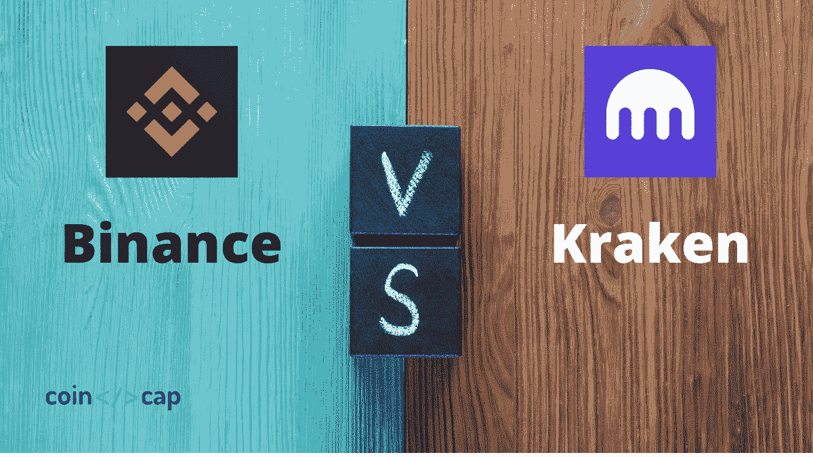
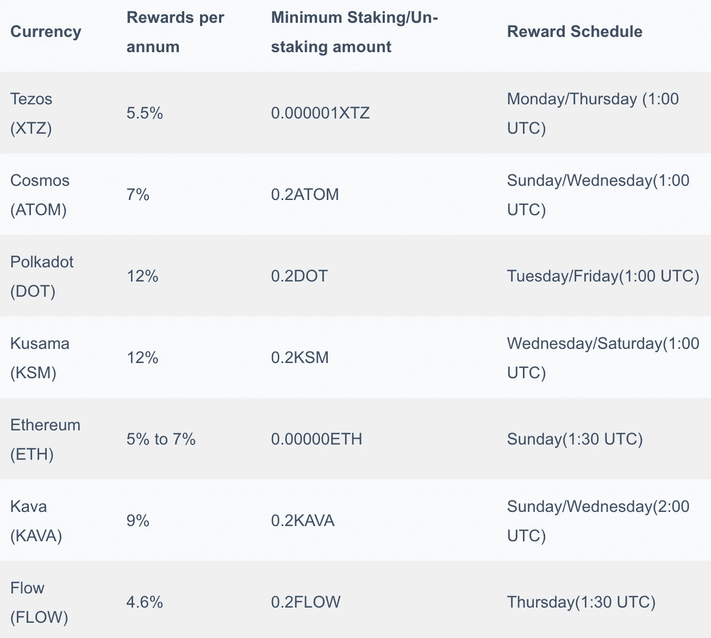
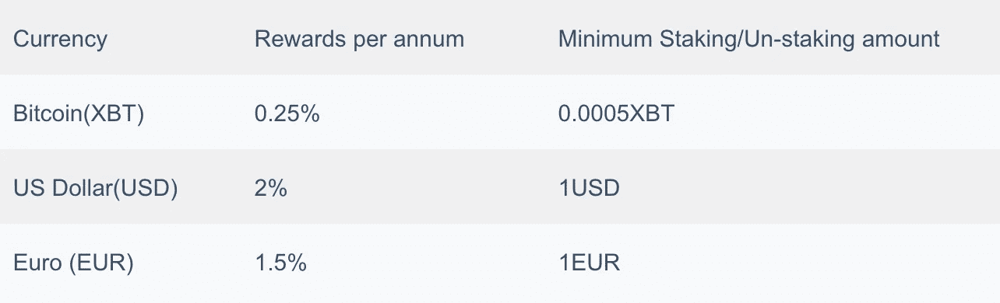
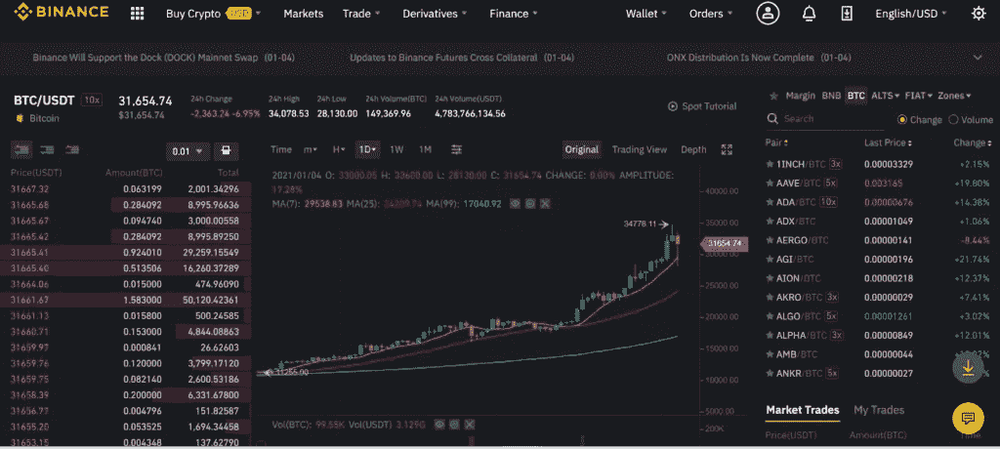
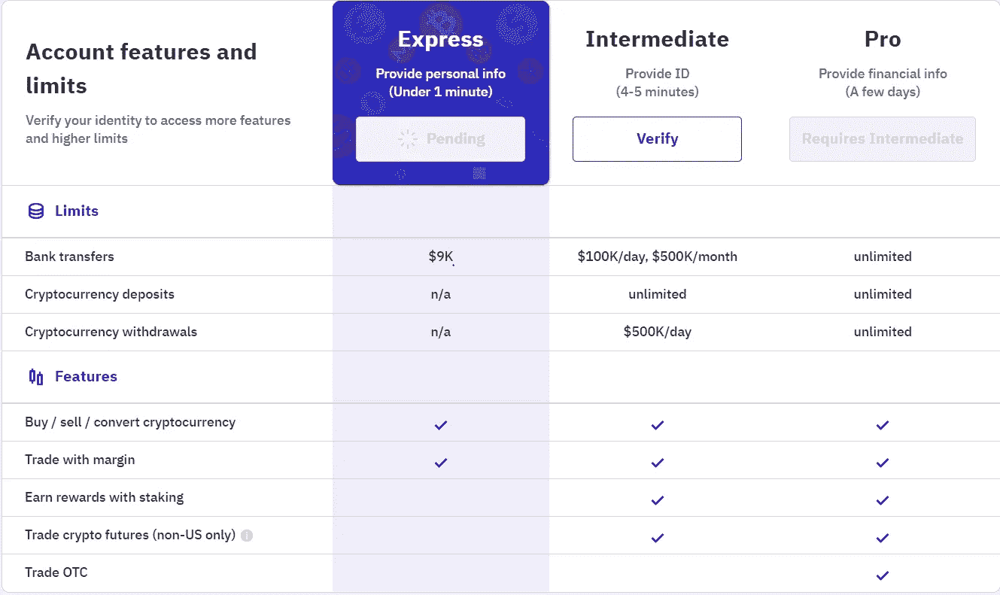
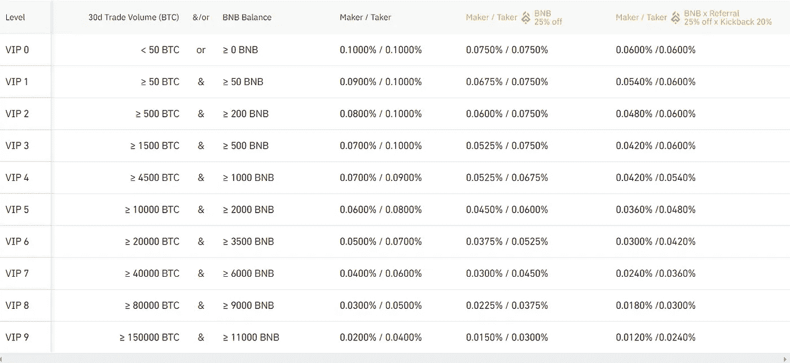
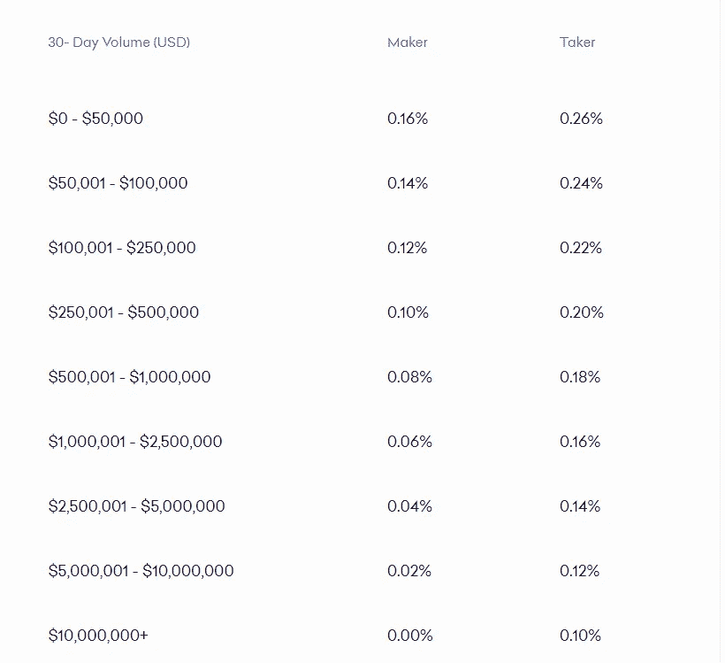
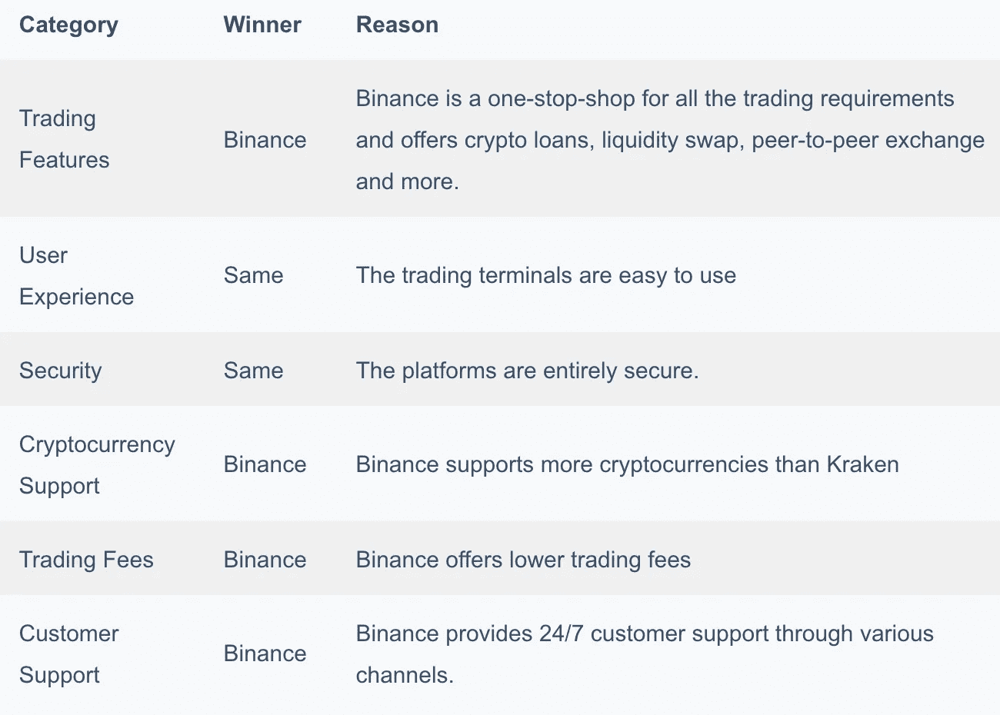

# 币安 vs 北海巨妖 2021 |你应该选择哪种加密交换？

> 原文：<https://medium.com/coinmonks/binance-vs-kraken-47828c2d1538?source=collection_archive---------9----------------------->

如今，市场上提供了各种[加密货币交易交换平台](https://blog.coincodecap.com/crypto-exchange)，每一个平台都有其独特的功能。其中两个交换平台是**和**。这两个平台都非常受欢迎，评价良好，并且是成功的加密货币交易平台。****

****在这里，我们将比较[币安](https://blog.coincodecap.com/go/binance)和[北海巨妖](https://blog.coincodecap.com/go/kraken)，这将帮助你根据你的交易要求和风格确定[最适合你的加密交易所](https://blog.coincodecap.com/crypto-exchange)。****

****[币安](https://blog.coincodecap.com/go/binance)是目前全球最大的[加密货币交易所](https://blog.coincodecap.com/go/crypto-exchange)，在一个平台下提供各种服务。由长鹏造(又名 CZ)于 2017 年 7 月研发，总部位于马耳他。它提供全球最实惠的利率，甚至是最快的加密货币交易平台之一。交易引擎每秒钟能够处理多达 140 万笔交易。他们拥有大约 1350 万用户的庞大用户群。****

****[北海巨妖](https://blog.coincodecap.com/go/kraken)是最古老和最受欢迎的[加密货币交易所之一](https://blog.coincodecap.com/go/crypto-exchange)。它由杰西·鲍威尔于 2011 年 7 月创立，总部位于加利福尼亚州旧金山。他们在全球拥有超过 400 万用户。****

# ****总结(TL；博士)****

*   ****[币安](https://blog.coincodecap.com/go/binance)和[北海巨妖](https://blog.coincodecap.com/go/kraken)分别成立于 2017 年和 2011 年的热门[加密货币交易所](https://blog.coincodecap.com/go/crypto-exchange)。****
*   ****这些交易所提供各种交易功能，如现货、保证金、期货交易和赌注。****
*   ****他们提供 API，可以帮助你连接第三方应用程序来下单和操作交易订单。****
*   ****这两个交换都是完全安全的，并使用各种措施，如冷存储、反网络钓鱼、双因素身份验证等。****
*   ****它们提供易于使用的界面。****
*   ****[币安](https://blog.coincodecap.com/go/binance)和[北海巨妖](https://blog.coincodecap.com/go/kraken)分别支持超过 150 种和 50 种加密货币。****
*   ****它们支持多种存款和取款方式。北海巨妖的具体支付方式需要时间来完成。****
*   ****与北海巨妖相比，币安的交易费用较低。****
*   ****币安提供广泛的客户支持，而北海巨妖的客户支持是有限的。****

# ****币安 vs 北海巨妖:保证金交易****

****[融资融券交易](https://blog.coincodecap.com/margin-trading)让您可以用自己当前的余额作为抵押，用借入的资金进行交易。不建议初学者使用，因为它会成倍地增加损失和收益。如果你决定做[保证金交易](https://blog.coincodecap.com/go/margin-trading)，你应该使用风险缓解工具和风险管理策略，比如止损单。****

## ****币安保证金交易****

****[币安保证金交易](https://blog.coincodecap.com/binance-margin-trading)允许您借入资金对数字资产进行杠杆交易。它提供两种模式:**隔离余量模式**和**交叉余量模式**。****

****您可以根据市场方向分别选择保证金做空或保证金做多。空头头寸表明资产价格将下降，而多头头寸表明资产价格将上升。****

****当保证金头寸未平仓时，您的资产将作为您所借资金的抵押品。****

## ****北海巨妖保证金交易****

****[北海巨妖](https://blog.coincodecap.com/go/kraken) [融资融券交易](https://blog.coincodecap.com/go/margin-trading)提供多种订单类型和两种持仓选项。它价格合理，提供高保证金限额和高流动性。****

****您可以打开空头或多头头寸，并通过使用结算命令或创建相反的头寸来关闭它们。根据加密货币的基础和报价，北海巨妖为各种加密货币提供不同的杠杆水平。****

****这是有益的，可以让你增加利润和杠杆作用，使你能够执行更积极和复杂的交易策略。它为各种加密货币的合格交易者提供高达 5 倍的杠杆，这意味着与现货交易相比，您的盈利潜力高达 5 倍。[北海巨妖](https://blog.coincodecap.com/go/kraken)允许您使用高级 API 访问等高级选项轻松管理您的头寸。****

# ****币安 vs 北海巨妖:期货交易****

## ****币安期货交易****

****[币安期货](https://www.binance.com/en/futures)平台让您利用杠杆进行做空或做多，以提高利润，降低风险。币安期货平台为您提供以下交易选项:****

1.  ****usdⓢ-m 期货:这些合约有明确的定价规则，允许你以高达 125 倍的杠杆进行交易。他们不是定居在 BUSD 就是定居在 USDT。这些合同不是反向的，也没有到期日。****
2.  ****硬币期货:它们可能有也可能没有到期日，允许你以高达 125 倍的杠杆交易永久和季度硬币期货。****
3.  ****[**杠杆代币**](https://blog.coincodecap.com/leveraged-token) :可以在现货市场交易这些代币。这些代币是衍生产品，为您提供增强的杠杆，而没有清算风险，维持保证金水平，或不得不提供任何抵押品。币安杠杆代币不允许你用持续的杠杆交易；然而，他们的目标杠杆率保持在 1.25 倍至 4 倍之间。您头寸的名义价值决定了您可以利用的最大杠杆数量。较大的头寸通常提供较低的杠杆。因此，您选择的杠杆决定了初始保证金存款。****
4.  ******普通期权合约**:币安期货平台允许您买卖普通期权，即欧式期权。这些期权允许您从开始时间到期权执行前以特定价格卖出或买入商品。 [**币安**](https://blog.coincodecap.com/go/binance) 为每个用户提供单独的期权账户，交易结算货币为 USDT。即使你购买了期权合约，你也没有义务结清你的头寸。****

****如果你是买方，并且持有到期日的期权，你可以选择是否行使该权利。但是，如果你是卖家，你必须匹配买家。****

****有两种不同类型的普通期权:看跌期权和看涨期权。****

## ****北海巨妖期货交易****

****[北海巨妖期货](https://www.kraken.com/features/futures)允许你以高达 50 倍的杠杆交易数字资产衍生品。****

****你可以做多或做空，从价格波动中获益，或者保护自己免受财务损失。 [**【北海巨妖】**](https://blog.coincodecap.com/go/kraken) 期货交易为您提供市场的敏捷性和准备性，并允许您在不增加额外加密货币的情况下保护现有现货头寸。****

****您可以访问[这里](https://www.cryptofacilities.com/)了解更多关于北海巨妖期货提供的监管期货产品。****

# ****币安 vs 北海巨妖:赌注****

****[**币安**](https://blog.coincodecap.com/go/binance) 提供锁定和灵活的锁定选项。****

****灵活的赌注没有任何锁定期，你可以随时交易或退出。锁定赌注有 15 天、30 天、60 天或 90 天的锁定期。在此期间，您不能撤回或交易。****

****与锁定赌注相比，灵活赌注的回报较低。您可以在此查看所有受支持资产的费率[。](https://www.binance.com/en/pos)****

****北海巨妖允许你下注你的加密货币和法币，并赚取赌注奖励。根据您下注的资产，您将获得每周或每两周一次的奖励。****

****除以太坊(ETH)外，没有绑定或等待期。你可以随时取消你的资产。****

****他们提供链上和链外定位。****

****目前， [**北海巨妖**](https://blog.coincodecap.com/go/kraken) 提供以下资产的链上打桩。****

********

****对于[比特币](https://blog.coincodecap.com/a-candid-explanation-of-bitcoin) (XBT)、美元(USD)、欧元(EUR)，允许进行链外赌注。****

********

# ****币安对北海巨妖:API****

****[**币安**](https://blog.coincodecap.com/go/binance) 有一个 RESTful API，通过第三方应用程序连接到币安服务器，使用 Python 等编程语言来管理你的资产或交易。****

****第三方应用程序中使用了币安 API，允许您查看数据和资产，并移动、存入、提取或交易资金。你可以用它来自动化你的交易。币安 API 使用 HTTP 请求来接收和发送数据。有各种第三方库可用于币安 API，其中 python-币安是最流行的一个。****

****[北海巨妖 API](https://www.kraken.com/features/api) 允许您与交易终端集成，并向我们提供有关市场数据和私人用户数据的信息。它将使您能够放置和操作订单簿。****

# ****币安 vs 北海巨妖:附加功能****

****[**【币安】**](https://blog.coincodecap.com/go/binance) 是交易的一站式商店，并提供各种附加功能。****

*   ****币安 P2P 公司提供与其他用户直接买卖加密货币的服务。****
*   ****币安赚允许你借出资金，通过币安将你的资金存入一项服务，或者用你的服务证明硬币来赚取利息。****
*   ****币安池让你[赚取被动收入](https://blog.coincodecap.com/earn-crypto-by-staking-coins)。****
*   ****币安 Visa 卡，一种加密货币卡，让您的[加密货币支付](https://blog.coincodecap.com/best-bitcoin-payment-processors)体验无缝衔接。****
*   ****币安[加密贷款](https://blog.coincodecap.com/top-5-crypto-lending-platforms)通过使用你的数字资产作为抵押来提供贷款。****
*   ****币安流动性掉期通过向流动性池提供流动性，提供了非凡的年度利润。****

# ****加密手表****

****[**北海巨妖**](https://blog.coincodecap.com/go/kraken) 于 2019 年收购 Cryptowatch，该公司提供一个高级交易终端，为超过 25 家交易所提供实时加密货币市场数据、[制图](/coinmonks/what-are-the-best-charting-platforms-for-cryptocurrency-trading-85aade584d80)和交易服务。这些数据是使用来自 4000 多个市场的 API 获取的。****

****他们提供免费和付费计划。您可以建立自定义付费计划，只为您使用的内容付费。你可以点击查看价格。****

****一些受欢迎的功能如下****

*   ****从一个终端在多个交易所进行交易****
*   ****使用高级图表界面分析市场趋势****
*   ****检查交易历史、订单和头寸****
*   ****使用 [Trollbox](https://trollbox.io/) 与交易伙伴聊天****
*   ****接收价格、数量、订单履行和技术分析警报****
*   ****使用 [Zapier](https://zapier.com/) 的触发器和动作自动发出警报和订单****

# ****北海巨妖 vs 币安:安全****

****在选择[加密货币交易所](https://blog.coincodecap.com/go/crypto-exchange)时，比较安全性非常重要，因为不安全的平台可能会导致你失去所有资金。虽然这两个交易所都提供高度安全措施，但以下是币安和北海巨妖安全部门之间的详细比较。****

******提供反网络钓鱼措施，允许您设置反网络钓鱼代码，以增强您的账户安全，保护您的资产。它为交易、取款和安全性修改提供了以下认证措施:电子邮件地址认证、短信认证和[双因素认证(2FA](https://en.wikipedia.org/wiki/Multi-factor_authentication) )。******

******在您设置帐户时，需要 KYC 验证。它还提供 YubiKey(硬件设备)和白名单地址等措施。******

******[**北海巨妖**](https://blog.coincodecap.com/go/kraken) 高度安全可靠。它为取款提供电子邮件确认，并提供[双因素认证(2FA](https://en.wikipedia.org/wiki/Multi-factor_authentication))(yubi key 和 Google 认证)。虽然 2FA 可以防止其他人访问您的帐户，但它不能防止您的帐户被钓鱼或被黑客攻击。******

****北海巨妖为您的帐户提供了额外的一层保护，如 [SIM 卡交换、](https://blog.kraken.com/post/5072/watch-krakens-crypto-security-guide-to-mobile-phones-and-wifi/)可定制的 API 密钥权限、SSL 加密和可配置的帐户超时。它允许您将 95%的资产保存在冷存储设备中，这意味着这些资产可以离线使用，并且完全没有任何空隙。****

****此外，它还提供个人身份识别、 [PGP 电子邮件加密](https://en.wikipedia.org/wiki/Pretty_Good_Privacy)和主账户锁。****

# ****北海巨妖 vs 币安:用户体验****

****[**币安**](https://blog.coincodecap.com/go/binance) 有各种用户界面布局；虽然有些简单易用，但有些对初学者来说可能很复杂。先进的币安界面会让你很难熟悉币安及其技术，但基本的界面很容易使用并开始交易。****

****它允许交易者在任何地方进行交易。该网站支持超过 15 种语言。****

****桌面应用可用于 [Windows](https://ftp.binance.com/electron-desktop/windows/production/binance-setup.exe) 、 [macOS](https://ftp.binance.com/electron-desktop/mac/production/binance.dmg) 、 [Linux deb](https://ftp.binance.com/electron-desktop/linux/production/binance-amd64-linux.deb) 和 [Linux rpm](https://ftp.binance.com/electron-desktop/linux/production/binance-x86_64-linux.rpm) 。该移动应用程序支持 [Android](https://ftp.binance.com/pack/Binance.apk) 和 [iOS](https://app.appsflyer.com/id1436799971?pid=internal&c=product_entrance) 平台，并帮助您在旅途中管理您的账户。****

********

****[**北海巨妖**](https://blog.coincodecap.com/go/kraken) 有一个简单易用的界面。它是用户友好的，尤其是对初学者。根据你的需要和经验，你可以选择北海巨妖(基本)、北海巨妖专业和北海巨妖期货。****

****北海巨妖的基本应用程序为初学者提供了一个易于使用的交易终端。北海巨妖专业版提供更广泛的功能，北海巨妖期货提供期货交易。****

****这些应用适用于安卓系统和 iOS 系统。该应用程序的桌面版本不可用，但您可以通过模拟器在桌面上使用它。****

****北海巨妖贸易码头****

# ****币安 vs 北海巨妖:加密货币支持****

****[**币安**](https://blog.coincodecap.com/go/binance) 支持多种加密货币，这是其惊人增长和成功背后的主要原因之一。它兼容 150 多种加密货币，包括币安币(BNB)、比特币、莱特币、以太币、TomoChain(托莫)、ZCoin (XZC)、BAT(基本注意力令牌)、CyberMiles (CMT)等等。****

****[**北海巨妖**](https://blog.coincodecap.com/go/kraken) 支持超过 50 种加密货币。你可以在北海巨妖[这里](https://support.kraken.com/hc/en-us/articles/201893658-Available-currency-pairs-on-Kraken)找到支持的加密货币对的完整列表。****

# ****币安 vs 北海巨妖:存款和取款****

****[**币安**](https://blog.coincodecap.com/go/binance) 允许您购买、出售、存入和提取加密货币。此外，它还支持菲亚特。它支持以下支付方式:****

*   ****信用卡和借记卡****
*   ****外部钱包****
*   ****P2P 交易****
*   ****银行汇款****
*   ****现金余额或法定货币；它接受 65 种法定货币，如加拿大元(CAD)、印度卢比(INR)、欧元(EUR)、美元(USD)等。****
*   ****通过 Banxa 和 Simplex 等组织进行的第三方支付。****

****币安的存款和取款一般都处理得很快。****

****提款和存款限额取决于您的 [**北海巨妖**](https://blog.coincodecap.com/go/kraken) 账户的验证级别。****

********

****此外，**北海巨妖允许您使用现金和信用卡/借记卡存款/取款。******

******法定货币:你可以购买加密使用法定货币，如加拿大元(加拿大元)，欧元(欧元)，英镑(英镑)，美元(美元)。******

******现金:仅允许以现金形式在加拿大元(当面)存款******

******借记卡:仅允许现金存款(当面)******

******[北海巨妖](https://blog.coincodecap.com/go/kraken)通常需要 1-5 天来处理存款和取款。******

# ******北海巨妖 vs 币安:费用******

******[**币安**](https://blog.coincodecap.com/go/binance) 采用的是制造者-接受者模式。汇率取决于过去三十天的交易量和 BNB 余额。******

****您三十天的交易量和 BNB 余额将在世界标准时间每天凌晨 0:00 更新。制定者-接受者费用和等级级别在世界协调时 2:00 更新****

****默认情况下，交易费用将从您的 BNB 账户中扣除，交易费用享受 25%的折扣。通过介绍你的朋友去币安，你可以得到额外的 20%的折扣。****

********

****你可以在这里查看币安和币安美国费用的详细指南。****

******北海巨妖采用做市商-接受者模型，利率取决于过去三十天的交易量。使用即时购买产生的交易量不包括在您的交易量中。******

************

******你可以在这里查看[稳定币](https://blog.coincodecap.com/stablecoins-a-simple-overview)和外汇对、保证金和期货[的收费表。](https://www.kraken.com/features/fee-schedule)******

# ******北海巨妖 vs 币安:客户支持******

******[**币安**](https://blog.coincodecap.com/go/binance) 拥有一支反应迅速的客户支持团队，随时准备在您需要帮助时为您提供帮助。他们提供全天候的实时聊天。你可以在推特上与他们联系。******

****他们有一个中文和英文的互动电报社区，还有一个单独的公告频道。你也可以查看他们的 Youtube 频道的教程。****

****[**北海巨妖**](https://blog.coincodecap.com/go/kraken) 没有提供任何电子邮件或电话号码。顾客服务是最少的。****

****你可以在推特上和他们联系。****

********

# ****币安:利弊****

## ****赞成的意见****

1.  ****[**币安**](https://blog.coincodecap.com/go/binance) 提供最实惠的价格。****
2.  ****它兼容 150 多种加密货币。****
3.  ****交易所提供了一个用户友好的界面。****
4.  ****由于交易量大，它提供了高流动性。****
5.  ****币安提供了很多教程让你熟悉交流。****
6.  ****它可以帮助您从任何地方访问您的帐户，因为它兼容桌面和移动设备。****
7.  ****该交易所允许您使用加密货币和法定货币进行交易。****

## ****骗局****

1.  ****寻求匿名的用户认为 KYC 验证是否定的。****
2.  ****只有币安期货公司有测试网。****

# ****北海巨妖:利弊****

## ****赞成的意见****

1.  ****[**北海巨妖**](https://blog.coincodecap.com/go/kraken) 支持 50 多种加密货币。****
2.  ****它支持菲亚特。****
3.  ****北海巨妖允许你通过他们的 Cryptowatch 平台在各种交易所进行交易。****

## ****骗局****

1.  ****北海巨妖提供有限的客户支持服务。****

# ****币安对北海巨妖:结论****

**********[**【北海巨妖】**](https://blog.coincodecap.com/go/kraken) 是用户友好且安全的加密货币交易所。在比较了所有功能后，我们看到币安提供了更低的交易费用、更多的交易选择、更好的加密货币和客户支持。不过，如果你不需要额外的功能，你也可以继续使用[北海巨妖](https://www.kraken.com/)。**********

# ****常见问题****

******什么是 Cryptowatch？******

****北海巨妖在 2019 年收购了 Cryptowatch，这是一个优质的交易终端，为超过 25 个交易所提供实时加密货币市场数据、图表和交易服务。这些数据是使用来自 4000 多个市场的 API 获取的。您可以建立自定义付费计划，只为您使用的内容付费。****

*   ****[5 家最佳比特币保证金交易交易所【2021】](https://blog.coincodecap.com/bitcoin-margin-trading-exchange)****
*   ****[币安评论 2021 |你需要知道的一切](https://blog.coincodecap.com/binance-review)****
*   ****[2021 年如何在币安购买比特币？](https://blog.coincodecap.com/buy-bitcoin-binance)****
*   ****[Pionex vs 币安 2021 |交易、费用和机器人](https://blog.coincodecap.com/pionex-vs-binance)****
*   ****[币安保证金交易 2021 |你需要知道的一切](https://blog.coincodecap.com/binance-margin-trading)****

> ****加入 coin monks[Telegram group](https://t.me/joinchat/PmKOYQ9NNKZlZGNl)，了解加密交易和投资****

## ****另外，阅读****

*   ****[什么是融资融券交易](https://blog.coincodecap.com/margin-trading) | [成本平均法](https://blog.coincodecap.com/dca)****
*   ****最好的[密码交易机器人](/coinmonks/crypto-trading-bot-c2ffce8acb2a) | [网格交易机器人](https://blog.coincodecap.com/grid-trading)****
*   ****[3 商业评论](/coinmonks/3commas-review-an-excellent-crypto-trading-bot-2020-1313a58bec92) | [Pionex 评论](/coinmonks/pionex-review-exchange-with-crypto-trading-bot-1e459d0191ea) | [Coinrule 评论](/coinmonks/coinrule-review-2021-a-beginner-friendly-crypto-trading-bot-daf0504848ba)****
*   ****[AAX 交易所评论](/coinmonks/aax-exchange-review-2021-67c5ea09330c) | [德里比特评论](/coinmonks/deribit-review-options-fees-apis-and-testnet-2ca16c4bbdb2) | [FTX 交易所评论](/coinmonks/ftx-crypto-exchange-review-53664ac1198f)****
*   ****[n ave 零点回顾](/coinmonks/ngrave-zero-review-c465cf8307fc) | [Phemex 回顾](/coinmonks/phemex-review-4cfba0b49e28) | [PrimeXBT 回顾](/coinmonks/primexbt-review-88e0815be858)****
*   ****[Bybit Exchange 审查](/coinmonks/bybit-exchange-review-dbd570019b71) | [Bityard 审查](/coinmonks/bityard-review-7d104239be35) | [CoinSpot 审查](https://blog.coincodecap.com/coinspot-review)****
*   ****[3 commas vs crypto hopper](/coinmonks/3commas-vs-pionex-vs-cryptohopper-best-crypto-bot-6a98d2baa203)|[赚取加密利息](/coinmonks/earn-crypto-interest-b10b810fdda3)****
*   ****最好的比特币[硬件钱包](/coinmonks/the-best-cryptocurrency-hardware-wallets-of-2020-e28b1c124069?source=friends_link&sk=324dd9ff8556ab578d71e7ad7658ad7c) | [BitBox02 回顾](/coinmonks/bitbox02-review-your-swiss-bitcoin-hardware-wallet-c36c88fff29)****
*   ****[莱杰 vs n rave](/coinmonks/ledger-vs-ngrave-zero-7e40f0c1d694)|[莱杰 nano s vs x](/coinmonks/ledger-nano-s-vs-x-battery-hardware-price-storage-59a6663fe3b0) | [币安评论](/coinmonks/binance-review-ee10d3bf3b6e)****
*   ****[密码本交易平台](/coinmonks/top-10-crypto-copy-trading-platforms-for-beginners-d0c37c7d698c) | [Coinmama 评论](/coinmonks/coinmama-review-ace5641bde6e)****
*   ****[CoinLoan 评论](/coinmonks/coinloan-review-18128b9badc4) | [YouHodler 评论](/coinmonks/youhodler-4-easy-ways-to-make-money-98969b9689f2) | [BlockFi 评论](/coinmonks/blockfi-review-53096053c097)****
*   ****最好的[加密税务软件](/coinmonks/best-crypto-tax-tool-for-my-money-72d4b430816b) | [硬币追踪评论](/coinmonks/cointracking-review-a-reliable-cryptocurrency-tax-software-5114e3eb5737)****
*   ****最佳[加密借贷平台](/coinmonks/top-5-crypto-lending-platforms-in-2020-that-you-need-to-know-a1b675cec3fa) | [杠杆令牌](/coinmonks/leveraged-token-3f5257808b22)****
*   ****[block fi vs Celsius](/coinmonks/blockfi-vs-celsius-vs-hodlnaut-8a1cc8c26630)|[Hodlnaut 审核](/coinmonks/hodlnaut-review-best-way-to-hodl-is-to-earn-interest-on-your-bitcoin-6658a8c19edf) | [KuCoin 审核](https://blog.coincodecap.com/kucoin-review)****
*   ****[Bitsgap 审查](/coinmonks/bitsgap-review-a-crypto-trading-bot-that-makes-easy-money-a5d88a336df2) | [Quadency 审查](/coinmonks/quadency-review-a-crypto-trading-automation-platform-3068eaa374e1) | [Bitbns 审查](/coinmonks/bitbns-review-38256a07e161)****
*   ****[埃利帕尔泰坦评论](/coinmonks/ellipal-titan-review-85e9071dd029) | [赛克斯斯通评论](/coinmonks/secux-stone-hardware-wallet-review-15-discount-coupon-2020-7577032faa6e)****
*   ****[本地比特币审核](/coinmonks/localbitcoins-review-6cc001c6ed56) | [加密货币储蓄账户](https://blog.coincodecap.com/cryptocurrency-savings-accounts)****
*   ****最佳[区块链分析](https://bitquery.io/blog/best-blockchain-analysis-tools-and-software)工具| [赚比特币](/coinmonks/earn-bitcoin-6e8bd3c592d9)****
*   ****[加密套利](/coinmonks/crypto-arbitrage-guide-how-to-make-money-as-a-beginner-62bfe5c868f6)指南| [如何做空比特币](/coinmonks/how-to-short-bitcoin-568a2d0b4ae5)****
*   ****最佳[加密制图工具](/coinmonks/what-are-the-best-charting-platforms-for-cryptocurrency-trading-85aade584d80) | [最佳加密交易所](/coinmonks/crypto-exchange-dd2f9d6f3769)****
*   ****[如何在印度购买比特币？](/coinmonks/buy-bitcoin-in-india-feb50ddfef94) | [瓦济克斯评论](/coinmonks/wazirx-review-5c811b074f5b)****
*   ****[印度比特币交易所](/coinmonks/bitcoin-exchange-in-india-7f1fe79715c9) | [比特币储蓄账户](/coinmonks/bitcoin-savings-account-e65b13f92451)****
*   ****[CoinDCX 评论](/coinmonks/coindcx-review-8444db3621a2) | [加密保证金交易交易所](https://blog.coincodecap.com/crypto-margin-trading-exchanges)****

*****原载于 2021 年 4 月 19 日 https://blog.coincodecap.com***。******