# BingX 评论:它是最好的加密社交交易平台吗？

> 原文：<https://medium.com/coinmonks/bingbon-review-6b05b83f3c9f?source=collection_archive---------4----------------------->

选择一个加密交易平台可能是一项具有挑战性的任务。BingX 是一个安全的交易平台，涵盖了所有由您选择的重要功能。此外， [**BingX**](https://bingx.com/invite/GB5TAS) 可能是最好的社交交易平台之一，BingX 的这篇评论旨在权衡所有可以证明这一点的特征。

# 总结(TL；博士)

*   BingX 是一家总部位于新加坡的 [**加密社交交易**](/coinmonks/top-10-crypto-copy-trading-platforms-for-beginners-d0c37c7d698c) 网络，于 2018 年问世。
*   BingX 加密交易平台为您提供 30 多个使用 USDT 或 BTC 作为抵押品的加密交易对。
*   该平台让用户与精英交易者联系，并发现更多创新的投资策略。
*   该平台是为数不多的还向交易员提供自动复制交易的衍生品之一。
*   交易者可以通过扫描二维码或通过 Playstore 或 App Store 直接从网站下载该应用程序，因为它适用于 [Android](https://play.google.com/store/apps/details?id=pro.bingbon.app) 和 [iOS](https://apps.apple.com/us/app/bingbon-global/id1500217666?ls=1) 。
*   平台不收取存放加密货币的存放费。
*   该平台提供多种支付方式，包括[加密货币](https://blog.coincodecap.com/analyzing-cryptocurrencies-github-activity)、Apple Pay、MoonPay、Banxa 以及借记卡或信用卡。

> **在这里通过******报名，并获得 UPTO 100 美元的报名奖金。****

# **BingX 是什么？**

**BingX——社交交易网络是一个[加密交易所](https://coincodecap.com/crypto-exchange),提供加密货币现货和衍生品交易服务。该平台于 2018 年进入加密货币市场。此外，作为一个加密社交交易网络，BingX exchange 致力于为用户提供[加密货币交易策略](https://coincodecap.com/test-your-trading-strategy)，并确保用户以简单、吸引人和透明的方式进行投资。此外，该平台还提供商品、全球指数、外汇、自动复制交易功能和其他合约交易产品。**

**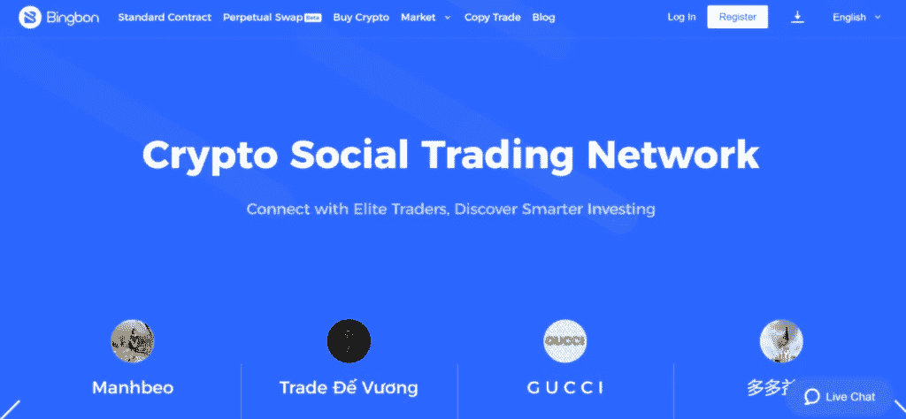**

# **BingX 受管制吗？**

**BingX 是一个在爱沙尼亚共和国注册的加密社交交易平台。此外，该平台拥有 FinCen 和监管机构 AUSTRAC 颁发的 MSB 或 MoneyServices 业务许可证。**

# **BingX 怎么入门？**

**要开始你的 BingX 交易之旅，你首先需要在 BingX 注册一个账户。下面是注册和登录过程的分步指南:**

1.  **创建账户，访问 [BingX 网站](https://bingx.com/invite/GB5TAS)，在右上角选择登录/注册。**
2.  **要注册，请输入您的手机号码或电子邮件地址以及适当的密码。如果您有推荐代码，请输入。**
3.  **按照相同的步骤，输入您的手机号码/电子邮件地址和密码进行登录。**
4.  **点击提交按钮，输入发送到您的电子邮件/手机的验证码。**
5.  **最后，单击“注册”继续进行帐户注册。**

**该平台不包括任何 KYC 过程，因此您可以直接开始将资金存入该平台。**

**[**现在就去 BingX 报名吧！**](https://bingx.com/invite/GB5TAS)**

**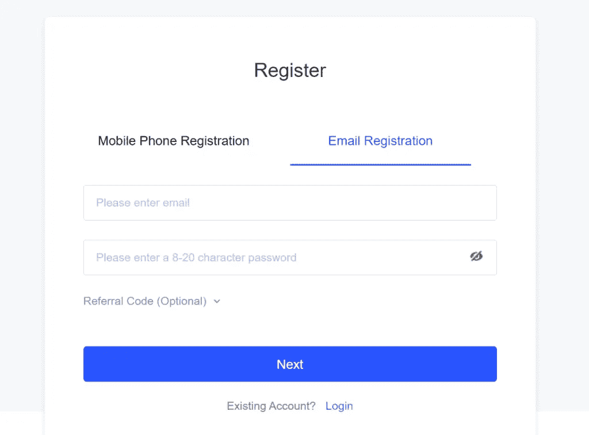**

# **BingX:功能**

**BingX 得到了所有的关注，因为它承诺向交易者提供一篮子重要功能。该平台的特点如下:**

1.  ****即时加密交易** : BingX 交易者只需点击“交换”选项，就可以轻松地将一种加密货币交易到另一种加密货币。**
2.  ****高级交易平台**:交易者希望访问更高级的交易平台，BingX 满足了这一需求。它为交易员提供了一个现代、设计精良、易于使用的界面，可以在手机和桌面上运行。除此之外， [**TradingView**](https://www.tradingview.com/?offer_id=10&aff_id=24152) 提供了包括覆盖图、指示器和多种聊天工具的图表。**
3.  ****演示交易**:每创建一个新账户，就会获得 BingX 发行的虚拟硬币，即 100，000 个 VSD 代币。这些代币无需任何实际存款，就可以在平台上交易。这个演示交易帮助交易者熟悉交易平台，学习如何在练习资金的帮助下做杠杆交易。**
4.  ****复制交易** : BingX 为其交易员提供复制交易选项。有了复制交易，你可以跟随成功交易者的策略并复制它们。为了分享他们的策略，成功的交易者将获得 8%的利润。**
5.  ****传统市场**:除了加密货币，BingX 还提供传统市场敞口。因此，可以推测商品、外汇和指数等市场的价格变动。**

# **BingX:支持的对**

**与其他加密货币交易所相比，BingX 为其用户提供了多样化的交易对。衍生品交易所还提供数字货币和传统市场，你可以在高利润下交易。使用 USDT 或比特币作为抵押品的用户可以查看商品、指数和密码对等交易市场。30 多个加密交易对可用于杠杆交易。**

**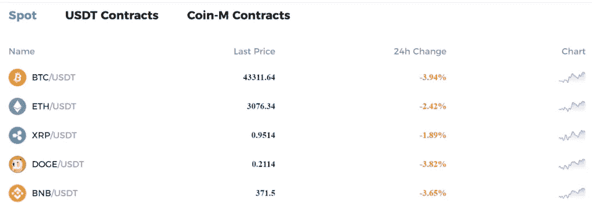**

# **BingX 标准合同**

**BingX 的标准合约允许你在不同的市场上用 UPTO 125x 杠杆进行交易。此外，你可以在加密、NFT、DeFi、外汇、商品和指数市场进行交易。除此之外，该平台还提供利润和止损订单，帮助您正确实施风险管理策略。**

**[参观 BingX](https://bingx.com/invite/GB5TAS)**

**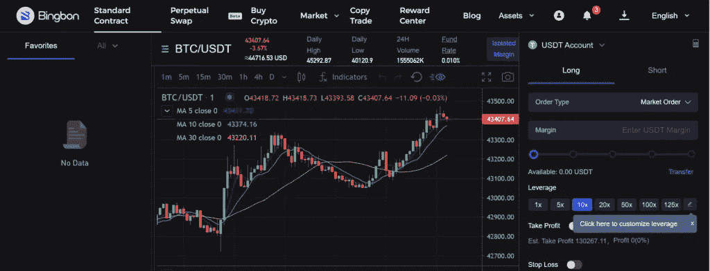**

# **BingX 永久互换**

**截至 2021 年 10 月，BingX 永久互换仍处于测试模式。永久掉期几乎类似于期货市场，只是它没有交割日期。因为期货市场非常不稳定，市场存在巨大的不确定性，因此可能导致巨大的损失。因此，BingX 永久掉期使用“基金利率”系统来确保永久合约在较长时期内与标记价格一致。**

**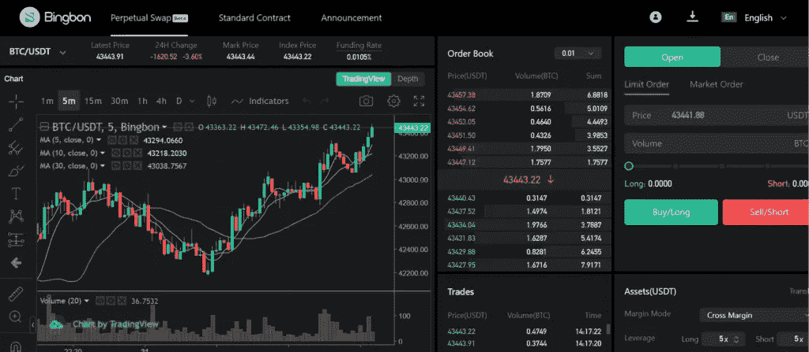**

# **在 BingX 上购买密码**

**此购买加密功能将允许您通过以下方式在平台上购买/出售加密:**

*   **首先，你需要输入要购买/花费的加密或法定金额。**
*   **为了继续付款，请选择您首选的服务提供商。**
*   **最后，等待你的密码到达。**

**[**在 BingX 上购买密码**](https://bingx.com/invite/GB5TAS)**

**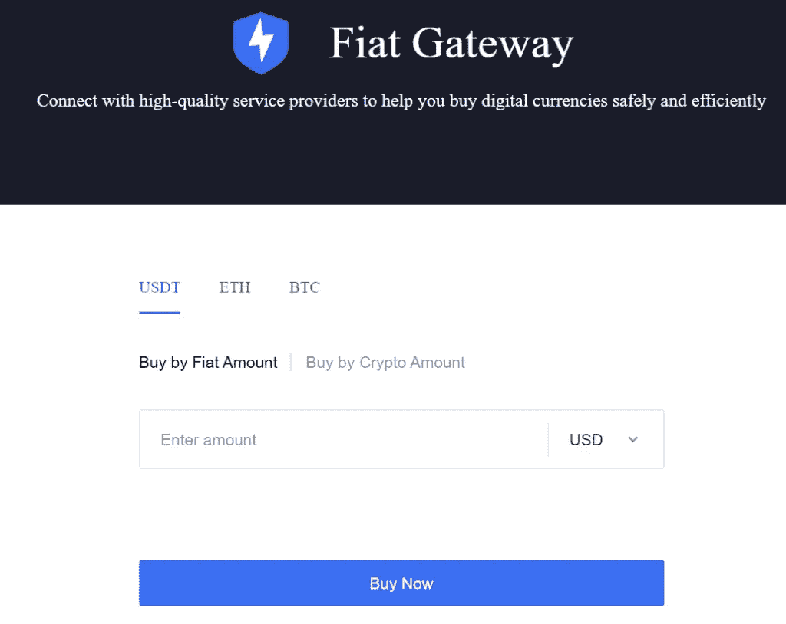**

# **BingX 现货交易**

**现货交易允许你购买/出售加密资产，如 BTC，某事，XRP 等。，立即发货。交易所收取少量交易费，交易直接发生在买方和卖方之间。此外，通过赌注/贷款，交易者甚至可以从他们的赌注中获得被动收入。**

**现货交易需要实际持有现金商品，盈亏清算需要实际买入或卖出现货。一般来说，利润只有在价格上涨时才能产生。**

**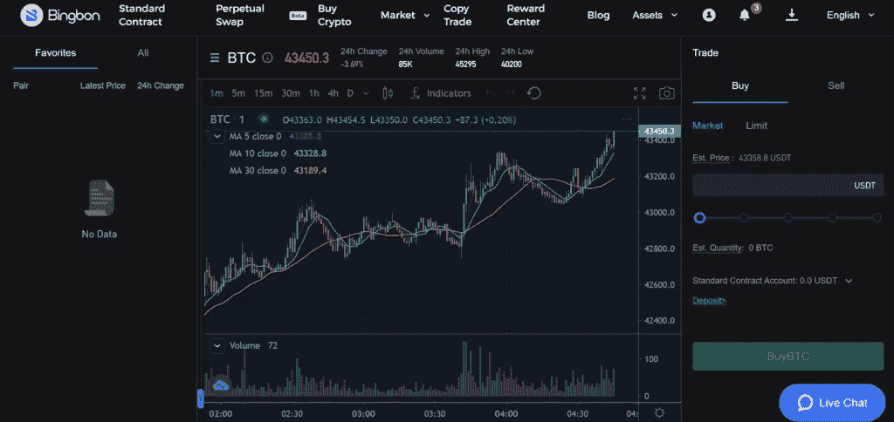**

# **BingX 复印贸易**

**BingX 可以夸耀的另一个功能是它的复制交易功能，允许你观察和复制著名的交易者。有一个交易者列表，根据关注者的数量、交易风格和利润率列出交易者。此外，除了最近的交易，该平台还显示每个交易者的总体统计数据。用户可以设置他们希望提交给特定拷贝交易的每日限额，并设置他们的最大数量。**

**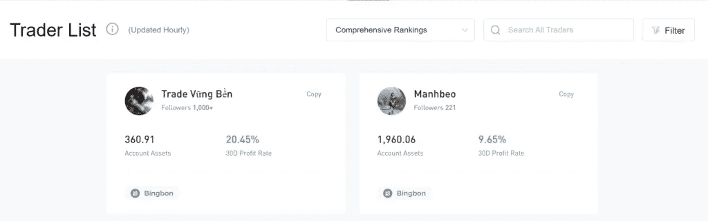**

# **BingX:费用结构**

1.  ****交易费用****

**对于开仓和平仓，BingX 交易所收取相同的交易费用 0.075%。要计算交易费，他们需要用 0.075%乘以交易量。**

1.  ****押金费用****

**向 BingX 存入加密货币不收存款费。**

1.  ****提现费用****

**从交易所转出瑞士联邦理工学院和 BTC 的取款费分别为 0.007 瑞士联邦理工学院和 0.0005 BTC。在 BingX 上，稳定的硬币提取费用高达每笔 28 美元。**

**[**拜访 BingX**](https://blog.coincodecap.com/go/bingbon)**

**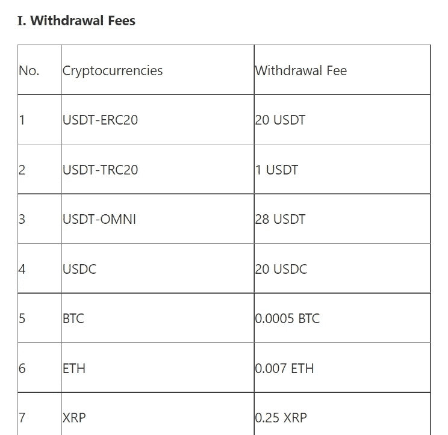**

# **BingX 安全吗？**

**是的，BingX 完全可以安全使用。此外，自 BingX 成立以来，还没有出现过任何安全漏洞。此外，双因素认证可用于保护用户的交易账户，这将进一步有助于增加黑客访问账户和实施恶意工作的难度。还建议您从 BingX 帐户的帐户和安全/安全中心完成 Google 身份验证的设置，以提高您帐户的安全级别。**

# **基于任务的新用户奖励和奖金**

**BingX 向用户提供基于任务的新用户奖励，只要他们注册了账户。这些基于任务的奖励提供给用户，以鼓励他们并确保他们更好地使用他们的服务。这些奖励是基于 KYC 过程、交易或某些存款等。完成这些任务后，他们将获得的奖金可用于合约交易，有时也可用于亏损扣除。**

**关于奖金，有几点需要注意:**

*   **对于奖金，有一个截止日期。**
*   **交易员在下有奖金的订单时，应注意“最大杠杆”限制。此外，如果杠杆率过高，奖金就无法使用。**
*   **用户不应创建多个账户来获取奖金。如果被发现，该帐户将被永久关闭。**

**[**在 BingX**](https://bingx.com/invite/GB5TAS) 赢得奖励**

**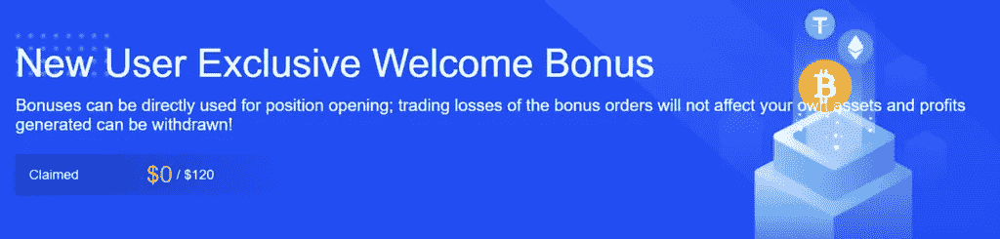**

# **BingX:推荐计划**

**BingX 为推荐交易者设置奖励规则，是为了让优秀的交易者更广泛的可用。此外，它还允许 BingX 用户将优秀的交易员分享/推荐给其他 BingX 用户。如果他们推荐的人成功创建了一个账户，用户就可能获得特定的利润分成。**

**如果推荐成功，用户可以获得 25%的利润分成。这个分成是其他用户成功跟随交易者，复制交易者的盈利单所产生的奖励。**

**[**在 BingX**](https://bingx.com/invite/GB5TAS) 参考赚取**

**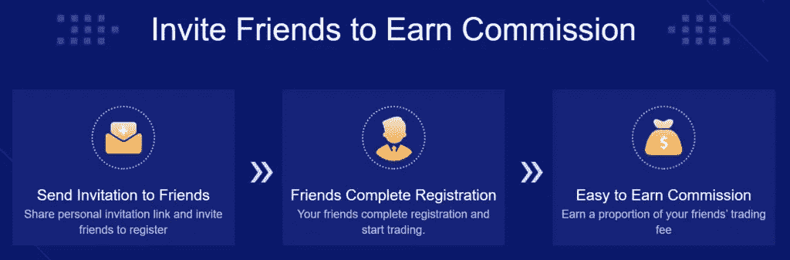**

# **BingX 评论:客户支持**

**BingX 拥有出色的客户服务，他们的 24*7 客户服务代表随时准备为您提供帮助。他们乐意回答问题并解决你可能遇到的任何问题。如果任何交易者面临任何问题，他们可以随时联系他们在 support@bingX.com 的客户支持。此外，为了获得及时的帮助，您可以通过他们的实时聊天选项直接联系他们的客户支持。**

****

# **BingX 评论:利弊**

**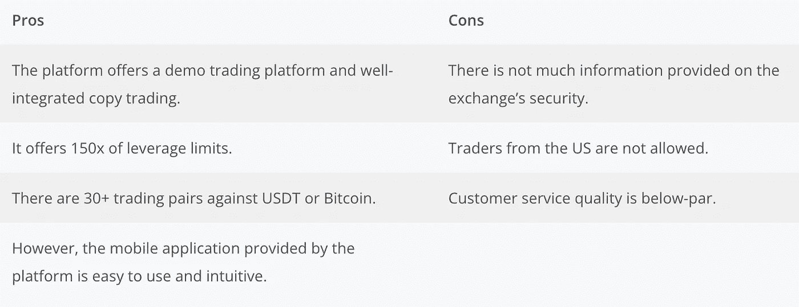**

# **BingX:结论**

**对于正在寻找领先的加密杠杆平台的用户来说，BingX 是一个理想的和有前途的交换平台。它是顶级加密货币交易所之一，面向新手和有经验的交易者。此外，该平台允许你只需点击一下就可以复制专业交易者，并完全自动化你的加密交易。您可以使用下面的按钮在 BingX 上注册，并获得 UPTO 100 美元作为欢迎奖金。**

**[**现在就申领你的 100 元！**](https://bingx.com/invite/GB5TAS)**

# **常见问题**

## **什么是 VST 模拟令牌？**

**VST 或虚拟 USDT 是 BingX 发行的模拟令牌。此令牌可用作复制交易或标准合约演示交易的保证金。但是，VST 演示交易产生的利润不能收回，没有实际价值。**

## **如何转换到其他密码？**

**您可以在兑换页面将您的资产兑换成其他货币。
**选项一:**点击 BingX 手机 app 上资产页面的兑换按钮。
**选项二:**点击 BingX 网站首页的兑换按钮。
然后，在左边选择你持有的货币，在右边选择你要兑换的货币。
填写您想要兑换的金额，然后点击兑换。**

## **BingX 在澳洲有吗？**

**BingX 已经从澳大利亚的监管机构 AUSTRAC 获得了许可证。因此，居住在澳大利亚的加密交易员可以开立账户，使用杠杆头寸进行买卖，存放加密数据，并从 BingX 提取资金。**

> **加入 Coinmonks [电报频道](https://t.me/coincodecap)和 [Youtube 频道](https://www.youtube.com/c/coinmonks/videos)了解加密交易和投资**

## **另外，阅读**

*   **[Bookmap 点评](https://coincodecap.com/bookmap-review-2021-best-trading-software) | [美国 5 大最佳加密交易所](https://coincodecap.com/crypto-exchange-usa)**
*   **最佳加密[硬件钱包](/coinmonks/hardware-wallets-dfa1211730c6) | [Bitbns 评论](/coinmonks/bitbns-review-38256a07e161)**
*   **[新加坡十大最佳加密交易所](https://coincodecap.com/crypto-exchange-in-singapore) | [购买 AXS](https://coincodecap.com/buy-axs-token)**
*   **[红狗赌场评论](https://coincodecap.com/red-dog-casino-review) | [Swyftx 评论](https://coincodecap.com/swyftx-review) | [CoinGate 评论](https://coincodecap.com/coingate-review)**
*   **[投资印度的最佳密码](https://coincodecap.com/best-crypto-to-invest-in-india-in-2021)|[WazirX P2P](https://coincodecap.com/wazirx-p2p)|[Hi Dollar Review](https://coincodecap.com/hi-dollar-review)**
*   **[加拿大最佳加密交易机器人](https://coincodecap.com/5-best-crypto-trading-bots-in-canada) | [库币评论](https://coincodecap.com/kucoin-review)**
*   **[用于 Huobi 的加密交易信号](https://coincodecap.com/huobi-crypto-trading-signals) | [HitBTC 审查](/coinmonks/hitbtc-review-c5143c5d53c2)**
*   **[如何在 FTX 交易所交易期货](https://coincodecap.com/ftx-futures-trading) | [OKEx vs 币安](https://coincodecap.com/okex-vs-binance)**

**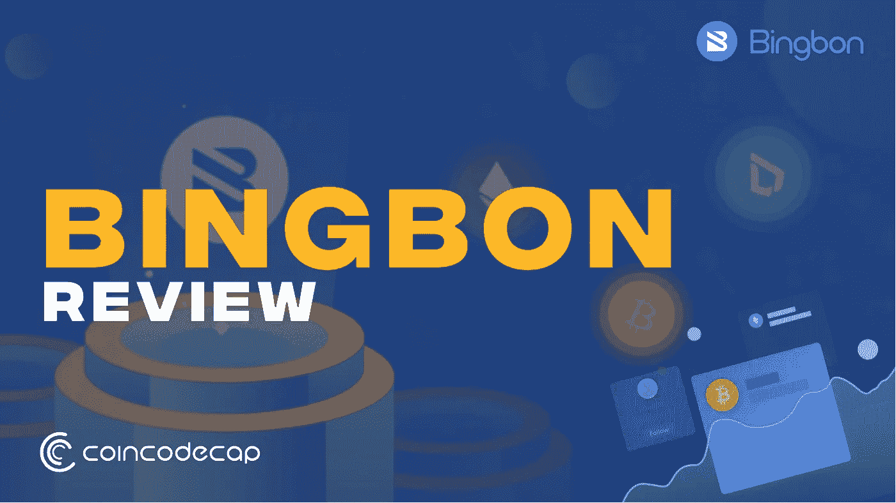**