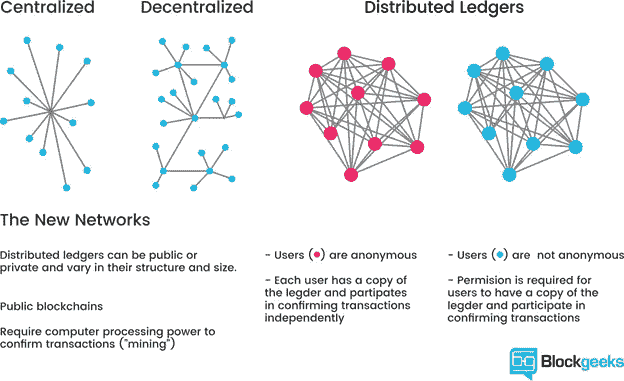

# BIoT:基于区块链的物联网

> 原文：<https://medium.com/coinmonks/biot-blockchain-based-iot-bd913162b6d1?source=collection_archive---------7----------------------->

物联网(IoT)和区块链是两个引起大量炒作和兴奋的话题，不仅在技术圈，在更广泛的商业世界也是如此。然而，将它们放在一起可以产生比其各部分之和更大的东西，这种想法正开始受到关注。将它们放在一起，理论上，你就有了一种可验证、安全和永久的方法来记录物联网中“智能”机器处理的数据。基于区块链的 IOT 解决方案非常适合简化业务流程、改善客户体验和实现显著的成本效益。正所谓物联网需要区块链，区块链需要物联网。

物联网利用区块链技术的四种方式:

1.信任建设

2.成本降低

3.加速数据交换

4.规模安全

集中式架构给物联网安全部署带来了挑战。处理现有的和预计的海量数据令人望而生畏。管理连接到看似无限的设备列表的不可避免的复杂性是复杂的。当今企业中常见的集中式安全模式将难以扩展以满足物联网(IoT)的需求。

采用标准化的点对点通信模式来处理设备之间的数千亿次交易，将显著降低安装和维护大型集中式数据中心的相关成本，并将在构成物联网网络的数十亿台设备之间分配计算和存储需求。这将防止网络中任何单个节点的故障导致整个网络停止崩溃。

# **物联网**

任何实物都是“东西”当它有一个开/关开关将它连接到互联网并相互连接时，它就成为了一个物联网(IoT)。通过连接到计算机网络，诸如汽车之类的物体就不仅仅是一个物体了。现在是人-人，人-物，物-物。物联网对你有什么影响？当墨盒电量不足时，您的打印机可以自动从亚马逊订购墨盒。市政垃圾桶在满了需要清空时会发出信号。

根据定义，物联网是物理设备、车辆(也称为“连接设备”和“智能设备”)、建筑物和其他物品的互联网络，嵌入了电子设备、软件、传感器、执行器和网络连接，使这些对象能够收集和交换数据。

内置传感器的设备和对象连接到物联网平台，该平台集成来自不同设备的数据，并应用分析与为满足特定需求而构建的应用程序共享最有价值的信息。这些强大的物联网平台可以准确定位哪些信息是有用的，哪些信息可以安全地忽略。这些信息可用于检测模式、提出建议以及在问题发生之前检测出可能的问题。

**当今物联网架构:集中式**

它依赖于集中的、代理的通信模型(也称为客户机-服务器模式)。所有设备都通过具有巨大处理和存储能力的云服务器进行识别、认证和连接。设备之间的连接只通过互联网进行，即使它们相距几英尺。此外，机器对机器(M2M)通信很困难，因为没有连接所有设备的单一平台，无法保证不同制造商提供的云服务可以互操作和兼容。

集中式架构给物联网安全部署带来了挑战。处理现有的和预计的海量数据令人望而生畏。管理连接到看似无限的设备列表的不可避免的复杂性是复杂的。由于面临诸多挑战，将海量数据转化为有价值的行动似乎是不可能的。现有的安全技术将在减轻物联网风险方面发挥作用，但这还不够。目标是在正确的时间以正确的格式将数据安全地送到正确的位置；说起来容易做起来难，原因有很多。

当今企业中常见的集中式安全模式将难以扩展以满足物联网(IoT)的需求。

**区块链**

“区块链是一个不朽的经济交易数字账本，可以通过编程不仅记录金融交易，还记录几乎所有有价值的东西。”

*   Don & Alex Tapscott，《区块链革命》作者(2016)

区块链网络生活在一种共识状态中，每十分钟自动自我检查一次。这是一种数字价值的自我审计生态系统，该网络以十分钟为间隔协调每一笔交易。每组事务被称为一个“块”。

**区块链实施**

区块链是同时存在于多台计算机上的分布式数据库。随着新的记录集或“块”的加入，它在不断增长。每个块都包含一个时间戳和一个到前一个块的链接，所以它们实际上形成了一个链。数据库不由任何特定机构管理；相反，网络中的每个人都会得到整个数据库的副本。旧数据块将被永久保存，新数据块将被不可逆转地添加到分类账中，因此不可能通过伪造文件、交易和其他信息来进行操纵。所有块都以特殊方式加密，因此每个人都可以访问所有信息，但只有拥有特殊密钥的用户才能向特定链添加新记录。只要你是唯一知道密钥的人，就没有人能操纵你的交易。此外，密码术用于保证网络中每台计算机(或节点)上的区块链副本的同步。

区块链让你证明你已经超过 18 岁，而不需要透露你的出生日期，或者证明你在银行有足够的钱进行金融交易，而不需要透露你的余额或其他细节。这限制了隐私泄露或身份盗窃的风险。

由此产生了两个重要的特性:

1.**透明性**数据作为一个整体嵌入网络，根据定义，它是公开的。

2.**它不能被破坏**改变区块链上的任何信息单元都意味着使用巨大的计算能力来覆盖整个网络。

**两种区块链**

1.在一个**公共** **区块链**中，每个人都可以读取或写入数据。一些公共区块链只允许阅读或写作。例如，比特币使用一种任何人都可以写的方法。

2.在一个**私人** **区块链**中，所有的参与者都是被认识和信任的。当区块链在属于同一法人母公司的公司之间使用时，这很有用。

**分散物联网网络**

采用标准化的点对点通信模式来处理设备之间的数千亿次交易，将显著降低安装和维护大型集中式数据中心的相关成本，并将在构成物联网网络的数十亿台设备之间分配计算和存储需求。这将防止网络中任何单个节点的故障导致整个网络停止崩溃。

**区块链和物联网**

区块链技术可以用于跟踪数十亿台联网设备，实现设备之间的交易处理和协调；为物联网行业制造商节省大量成本。这种去中心化的方法将消除单点故障，为设备运行创造一个更具弹性的生态系统。区块链使用的加密算法将使消费者数据更加隐私。

该分类帐是防篡改的，不能被恶意行为者操纵，因为它不存在于任何单个位置，并且中间人攻击不能上演，因为没有单个通信线程可以被拦截。区块链使无信任的点对点消息传递成为可能，并已通过比特币等加密货币证明了其在金融服务领域的价值，提供有保障的点对点支付服务，而无需第三方经纪人。

区块链的分散、自主和无信任能力使其成为物联网解决方案基本要素的理想组件。企业物联网技术迅速成为区块链技术的早期采用者之一，这并不奇怪。

在物联网网络中，区块链可以保持智能设备历史的不变记录。此功能支持智能设备的自主运行，无需集中授权。因此，区块链打开了一系列物联网场景的大门，如果没有它，这些场景将非常困难，甚至不可能实现。

通过利用区块链，物联网解决方案可以在物联网网络中的设备之间实现安全、无信任的消息传递。在这个模型中，区块链将把设备之间的消息交换视为类似于比特币网络中的金融交易。为了实现消息交换，设备将利用智能合同，然后对双方之间的协议进行建模。

区块链最令人兴奋的功能之一是能够维护网络中发生的所有交易的适当分散、可信的分类账。这种能力对于实现工业物联网应用的许多合规性和监管要求至关重要，而无需依赖集中式模型。

**结合区块链和物联网**

建造能够通过区块链通信和操作的智能机器的想法有几个明显的优势。

首先是监督问题。由于数据交易发生在由多个组织拥有和管理的多个网络之间，永久、不可变的记录意味着当数据或实物在供应链中的各个点之间传递时，可以跟踪监管情况。区块链记录就其本质而言是透明的——任何被授权连接到网络的人都可以跟踪和分析活动。

如果出了问题，出现了损坏，数据泄露到了不该泄露的地方，那么区块链记录可以很容易地识别薄弱环节，并采取补救措施。

其次，加密和分布式存储的使用意味着数据可以被供应链中的所有参与方信任。机器将安全地记录它们之间发生的交易细节，没有人的监督。

如果没有私钥对区块链(在这种情况下由机器持有)进行写访问，任何人都无法用不准确的信息重写记录。

第三，一些区块链网络(如以太坊)提供的“智能合同”设施允许达成协议，当条件得到满足时将执行这些协议。例如，当条件表明已经提供了服务交付时，授权一个系统进行支付，这可能是非常有用的。

第四，区块链提供了极大提高物联网环境整体安全性的潜力。物联网生成的许多数据都是高度个人化的，例如，智能家居设备可以访问我们生活和日常事务的隐私细节。这些数据需要与其他机器和服务共享，以便对我们有用。但这也意味着黑客有更多的机会攻击我们。投资于物联网的企业和政府还必须应对犯罪分子、竞争对手或外国敌人造成的数据泄露范围的扩大。

除了将提供新的机遇，区块链和物联网融合甚至有可能在某个时候成为一种必然。如果当前的物联网模式(通过集中式云存储和处理服务连接的设备)继续下去，那么随着数据量和连接设备的数量不断增加，系统可能会变得越来越臃肿。

随着通过云服务传输的数据量增加，这些云服务很可能会成为瓶颈。由于它们的分布式性质，区块链可以弥补这一点。区块链数据存储网络不是一个昂贵的集中式数据中心，而是在组成网络的数百台(或者可能是数千台或数百万台)计算机和设备上复制。这种巨大的冗余意味着数据在需要时总是近在咫尺，减少了传输时间，也意味着一台服务器的故障不会对业务活动产生任何影响。

**区块链物联网的优势**

物联网利用区块链技术的四种方式:

1.信任建设

2.成本降低

3.加速数据交换

4.规模安全

以下是区块链分布式体系结构帮助解决许多安全和信任挑战的一些方法:

1.区块链可用于跟踪传感器数据测量，并防止复制任何其他恶意数据。

2.物联网设备的部署可能很复杂，分布式账本非常适合提供物联网设备识别、认证和无缝安全数据传输。

3.物联网传感器可以通过区块链交换数据，而不是通过第三方建立信任。

4.分布式账本消除了生态系统中的单一故障源，保护 IOT 设备数据不被篡改。

5.区块链支持设备自治(智能合同)、个人身份、数据完整性，并通过消除技术瓶颈和低效率支持点对点通信。

6.由于没有中介，物联网的部署和运营成本可以通过区块链降低。

7.物联网设备可通过区块链直接寻址，为故障排除提供连接设备的历史记录。

**结论**

区块链和物联网融合在某个时候会成为一种必然。如果当前的物联网模式(通过集中式云存储和处理服务连接的设备)继续下去，那么随着数据量和连接设备的数量不断增加，系统可能会变得越来越臃肿。

随着通过云服务传输的数据量增加，这些云服务很可能会成为瓶颈。由于它们的分布式性质，区块链可以弥补这一点。

采用标准化的点对点通信模式来处理设备之间的数千亿次交易，将显著降低安装和维护大型集中式数据中心的相关成本，并将在构成物联网网络的数十亿台设备之间分配计算和存储需求。这将防止网络中任何单个节点的故障导致整个网络停止崩溃。

因此，这两种趋势技术的融合是不可避免的。这两种技术相互补充，相互支持。甚至有人说，物联网需要区块链，区块链需要物联网。