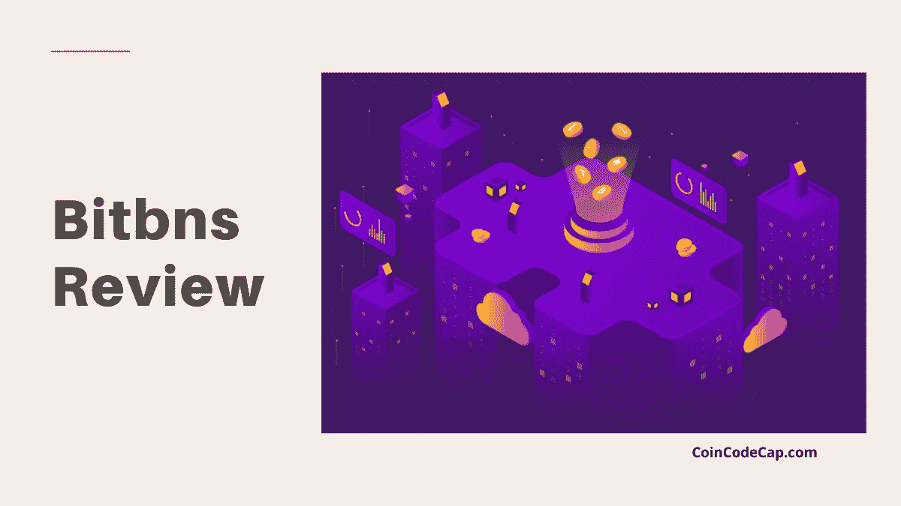
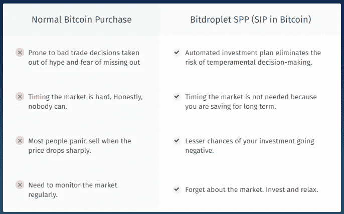

# Bitbns 评论 2021:安全合法吗？

> 原文：<https://medium.com/coinmonks/bitbns-review-38256a07e161?source=collection_archive---------1----------------------->

## 交易费、保证金贷款和比特币 SIP

# 什么是 Bitbns？

[**Bitbns**](https://blog.coincodecap.com/go/bitbns) 于 2017 年 12 月 14 日由 Bitbns 的母公司 Buyhatke Internet Pvt. Ltd .发起。Bitbns 是印度唯一一家支持 90 多种加密货币交易的 [**加密交易所**](https://blog.coincodecap.com/bitcoin-exchange-in-india) 。在本次 Bitbns 回顾中，我们将研究该交易所提供的所有功能和服务。

# 摘要

*   在 Bitbns 上，制造者和接受者都支付相同的费用(0.25%)。
*   目前，Bitbns 上列出了 98+种加密货币。
*   Bitbns 的 testnet 模拟了一个交易环境，提供与主平台相同的特性和功能。
*   [**Bitbns**](https://blog.coincodecap.com/go/bitbns) 允许你最多借三倍于你当前净值的钱(在 Bitbns 上)。因此，你可以用 4 倍杠杆交易来增加你的利润。
*   Bitbns 为保证金交易提供 28 种数字资产。
*   保证金贷款让你通过在固定的时间内以固定的利率贷款比特币和其他加密货币基金来赚钱。
*   在 Bitbns 上，止损单和止损跟踪区间可用于额外的下跌保护。
*   您可以使用 3 合 1 支架订单将风险降至最低。支架订单是进场订单、出场订单和跟踪止损订单的组合。
*   只有贷方需要支付保证金交易费用。借款人不需要付费。
*   [Bitbns](https://blog.coincodecap.com/go/bitbns) 允许您将特定金额的 BTC 或 USDT 投资于某个 FIP 计划，以获得固定的回报率和固定的期限。当这一时期结束时，您将收到 Bitbns 钱包中的本金和利息。
*   Bitdroplet 允许投资者通过**系统购买计划(SPP)** 投资比特币和其他加密货币，就像**系统投资计划(SIP)** 一样。
*   用 [**Bitbns**](https://blog.coincodecap.com/go/bitbns) 交易手机 app 优化您的交易体验。
*   获取由 Bitbns 支持的套利者应用程序，享受最无缝的套利体验。
*   你也可以通过 Telegram、Twitter、Instagram 和脸书联系 Bitbns，或者提交一张票。
*   Bitbns 拥有最先进的技术架构和 A 级安全特性。

# 如何在 Bitbns 上入门？

以下是开始使用 [Bitbns](https://blog.coincodecap.com/go/bitbns) 的步骤。

## **在 Bitbns 上开户**

访问 Bitbns 的官方网站，点击注册。输入您的电子邮件地址和密码来创建帐户。完成此步骤后，您将收到一个指向您电子邮件地址的验证链接。当你点击这个验证链接时，你的 [**Bitbns 账户**](https://blog.coincodecap.com/go/bitbns) 被创建。稍后，您可以首次登录 Bitbns。

## **Bitbns 上的 KYC**

在您提交您的 AADHAR 卡详细信息和 PAN 详细信息后，您帐户的 KYC 验证就完成了。要在 Bitbns 上交易加密货币，你必须注册并提交所有必需的 KYC 文件进行验证。

## **Bitbns 中的存款**

该交易所提供电汇作为可用的存款方式。然而，你不能通过信用卡存款。值得注意的是， [**Bitbns**](https://blog.coincodecap.com/go/bitbns) 确实接受法定货币的存款。

## **开始交易**

一旦你在 Bitbns 上存了钱，现在你就可以购买密码，开始你的交易之旅。

# 将印度卢比存入 Bitbns

1.  完成验证后，您可以从交易仪表板向您的 INR 钱包添加资金。
2.  下一步是点击“钱包”按钮。您将被带到帐户页面。点击账户页面上的“将钱存入钱包”。
3.  在下一页， [**Bitbns**](https://blog.coincodecap.com/go/bitbns) 会给出说明。
4.  Bitbns 的具体银行的受益人详情会提到。您可以通过 P2P 或 UPI/ NEFT/ IMPS/ RTGS 向该银行转账印度卢比。
5.  整个过程需要你的银行指定的时间。

# 在 Bitbns 上交易

## Bitbns 保证金交易

简单来说，保证金是一种贷款形式。你可以利用借来的资金来对抗你目前拥有的资产，以增强你的购买力。因此，你可以在不拥有资产的情况下，通过保证金交易扩大你的利润。

**4 倍保证金杠杆**

[**Bitbns**](https://blog.coincodecap.com/go/bitbns) 允许你**借到最多三倍**你目前的净资产(在 Bitbns 上)。因此，你可以用 4 倍杠杆交易来增加你的利润。例如，如果你拥有 1 BTC 的净资产，你可以额外借 3 BTC。这样，你总共可以交易 4 个 BTC。这是 4 倍杠杆。因此，你可以借你目前净资产的 300%。Bitbns 为保证金交易提供 28 种数字资产。

# 保证金贷款

你可以用保证金贷款来借出你的资金。请在保证金交易部分查看这一功能。毫无疑问，这是赚取利润的最简单的方法之一。这个利润是通过[在固定期限内以固定利率出借比特币和其他加密货币](https://blog.coincodecap.com/top-5-crypto-lending-platforms)资金获得的。

# Bitbns 评论:互换

Bitbns 最近(2021 年 9 月 17 日)才推出互换。据此，现在可以从 300 种可用的加密货币中进行互换。此外，掉期利率是不同交易所的最佳利率。但是，将对交易征收 0.25%的固定价格。此外，用户可以交换的最小数量很大程度上取决于主加密。

要交换，你需要做的就是选择你想要替换的加密，然后选择你想要替换的人。然后，输入金额，并点击交换，以完成您的交易。

# Bitbns 上的订单类型

## 限价止损单

在 [**位和**](https://blog.coincodecap.com/go/bitbns) 位有限价止蚀单。限价止蚀订单是一种有条件的订单。只有满足特定条件时，才会执行该订单。当您的止损价或触发价达到时，您的限价订单将立即被列入订单簿。所以，只有当你确定价格动力时，你才能退出或进入市场。

## 追踪止损限价单

在 Bitbns 上，止损单和止损跟踪区间可用于额外的下跌保护。要详细了解这一点，请查看下面的视频。

[https://www.youtube.com/watch?v=3WYlCE2Vp5w](https://www.youtube.com/watch?v=3WYlCE2Vp5w)

## 括号顺序

您可以使用 3 合 1 支架订单将风险降至最低。支架订单是进场订单、出场订单和跟踪止损订单的组合。

# 撤回 Bitbns 上的 INR

1.  [Bitbns](https://blog.coincodecap.com/go/bitbns) 提供比其他交易所更快更容易的取款。
2.  你必须点击仪表板上的“钱包”按钮。在此之后，您将被带到帐户页面。
3.  你会在“往钱包里存钱”下面看到一个“取款”按钮点击“撤回”按钮。然后，你必须输入你想提取的金额。
4.  你会在注册时提到的银行账户中收到你的钱。

# Bitbns 费用

## Bitbns 交易费

在 [**Bitbns**](https://blog.coincodecap.com/go/bitbns) 上，制造者和接受者都支付相同的费用(0.25%)。

## 保证金交易费用

只有贷款人需要支付费用。借款人不需要付费。

## 存款和取款费用

存放加密货币不收取任何费用。您可以在下表中查看取款费用:

# Bitbns 支持的加密货币

目前，Bitbns 上列出了 98+种加密货币。在这里，人们可以交易一些顶级的加密货币，如[比特币](https://blog.coincodecap.com/a-candid-explanation-of-bitcoin) (BTC)、以太坊(ETH)、Ripple (XRP)、莱特币(LTC)、[币安](https://blog.coincodecap.com/go/binance)硬币(BNB)、Neo (NEO)等等。

# Bitbns 评论:安全性

[**Bitbns**](https://blog.coincodecap.com/go/bitbns) 拥有最先进的技术架构和 A 级安全特性。该功能可确保您的数据、INR 数量、加密货币和钱包的安全。

此外，Bitbns 还支持 2FA 认证(Google Authenticator)。

# Bitbns 固定收益计划(FIP)

固定收益计划仅在 [**Bitbns**](https://blog.coincodecap.com/go/bitbns) 网站上提供。在这里，您可以将特定金额的 BTC 或 USDT 投资于某个 FIP 计划，以获得固定的回报率和固定的期限。每个计划都有分配限额。累积的资金会在到期日锁定，以计算利息。当这一时期结束时，您将收到 Bitbns 钱包中的本金和利息。

# Bitdroplet 和 SPP(比特币 SIP)

[**Bitbns**](https://blog.coincodecap.com/go/bitbns) 开发了一个安全便捷的平台，名为 Bitdroplet。该平台允许投资者通过系统购买计划(SPP)投资比特币和其他加密货币。物种系统购买计划(SPP)就像股票投资中的传统系统投资计划(SIP)。然而，SSP 是专门为投资加密货币而设计的。它可以被认为是一个 SIP，但对于加密货币。

此外，你甚至不需要一个 [Bitbns](https://blog.coincodecap.com/go/bitbns) 账户来注册 Bitdroplet。可以直接在 Bitdroplet 上创建账号。

# Bitbns 应用程序

用 [**Bitbns**](https://blog.coincodecap.com/go/bitbns) 交易手机 app 优化您的交易体验。你可以在这里找到大量的功能和交易工具。点击下面的链接下载应用程序:

*   [**Bitbns 安卓 app**](https://play.google.com/store/apps/details?id=com.bitbns&referrer=utm_source=coincodecap&utm_medium=website)
*   [**Bitbns iOS app**](https://apps.apple.com/in/app/bitbns-crypto-trading-exchange/id1346160076)

> 完成 KYC 后，使用 **64358** 转介代码获得交易费和₹100 价值 BTC 的折扣。

# Bitbns Arbitrager 应用

获取由 [Bitbns](https://blog.coincodecap.com/go/bitbns) 支持的套利者应用程序，享受最无缝的套利体验。开始使用 Bitbns 扩展或移动应用程序查看 Bitbns 与[币安](https://blog.coincodecap.com/go/binance)、[火币](https://blog.coincodecap.com/go/huobi)、Gate.io 和 Kucoin 之间的套利机会。你还可以在 [Bitbns](https://blog.coincodecap.com/go/bitbns) 上更快地交易，而无需从[币安](https://blog.coincodecap.com/go/binance)、[火币](https://blog.coincodecap.com/go/huobi)、Gate.io 和 Kucoin 切换标签。

*   [**任意铬延伸**](https://chrome.google.com/webstore/detail/bitbns-extension/chohglfmmlfhnkloampcdmnnhnhegbfg?hl=en)
*   [**套利者手机 app**](https://play.google.com/store/apps/details?id=com.bitbns.arbitrage)
*   [**火狐扩展**](https://addons.mozilla.org/en-US/firefox/addon/bitbns-extension/)
*   [**任意者微软边缘扩展**](https://microsoftedge.microsoft.com/addons/detail/bitbns-extension/henknmclfminihnoikcbpggjoofiiafc)

# Bitbns 测试网

[**Bitbns**](https://blog.coincodecap.com/go/bitbns) 为初学者提供了一个 testnet 平台。通过 testnet，新用户和加密货币爱好者可以学习交易加密货币，而不会将自己的资金置于风险之中。Bitbns 的 testnet 模拟了一个交易环境，提供与主平台相同的特性和功能。新用户可以使用 testnet 硬币，这与实际的加密货币不同。这些测试网硬币没有任何价值。因此，加密货币爱好者可以自由试验。

# Bitbns 推荐计划

当你把 [Bitbns](https://blog.coincodecap.com/go/bitbns) 介绍给你的一个朋友时，你会获得他/她的交易费的 50%。你推荐的每个人的交易费都会直接发到你的比特币钱包里。

当您的朋友成功完成注册和 KYC 后，他/她还将获得₹100 价值 BTC。

> 完成 KYC 后，使用 **64358** 转介代码获得交易费和₹100 价值 BTC 的折扣。

# Bitbns 客户支持

在这里 提交一张票 [**提出你的问题。你也可以在**](https://bitbns.freshdesk.com/support/home)**[电报](https://t.me/Bitbns)、[推特](https://twitter.com/bitbns/)、 [Instagram](https://www.instagram.com/bitbns/) 、[脸书](https://www.facebook.com/bitbns/)上接触到**。****

# **Bitbns 审查:结论**

**[**Bitbns**](https://blog.coincodecap.com/go/bitbns) 在交易大量加密货币和创新功能方面为用户提供了大量机会。像系统购买计划和固定收入计划这样的功能可能会使 Bitbns 比其他交易平台具有竞争优势。Bitbns exchange 是为初学者和专业用户打造的，[现在就试试 bit bns](https://blog.coincodecap.com/go/bitbns)。**

# **常见问题**

****印度卢比能否从注册时未提及的银行存入 Bitbns？****

**不， [Bitbns](https://blog.coincodecap.com/go/bitbns) 不允许从未提及的银行存款。您必须通过您在注册过程中指定的银行存款。如果你从任何其他银行存钱，七天后就会退还给你。**

****比特币银行的加密货币存取限额是多少？****

**Bitbns 对加密货币存款和取款没有任何限制。**

****从比特币银行撤回加密货币需要多长时间？****

**撤回时间确实取决于拥塞，网络和区块链块确认。每种加密货币都不一样。例如，比特币需要 4 个区块的确认。**

****bit bns 合法安全吗？****

**是的， [Bitbns](https://blog.coincodecap.com/go/bitbns) 是一个注册的交易所，拥有数百万用户。**

***包含附属链接***

> **加入 coin monks[Telegram group](https://t.me/joinchat/EPmjKpNYwRMsBI4p)并了解加密交易和投资**

## **另外，阅读**

*   **什么是[闪贷](https://blog.coincodecap.com/what-are-flash-loans-on-ethereum)？**
*   **最好的[密码交易机器人](/coinmonks/crypto-trading-bot-c2ffce8acb2a) | [网格交易](https://blog.coincodecap.com/grid-trading)**
*   **[3 商业评论](/coinmonks/3commas-review-an-excellent-crypto-trading-bot-2020-1313a58bec92) | [Pionex 评论](/coinmonks/pionex-review-exchange-with-crypto-trading-bot-1e459d0191ea) | [Coinrule 评论](https://blog.coincodecap.com/coinrule-review-a-perfect-trading-bot)**
*   **[AAX 交易所评论](/coinmonks/aax-exchange-review-2021-67c5ea09330c) | [德里比特评论](/coinmonks/deribit-review-options-fees-apis-and-testnet-2ca16c4bbdb2) | [FTX 交易所评论](/coinmonks/ftx-crypto-exchange-review-53664ac1198f)**
*   **[n 零审核](/coinmonks/ngrave-zero-review-c465cf8307fc) | [Phemex 审核](/coinmonks/phemex-review-4cfba0b49e28) | [PrimeXBT 审核](/coinmonks/primexbt-review-88e0815be858)**
*   **[Bybit 交易所评论](/coinmonks/bybit-exchange-review-dbd570019b71) | [Bityard 评论](https://blog.coincodecap.com/bityard-reivew) | [CoinSpot 评论](https://blog.coincodecap.com/coinspot-review)**
*   **[3 commas vs crypto hopper](/coinmonks/3commas-vs-pionex-vs-cryptohopper-best-crypto-bot-6a98d2baa203)|[赚取加密利息](/coinmonks/earn-crypto-interest-b10b810fdda3)**
*   **最好的比特币[硬件钱包](/coinmonks/the-best-cryptocurrency-hardware-wallets-of-2020-e28b1c124069?source=friends_link&sk=324dd9ff8556ab578d71e7ad7658ad7c) | [BitBox02 回顾](/coinmonks/bitbox02-review-your-swiss-bitcoin-hardware-wallet-c36c88fff29)**
*   **[总帐 vs n 平均](https://blog.coincodecap.com/ngrave-vs-ledger) | [总帐 nano s vs x](https://blog.coincodecap.com/ledger-nano-s-vs-x)**
*   **[加密副本交易平台](/coinmonks/top-10-crypto-copy-trading-platforms-for-beginners-d0c37c7d698c) | [比特码副本交易](https://blog.coincodecap.com/bityard-copy-trading)**
*   **[Vauld Review](https://blog.coincodecap.com/vauld-review)|[you hodler Review](/coinmonks/youhodler-4-easy-ways-to-make-money-98969b9689f2)|[BlockFi Review](/coinmonks/blockfi-review-53096053c097)**
*   **最好的[加密税务软件](/coinmonks/best-crypto-tax-tool-for-my-money-72d4b430816b) | [硬币追踪评论](/coinmonks/cointracking-review-a-reliable-cryptocurrency-tax-software-5114e3eb5737)**
*   **最佳[加密借贷平台](/coinmonks/top-5-crypto-lending-platforms-in-2020-that-you-need-to-know-a1b675cec3fa) | [杠杆令牌](/coinmonks/leveraged-token-3f5257808b22)**
*   **[莱杰纳米 S vs 特雷佐 one vs 特雷佐 T vs 莱杰纳米 X](https://blog.coincodecap.com/ledger-nano-s-vs-trezor-one-ledger-nano-x-trezor-t)**
*   **[block fi vs Celsius](/coinmonks/blockfi-vs-celsius-vs-hodlnaut-8a1cc8c26630)|[Hodlnaut Review](https://blog.coincodecap.com/hodlnaut-review)**
*   **[Bitsgap 审查](/coinmonks/bitsgap-review-a-crypto-trading-bot-that-makes-easy-money-a5d88a336df2) | [四项审查](/coinmonks/quadency-review-a-crypto-trading-automation-platform-3068eaa374e1)**
*   **[埃利帕尔泰坦评论](/coinmonks/ellipal-titan-review-85e9071dd029) | [赛克斯斯通评论](https://blog.coincodecap.com/secux-stone-hardware-wallet-review)**
*   **[DEX Explorer](https://explorer.bitquery.io/ethereum/dex)|[w](https://explorer.bitquery.io/graphql)|[local bitcoins 评论](https://blog.coincodecap.com/localbitcoins-review)**
*   **最佳[区块链分析](https://bitquery.io/blog/best-blockchain-analysis-tools-and-software)工具| [赚比特币](https://blog.coincodecap.com/earn-bitcoin)**
*   **[加密套利](/coinmonks/crypto-arbitrage-guide-how-to-make-money-as-a-beginner-62bfe5c868f6)指南:新手如何赚钱**
*   **最佳[加密制图工具](/coinmonks/what-are-the-best-charting-platforms-for-cryptocurrency-trading-85aade584d80) | [最佳加密交易所](/coinmonks/crypto-exchange-dd2f9d6f3769)**
*   **[如何在印度购买比特币](https://blog.coincodecap.com/buy-bitcoin-app-india)？**
*   **[印度比特币交易所](/coinmonks/bitcoin-exchange-in-india-7f1fe79715c9) | [比特币储蓄账户](https://blog.coincodecap.com/bitcoin-savings-account)**
*   **了解比特币最好的[书籍有哪些？](/coinmonks/what-are-the-best-books-to-learn-bitcoin-409aeb9aff4b)**

> **[直接在您的收件箱中获得最佳软件交易](/coinmonks/newsletters/coinmonks)**

****

***原载于 2021 年 2 月 24 日 https://blog.coincodecap.com***。****