# 比特币锅炉:比特币挖掘之旅

> 原文：<https://medium.com/coinmonks/bitboiler-a-bitcoin-mining-journey-a32a7a4d4706?source=collection_archive---------0----------------------->

## DIY——用 Miner 制作加热器

# 背景

在我的加密货币之旅中，采矿总是让我着迷。出于技术和经济的原因。

我总是喜欢机器，和它们“交谈”并让它们做我想让它们做的事情。

2017 年底，在我的加密之旅开始几个月后，我被采矿钻机和它们提供的动力迷住了。

但这是一个疯狂的时代，对钻机和显卡的需求如此之大，以至于价格高得离谱，所以我等了近一年，像我们许多人一样，受到了 2018 年熊市的打击(没那么严重，我实际上没有亏损，但我抹去了几欧元的利润…..#贪婪#DontForgetToTakeProfit

11 月 18 日，我嗅到了某种投降的味道，开始寻找二手钻机。

它们很多，有些价格合理，有些仍然很可笑，但是很多…大量供应，但需求减少…你知道我的意思…

所以，我开始了一个积极的投标策略(就像在 shitcoins 上的低价竞标…)并且正在寻找一个特殊的项目，RADEON Vegas！！！

早在矿业繁荣时期，它们每只售价(或至少定价)高达 800 €🤦。

我花了几百欧元在拉斯维加斯买了我的第一台钻机💶又找到了两张便宜的卡来完成我的第一次设置。

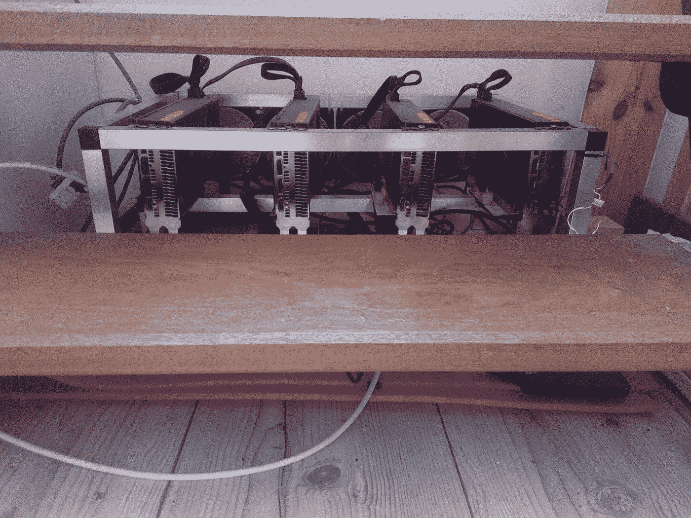

Las QuadriVegas …

这个小野兽吸 500 W 在墙和矿大部分时间 CN-coins(Monero，TurtleCoin，BitTube，ArtoCash，…..)，还有 Ubiq 和一些 specmining 剧…

我主要是寻找低难度和积累硬币，而不是出售或几个

我家有一个小走廊，里面没有暖气。这不是一个真正的问题，因为它只是一个我们行走而不停留的地方，但是当冬天很冷的时候，穿越这个寒冷的地区是不愉快的。

我的供暖系统是一个连接到循环热水的经典中央供暖系统的颗粒炉。

在走廊里安装这样一个散热器是很复杂的，因为我必须连接很远的水管，而且是在墙的另一边(而且我讨厌水管工…)

所以我妻子想让我修一个电暖器来取暖，但是我不同意，并告诉她他们浪费了很多电和钱。

与此同时，她对我的加密投资非常怀疑，随着熊市的展开，情况变得更糟。所以她不太愿意让我花钱买采矿机器和电力。

我们最终满足了我们的要求，我提议将设备安装在楼梯下，并回收热空气来加热走廊。

尽管有风扇噪音(由于欠锁设置，噪音没有那么大)，我妻子发现今年冬天在用电取暖的同时获得报酬是高效和明智的。

# 旅程的开始

这就是这篇小文章的重点，胰热/电/钱。

当我发现并探索了 crypto mining rabbit hole 时，我立即想到了芯片产生的所有热量以及所有这些努力和成本(风扇、空调等)。)来对抗它。

我在想这很荒谬:尽管热是我们家需要的一种能量形式，但为什么要花费能量来对抗热呢？

一些人已经解决了这个问题，正在用 ASICs 或钻机给房间供暖，但是有一个主要的警告:不要看！！！！

所以我也在寻找一个可以整合我当前设置的解决方案，所以我的问题是如何代替烤箱加热水？

此外，在夏天，炉子是关着的，但我需要热水，所以我在交换水箱中使用 2000 瓦的电阻，就像一个经典的水锅炉一样。

我在网上开始了我的研究，发现了 3 个相关的项目:

*   我真的很喜欢他们的项目，但是几个月来都没有真正的进展…
*   Hotmine:早在 2017 年，他们销售的正是我想要的那种设备:热水器锅炉中的多个 Hashboards。但是，向乌克兰网站发送超过 6000 美元的高运费在当时似乎是不合理的(甚至在今天也是如此……)

他们不再推荐这个产品，而是推荐这个庞然大物:

【https://hotmine.io/en/catalog/16 号

*   这家伙:[https://motherboard . vice . com/en _ us/article/9k 8 ykp/heating-water-with-bit coin-mining-ASIC-Reddit](https://motherboard.vice.com/en_us/article/9k8ykp/heating-water-with-bitcoin-mining-asic-reddit)

哇，就是它！！！！便宜，DIY，巧妙，它是工作！！

两个集成电路，一个汽车散热器和一些通风管，我们走吧！！！

所以这种装置一度是我的目标，甚至考虑用我的旧柴油炉作为热空气和水的交换。

我得感谢这个人，因为那篇文章真的让我决定走得更远。

于是，11 月 18 日，我在易贝上找到了我拼图的第一块，是一个不到 100 €的无名 M3。

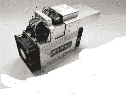

有一点是肯定的，ASICS 比设置 GPU 采矿钻机要简单和容易得多:

只需插入电缆，登录，把你的池和帐户，它就可以了。但我意识到真正的，真正的恼人的噪音，当然还有热。那时我(重新)发现并探索了沉浸式冷却的神奇世界。这是探索沉浸式冷却可能性的时候了

# 浸入式冷却绝对很酷

这个概念非常简单:

你把电子设备(服务器，GPU，…ASIC)在阿迪-不能走捷径的电流体，热量传递到这种流体，然后通过无源散热器或风扇散热。

它被工业用于大型服务器操作或极端超频计算机狂热者…

有专门用于计算机设备的液体，如 3M Novec。

但是作为一个业余的欧洲随机顾客(也没那么有钱)，这些产品本身和运费都太贵了。那怎么办呢？

嘿，使用你的搜索引擎，找到一个替代品:矿物油，绝缘油

我终于找到了两个法国零售网站出售任何种类的石油(汽车，划船，切割等)。)并发现了这个:

 [## 我们的产品是乐惠的

### 你在研究乐惠的选举吗？你不知道乐惠是怎么选择的吗…

www.lubexcel.com](https://www.lubexcel.com/recherche-produit/categorie/huile-dielectrique) 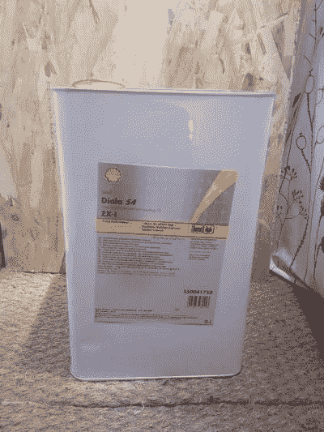

2x20 升的成本约为 200 €，所以每升 5 €

这样的费用，但它对我的项目是强制性的，没有找到更好的价格。

现在，我需要一个油箱来装这些油。

好吧，让我们用一个 60 升的基本塑料罐

20 €需要 2 辆坦克，好吧，拥有两辆坦克可能是安全的

与此同时，我每天都在寻找一些廉价的钻机、GPU 或 ASICS。在 2018 年底和 2019 年的前几个月，我在€160 号找到了 1 台 AVALON 841+2PSU，以完成我的沸腾农场。

所以当我所有的零件都在家里时，我必须把它们组装起来。所以我在油箱里加满了 40 升的水，然后先把 M3 沉进去…

我承认在插上交流电源线之前我有点紧张，但是现在我们开始吧…

起作用了！led 在发光，风扇在液体中转动。

让我们看看是否有一些散列！！！

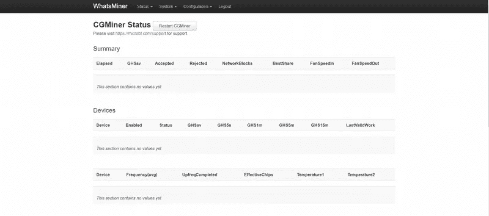

哦…不… Cgminer 不启动…搞什么鬼！

在查看日志后，我意识到问题出在风扇，或者更准确地说是风扇速度。

它们被设计成在空气中高速旋转(1000/6000 RPM)以有效冷却，但在流体状的油中，它们很难达到 300 RPM

该板正在监控两个风扇的速度。在启动过程中，系统测试最大速度，由于速度只有 300，这个测试失败，Cgminer 进程停止。

那怎么办呢？拔下风扇插头，因为冷却不再需要它们？

错误，因为系统会检测到他们不存在，不会启动…

我在网上发现了一些专为 ASICS 设计的风扇欺骗器(特别是 Antminers，但他们可以安装其他带有 PWM 风扇的设备),模拟风扇的存在和转速。

为什么不，但是这是额外的费用和额外的等待时间…

所以我挠了挠头，ASIC 控制板只是一台处理风扇转速等数字的电脑…那台电脑会有操作系统…什么样的操作系统？Unix 风格的？

太好了，在我启动 Putty 并登录我的 M3 时，帮我拿着啤酒…

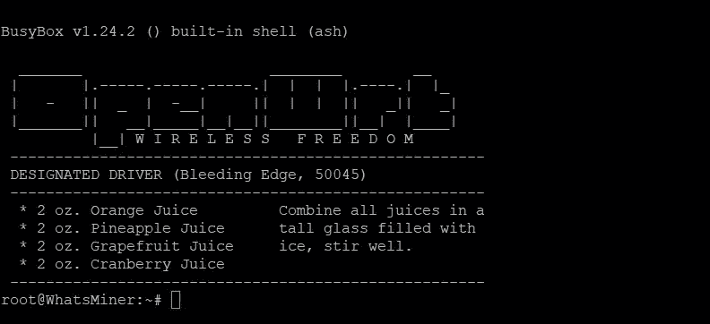

凭据与 web 界面相同

我们进去了。！

盒子里是什么

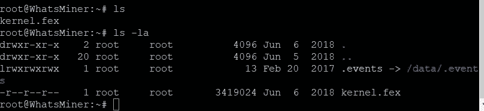

？？？？好的。这不是我所期望的…

所以，让我们回顾一下当前的一些 Linux 回购协议名称…

哈哈！！！抓到你了。！

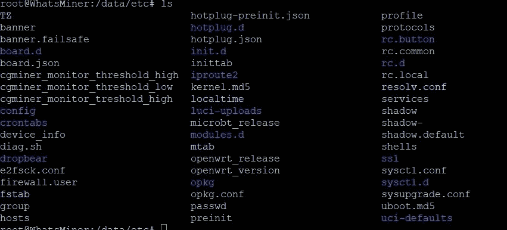

所以/config 看起来很准确…

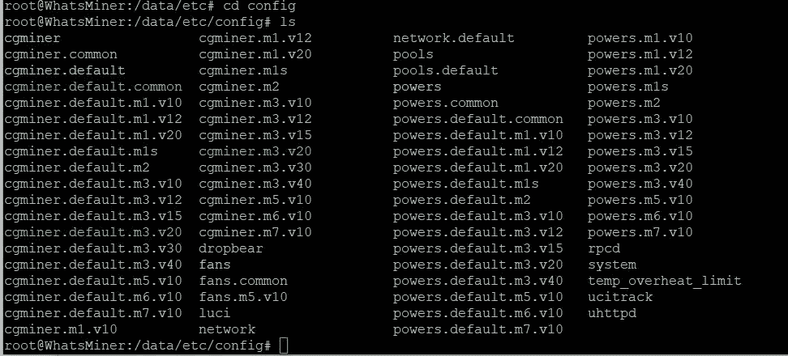

嗯嗯…如果我的粉丝问题可以在“粉丝”中解决会怎样……

尝试“纳米风扇”…当然不是纳米…所以试试 Vim 吧？

欢迎来到维姆奇妙的疯狂世界。

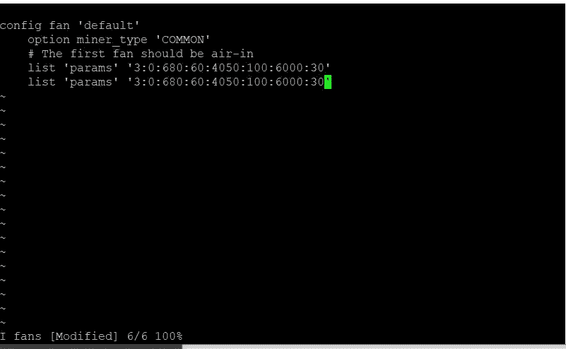

好吧，我想这些数字是每一步的目标速度…

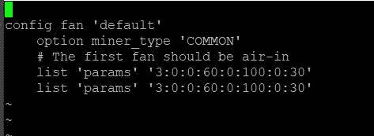

就这样，我把所有风扇的目标转速降低到 0 rpm，现在软件正在启动…

矿工在哈希！！

迦南矿工容易得多，因为你可以直接拔掉风扇，因为他们没有脉宽调制控制，它不会损坏机器。

我还移除了外壳，以便让热量更好地在油中流动。

从我的经验来看，在水箱中至少有一个风扇似乎是明智的，因为它可以更有效地混合和散热。

几分钟后，油达到 70℃以上，因此一个或两个矿工必须重新启动，因为过热温度被触发

所以是时候迈出最后一步了

# 回收热量

既然我已经验证了矿工在油浴中可以高效无声地运行，我必须考虑将热量转移到我的水回路中。

我愿意使用汽车散热器，但在寻找热交换器后，我在一个啤酒酿造商网站上找到了一个便宜又好的解决方案:扭曲的铜！！

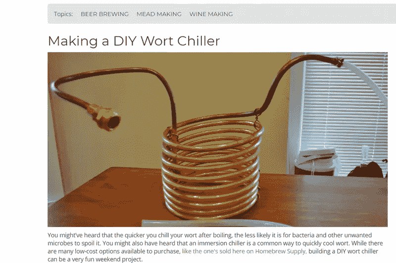

所以我买了 10 米 12 毫米的铜，把它弯成两个蛇形以适合我的箱子。

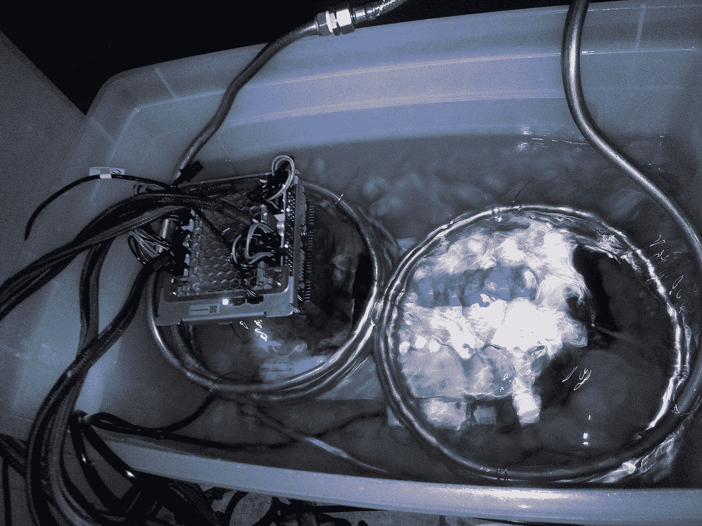

这条蛇形线只是连接到加热电路，而不是散热器

水通过铜触点流入并接受油的热量…

最后，这是我的安装方案

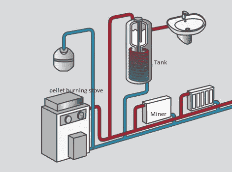

几个小时后，我得出了结论……起作用了！

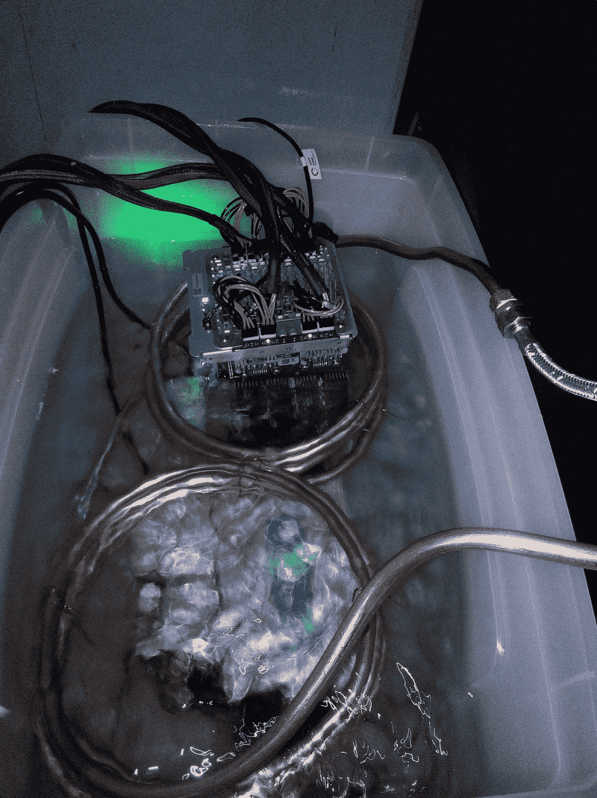

机油温度在 60/70°C 范围内，水箱中的水温在 35/55°C，这取决于散热器的需求。

查看 BitBoiler 的运行情况:

 [## 比特锅炉

### 带沉浸式冷却 ASICs 的 DIY 中央供暖系统....

bittube.tv](https://bittube.tv/post/94d9436e-5b36-4237-9acd-e1075c7d5918) 

# 丰富

我做到了，我的水是通过采矿加热的！！但是正如我所担心的，40/45 摄氏度的温度很低，对热水来说不太舒服，此外，储备只有 100 升，所以进行多次淋浴是不可能的。

我只需要考虑我的水箱将水预热到 40/50 ℃,然后另一个设备将水温升高到 50/60 ℃!！

所以我最初想到了一个额外的经典电动坦克。但这是一项新的开支，也是一点管道工程。

所以我看了一些即热式热水器。我认为大多数这些产品都是骗局，不会提供足够的热量或低借记。

我最终在亚马逊上买了这个 T1，因为它看起来比其他中国垃圾更严重，并提出了 3 个设置:2000/5000/7000 W

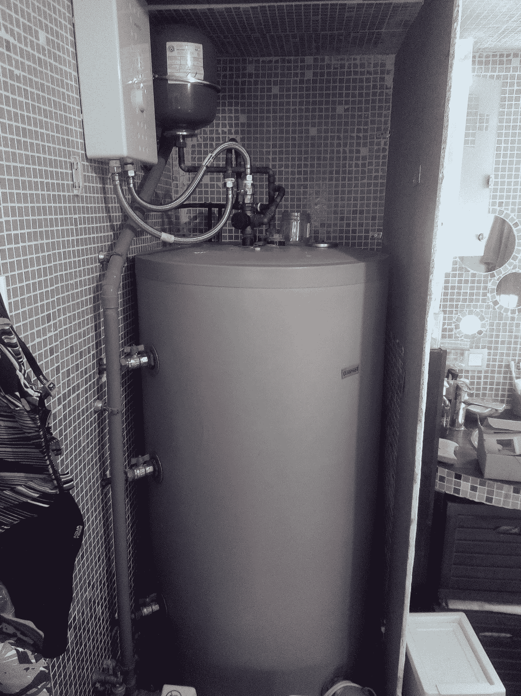

这是串联的交换罐和快速加热器

# 初步结果

四月/五月是测试和验证该设置的最佳时间，到目前为止，它比我预期的工作得更好…

矿工们在寒冷的时候跑得完美无缺

我让 2/3 的散热器完全打开，为客厅和孩子的卧室供暖，循环水在 35°C 和 45°C 之间波动……这在冬天是不够的，但在白天温度调节、夜晚寒冷的时候是可以的，它能维持一个舒适的温度。

对于热水，在中等位置(5000 瓦)使用快速加热器更舒适，但是，如果散热器没有完全打开，低位置(2000 瓦)就足够了…

另一方面，当我关闭散热器，只使用油箱加热时，就不需要即时加热器了，因为油温很快就会超过 70 摄氏度，矿工必须重启以防止过热。

# 总结:

*   M3:€90 号
*   阿瓦隆米娜 841 + 2 PSU : 160 €
*   2x20L 矿物油:220 €
*   塑料外壳、铜和软管:100 €

所以，我的比特锅炉花了我 570 € …..

当前产量:

1500W 瓦时约 10 秒

阿瓦隆 841:800 瓦时约 9 秒

两者都配置了低功率设置

它实际上为 2300 W 产生了近 19 Th/s

我当然开采 BTC，但也开采 VLS，一种多算法低帽硬币…(快速先令…；) )

由于电费约为 0.12€/千瓦时，盈亏平衡还很遥远。

但另一方面，我过去每天至少要支付 5 €来加热小球，1 €就能轻松获得热水。所以我真的很喜欢在取暖的同时获得报酬的想法

总之，我真的很喜欢构建这个概念 BitBoiler 的证明，并且确信一些严肃的工程师团队可以提高这个系统的效率和可伸缩性。我也很惊讶沉浸式冷却被如此低估，因为它并不难实现，并解决了噪音和冷却等主要缺点。

# 编辑 2019 年 11 月:

*   这个系统整个夏天都在阿瓦隆上运行。它为水提供了足够的高温，而不需要快速加热器的帮助。
*   在 11/12 摄氏度的室外温度下，该系统足以调节我的房间(大约 120 米)
*   拉斯维加斯已经成长起来，现在是拉斯维加斯十月…

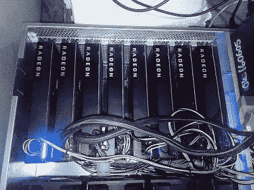

> [在您的收件箱中直接获得最佳软件交易](https://coincodecap.com/?utm_source=coinmonks)

