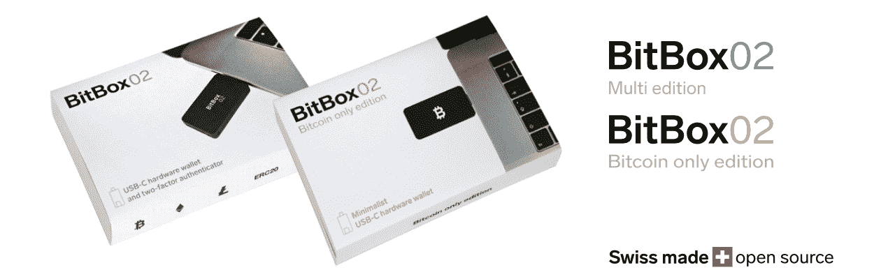
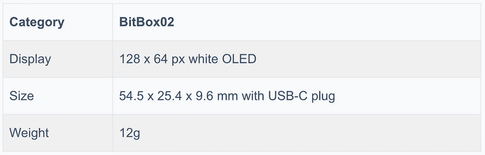
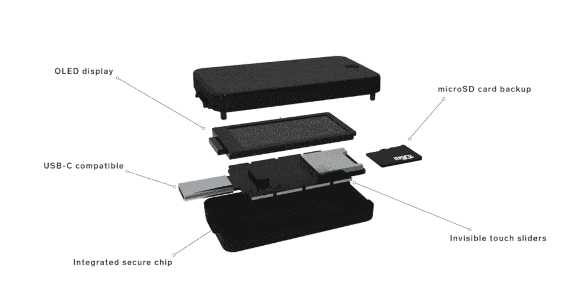
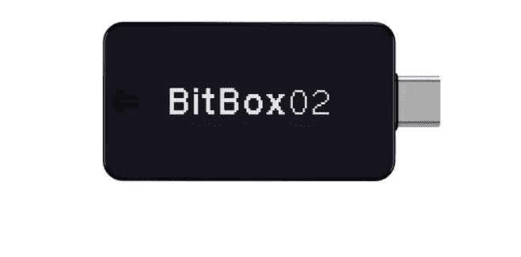
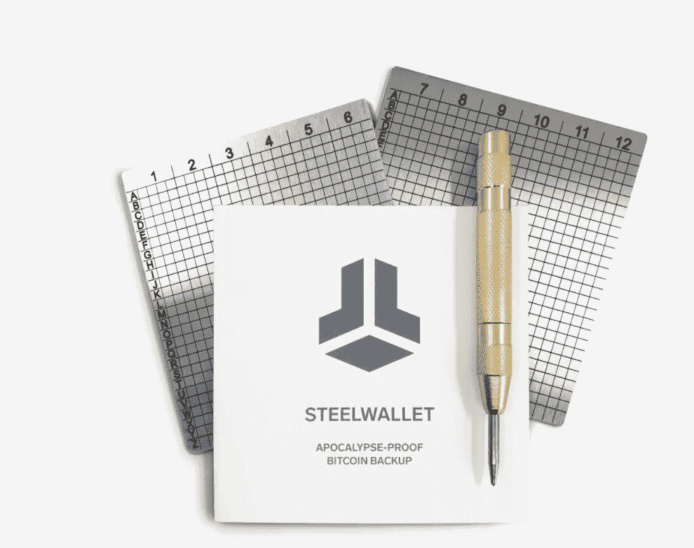
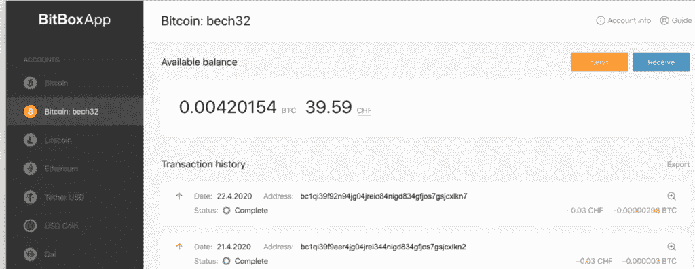
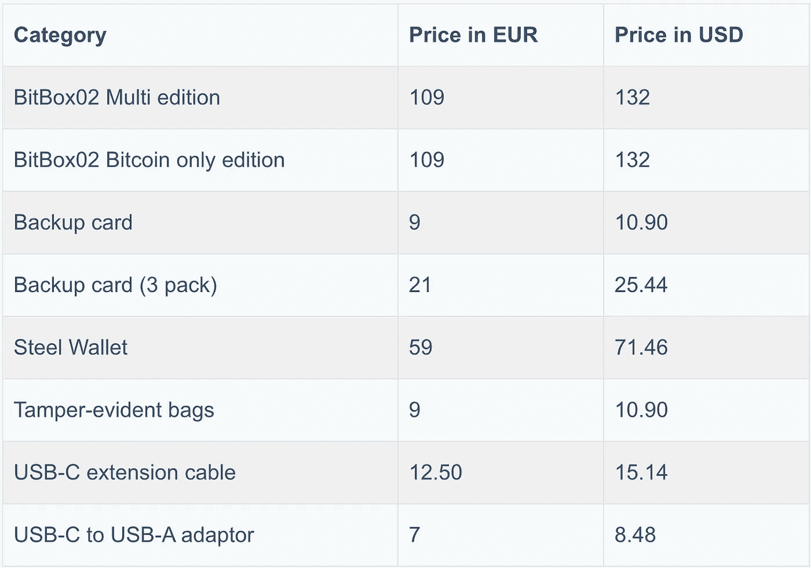

# 比特币 02 回顾 2021 |你的瑞士比特币硬件钱包

> 原文：<https://medium.com/coinmonks/bitbox02-review-your-swiss-bitcoin-hardware-wallet-c36c88fff29?source=collection_archive---------1----------------------->

[硬件钱包](/coinmonks/the-best-cryptocurrency-hardware-wallets-of-2020-e28b1c124069)是存储加密货币的离线设备。在这篇文章中，我们将回顾瑞士公司 Shift CryptoSecurity 创造的 [Bitbox](https://blog.coincodecap.com/go/bitbox) 钱包。

[BitBox 钱包](https://blog.coincodecap.com/go/bitbox)有两个版本——**BitBox 01**和 **BitBox02** 。有两种不同类型的比特币 02 钱包——仅比特币和多货币版。多货币版钱包支持比特币、莱特币、以太币和 ERC 20 代币。

# 摘要

*   Shift CryptoSecurity 在瑞士生产[位盒](https://blog.coincodecap.com/go/bitbox)钱包。
*   这些钱包设计简单而优雅。它们使用直观的触摸滑块，没有任何按钮。
*   钱包有一个 USB-C 端口连接到设备上，并且也与 USB-A 兼容。
*   [Bitbox](https://blog.coincodecap.com/go/bitbox) 支持超过 1500 种加密货币。
*   BitBox 提供了两种备份选择，一种是 SD 卡，另一种是防灾难的钢制钱包备份。
*   [Bitbox](https://blog.coincodecap.com/go/bitbox) 对安全芯片进行签名，以防止任何物理篡改。他们使用各种措施来确保设备完全安全。
*   它们提供了一个易于使用和用户友好的界面。

# BitBox02 回顾:物理外观

*   BitBox02 钱包使用聚碳酸酯材料。它们坚韧耐用。
*   该设备没有任何按钮。
*   设计时尚简约。
*   传感器内置在它的边缘。
*   该设备有一个卡插槽，可插入用于备份的 micro 卡。

他们通过三种简单的手势使用隐形触摸传感器:滑动、点击和按住。手势是用来-

*   点击—导航并选择
*   幻灯片-验证您的地址。
*   保持-它避免了任何意外的交易。

# 连通性

[BitBox02](http://blog.coincodecap.com/go/bitbox) 有一个 USB-C 端口连接到设备。此外，它还提供了一个 USB C 到适配器。

# 五金器具

[Bitbox](http://blog.coincodecap.com/go/bitbox) 采用 ATSAMD51J20A 微控制器。此外，他们使用真正的随机数发生器来增加安全性。

安全芯片 ATECC608A 用于防止物理篡改。这有助于防止暴力攻击，并为私钥提供额外的安全性。

# BitBox02 加密货币支持

[BitBox02](http://blog.coincodecap.com/go/bitbox) 钱包支持超过 1500 种加密货币。点击可以查看[的完整列表。](https://shiftcrypto.ch/coins/)

# 支持

如果您的设备丢失，创建备份以恢复您的资金是至关重要的。您可以使用 SD 卡备份钱包中的所有信息。

不过，你也可以用钢钱包防天启备份。它由不锈钢制成，可以经受住室内火灾、辐射、腐蚀或任何类似的极端条件。

该设备易于使用，不需要任何额外的工具。它们是后代的抗老化备份。最重要的是，它们与 BIP-39 兼容。

钢制钱夹由两块金属板组成。每张纸每面可以写六个字。使用打孔机将恢复字记录在上面。冲床弹簧产生持久的凹痕。恢复短语的前四个字符是唯一的；所以，我们只需要打他们一拳。为了避免错误，你可以先用记号笔在孔上做标记，然后用打孔器。为了区分第一个和第二个板材，您可以在板材的侧面分别打一个和两个孔。

# BitBox02 审查:安全性

[Bitbox](http://blog.coincodecap.com/go/bitbox) 在工厂设置期间验证钱包。每次你使用 BitBox 应用程序，他们都会检查设备的真实性。

该应用程序只接受由 Shift Crypto 签名的固件。固件是开源的，允许确定性的构建。此外，他们有一个漏洞奖励计划，用于报告任何安全漏洞的发现。

比特币钱包被装在真空密封的塑料袋里，以防止供应链受到攻击

引导装载程序防止安装不同版本的固件或任何降级。为了二进制透明性，引导装载程序在执行固件之前显示固件的散列。

[Bitbox](http://blog.coincodecap.com/go/bitbox) 在安全芯片中使用单调计数器来限制密码输入的尝试次数。这有助于避免暴力攻击。

您可以为设备设置密码。应用程序和设备之间的所有通信都是加密的。

[Bitbox](http://blog.coincodecap.com/go/bitbox) 使用多个熵源生成 24 个单词的恢复种子短语。它被加密并存储在微控制器单元(MCU)中，由您选择的密码和安全芯片保护。

此外，BitBox 允许你对你的一些在线账户使用[通用双因子(U2F)](https://en.wikipedia.org/wiki/Universal_2nd_Factor)——GitHub、Dropbox、谷歌、脸书等等。它不允许您在没有通过设备验证的情况下登录。插一下，摸一下也可以。

# 用户体验

[Bitbox](http://blog.coincodecap.com/go/bitbox) 提供了一个安全、用户友好的应用程序来安全地管理您的资产。它允许你管理和更新你的 Bitbox 设备。他们提供最新的 Segwit Bech32 地址格式，让您可以节省交易费用。

Bitbox02 设备可以使用 BitBox Bridge 与应用程序配对。要做到这一点，你需要确保设备屏幕上显示的代码与应用程序的代码相同。它们为您提供创建新钱包或恢复现有钱包的选项。

他们提供多语言支持。该应用程序有保加利亚语，中文，英语，法语，德语，希伯来语，印地语，日语，马来语，波斯语，葡萄牙语，俄语，斯洛文尼亚语，西班牙语，土耳其语。

该应用程序支持 macOS、Windows、Linux 和 Android。你可以从这里的[下载。](https://shiftcrypto.ch/download/)

# BitBox02 定价

您可以在这里预订[。BitBox 提供两年的保修期。所有订单超过€ 250 得到免费送货。](http://blog.coincodecap.com/go/bitbox)

[Bitbox](http://blog.coincodecap.com/go/bitbox) 覆盖导入成本。您也可以从美国、欧洲、中东或亚太地区的当地经销商处订购。

如果产品在交付后十天内未使用且包装未打开，您可以退货。BitBox 会从总价中扣除原运费和退货运费，退还剩余金额。如果您使用比特币完成了交易，退款将按照订单的美元价值发放。使用传输时间的汇率值。

# 客户支持

您也可以通过 [support@shiftcrypto.ch](mailto:support@shiftcrypto.ch) 给他们写信。 [Bitbox](https://shiftcrypto.ch/) 在 [Twitter 上也有。](http://@shiftcryptohq)

此外，他们还运营着一个 Youtube 频道。

# BitBox02 回顾:利弊

# 赞成的意见

1.  一家著名的公司 Shift CryptoSecurity 开发了这种钱包。
2.  钱包很容易设置。
3.  BitBox 应用程序易于使用，具有用户友好的界面。
4.  他们使用各种措施来确保设备的安全性。
5.  它们提供通用双因子(U2F)支持。
6.  还提供了强大的备份选项。

# 骗局

1.  支持有限的加密货币。
2.  屏幕尺寸小。

# BitBox02 审查:结论

[BitBox](http://blog.coincodecap.com/go/bitbox) 提供易于使用的安全钱包。钱包用手势控制，比较新颖。最初，你可能会发现使用它们有点困难，但是一旦你习惯了，就会觉得很有趣。

钱包兼容 USB-C 和 USB-A。 [Bitbox](http://blog.coincodecap.com/go/bitbox) 使用多重安全层来保护设备。此外，它们还提供了简单安全的备份和恢复选项。

# 常见问题(FAQ)

**bit box 钱包安全吗？**

[BitBox](http://blog.coincodecap.com/go/bitbox) 为每个设备的固件签名。每次设备与应用程序连接时，都会检查设备的真实性。引导加载程序防止安装不同版本的固件或任何降级。除此之外，BitBox 还允许你对一些在线账户使用通用双因子(U2F)。

**BitBox 中有哪些备份选项？**

BitBox 提供了两种备份选择——一个 SD 卡和一个钢制钱包，以防天启。钢制钱包可以经受住室内火灾、辐射、腐蚀或任何此类极端条件的考验。

**bit box 钱包里的触摸滑块难用吗？**

钱包用手势控制，比较新颖。最初，你可能会发现使用它们有点困难，但是一旦你习惯了，就会觉得很有趣。

**BitBox 钱包可以退吗？**

是的，如果产品在交付后十天内没有使用并且包装没有打开，您可以退货。 [BitBox](http://blog.coincodecap.com/go/bitbox) 会从总价中扣除原运费和退货运费，退还余款。

## 另外，阅读

*   [零审核](https://blog.coincodecap.com/ngrave-zero-review)
*   [莱杰 vs 特雷佐](/coinmonks/ledger-vs-trezor-best-hardware-wallet-to-secure-cryptocurrency-22c7a3fd391e)
*   [奥普罗评论](https://blog.coincodecap.com/opolo-hardware-wallet-review)
*   [SecuX STONE 五金钱包评论](/coinmonks/secux-stone-hardware-wallet-review-15-discount-coupon-2020-7577032faa6e)
*   [莱杰 Nano S vs 特雷佐 one vs 特雷佐 T vs 莱杰 Nano X](https://blog.coincodecap.com/ledger-nano-s-vs-trezor-one-ledger-nano-x-trezor-t)