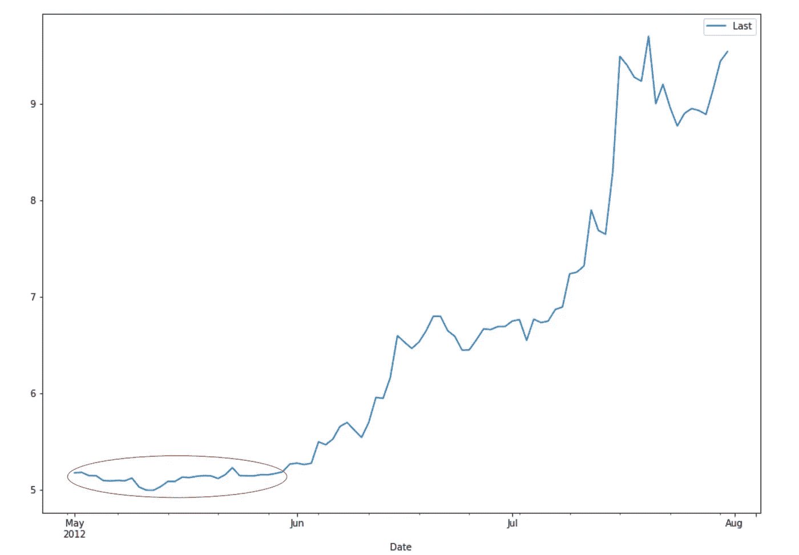
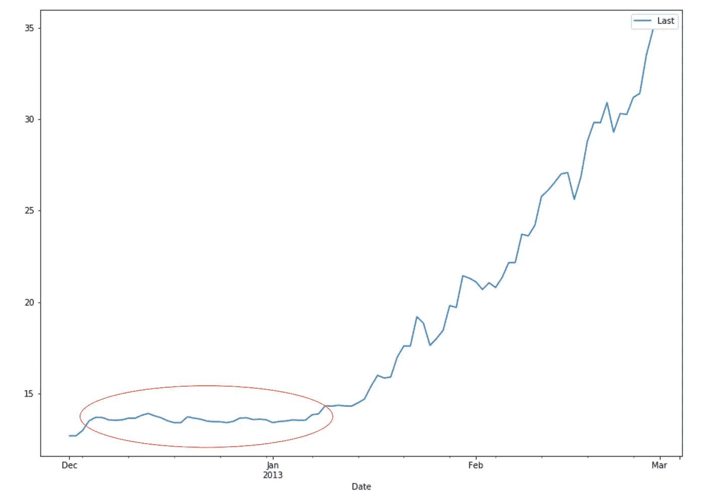
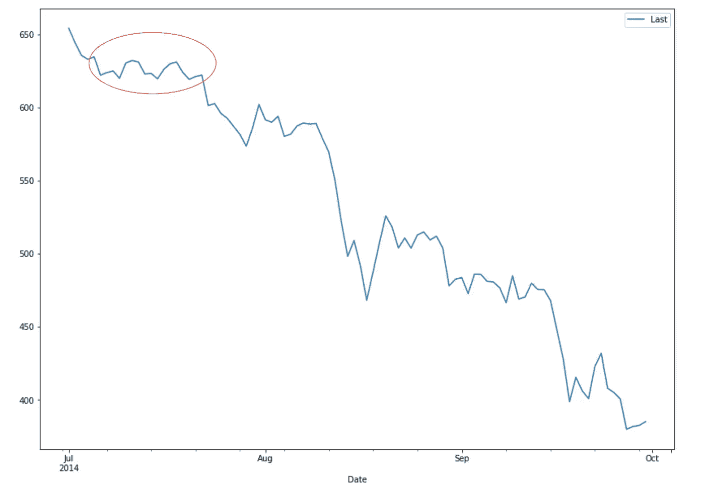
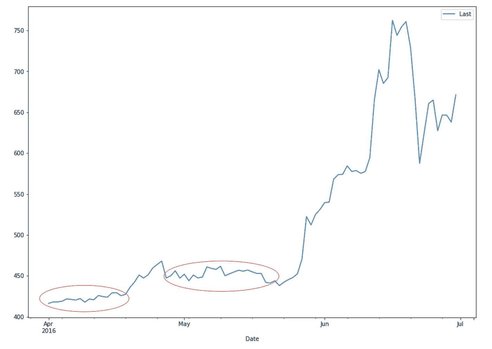
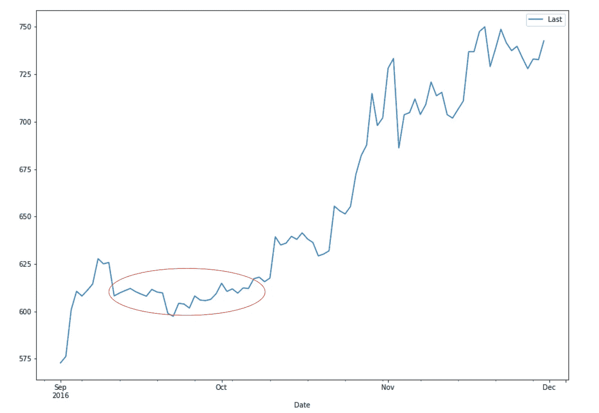
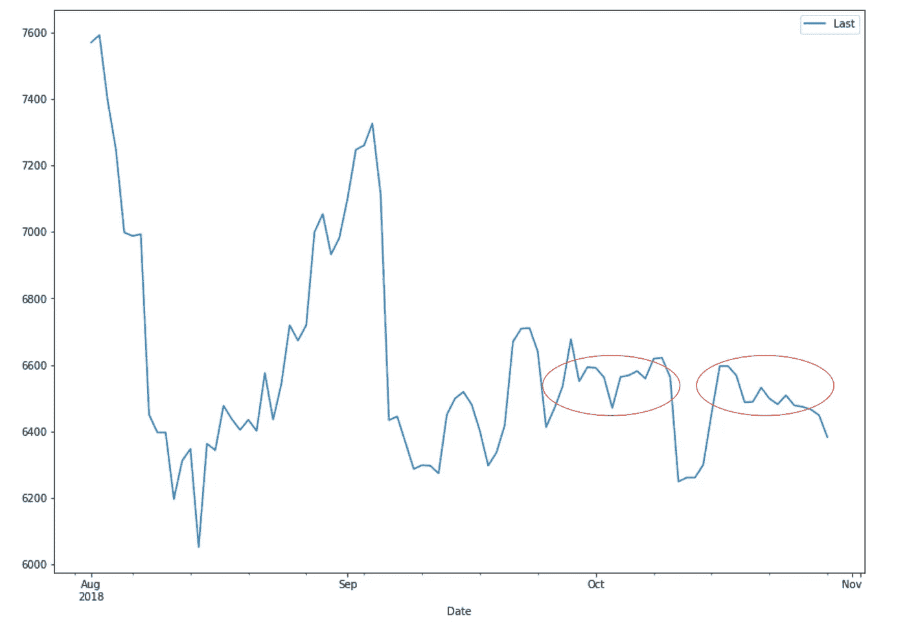

# 比特币:12 天 2.2%的交易区间

> 原文：<https://medium.com/coinmonks/bitcoin-12-days-in-a-2-2-trading-range-b6b531365d35?source=collection_archive---------5----------------------->


“black stacking stones on gray surface” by [Sean Stratton](https://unsplash.com/@seanstratton?utm_source=medium&utm_medium=referral) on [Unsplash](https://unsplash.com?utm_source=medium&utm_medium=referral)

比特币最近一直处于非常紧张的交易区间。推特上的人们半开玩笑地称比特币为新的稳定币。

彼得·勃兰特下面的推文让我想知道这种情况以前是否发生过，如果发生过，这是否能给我们任何关于接下来会发生什么的线索。使用 Python 使这变得快速而简单。

首先，让我们将一些比特币价格数据加载到熊猫数据框架中。

```
# Get price data from Quandl
bitcoin = quandl.get("BCHAIN/MKPRU")
bitcoin = bitcoin.shift(-1) # data set has daily open, we want daily close
bitcoin = bitcoin.loc['2011-01-01':] # Remove the 0's
bitcoin.columns = ['Last']
```

接下来，我们通过首先计算连续 12 天的最小值和最大值来计算连续 12 天的交易范围。

```
bitcoin['min'] = bitcoin['Last'].rolling(window=12).min()
bitcoin['max'] = bitcoin['Last'].rolling(window=12).max()
bitcoin['tr'] = (bitcoin['max'] / bitcoin['min'] - 1) * 100
```

然后，这只是一个寻找 12 天交易范围小于 2.2%的日期的例子。

```
matches = bitcoin[bitcoin['tr'] <= 2.2]
```

一旦我们有了日期，我们就可以绘制一些价格图表，显示大约前 12 天(因为我们使用 12 天滚动周期)以及未来一两个月的价格。下面是所有的图表。

```
bitcoin[['Last']].loc['2012-05':'2012-07'].plot(figsize=(14,10));
```



May 2012



Dec 2013



Jul 2014



Apr / May 2016



Sep / Oct 2016



Oct 2018

以下是我的初步想法:

*   从 2011 年来看，之前发生过 5 次，分别是 2012 年 5 月、2013 年 12 月、2014 年 7 月、2016 年 4/5 月和 2016 年 9/10 月。大概是 1.5 年一次。
*   4 次之后价格上涨，一次之后价格下跌。
*   随后的价格变动幅度很大
*   在样本规模为 5 的情况下，我不认为我们可以得出上涨的可能性大于下跌的结论，但我认为我们可以得出结论，我们很可能会看到一个强劲的上涨或下跌。

你可以在这里查看这篇文章的全部内容。如果你从这篇文章中得到什么好处，请鼓掌，让其他人也能发现。

*请注意，本文中的任何内容都不应被视为投资或交易建议。以上是我个人的看法和体会。比特币和以太坊的波动性极大。在投资或交易之前，请做好自己的研究。*

> [在您的收件箱中直接获得最佳软件交易](https://coincodecap.com/?utm_source=coinmonks)

[](https://coincodecap.com/?utm_source=coinmonks)