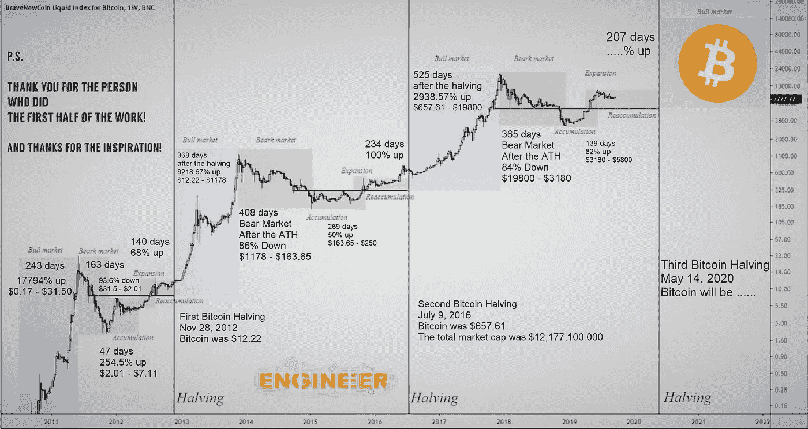
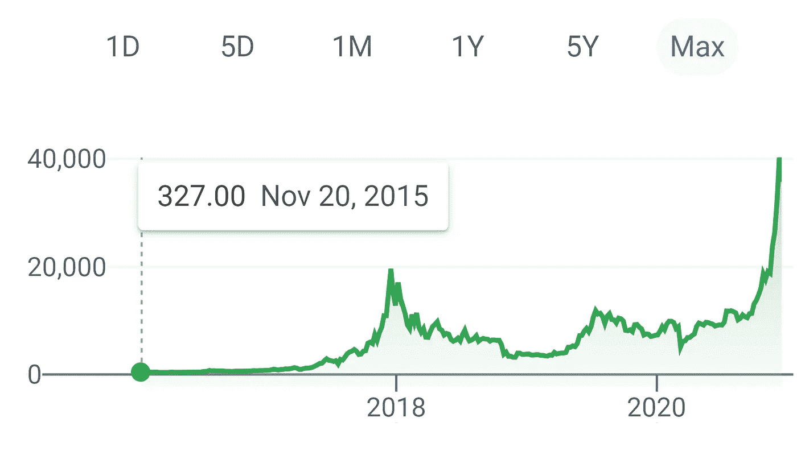
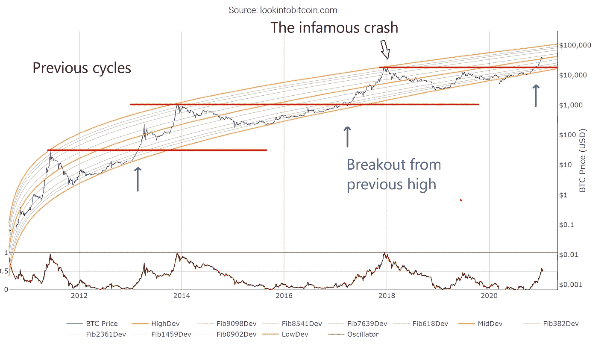
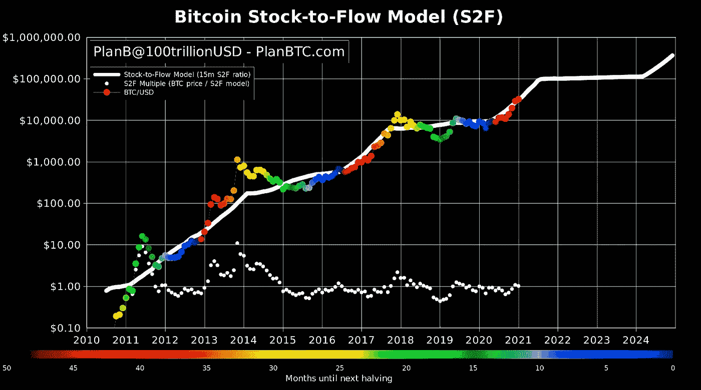

# 比特币 2021:骗局还是周期？第四次浪潮正在发生

> 原文：<https://medium.com/coinmonks/bitcoin-2021-rally-or-crash-scam-or-cycle-the-4th-wave-is-here-82f79595e951?source=collection_archive---------1----------------------->

A summary of the Bitcoin cycling pattern. [Source](https://masterthecrypto.com/bitcoin-halving/)

比特币重新出现在新闻中，这意味着价格已经疯狂了几个月，这意味着你在想:为什么比特币的价格会上涨？我不会在这里解释比特币是如何工作的，YouTube 上已经有太多关于比特币的视频了。我更愿意讨论在比特币的过去和可能的未来背景下，当前的价格走势意味着什么。

但是亚历杭德罗，如果比特币只是一段代码，稀薄的空气，为什么它首先就有价值？比特币和货币的工作方式是一样的，因为它们的价值只存在于我们的想象中。钱有用的唯一原因是因为我们都同意它有价值。如果有一天我们不再认为一些绿皮书有价值，那么它的价值就会下降。对吗？

引用尤瓦尔·诺亚的《智人》

> 金钱是有史以来最普遍、最有效的互信体系

事实上，金钱代表了你和政府之间，以及你和其他消费者之间的信任体系。只要人们相互信任，信任美联储，一切都好。例如，阿兹特克人使用可可豆作为货币！为什么？因为巧克力太棒了，这就是原因。他们确实有黄金，但是当你有可可豆的时候，谁会关心闪亮的金属！

因此，不管我们谈论的是一张纸、一块金属、可可豆，还是中本聪精心设计和实现的数学抽象，归根结底，这是一个信任体系。一个允许我们交换商品和服务的系统。只要我们同意，一公斤可可豆用美元、黄金和 BTC 的价格是相等的。

然而，普通货币和比特币之间的一个区别是，货币是绿纸，绿纸可以在神奇的绿纸工厂(又名美联储)制造，而比特币——因为它的设计方式——有有限的限制！比特币将永远只有 2100 万枚。就这样，不多不少。实际上可能更少，因为数千甚至数百万被认为是在死钱包中丢失的(人们忘记了他们的密码，丢失了他们的电脑，甚至忘记了他们在 2012 年打开了一个比特币钱包来购买…呃…披萨)。所以让我们在这里做一下数学计算:如果我们都想要一块比特币，因为我们都同意它有价值，而且只有有限的数量，价格只能在长期内上涨。还是那句话，只要我们同意它有价值，但到目前为止，情况似乎就是这样。

# 三张图中的一出戏

我们都有一个总是说“但是亚历杭德罗，比特币是一个泡沫，还记得 2017 年的崩盘吗？很多人丢了钱。比特币是一个骗局”这种说法通常来自电视或《华尔街日报》，他们展示并“分析”这样的图表:

Bitcoin price history as shown by Google

晨星、雅虎财经、金融时报、Robinhood 等很多平台都是这样展示比特币的价格历史的。从这张图表来看，似乎多年来比特币无所作为— —大概是因为它是一个骗局——只有在 2016 年左右，人们才开始无缘无故地购买比特币。这种购买压力产生了一个泡沫，最终在 2017 年底破裂。人们损失 80%金钱的时候。经典骗局。*右*。这种说法显然有问题。让我们来谈谈关于数据可视化的两个基本经验。首先，我们需要展示 2010 年的数据，那时 BTC 刚刚起步。罗宾汉，谷歌，雅虎财经等。只显示 2015 年比特币的价格，就好像它有一天神奇地出现了，价格是 327 美元。

第二，也是最重要的:图表的比例是错误的。由于 2017 年的大规模反弹，此前的价格历史被掩盖了。当我们在数据中有这样的极端值时，我们需要使用对数标度。当我们将较长的价格历史与对数标度相结合时，我们得到了这张图表:

A Log-scale chart of the price of Bitcoin reveals a cycling pattern. Credit: Cole Garner and @quantadelic

这看起来非常不同。现在非常清楚的是，自 2010 年问世以来，比特币的价格一直在持续上涨。2011 年 5 月左右，它的交易价格为 10 美元，然后花了两年时间达到 100 美元(两年内增长了 1000%)，2013 年晚些时候，它的交易价格首次达到 1000 美元。而且我们可以清楚的看到价格触及上方黄线时的 3 浪，达到临界水平，后期崩盘。比如 2013 年达到 1000 美元的峰值后，差不多过了 3 年价格才再次达到那个水平(说说包包持有者吧！).重要的是，即使在暴跌之后，比特币的价格仍然高于这波行情开始之前的价格！对所有三种波来说都是如此。

股票市场的交易者在价格图表上找到模式，并用它们作为指导，知道何时进入或退出交易。其中一些模式几乎是股价图表顶部的线条，代表数据的汇总统计，交易员据此制定“规则”。例如:“如果价格触及 50 日均线，但在 200 日均线之上，且 RSI 统计小于 40:进入持仓”。重要的是，这些“规则”或策略(又名*技术分析*)在某种程度上确实有效，因为我们都在画同样的线，期待同样的模式！所以当股价达到我们的假想线时，我们都买入股票，价格从那里上涨。因此，价格图表上的模式是自我实现的预言，因为我们让它们发生。

当我们透视比特币(使用对数轴)时，2017 年的峰值和当前的反弹似乎是比特币诞生以来的一贯模式的一部分！黄线完全符合价格历史，红线表明比特币何时突破前期高点。比特币交易者似乎正在关注这些线，因为一旦价格达到临界水平，事情就会发生。

A Bitcoin price chart colored by the time before the next halving. [Source](https://blog.cryptowat.ch/bitcoin-stock-to-flow-stf-indicator-live-cryptowatch/)

那么比特币为什么要这么做呢？这是光明会的阴谋吗？或许是天网控制了全球经济？事实上，这种模式似乎与比特币挖矿减半有关。每 4 年，挖掘新比特币的奖励减半，这样矿工每验证一次交易，获得的比特币就会少 50%。我们可以看到，比特币价格波动的周期与减半周期相关。这意味着，我们看到的行为在某种程度上是被编程的。对比特币感兴趣的人在决定何时开始买卖比特币之前，会密切关注所有这些变量，因此当价格达到临界水平(或高或低)时，预言就会开始自我实现。

还有一点要考虑的是，早在 2017 年，这波行情大部分是由像你我这样的散户推动的。Google trends 显示的对比特币的兴趣表明，2017 年街上有很多人想要比特币！然而，金融机构、基金、亿万富翁、华尔街和“聪明钱”社区的其他成员对此不感兴趣。然而，这一次，他们在船上。银行，Square，PayPal，华尔街，Cathie Wood，他们看好比特币，他们终于被说服了，被改变了！

# 结论

那么，这一切意味着什么呢？第四波比特币价格将由金融机构、投资者、华尔街以及散户投资者推动。如果图表是正确的，第四波的目标价格在 100k 左右。是的，100k。这很疯狂吗？不，是的。我是说，看看图表！现在有几个人在谈论 10 万美元的比特币。那么，你相信这种模式吗？你相信不依赖于银行账户的分散的、可编程的、即时的点对点货币交易吗？一个中间人？月租费？没有边界？给所有人？数学设计和防黑客？如果是这样，朋友，你是比特币信徒，比特币信徒买比特币。300 年后，未来的人类会像我们现在看待可可豆一样看待比特币吗？可能吧…但同时，我会喝我的巧克力，阿兹特克风格的。

> 加入 Coinmonks [电报频道](https://t.me/coincodecap)和 [Youtube 频道](https://www.youtube.com/c/coinmonks/videos)获取每日[加密新闻](http://coincodecap.com/)

## 另外，阅读

*   [复制交易](/coinmonks/top-10-crypto-copy-trading-platforms-for-beginners-d0c37c7d698c) | [加密税务软件](/coinmonks/crypto-tax-software-ed4b4810e338)
*   [网格交易](https://coincodecap.com/grid-trading) | [加密硬件钱包](/coinmonks/the-best-cryptocurrency-hardware-wallets-of-2020-e28b1c124069)
*   [密码电报信号](http://Top 4 Telegram Channels for Crypto Traders) | [密码交易机器人](/coinmonks/crypto-trading-bot-c2ffce8acb2a)
*   [最佳加密交易所](/coinmonks/crypto-exchange-dd2f9d6f3769) | [印度最佳加密交易所](/coinmonks/bitcoin-exchange-in-india-7f1fe79715c9)
*   [开发人员的最佳加密 API](/coinmonks/best-crypto-apis-for-developers-5efe3a597a9f)
*   最佳[密码借贷平台](/coinmonks/top-5-crypto-lending-platforms-in-2020-that-you-need-to-know-a1b675cec3fa)
*   杠杆代币的终极指南