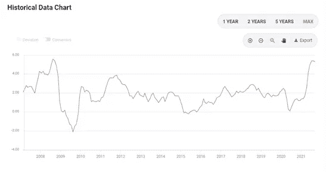
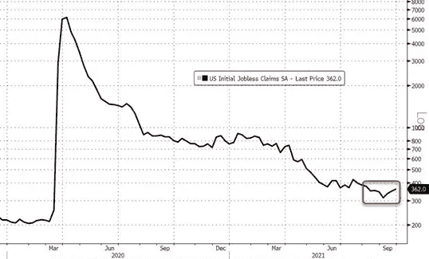
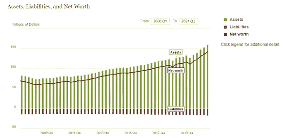
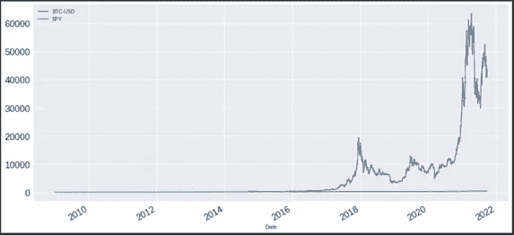
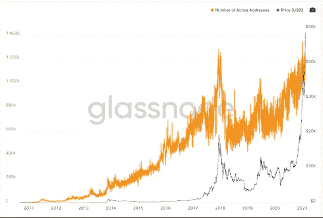
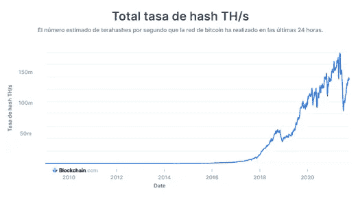
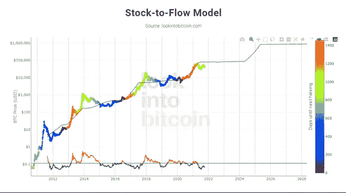

# 比特币:泡沫还是你投资组合的重要资产？

> 原文：<https://medium.com/coinmonks/bitcoin-a-bubble-or-an-essential-asset-for-your-portfolio-83617288d76f?source=collection_archive---------9----------------------->

Photo by [Bermix Studio](https://unsplash.com/@bermixstudio?utm_source=medium&utm_medium=referral) on [Unsplash](https://unsplash.com?utm_source=medium&utm_medium=referral)

# 介绍

在 4 月份达到约 6.3 万美元的历史高点后，最近几个月关于这种著名的加密货币已经说了很多，随后甚至暴跌到 3 万美元以下。迄今为止，该指数尚未回升，也远未达到 4 月份创下的高点。面对这种情况，许多人指出，“比特币已死”，“它是一个泡沫”，“它是 21 世纪的郁金香”，而其他人则评论说，这是一个小的“健康”调整，并将在以后达到新高。由此产生的问题是，这两种观点哪一种是正确的？这个答案就是我们将在本文中尝试开发的。

# 比特币是什么？

首先，比特币是一种基于区块链体系的加密货币，该体系具有去中心化的经济体系，对所有人开放。比特币的交换是在用户之间进行的，没有任何中介，也不受任何类型的实体的监管。这种形式的货币通过分布在全球的计算机网络(任何个人都可以参与其中)来创造、分配和保护，这些网络记录了所有的比特币交易。此外，这种货币的“开采”是通货紧缩的(即创造的比特币数量随着时间的推移而减少)，它有 2100 万个硬币的限制。此外，每枚硬币可以分成 100000000 份。

# 是什么推动了比特币的价格？

比特币的价格纯粹由供求关系决定，因为如前所述，没有任何实体或政府控制比特币系统，也没有任何实体或政府能够减缓或加速比特币价格的波动。

# 为什么投资组合中有比特币？

拥有比特币的原因多种多样。人们中常见的一种是投机，即买入是希望以更高的价格卖出，从而获利。此外，由于没有“备份价值”，比特币是几个批评的目标，说它没有用，或者它只用于非法活动。但这是真的吗？比特币没用？事实是，不，它有实用性和优势，这就是为什么它的用户数量在全世界呈指数增长。
钱包里有比特币的一些好处可以是:
1。*它是一种价值储存手段*:这是因为它是一种稀缺资产，所以它往往会随着时间的推移而保值(甚至会随着时间的推移而升值)。它甚至可以在通货膨胀过程中保护购买力(这在拉丁美洲国家很常见)。诚然，它仍然有很高的波动性，但这是因为它的市场上限仍然很低。因此，随着其市值的增加，这种高波动性将会消失。
2。它是货币的一种改良形式:作为一种数字资产，它比法定货币更便于携带和转移。首先，你可以从任何连接互联网的移动设备上使用比特币进行交易，这在当今社会非常普遍和有用。第二，比特币可以从一个用户转移到另一个用户，不受距离限制，金额不限，佣金最低。例如，乌拉圭的用户可以用比特币向日本的另一个用户发送相当于 100 万美元的金额，并支付 1 美元的佣金。此外，随着“比特币闪电网络”的引入，比特币能够增加其在交易处理方面的可扩展性，这不仅允许网络处理更多的支付，还允许较低经济价值的交易，这在之前是无法实现的，因为网络佣金的金额不允许它们。另一方面，比特币被批评为无用，因为东西没有用所述加密货币定价，所以它永远不能被视为真正的货币。但是，随着萨尔瓦多今年 9 月的立法，比特币被命名为法定货币，摧毁了所有这类论点。now a days 的唯一缺点是，其美元价格波动非常剧烈，因此很难评估比特币的固定价格。
3。它提供了自由、隐私和安全:由于该协议没有监管机构，用户之间的交易是直接、自由和无差别的，无需任何人的许可。这在那些经济自由受到限制的国家尤其有用，这些国家阻止人们购买某些商品和货币(例如美元或黄金)。比特币设法绕过政府设置的这些障碍，让人们能够交易他们想要的任何物品。同样，它也是一种“安全”的资产，因为如果他们没有或无法获得你虚拟“钱包”的“私人密钥”，任何东西或任何人都不能没收该资产。不像法定货币或贵金属，它们有从银行或你存放它们的家中被盗的风险，或者保存它们的成本相当高。
4。*可预测:*与其他货币不同，比特币的协议是固定的，所以我们时刻都知道有多少比特币在流通，以及未来会有多少比特币在流通，可“开采”的最大数量是有限制的。在一个充满不确定性的世界里，拥有这种确定性是一种优势。

# 未来比特币的价格会有怎样的表现？

很难知道比特币明天会有什么价格，因为它不会像公司一样产生可计算的现金流，而且它是一种破坏性的、相对较新的技术资产，所以它的未来估值将取决于几个因素，比如它是否会被普遍采用，它是否会被政府禁止，或者它的代码是否存在缺陷，使得它在未来的使用不可行，等等。然而，有一些经济和社会因素可以帮助我们预测比特币在未来几年可能采取的道路。

# 美元危机

我们必须考虑的因素之一是美元(因为它是当今世界上价值货币的储备)，因为面对弱势美元，所有以美元定价的资产都会涨价。相反，如果美元走强并升值，其余资产的价格就会下跌。让我们看看最近几年发生了什么，以及预计未来会发生什么。让我们先来看看过去 12 年通货膨胀在美国经济中的表现。

Consumer Price Index (CPI) chart, source: FXStreet

正如我们所见，2009 年至 2020 年间，通胀率每年在 2%左右波动，然后我们看到去年通胀率如何反弹，到 2021 年同比达到 5.3%。如果我们从 2009 年到 2021 年的累计通胀率，这大约是 36.09%，相当于购买力损失 36%。这也可能是危机的迹象，因为我们正处于与 2008 年银行业危机后最大通胀峰值类似的通胀水平，此外，由于疫情的检疫，2020 年生产将出现收缩。这种萎缩反映在美国的就业水平上，即使在今年的这个时候，经济也无法恢复到疫情之前的水平，即使在最后一阶段失业率略有回升。

Graphic of US Initial Jobless Claims, Source: Zerohedge

最重要的是，如果我们加上美联储注入经济的货币供应量的增加，通胀可能会在未来几个月继续上升。世界其他地方也会出现同样的情况，因为这个星球上的大多数央行都以同样的方式行事。在下图中，我们可以看到自 2008 年以来美联储天平的演变。

Evolution of the Federal Reserve Balance from 2008 to the present. Source: Board of Governors of the Federal Reserve System

可以看出，从 2020 年第一季度到 2021 年第二季度，美联储余额呈指数增长，从 2020 年 3 月的 111 万亿美元增长到今年 6 月的约 142 万亿美元。也就是说，在过去的一年中，仅在一年多一点的时间里，就有 21.8%的当前美元货币被注入到经济中，更糟糕的是，现在经济中可供销售的商品越来越少，加速了当前的通胀效应。对世界经济来说，另一个不小的问题是美国的高债务水平，它已经达到超过 28 万亿美元的水平，相当于债务/国内生产总值的 140%。在这种困难的经济背景下，美联储正处于十字路口，没有任何解决方案是“积极的”一种选择是提高利率，以控制不断上升的通货膨胀，但其结果是，投资将会下降，而且由于偿还债务的利息增加，美国违约的可能性很大。这将在美国乃至全世界引发一场重大的金融和经济危机，在这种情况下，人们最终可能会对美元失去信心，失去其作为世界“储备”货币的地位。另一个选择是保持低利率并继续发行债券以偿还债务，但通胀有可能继续加速，导致美元进一步丧失购买力。在这种情况下，人们可能会通过购买食品和基本商品来尽快摆脱货币，甚至通过贵金属、股票和比特币等安全资产来保护自己。

# 比特币之旅

自 2009 年创立至今，(尽管几经沉浮)，一直没有停止升值。在 2009 年至 2021 年期间，比特币的价值从 0.1 美元升至今天的约 4.8 万美元，其价值增长了约 48 万倍。尽管仅凭这一点无法得出结论，但作为第一印象，我们可以看到比特币的通缩协议导致其随着时间的推移而升值。

BTC performance versus SPY, own source, using yahoo finance API database.

相比股票，(比如以 SP500 为参照)这些年间谍的回报率接近 360%，而比特币的回报率接近 43700%。诚然，比特币的寿命更短，市值更低，因此更有可能获得更高的股票回报，但其表现的幅度以及如何维持其上升趋势仍令人惊讶。
另外重要的一点是人们对比特币的接受程度。记住，越多的人采用这种货币，它被赋予的经济用途越多，它的价值就越大。尽管钱包里有比特币的总人口比例仍然很小，但获得这种加密货币的趋势仍在持续上升，如下图所示:

Active Bitcoin Wallets Chart, Source: Glassnode

此外，随着萨尔瓦多采用比特币，这一趋势还会进一步加快。在不到一个月的时间里，根据 Bukele 总统在 Twitter 账户上的说法，拥有比特币钱包的人数超过了拥有银行账户的人数，分别为 300 万和 180 万。我们还必须补充的是，从 2020 年开始，一些知名公司开始采用比特币，如 Microstrategy、特斯拉、银河数字控股公司等，如果接受以所述加密货币支付服务，这可能会进一步推动其采用。
同样，自加密货币诞生以来，比特币散列率也一直呈上升趋势。散列率是一个值，它指示挖掘器网络作为一个整体能够执行的计算操作的数量。这不仅显示了网络中存在的完成块(给予奖励的块)的“竞争”，还显示了网络中存在的安全性，因为较高的散列率增加了对系统执行攻击所需的最小功率，从而控制了 51%的系统，能够随意“修改”块。因此，这个比率越高，比特币网络就越安全，如果我们考虑到这个网络是以分散的方式分布的，那么就更安全。

Evolution of the Bitcoin Hash rate over the years, source: Blockchain.com

最后，我们有供应减少的因素和比特币的“超级周期”。“超级周期”通常持续大约四年，这是处理必要块数所需的时间，直到“减半”发生，即每块开采的比特币数量减少一半。每次“减半”发生时，比特币的价格通常会重复某些行为模式，如下图所示，该图基于库存-流量模型，该模型通过比较比特币与贵金属(也供不应求)的行为来预测比特币的价格:

BItcoin price evolution compared to the Stock-to-Flow Model

如图所示，在 2012 年和 2016 年的“减半”的“超级周期”中，也有类似的行为。在减半后的第一个月，价格通常会略有下降，并保持一段时间，直到那时价格呈抛物线上升，是比特币供应减少前价格的几倍。这种情况一直发生，直到它达到一个最大峰值，然后它开始突然下跌，并保持水平，直到下一个减半。然而，尽管价格在见顶后大幅下跌，但从未回到之前价格减半的水平。今天，我们将接近超级周期的中期，我们仍然需要达到模型预测的水平(这将给出接近 8 万美元的价格)。然而，与前两个周期不同，在这种情况下，比特币必须面对一个经济危机的环境，因此可能会有很大的波动性(比资产已经有的波动性更大)，以达到模型提出的目标，甚至因为危机而克服它，利用通货膨胀和所有世界货币的退化浪潮。

# 结论

总之，我们可以说，尽管比特币在短期内具有很高的持续波动性，但它可以成为投资组合中的一个很好的替代品，因为它是一种颠覆性的技术，为我们提供了长期的盈利能力，它是一种混合了法定货币和贵金属之间的最佳资产，即稀缺性和交易的便利性，此外，它还为我们提供了隐私，交易成本非常低。同样，它可以成为一种有用的资产，作为抵御全球通胀的一种保护形式，并能够维持我们的购买力。
最后，本文不是财务建议，在投资资产或股票之前，做自己的研究，得出自己的结论。此外，比特币在过去获得巨大回报的事实并不能保证它们在未来会重演，更不用说在可能发生全球经济危机的背景下，也不是因为它仍然是一种“新”技术，所有的细微差别都有待探索。它包括。

**来源:**

*   [https://www . fxstreet . com/economic-calendar/event/6f 846 EAA-9a 12-43ab-930d-f 059069 c 6646](https://www.fxstreet.com/economic-calendar/event/6f846eaa-9a12-43ab-930d-f059069c6646)
*   [https://www . zero hedge . com/personal-finance/initial-unless-journey-jump-worst-7-weeks](https://www.zerohedge.com/personal-finance/initial-jobless-claims-unexpectedly-jump-worst-7-weeks)
*   [https://www . federal reserve . gov/releases/Z1/dataviz/Z1/balance _ sheet/chart/](https://www.federalreserve.gov/releases/z1/dataviz/z1/balance_sheet/chart/)
*   [https://www.usdebtclock.org/#](https://www.usdebtclock.org/#)
*   https://studio.glassnode.com/metrics?a=BTC&类别=地址&m =地址。ActiveCount & pScl=lin
*   【https://youtu.be/SvEeF8TdQCU 
*   [https://www.blockchain.com/charts/hash-rate](https://www.blockchain.com/charts/hash-rate)
*   [https://www.lookintobitcoin.com/charts/stock-to-flow-model/](https://www.lookintobitcoin.com/charts/stock-to-flow-model/)

> 加入 Coinmonks [电报频道](https://t.me/coincodecap)和 [Youtube 频道](https://www.youtube.com/c/coinmonks/videos)了解加密交易和投资

## 另外，阅读

*   [什么是保证金交易](https://blog.coincodecap.com/margin-trading) | [美元成本平均法](https://blog.coincodecap.com/dca)
*   [支持卡审核](https://blog.coincodecap.com/uphold-card-review) | [信任钱包 vs MetaMask](https://blog.coincodecap.com/trust-wallet-vs-metamask)
*   [Exness 回顾](https://blog.coincodecap.com/exness-review)|[moon xbt Vs bit get Vs Bingbon](https://blog.coincodecap.com/bingbon-vs-bitget-vs-moonxbt)
*   最佳[密码交易机器人](https://blog.coincodecap.com/best-crypto-trading-bots) | [购买索拉纳](https://blog.coincodecap.com/buy-solana) | [矩阵导出评论](https://blog.coincodecap.com/matrixport-review)
*   [Coldcard 评论](https://blog.coincodecap.com/coldcard-review) | [BOXtradEX 评论](https://blog.coincodecap.com/boxtradex-review)|[unis WAP 指南](https://blog.coincodecap.com/uniswap)
*   [阿联酋 5 大最佳加密交易所](https://blog.coincodecap.com/best-crypto-exchanges-in-uae) | [SimpleSwap 评论](https://blog.coincodecap.com/simpleswap-review)
*   [购买 Dogecoin 的 7 种最佳方式](https://blog.coincodecap.com/ways-to-buy-dogecoin) | [ZebPay 评论](https://blog.coincodecap.com/zebpay-review)
*   [最佳期货交易信号](https://blog.coincodecap.com/futures-trading-signals) | [流动性交易所评论](https://blog.coincodecap.com/liquid-exchange-review)
*   [3 商业评论](/coinmonks/3commas-review-an-excellent-crypto-trading-bot-2020-1313a58bec92) | [Pionex 评论](https://blog.coincodecap.com/pionex-review-exchange-with-crypto-trading-bot) | [Coinrule 评论](/coinmonks/coinrule-review-2021-a-beginner-friendly-crypto-trading-bot-daf0504848ba)
*   [莱杰 vs Ngrave](/coinmonks/ledger-vs-ngrave-zero-7e40f0c1d694) | [莱杰 nano s vs x](/coinmonks/ledger-nano-s-vs-x-battery-hardware-price-storage-59a6663fe3b0) | [币安评论](/coinmonks/binance-review-ee10d3bf3b6e)
*   [Bybit Exchange 审查](/coinmonks/bybit-exchange-review-dbd570019b71) | [Bityard 审查](https://blog.coincodecap.com/bityard-reivew) | [CoinSpot 审查](https://blog.coincodecap.com/coinspot-review)
*   [3 commas vs crypto hopper](/coinmonks/3commas-vs-pionex-vs-cryptohopper-best-crypto-bot-6a98d2baa203)|[赚取加密利息](/coinmonks/earn-crypto-interest-b10b810fdda3)
*   最好的比特币[硬件钱包](/coinmonks/hardware-wallets-dfa1211730c6) | [BitBox02 回顾](/coinmonks/bitbox02-review-your-swiss-bitcoin-hardware-wallet-c36c88fff29)
*   [BlockFi vs Celsius](/coinmonks/blockfi-vs-celsius-vs-hodlnaut-8a1cc8c26630)|[Hodlnaut 点评](/coinmonks/hodlnaut-review-best-way-to-hodl-is-to-earn-interest-on-your-bitcoin-6658a8c19edf) | [KuCoin 点评](https://blog.coincodecap.com/kucoin-review)
*   [Bitsgap 评审](/coinmonks/bitsgap-review-a-crypto-trading-bot-that-makes-easy-money-a5d88a336df2) | [Quadency 评审](/coinmonks/quadency-review-a-crypto-trading-automation-platform-3068eaa374e1) | [Bitbns 评审](/coinmonks/bitbns-review-38256a07e161)
*   [加密复制交易平台](/coinmonks/top-10-crypto-copy-trading-platforms-for-beginners-d0c37c7d698c) | [Coinmama 审核](/coinmonks/coinmama-review-ace5641bde6e)
*   [印度的加密交易所](/coinmonks/bitcoin-exchange-in-india-7f1fe79715c9) | [比特币储蓄账户](/coinmonks/bitcoin-savings-account-e65b13f92451)