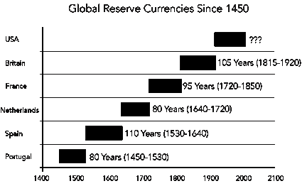
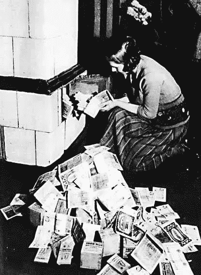

# 比特币:一代人的投资？

> 原文：<https://medium.com/coinmonks/bitcoin-a-generational-investment-88f547eb9f76?source=collection_archive---------3----------------------->

[比特币](https://blog.coincodecap.com/a-candid-explanation-of-bitcoin/) …我已经关注这种加密货币和小额美元平均成本近一年了。然而，这是*而不是*说它一直是一个‘不用动脑筋’的人。事实上，恰恰相反。我有很多疑问。去年的大部分时间都很不顺利。

当我第一次开始进入兔子洞时，我的头脑通常处于两个阵营中的一个:(1)“我是一个疯狂的人，正在赌一个‘快速致富’的计划”或(2)“比特币是一项投资的绝对独角兽，它可能能够解决世界上的大多数问题。”没有中间环节。

随着时间的推移，我在疯子营地的时间越来越少，在有独角兽的营地的时间越来越多。现在，这可能是由于沉没成本谬论。或者，比特币可能是我们一生的投资……原因不止一个。

我为我的案子辩护:

# 早期

我于 2019 年 5 月大学毕业，获得商业金融学位。我选择这条路是因为我明白，如果你想在这个世界上获得真正的“自由”，金融知识是必不可少的。然而，随着我的研究越来越深入，我开始意识到，要获得这种自由，你需要四样东西中的一种:

1.  **时间**。你需要愿意花 20 年、30 年甚至 40 年的时间朝九晚五地工作，这样你就能存够钱，以 10%的回报率退休后不再有被动收入。你也必须谨慎消费。
2.  **禀赋**。你需要出生在一个富裕的家庭，这个家庭给了你一大笔遗产。
3.  **风险承受能力**。由于投资的风险和回报潜力之间存在着不断的权衡，你需要能够忍受你可能会损失大部分资金的可能性。
4.  **专家知识**。你需要知道一些 99%的人都不知道的事情。获得这种知识需要很多年。即便如此，你利用这种不对称风险回报比的投资机会的可能性也很小。

事实证明，我并不热衷于将我生命中最好的时光花在攀登后者上。美国公民的平均退休年龄和预期寿命仅相差 15 岁，这也于事无补。

我也不是出生在一个给予我大笔捐赠基金的肮脏富有的家庭。

在我对金融和经济的研究中，我遇到了有效市场假说(EMH)。EMH 指出，跑赢市场或把握市场时机是不可能的。现在，这并不完全正确，但它确实有一定的道理。此外，显而易见的是，真正参与股票市场的唯一方法是已经拥有几十万美元(和技术)来构建一个适当的多元化投资组合或通过金融衍生品执行套利机会。

糟糕。

在我的投资组合管理课上，我们用虚拟股票交易所“假装投资”了一百万美元。我们部门没有一个小组的回报率高于 1%…

所以我最终得出结论，像我这样的普通人应该坚持被动投资，比如先锋共同基金或标准普尔 500 指数。

至少可以说令人沮丧。

然后我在 2019 年 4 月第二次遇到了比特币。当时，每枚硬币大约值 3000 美元。作为一名破产的大学生，我之前曾在场外观看了 2017 年的大牛市(而普通人在几周内成为了百万富翁)。尽管当时没有任何钱，我还是决定毕业并获得一份“大男孩”工作后的第一笔投资将是购买整个比特币…

…但那时已经太晚了。

当我的第一份薪水被直接存入我的银行账户时，比特币已经经历了又一轮牛市，涨到了 1 美元 10K 以上。

所以，我慢慢开始将美元成本平均化到投机性的加密货币中…

首先，我开始每周 50 美元。然后，我开始做一些研究。在我意识到这一点之前，比特币似乎成了一生的投资机会。我怎么也看不够。

原因如下:

# 投资机会

是钱把我拉进来的。我甚至不能撒谎。正如我们在我的最新出版物“[比特币减半基础知识](/coinmonks/bitcoin-halving-basics-53a830409ac7)”中所讨论的，比特币每四年左右就会发生一些神奇的事情:

抛物线式的价格升值。

比特币只有 10 年或 11 年的历史。然而，在这么短的时间内，它的价格上涨了 10 倍(或更多),与此同时，它的供应量减少了一半。距离下一个减半的目标还有一年时间。

所以我想分一杯羹。

此外，我还考虑到了一个关于投资的普遍真理:“专注创造财富，多样化保存财富。”当时，我没有多少财富。事实上，我欠了 3 万美元的学生贷款。将一些财富集中在一项高度投机的资产上是非常明智的。

# 全球储备货币的历史

下面的图表说明了一切。在过去的 600 年里，每一种储备货币最终都失败了。因此，认为美元在适当的时候也会贬值并不荒谬。如果是这样的话，如果比特币取代它成为全球储备货币，那么每枚比特币将价值约 1000 万美元。

假设每个比特币的价格是 10000 美元。你愿意为了赢得 1000 万美元的机会而失去 10K 吗？

这就是不对称的定义…

我不知道你怎么想，但我宁愿不赌。

# 法定货币的邪恶

以下是维基百科对法定货币的定义:*“通常由政府监管的作为货币存在的货币，但它没有内在价值。”*

(美元、欧元、人民币、日元和墨西哥比索都是法定货币的例子。)

关于法定货币，真正让我恼火的是政府可以凭空创造出来。事实上，我们已经看到美国政府在最近几个月向经济注入了高达 2.3 万亿美元的法定货币。这种刺激被称为“量化宽松”——我们将在另一个时间谈论它。现在，只要知道他们才刚刚开始。

此外，就像快克瘾君子总是需要更多的药物来获得同样的快感一样，要知道量化宽松有着重大的长期影响。

这种类型的钱——没有“内在价值”的那种——是我们所有人努力工作的报酬。我们是否也认为我们花在工作上的时间“没有内在价值？”想想看:我们中的许多人将财富储存在一种价值未知的货币中。

听着，我们不知道未来会有多少美元。因此，我们不知道我们的钱会值多少钱。如果我们不知道我们的钱值多少钱，那么我们就不能自信地认为我们为他人工作的时间得到了适当的报酬。既然我们终有一天会死去，这就引出了一个问题:*我们是在浪费时间吗？*

另一方面，我们确切地知道*现在有多少比特币。此外，我们确切地知道将来会有多少比特币。永远不会超过 2100 万。任何人都无法改变这一点。*

我们的政府很狡猾，比特币很透明。

# 我们不理解资本主义

Investopedia 是这样定义资本主义的:*“私人或企业拥有资本货物的经济体系。”*他们还提到了以下几点:*“商品和服务的生产是基于一般市场的供求关系——即所谓的市场经济——而不是通过中央计划——即所谓的计划经济或指令经济。”*

说美国是资本主义经济体，至少可以说是一种误导。鉴于我们欠其他人 25 万亿美元，我甚至可以说，我们实际上是一个基于债务的经济体。

此外，我们的商品和服务并不完全基于供求关系。我们的政府因救助濒临破产的华尔街、航空公司和大公司而臭名昭著。鉴于我们经济中的一些大部门依赖于中央计划，我甚至可以说我们在某种意义上是社会主义经济。

# 通货膨胀和坎蒂隆效应

当我们敬爱的官僚中央计划者以救助 1%的顶层人士的名义凭空印钱时，通胀不可避免地发生了。通俗地说，这就是当商品和服务的价格水平因货币供应增速快于消费增速而上涨。

像生活中的大多数事情一样，一点点通货膨胀不一定是坏事。然而，太多会导致彻底的毁灭。

通货膨胀是今天 100 美元钞票买不到 30 年前那么多东西的原因。

通货膨胀会惩罚你存进储蓄账户以备不时之需的每一美元。

如果你在 2000 年的工资是 10 万美元，而你现在没有挣到 15 万美元，那么通货膨胀正在吞噬你。

由于坎蒂隆效应，通货膨胀让穷人更穷……同时让富人更富。每当美联储救助华尔街、航空公司和大公司时，贫富差距就会扩大。

恶性通货膨胀解释了为什么德国人在一战后点着钞票取暖。这也解释了为什么今天委内瑞拉、黎巴嫩和津巴布韦等国的人们每天早上醒来都担心他们的钱一夜之间损失了多少。

A German woman lights a fire with worthless banknotes, 1923

另一方面，比特币不能被第三方膨胀。它的通货膨胀时间表不仅可以提前几年知道，而且每年都在减少。事实上，它几乎和黄金一样低——而黄金已经存在了几千年。

从某种意义上说，比特币几乎是通货紧缩的。这意味着你持有的时间越长，你购买商品和服务的价格就越便宜。你持有通货紧缩货币的时间越长，你的购买力就越强。可以这样想:*随着囤积一种通货紧缩的货币的人数增加，流通中的货币总供给减少，使得每一单位更加稀缺。在其他条件相同的情况下，一种货币越稀缺就越有价值。*

我们需要一种能长期保值的货币。我们需要用稀缺的货币来补偿我们稀缺的时间。而我们需要这种稀缺的货币以备不时之需，是因为我们无法预测未来，不知道下一个雨天何时到来。问问新冠肺炎就知道了…

听着，我*喜欢比特币本身。这一点现在可能已经很清楚了。*

但事实是，我更喜欢比特币，因为它是一种赌博，而不是 T2，而不是 T4。

> [直接在您的收件箱中获得最佳软件交易](https://coincodecap.com/?utm_source=coinmonks)

