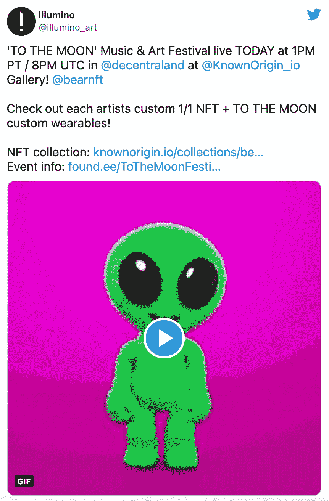
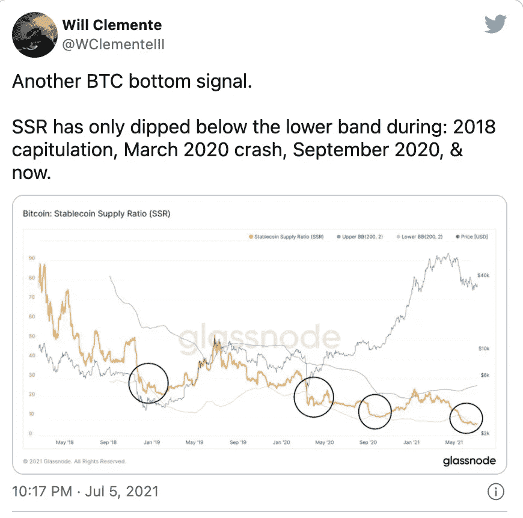

# 比特币积累/灰度解锁/全球首部 NFT 故事片

> 原文：<https://medium.com/coinmonks/bitcoin-accumulation-grayscale-unlocking-the-worlds-first-nft-feature-film-dccd6c18ad1a?source=collection_archive---------3----------------------->

Follow us on [Instagram @coincodecap](https://www.instagram.com/coincodecap/) for more Crypto Memes

## 以太坊在 Q2 2021 年结算 2.5 万亿美元交易/美国参议员倡导比特币作为退休资产

你好僧侣们，

怎么了，这是一个漫长的季度，比特币下跌，现在处于积累阶段。不要惊慌，这几乎经常发生😃。别忘了加入我们的[电报频道](https://t.me/coincodecap1)。

> "在投资中，舒适的东西很少会盈利."罗伯特·阿诺特

## **1。美国立法者购买 Dogecoin、以太坊和 Cardano**

Source [Click here](https://www.montgomeryadvertiser.com/)

最近几个月，[阿拉巴马州众议员巴里·摩尔](https://www.theblockcrypto.com/post/110616/us-congressman-buys-dogecoin-ethereum-and-cardano-amid-bull-market)购买了多种加密货币。根据目前的价值，到目前为止，他所有的加密投资都亏损了。

摩尔特别在 5 月 5 日购买了“Etherium”，随后在 5 月 10 日、11 日和 13 日购买了三次 Cardano，然后在 6 月 13 日购买了 dogecoin。

摩尔的声明没有透露他购买的每枚硬币的数量，但他们确实包括了每次购买 1000 美元至 15000 美元的范围。这表明他在购物上花费了 5000 到 75000 美元。

## **2。奥斯卡奖得主安东尼·霍普金斯的下一部电影将是 NFT**

安东尼·霍普金斯已经获得了两项奥斯卡奖。他很快就会拥有另一个独一无二的东西——一个与他的下一部电影相关的不可转让的令牌。

Enderby Entertainment 和 CurrencyWorks 合作的 VUELE 今天宣布，Hopkins 的下一部电影《零接触》(Zero Contact)将首次在该公司的 NFT 观看平台上发行。

据该公司称，这是“世界上第一部 NFT 故事片”

[source](https://twitter.com/vueledigital/status/1412811406014099462)

## **3。比特币矿工已经积累了一个多月**

Source

## **4。拥有超过 10 万 BTC 的地址数量达到了 27 个月以来的新高**

比特币巨鲸似乎正在以目前的水平储备加密货币。超过 10 万 BTC 的持有者总数仍处于 27 个月来的最高水平。这种积累似乎发生在比特币价格从 64000 美元的历史高点下跌期间。

根据链上分析和市场洞察组织[的统计，拥有超过 10 万个 BTC 的比特币地址占供应量的 3.64%。](https://twitter.com/santimentfeed/status/1413764966876803074?s=20)

Source: [Click here](https://app.santiment.net/charts?settings=%7B%22slug%22%3A%22bitcoin%22%2C%22ticker%22%3A%22BTC%22%2C%22from%22%3A%222020-07-10T07%3A00%3A00.000Z%22%2C%22to%22%3A%222021-07-11T06%3A59%3A59.999Z%22%7D&widgets=%5B%7B%22widget%22%3A%22HolderDistributionCombinedBalanceWidget%22%2C%22metrics%22%3A%5B%22price_usd%22%2C%22percent_of_holders_distribution_combined_balance_100k_to_1M%22%2C%22percent_of_holders_distribution_combined_balance_10k_to_100k%22%5D%2C%22axesMetrics%22%3A%5B%22percent_of_holders_distribution_combined_balance_100k_to_1M%22%2C%22percent_of_holders_distribution_combined_balance_10k_to_100k%22%5D%2C%22colors%22%3A%7B%22price_usd%22%3A%22%230d3b1a%22%2C%22percent_of_holders_distribution_combined_balance_100k_to_1M%22%3A%22%23FFCB47%22%2C%22percent_of_holders_distribution_combined_balance_10k_to_100k%22%3A%22%235275FF%22%7D%2C%22settings%22%3A%7B%22price_usd%22%3A%7B%22interval%22%3A%221d%22%2C%22node%22%3A%22autoWidthBar%22%7D%7D%7D%5D)

## **5。美国银行成立加密货币研究团队**

根据彭博获得的一封内部信件，美洲银行(BOFA)成立了一个新的部门，专门研究加密货币。该消息的内容得到了银行代表的证实。

阿尔凯什·沙阿是美国银行数据和创新战略小组的创始成员，他将领导新的加密团队。它将向该行全球固定收益、货币和大宗商品研究主管迈克尔·马拉斯(Michael Maras)汇报。除了加密货币，该团队还将探索数字货币相关技术。

美国银行全球研究主管坎迪斯·布朗宁在备忘录中指出:

> 加密货币和数字资产构成了发展最快的新兴技术生态系统之一。由于我们强大的行业研究分析、市场领先的全球支付平台和我们的区块链专业知识，我们在提供思想领导方面具有独特的优势。

## **6。grady Digital Large Cap Fund 成为 SEC 报告公司，因为 grady Investments 在表格 10 上提交了另外三个产品的注册声明**

[灰度投资](https://www.globenewswire.com/Tracker?data=uknMj-euyiexlMMqUdYwgzQnxKm_AaNTsztyeaeG-R05Ng2FIHzP1PnalXDByjB76otOG1yxzZEwNNWzB27yFmrX6IOCU0_rmEx_yNl0tmI6R6z4UIdSmLqNkR_HUd6NUyfEgyl8gO89NQ36DyutKIrAIEqckYYz7brLT_M1tEbWXo3S7qRNoHvMggSoT_1m)，全球最大的数字[货币资产管理公司](https://www.globenewswire.com/news-release/2021/07/12/2261212/0/en/Grayscale-Digital-Large-Cap-Fund-Becomes-SEC-Reporting-Company-As-Grayscale-Investments-Files-Registration-Statements-on-Form-10-For-Three-Additional-Products.html)和[灰度数字大盘基金](https://www.globenewswire.com/Tracker?data=uknMj-euyiexlMMqUdYwgzqJqubodAJiN4cWKghB1HmsuXpJGhG1-QjVnp59ita4aXL_p8K2jMTFQvS0SPX71LcIBJ0-tDqv3bi0mFEiOIkzc9qkQcZ_yHqlbTvi4dwqtg-zeecROoBE1VcR9PlewWFgBJB8wyDKok4uJGbiPJM=) ( [OTCQX: GDLC](https://www.globenewswire.com/Tracker?data=srl1dgGMIXuSMoQ73fNAHBt8cDqFpQPHCfwfaDrpDEB0aBG-3-wnRNQfUhwF_IB7qQVhSLb6fifHJCumITCmRUfpxLLu2gPW6H-yTI_6K9Q=) )(本基金)的管理人，今天宣布[代表本基金向美国证券交易委员会(SEC)提交](https://www.globenewswire.com/Tracker?data=9fL4MWw6P3v_a3NryseATz41VsC6ZbdOXv0Y-oyrynPxv9EgK9MxMNPwavmhRkUYkRMziR5TAr79NLmkUD55TZmpFDYx0Idzpha5a9U8202AVpUBLnnC6MM3CN5fYcL3wLj0lDmrGugraGIZOgxdMrBxkLwegdRjG5sge_-5-WQyMPPzBhHa-DqKiu-IT2QPTST2LzeSxUOJ5RWvYpCdJoXriKb1mKqikpRNrME5Wbk7Layw40Fh4LYLZ0FWI4YWGbb6yRdAFq52fEIIeD-OB5WQ53u3gffHfq-IJ0dmXqTv8ARM-doKfdaK1a5g6JvKby8CGI6f4x-vjjziXEo9bQ==)的表格 10 上的登记声明已经生效。

该基金是灰度的第一个多元化数字货币投资基金，成为 SEC 报告公司，其股份根据 1934 年证券交易法(修订版)(“交易法”)第 12(g)节注册。*

灰度今天还宣布，它已经代表[灰度比特币现金信托](https://www.globenewswire.com/Tracker?data=uknMj-euyiexlMMqUdYwg_URUj7Vq8da0PCSnrgrpBznALensXiy0IfxbeGW8nCXJ_N59vMRevz8nuCZLVALDNYRF5YK6kTLzBwVveLNsXYE2gRF48b6gHXZoXO-_A_YzsV3e20OzOD132eRFRleoMwhf2JqN-k2HnnD_CKMkCwATXs0ykihHEaHhVG85Zuxq21QbB9S8lnNUyWQq8ihnPuVQ7QcWtyRUeE3Q2VHw9pUgl-_nV0ZsQkBXJ8U9bDA) *、[灰度**、**以太坊经典信托](https://www.globenewswire.com/Tracker?data=uknMj-euyiexlMMqUdYwg9JwMNy_KLvMcji3B3mxJvEn60uXL2j2QiI6dYQVAKUyiukC1n3dc5ISkYBv-BBHXCPa5eXy3CUV-I-JxQwhVw3fFOlnqV7yxC9yBrx3640WE0hEASpjEbPEObWDsguWHw5jmDX3h4HN98U_c2SfF8xIyvNi4Djgnk4MASxoZFIqljZuF0bQFKWsP901Xl9gm9RywWANzp1kW0ogeOIlm4FbBzi_QJDZFOeDS7LhOSst) *、和[灰度莱特币信托](https://www.globenewswire.com/Tracker?data=uknMj-euyiexlMMqUdYwg834Ret-I2gqm3N7bUcw2MuWXPkxZR_KHUUJ_E11_ND9DNj9uH7xFp8jCxVpUeVUsMI5x2fNV0XCpmWoidnHtyfEpq3T7OaHcyyKcKydzbmv5R-wM1Tw6ZMPwDsU-XB8c-JISG27FiowgRzo5QMT0BWlCa6jp4bBnsPF429BDNNLsefmZAYouspFkAbP2S1qraCPS9WEg1akwVUKuIjqd8U=) *向 SEC 公开提交了三份关于 Form 10 的额外注册声明。公司已经有两个 SEC 申报产品:[灰度比特币信托](https://www.globenewswire.com/Tracker?data=uknMj-euyiexlMMqUdYwgxRccYdXTIgOLDCG15U4UWWN3YX3JAv_-WhdMljR2kxrMAh6lKsIFqHymUdxr7ewXoJ9_YhbZEON1W8pMCQBEhv0whYU8peo-ekszM30Ec6gcjevrYovX1ki-ECC2mhDYQ==)和[灰度以太坊信托](https://www.globenewswire.com/Tracker?data=uknMj-euyiexlMMqUdYwg5gH7gCtTnKjd53ERT7iQzmwYLbtNVLGASA9xCbAovcmCRGgCRkLmNd-atlkrEhYPdUgGnw9P-ogaxXkOglyzM6PqiWm_p0r1yn6yf_Aef5QEUFkngW3XsNCsPQx9panmQ==)。

## **7。华纳兄弟进入 NFT 空间**

Source: [Click here](https://www.google.com/search?q=Warner+Bros+moves+into+NFT+space&rlz=1C1GCEV_en&sxsrf=ALeKk009vdQcGgqIOAEFNHlh6L7f7jTjVg:1626696480280&source=lnms&tbm=isch&sa=X&ved=2ahUKEwig2fTOjO_xAhWjH7cAHS58AbcQ_AUoAnoECAEQBA&biw=1707&bih=770&dpr=1.13#imgrc=O8rZBn8scJjseM)

Nifty's 与华纳兄弟公司合作，为将于 7 月 16 日上映的《太空堵塞:新遗产》开发了 92，000 件 NFT 收藏品。

任何在 Nifty 上注册并访问 Space Jam 2 画廊的人都将获得一个免费的 Space Jam NFT。(正常价格是每件 2.99 美元。)NFT 有 2D 和 3D 两种格式，以电影中的十几个角色为特色，包括勒布朗·詹姆斯、巴哥和萝拉·邦妮。

鼓励用户在社交媒体上分享 NFT，如果他们这样做，将获得另一个空间堵塞 NFT 的奖励。所有的 NFT 都是随机选择的，并且具有不同程度的稀有性。除了免费赠品，用户每天只能购买一个 NFT。

## **8。交易员从交易所提取比特币**

交易员每天从中央交易所提取 2000 BTC。

根据 Glassnode 的周一[“The Week On-Chain”](https://insights.glassnode.com/the-week-on-chain-week-28-2021/)时事通讯，集中交易所的比特币余额已跌至自 4 月以来的最低水平，当时 BTC 达到超过 65000 美元的历史高点。

## **9。以太坊在 Q2 2021 年结算了 2.5 万亿美元的交易**

Source: [Click here](https://twitter.com/RyanWatkins_/status/1415314367860682756)

## 10。稳定的硬币活动激增

梅萨里表示，2021 年 Q2 的稳定货币基础将超过 1070 亿美元，比 Q1 增长 70%，同比增长 800%。这三个月期间，稳定的硬币交易量达到 1.7 万亿美元，同比增长 1090%，自 Q1 以来增长 59%。

根据透明组织的报告，Tether 的总供应量为 624 亿英镑，比年初增长了 197%。其中不到一半，即 309 亿 USDT，属于 ERC-20 代币标准。拥有 320 亿 USDT 的 Tron 网络上有更多。

## **11。以太坊基金会发布官方声明**

以太坊 EIP 1559 伦敦升级版已在 testnet 上成功测试，并准备好在[以太坊主网](https://blog.ethereum.org/2021/07/15/london-mainnet-announcement/)上激活

## **12。美国参议员提倡将比特币作为退休资产**

Source : Watch the full interview by [clicking here](https://www.youtube.com/watch?v=IykZldPVeR0)

参议员 Cynthia Lummis (R-Wyo)与美国消费者新闻与商业频道的 Ylan Mui 谈论了她为什么投资比特币以及为什么加密应该成为退休计划的一部分。

用她的话说，“我认为它是一种巨大的价值储存手段，但我现在不认为它是一种交换手段。所以我想购买并持有，我鼓励人们购买并持有，我鼓励他们说比特币是为了他们的退休，为了他们的未来，这是因为国会花费了数万亿美元，用美元淹没我们的经济和世界经济”

参议员接着说，“作为多样化的一部分，从长远来看，比特币是最强大的价值储存手段之一。”

引人深思:在过去的 9 年里，比特币已经被宣布死亡超过 400 次。它从 fud 中复活了，甚至更加强大。2008 年的说法是，人民币可能成为全球货币，但最新的说法要好得多，即机构将人民币视为一种资产。

## 13。迈克尔·塞勒&比特币采矿委员会结果

比特币矿业委员会 Q2 简报的议程是可再生能源，比特币矿业能源消耗统计

Source: [Click here](https://twitter.com/michael_saylor/status/1410340492571783170)

全球比特币采矿委员会获得了巨大的声誉，因为它得到了迈克尔·塞勒的支持，23 家采矿公司加入了他们的咨询小组，占网络的 32%。

***执行摘要***

比特币采矿使用的能源可以忽略不计，正在迅速变得更加高效，并且由比任何主要国家或行业都更高的可持续能源组合驱动。

为了维持采矿和网络效应，并获得利润，不可避免的是，采矿者无法选择可再生能源而不是化石燃料，这种适应正在一个强劲的阶段发生。

**Q1 Vs Q2 2021 年 Q2 比特币挖矿指标，可持续能源组合达到 56%**

[Source](https://bitcoinminingcouncil.com/)

## **14。分散到以太坊举办 VR 音乐节**

利用以太坊技术，世界上第一个虚拟的月球音乐节于本周日在分散地举行。

这个节日的发起是著名的 NFT 市场 [KnownOrigin](https://knownorigin.io/) 、NFT 机构 [BEAR NFT、](https://www.bear-nft.com/)和 Illumino NFT 集体合作的结果，并且是来自不可替代的 Token (NFT)社区的一个团体。

[Source Click here](https://twitter.com/illumino_art/status/1414263864389115905)

这种合作是为了应对新冠肺炎疫情导致的现场音乐活动的低迷，这导致了格拉斯顿伯里等主要音乐节的取消。

该活动将在 KnownOrigin 位于分散地的虚拟总部举行，这是一个基于以太坊的虚拟现实世界，将由 Ookay、Fred Thurst、SNBRN、Autograf 和 Win and Woo 等艺术家进行现场在线音乐表演。

Source: [Click here](https://twitter.com/KnownOrigin_io/status/1411799716082466816?ref_src=twsrc%5Etfw%7Ctwcamp%5Etweetembed%7Ctwterm%5E1411799716082466816%7Ctwgr%5E%7Ctwcon%5Es1_&ref_url=https%3A%2F%2Ffinance.yahoo.com%2Fnews%2Fworld-first-vr-music-festival-140919845.html)

与会者可以期待的不仅仅是音乐，因为组织者已经宣布了一系列独家 NFT，将在整个音乐节上提供。

Source: [Click here](https://twitter.com/AviAisenberg/status/1411827517929971716?ref_src=twsrc%5Etfw%7Ctwcamp%5Etweetembed%7Ctwterm%5E1411827517929971716%7Ctwgr%5E%7Ctwcon%5Es1_&ref_url=https%3A%2F%2Ffinance.yahoo.com%2Fnews%2Fworld-first-vr-music-festival-140919845.html)

## **15。随着人们对伦敦硬叉子的热情日益高涨，以太坊的价格已达到两周高点。**

周日，市值第二大的加密货币达到 2350 美元的高点，为 6 月 18 日以来的最高水平。投资者对 ETH 的渴望受到比特币价格稳定性和对主要协议更新的预期的推动。

周五 2.3 亿美元的以太(ETH)期权到期似乎改变了市场情绪，有利于多头，至少暂时如此，因为投资者对即将到来的伦敦硬分叉以及比特币(BTC)形成强劲底部的可能性保持谨慎乐观。

Source: [Click here](http://www.tradingview.com/)

6 月 24 日，以太坊的伦敦硬分叉，包括广泛期待的以太坊改进提案 1559，在 Ropsten testnet 上上线，为 7 月晚些时候的全面 mainnet 部署铺平了道路。

由于许多建议的增强，预计硬分叉将提高以太的价值，包括转向环保的股权证明共识和新的“稀缺”功能，该功能将限制流通中的令牌数量。

## **16。Dogecoin 派对常客在百万 DOGE 迪斯科舞厅免费跳舞**

百万 Doge 迪斯科舞厅于 2021 年 7 月 3 日首次亮相，来自世界各地的成千上万的人已经加入了这一有趣的活动。

发布了一款面向 Dogefans DOGE 和 NFTs 的增强现实游戏。
凯尔·肯珀，贾斯廷·特鲁多同父异母的弟弟，是这个游戏的创作者之一。
派对常客目前正在提交流行视频。

昨天(2021 年 7 月 3 日)，随着“百万 Doge 迪斯科”正式开始，全世界的人们都开始庆祝 Dogecoin。

这款增强现实智能手机游戏类似于舞会和口袋妖怪 Go 的结合，邀请用户拍摄自己与动画柴犬跳舞的视频，并在整个城镇寻找宝藏，以赢得不同的 DOGE NFTs，以及价值 25 万美元的 100 万只 Dogecoins 的奖励。

准派对爱好者可以在 Doge Disco 网站上注册一个 Disco Doge NFT，也称为“Dogeagotchi”。Dogeagotchis 可能会获得 Dogecoin，定期发布 Doge 知识，并寻找隐藏在增强现实中的 NFT 物体。Dogeagotchi 和电子鸡一样，需要主人的定期照顾和关注。理论上讲，受到良好照顾的狗比那些被允许挨饿的狗更值钱。

Source: [Click here](https://twitter.com/DogeDisco/status/1400941568547123200?ref_src=twsrc%5Etfw%7Ctwcamp%5Etweetembed%7Ctwterm%5E1400941568547123200%7Ctwgr%5E%7Ctwcon%5Es1_&ref_url=https%3A%2F%2Fdecrypt.co%2F75186%2Fdogecoin-partygoers-dance-for-free-doge-at-million-doge-disco)

## **17。Polygon 推出 MakerDAO Vault 并承诺 5000 万美元的自动代币**

根据 Polygon 的说法，Maker 网络现在将有速度优化库。周三，区块链启用的协议(原名 Matic Chain)宣布，它将“在 Maker 中打开一个金库”，并根据批准的美国国债流动性，向 Matic 代币投资 5000 万美元。

随着最近的合并，该协议的范围、目标和转型已经发展成为以太坊规模的聚合器。

Source: [Click here](https://twitter.com/sourcex44/status/1410289455181668354)

## 18。Chainlink 目前共有 617 个集成

Source: [Click here](https://twitter.com/TheLinkMarine1/status/1411034869279375366?ref_src=twsrc%5Etfw%7Ctwcamp%5Etweetembed%7Ctwterm%5E1411034869279375366%7Ctwgr%5E%7Ctwcon%5Es1_&ref_url=https%3A%2F%2Fwww.redditmedia.com%2Fmediaembed%2Focgtm3%3Fresponsive%3Dtrueis_nightmode%3Dfalse)

## **19。通过一项新协议，EY 试图解决以太坊的燃气费问题**

[EY 推出《夜幕降临 3》](https://www.ey.com/en_gl/news/2021/07/ey-contributes-a-zero-knowledge-proof-layer-2-protocol-into-the-public-domain-to-help-address-increasing-transaction-costs-on-ethereum-blockchain),帮助区块链以太坊变得更加实惠。

《夜幕降临 3》是 2019 年对原《夜幕降临协议》的更新。该协议采用零知识证明(ZKP)结合乐观汇总。

在需求旺盛的时候，以太坊的可伸缩性限制可能会导致异常昂贵的交易费用。

用户在经济上被鼓励挑战有缺陷的第 2 层块，以便确保只有正确形成的第 2 层块被集成到最终的区块链记录中。当发送质询时，智能合约会判断质询的准确性，奖励正确的质询并消除错误的第 2 层块。

夜幕 3 可以实现每笔交易约 8200 美元的成本，同时通过使用 ZK 乐观的汇总保持匿名。这几乎是传统的公共 ERC20 令牌传输成本的八分之一。

nighth 3 还旨在为希望实现隐私的开发人员缩短学习曲线，为他们提供一个标准化的应用程序编程接口(API)，看起来与其他令牌传输解决方案类似。

## 20。鲸鱼买比特币！！

“鲸鱼实体”持有的比特币供应量已达到两个月来的最高水平，显示出看涨趋势。

上周五，鲸鱼实体持有的硬币数量增加了 8 万多，达到 421.6 万 BTC，为 5 月份以来的最高水平。

鲸鱼实体的数量也在最近三周增加到三周以来的最高值 1922 个。

鲸鱼实体积累的增加对市场来说是个好消息，因为这些富裕的投资者在 2021 年 2 月之前的五个月里推动比特币从 1 万美元上涨到大约 6 万美元。

在牛市期间，鲸鱼实体拥有的余额与价格同步增长，在 2 月 8 日达到创纪录的 454.2 万英镑。
在接下来的几个月里，鲸鱼开始抛售，给牛市浇了一盆冷水，到 5 月初，它们的比特币持有量下降了 8%，至 417 万 BTC。

## **21。Aave 将于 7 月开始对机构进行许可展示**

领先的去中心化金融(DeFi)货币市场 aave[公布了路线图](https://cointelegraph.com/news/aave-to-launch-permissioned-deployment-for-institutions-in-july)，本月将为机构投资者推出其平台的许可版本。

该平台将与加密保管人和服务提供商 Fireblocks 合作推出。

Source : [Click here](https://twitter.com/TraderNoah/status/1411719489947906048?ref_src=twsrc%5Etfw%7Ctwcamp%5Etweetembed%7Ctwterm%5E1411719489947906048%7Ctwgr%5E%7Ctwcon%5Es1_&ref_url=https%3A%2F%2Fcointelegraph.com%2Fnews%2Faave-to-launch-permissioned-deployment-for-institutions-in-july)

在首次亮相时，Aave Pro 将只支持四种资产:比特币(BTC)、以太(ETH)、Aave 和美元币(USDC)，其池与 Aave 的其余部分分开。

该平台将在其 v2 智能合约中添加一个白名单层，以确保 Aave Pro 仅可由通过 Fireblocks“了解您的客户”验证的“机构、企业和金融科技公司”访问。Fireblocks 还将负责 Aave Pro 的反洗钱和反欺诈措施。

通信中还提到了未来分散对 Aave Pro 控制权的雄心。

## **22。怀俄明州是美国第一个在法律上承认道的州**

怀俄明州已经成为美国第一个授权并在法律上承认分散自治组织(DAO)的州。

当[美国 CryptoFed DAO](https://www.americancryptofed.org/) 从怀俄明州州务卿办公室得到通知，它已经被承认为合法的企业组织时，这一举动成为正式的。

“怀俄明州是美国领先的数字资产管辖区，现在有了 DAO 法律，怀俄明州可以说是世界上最大的区块链管辖区，这意味着创造一种真正被大众接受的数字货币现在是可能的。”— Marian Orr，美国 CryptoFed DAO 的首席执行官

怀俄明州也在今年早些时候成为美国第一个立法承认 DAOs 为一种特殊类型的有限责任公司(LLC)的州。

Source: [Click here](https://twitter.com/CaitlinLong_/status/1384991490531729410?ref_src=twsrc%5Etfw%7Ctwcamp%5Etweetembed%7Ctwterm%5E1384991490531729410%7Ctwgr%5E%7Ctwcon%5Es1_&ref_url=https%3A%2F%2Ffinance.yahoo.com%2Fnews%2Fwyoming-becomes-first-us-state-143455445.html)

## 23。另一个 BTC 底部信号

Source: [Click here](https://twitter.com/WClementeIII/status/1412090886037684224)

比特币看起来很稳定，瑞士联邦理工学院正在经历供应冲击

## **24。以太坊供应类固醇休克！！？？**

所有 ETH 交易所的储备持续下降，并在去年达到最低点，为 1982.72 万英镑。同时，ETH2.0 存款合约的有效余额增加，达到 611.424 万。

Source: Crypto Quant

Source: Crypto Quant

EIP1559 将启动稀缺

## **25。NFT 热创下历史新高，2021 年迄今为止销售额已达 25 亿美元**

2021 年上半年，NFT 的销售额增长了 18，000%以上，仅在 6 月份，不可替代的代币就创造了 1.5 亿美元的收入，是去年上半年的 11 倍。

根据路透社援引的 Dune Analytics 统计数据，6 月份是 OpenSea 上不可替代代币(NFT)市场创纪录的一个月，OpenSea 是最大的不可替代代币市场。门户网站记录了近 1.5 亿美元的 NFT 销售额。这是前一年前六个月市场总销售额的 11 倍以上，即 1000%。

## **26。EIP 1559 重点外卖**

1.  以太坊的 EIP-1559 更新预计将于 8 月 4 日在[发布。](https://www.reddit.com/r/CryptoCurrency/comments/miffab/10_key_takeaways_of_ethereum_eip1559_and_why_eth/)
2.  EIP-1559 是迄今为止最令人期待的以太坊改进之一。
3.  它将对每一笔交易强制征收汽油费，使费用更可预测，并增加 ETH 的稀缺性。
4.  它将作为区块链伦敦硬分叉的一部分发行。

## 27。4000 家德国机构基金现在可以将其投资组合的 20%投资于加密货币资产

Source: [Click here](https://news.bitcoin.com/4000-institutional-funds-germany-invest-20-of-portfolios-crypto-assets/)

1.  备受期待《基金定位法》(Fondsstandortgesetz)将于 7 月 1 日在德国生效。4 月 22 日，德国联邦议会批准了这项立法。
2.  这项立法适用于大约 4，000 个此类特别基金。根据 BVI Investments 的数据，截至 2020 年 12 月底，1.88 万亿欧元(2.23 万亿美元)投资于开放式特殊基金，不包括特殊的房地产基金。
3.  这一规定允许新的和现有的国内特别基金(Spezialfonds)将其持有的 20%投资于比特币等加密资产。

## **28。自 10.3k** 以来的最高库存水平

比特币在 6000 至 12000 BTC 的范围内非常活跃，现在在 33000 至 35000 美元的 BTC，有望为比特币提供强有力的支持

Source: [Click Here](https://twitter.com/WClementeIII/status/1412812724124389381)

## **29。灰度的大 GBTC 解锁**

请点击此处阅读已经发表的文章

## **三十。圣马力诺批准 VeChain 上的区块链“Covid 证书”**

圣马利诺议会已授权奖励绿色疫苗接种通行证，该通行证采用 VeChain 技术和不可替代的硬币(NFT)。

7 月 1 日[发布了许可](https://www.dnv.com/news/san-marino-approves-national-green-pass-allowing-citizens-and-residents-to-move-freely-203736)，同时还描述了该系统如何使用二维码和不可替代的令牌工作。通过连接到区块链公共汽车上的 NFT，可以读取二维码来验证有效性。

**PoA 共识支持**

数字证书是一种便携式解决方案，任何人都可以验证它，而不需要下载特殊的软件。DNV 创新与增长全球总监 Renato Grottola 补充道:

> *“使用 VeChain 的区块链技术，特别是不可替代的代币，可以增强对信息真实性的信心，降低伪造风险。”*

我们已经看到机构支持加密，尤其是比特币和以太坊。我们现在正慢慢见证一些国家采用区块链技术。

收养是不可避免的。

***作者* : Eth！c@l 又名库马尔**

关注我们 [**Instagram**](https://www.instagram.com/coincodecap/) ， [**Twitter**](https://twitter.com/coinmonks) ， [**Telegram**](https://t.me/coincodecap1) 。