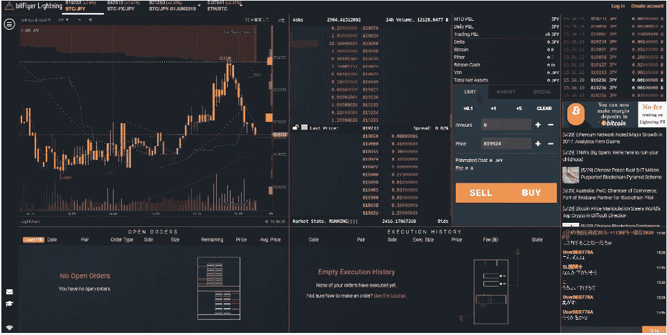
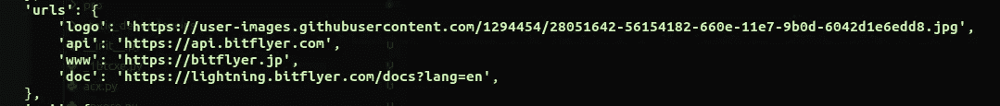
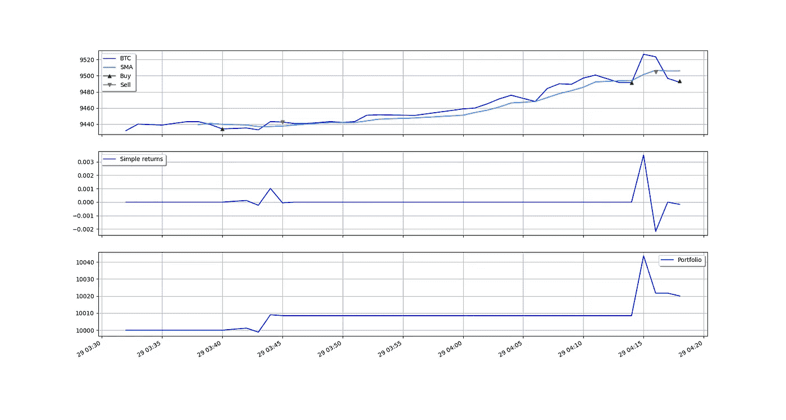

# 使用 bitFlyer Lightning APIs 的比特币累加器交易机器人

> 原文：<https://medium.com/coinmonks/bitcoin-accumulator-trading-bot-using-bitflyer-lightning-apis-eeb99243f3b5?source=collection_archive---------1----------------------->



[Source](https://blog-eu.bitflyer.com/bitcoin-accumulator-trading-bot-using-bitflyer-lightning-apis/)

在本文中，我们将学习如何使用[bitFlyer Lightning API](https://lightning.bitflyer.com/docs)构建一个交易机器人。我们将根据[简单移动平均线](https://en.wikipedia.org/wiki/Moving_average#Simple_moving_average)制定策略来积累比特币。此外，我们还将对我们的交易机器人进行回溯测试和优化。

[bitFlyer lightning](https://lightning.bitflyer.com/) 是一个加密交易平台，主要支持[比特币](https://blog.coincodecap.com/a-candid-explanation-of-bitcoin/)的现货和期货市场。

bitFlyer 为他们的交换提供了丰富的 API。你需要注册并验证你的账户才能访问 bitFlyer 的 API。

## 如何使用 bitFlyer 的 API？

bitFlyer lightning 为访问 exchange 数据提供了 Rest APIs 和 Websockets。

[在这里](https://lightning.bitflyer.com/docs/api)，您可以访问完整的文档。此外，我们还提供了一个 [API Playground](https://lightning.bitflyer.com/docs/playground#GETv1%2Fgetmarkets/javascript) ，使用它你可以直接从你的浏览器调用我们的 API。

我们用一个例子来理解。

## 获得市场

为了在 bitFlyer exchange 上获得市场，我们需要调用`[markets](https://lightning.bitflyer.com/docs/api#market-list)` API。在下面的例子中，我们调用了`markets` API 并将结果解析成 JSON 格式。

## 获得平衡

现在，让我们看一个例子，其中我们将需要我们的 API 密钥和秘密。这一次，我们将从 bitFlyer lightning exchange 获得我们的余额。

为了完成这个，我们需要调用`[getbalance](https://lightning.bitflyer.com/docs/playground#GETv1%2Fme%2Fgetbalance/javascript)` API。该请求需要[认证](https://lightning.bitflyer.com/docs/api#authentication)。

因此，我们需要传递包含以下字段的头。

*   内容类型—应用程序/json
*   访问密钥—您的 API 密钥
*   访问时间戳— Unix 时间戳
*   访问标志—签名

这里创造签名是唯一棘手的部分。为了准备它，我们需要创建一个包含 4 个参数的字符串。

*   当前时间戳
*   请求类型(ex- Get，POST)
*   我们正在调用的 API
*   请求正文

然后，我们需要准备一个加密签名，如下所述。

```
signature = hmac.new(secret.encode('utf-8'), text.encode('utf-8'), hashlib.sha256).hexdigest()
```

这里，`secret`是我们的 API Secret，它是我们从 bitFlyer 获得的，text 是我们使用上面提到的 4 个参数准备的字符串。

要查看结果，只需在下面的脚本中添加您的 API 密钥和密码并运行它。

## 建筑交易机器人

现在，我们知道如何直接调用 bitFlyer APIs，我们将把它留在那里。现在，我们将开始构建我们的交易机器人，但是，为此，我们将使用一个名为 [CCXT](https://github.com/ccxt/ccxt) 的库，它已经提供了一种访问 bitFlyer 交换 API 的简单方法。

## 先决条件

要阅读这一部分，您必须有一些编程经验。我们将安装以下库来获取 bitFlyer 数据并编写我们的交易策略。

*   [CCXT](https://github.com/ccxt/ccxt) —一个使用加密交换 API 的开源库。
*   [Pyalgotrade](https://gbeced.github.io/pyalgotrade/) —算法交易者的开源库。

**注意:**我用的是 Ubuntu 18.10 和 Python3.8。

## 项目设置

让我们现在建立我们的项目。如果没有`python`，需要安装。你可以按照 [**这些**](https://www.digitalocean.com/community/tutorials/how-to-install-python-3-and-set-up-a-programming-environment-on-ubuntu-18-04-quickstart) 的指令去做。此外，该指南还帮助您使用 python 虚拟环境，因此您不必全局安装项目依赖项。

1.  创建目录

```
mkdir bitFlyer-trading-botcd bitFlyer-trading-bot
```

2.设置并激活 python 环境

```
python3.8 -m venv envsource env/bin/activate
```

3.我们还需要一些额外的库，让我们把它们安装到

```
pip3.8 install ccxt
pip3.8 install pyalgotrade
pip3.8 install pandassudo apt-get install python3.8-tk
```

**注:**写这篇文章的时候，**`ccxt`库中有一个 bug。目前，它没有指向最新的 bitFlyer API 端点。要纠正这种情况，请遵循以下步骤:**

```
nano env/lib/python3.8/site-packages/ccxt/bitflyer.py
```

**将`api`参数更改为`‘api’: ‘[https://api.bitflyer.com'](https://api.bitflyer.com')`。它应该如下图所示。**

****

## **提取数据**

**现在，我们将使用`ccxt`库获取 bitFlyer 蜡烛数据。因此，在目录中创建一个名为`bitflyer-fetch-ohlcv-to-csv.py`的文件，并复制粘贴下面的代码。**

**粘贴后，运行下面的命令来运行文件，它将获取 bitFlyer 1 分钟蜡烛数据并保存在一个名为`sampledata.csv`的文件中**

```
python3.8 bitflyer-fetch-ohlcv-to-csv.py
```

## **建筑策略**

**我们将创建一个策略来积累比特币。因此，我们的策略将帮助您使用简单移动平均线(SMA)确定进入市场的最佳价格。**

**我们会找到购买比特币的最佳价格抵消。此外，我们还将配置以下参数。**

*   **可用于交易的资本— 90，000(在我们的示例中)**
*   **我们将如何计算 SMA**
*   **购买百分比(buy_percent) —可用于购买比特币的余额的最大部分**
*   **价格补偿(offset)——进入和退出市场的价格补偿**

**这里我们使用了`pyalgotrade`，一个用于回溯测试交易策略的 python 库。**

**现在，创建一个名为 accumulator.py 的文件，并复制粘贴以下代码。**

## **回溯测试策略**

**[回溯测试](https://en.wikipedia.org/wiki/Backtesting)是使用历史数据测试你的策略。现在，是时候对我们的策略进行回溯测试了。此外，我们还将绘制回溯测试的结果。**

**为此，我们将创建一个名为`strategy.py`的文件，并复制粘贴代码。**

## **运行回溯测试**

**现在，使用下面的命令运行回溯测试。**

```
python3.8 strategy.py
```

**它会弹出一个图表图像。这将显示以下信息**

1.  **标有进场和出场位置的价格和 SMA**
2.  **我们的投资组合表现**
3.  **从我们的战略中获得回报**

****

**Backtest Results**

## **优化战略**

**当然，您可以调整不同的参数(buy_offset，buy_percent)来优化回报。然而，我们将编写一个简单的程序来检查所有不同的参数组合。**

**为此，创建一个名为`optimiser.py`的文件，并复制粘贴以下代码。**

**现在，让我们运行这个文件**

```
python3.8 optimiser.py
```

**它将输出`buy_percent`和`buy_offset`的组合，这将为我们的策略提供最佳回报。**

## **包扎**

**让我们回顾一下今天所做的事情。我们使用简单的移动平均线创建了一个简单的比特币累加器策略。然后，我们对我们的进行回溯测试，并优化我们的策略以获得最佳回报。**

**你可以在 [Github](https://github.com/buddies2705/bitflyer-trading-bot) 上找到我们交易机器人的完整代码。此外，检查一下[bit flyer lightning API](https://lightning.bitflyer.com/docs)来创建你自己的交易策略。**

## **另外，阅读**

*   **[最佳加密交易机器人](/coinmonks/whats-the-best-crypto-trading-bot-in-2020-top-8-bitcoin-trading-bot-c16adeb13317)**
*   **[Deribit 审查](/coinmonks/deribit-review-options-fees-apis-and-testnet-2ca16c4bbdb2) |选项、费用、API 和 Testnet**
*   **[FTX 密码交易所评论](/coinmonks/ftx-crypto-exchange-review-53664ac1198f)**
*   **最好的比特币[硬件钱包](/coinmonks/the-best-cryptocurrency-hardware-wallets-of-2020-e28b1c124069?source=friends_link&sk=324dd9ff8556ab578d71e7ad7658ad7c)**
*   **[密码本交易平台](/coinmonks/top-10-crypto-copy-trading-platforms-for-beginners-d0c37c7d698c)**
*   **最好的[加密税务软件](/coinmonks/best-crypto-tax-tool-for-my-money-72d4b430816b)**
*   **[最佳加密交易平台](/coinmonks/the-best-crypto-trading-platforms-in-2020-the-definitive-guide-updated-c72f8b874555)**
*   **最佳[加密贷款平台](/coinmonks/top-5-crypto-lending-platforms-in-2020-that-you-need-to-know-a1b675cec3fa)**
*   **[莱杰 vs 特雷佐](/coinmonks/ledger-vs-trezor-best-hardware-wallet-to-secure-cryptocurrency-22c7a3fd391e)**
*   **[bits gap review](/coinmonks/bitsgap-review-a-crypto-trading-bot-that-makes-easy-money-a5d88a336df2)——一个轻松赚钱的加密交易机器人**
*   **为专业人士设计的加密交易机器人**
*   **[PrimeXBT 审查](/coinmonks/primexbt-review-88e0815be858) |杠杆交易、费用和交易**
*   **HaasOnline 评论享受九折优惠**
*   **Bitmex 保证金交易的白痴指南**
*   **[eToro 评论](/coinmonks/etoro-review-78807ddeb33c) |交易股票、密码、交易所交易基金、差价合约和商品**
*   **[Bitmex 高级保证金交易指南](/coinmonks/bitmex-advanced-margin-trading-guide-2270c195ce25?source=friends_link&sk=1d986cca731f5084b9a2db4a4bc4a7ad)**
*   **开发人员的最佳加密 API**
*   **[加密套利](/coinmonks/crypto-arbitrage-guide-how-to-make-money-as-a-beginner-62bfe5c868f6)指南:新手如何赚钱**
*   **顶级[比特币节点](https://blog.coincodecap.com/bitcoin-node-solutions)提供商**
*   **最佳[加密制图工具](/coinmonks/what-are-the-best-charting-platforms-for-cryptocurrency-trading-85aade584d80)**
*   **了解比特币最好的[书籍有哪些？](/coinmonks/what-are-the-best-books-to-learn-bitcoin-409aeb9aff4b)**

> **[在您的收件箱中直接获得最佳软件交易](https://coincodecap.com?utm_source=coinmonks)**

**[](https://coincodecap.com?utm_source=coinmonks)**