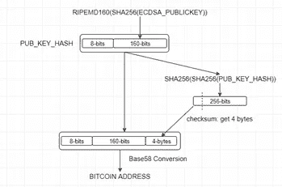

# Python 上的比特币地址生成

> 原文：<https://medium.com/coinmonks/bitcoin-address-generation-on-python-e267df5ff3a3?source=collection_archive---------0----------------------->

itcoin 是 2009 年 1 月创建的一种数字货币。它遵循了神秘的匿名开发者中本聪在白皮书中提出的想法。比特币地址是一个唯一的标识符，充当加密货币可以被发送或持有的虚拟位置。交易提供在保存私钥和比特币地址的[比特币钱包](https://blog.coincodecap.com/tag/bitcoin-wallet/)之间转移资产。私钥确保交易来自钱包的所有者。离线生成比特币地址是可能的。这段代码解释了如何一步一步地生成比特币地址。如下图所示，生成[比特币](https://blog.coincodecap.com/tag/bitcoin/)地址时有一些操作。



让我们开始考察如何才能生成比特币地址；

*   **第一步:**使用椭圆曲线数字签名算法生成私钥是因为公钥密码提供了比特币的签名原理。

```
ecdsaPrivateKey = ecdsa.SigningKey.generate(curve=ecdsa.SECP256k1)
print("ECDSA Private Key: ", ecdsaPrivateKey.to_string().hex())
```

*   **第二步:**由于公钥加密，我们需要依赖于私钥的公钥。所以我们也用椭圆曲线数字签名算法来生成它。

```
ecdsaPublicKey = '04' +  ecdsaPrivateKey.get_verifying_key().to_string().hex()
print("ECDSA Public Key: ", ecdsaPublicKey)
```

*   **步骤 3:** 我们将 SHA256 应用于在*步骤 2* 中创建的 ECDSA 公钥。

```
hash256FromECDSAPublicKey = hashlib.sha256(binascii.unhexlify(ecdsaPublicKey)).hexdigest()
print("SHA256(ECDSA Public Key): ", hash256FromECDSAPublicKey)
```

*   **步骤 4:** 我们将 RIDEMP160 应用于在*步骤 3* 中创建的值，并获得 20 字节的值。

```
ridemp160FromHash256 = hashlib.new('ripemd160', binascii.unhexlify(hash256FromECDSAPublicKey))
print("RIDEMP160(SHA256(ECDSA Public Key)): ", ridemp160FromHash256.hexdigest())
```

*   **步骤 5:** 我们将 00 作为网络字节添加到在*步骤 4* 中创建的值中。

```
prependNetworkByte = '00' + ridemp160FromHash256.hexdigest()
print("Prepend Network Byte to RIDEMP160(SHA256(ECDSA Public Key)): ", prependNetworkByte)
```

*   **步骤 6:** 我们将双精度 SHA256 应用于在*步骤 5* 中创建的值，以进行校验和检查。

```
hash = prependNetworkByte
for x in range(1,3):
    hash = hashlib.sha256(binascii.unhexlify(hash)).hexdigest()
    print("\t|___>SHA256 #", x, " : ", hash)
```

*   **步骤 7:** 我们得到在*步骤 6* 中创建的 4 个字节的值作为校验和。

```
cheksum = hash[:8]
print("Checksum(first 4 bytes): ", cheksum)
```

*   **步骤 8:** 我们将在*步骤 7* 中创建的校验和值附加到在步骤#5 中创建的值上。

```
appendChecksum = prependNetworkByte + cheksum
print("Append Checksum to RIDEMP160(SHA256(ECDSA Public Key)): ", appendChecksum)
```

*   **第 9 步:**我们对在*第 8 步*中创建的值应用了 Base58 编码。经过 Base58 编码后，我们得到的值就是比特币地址。(在 Python 中，b58 编码结果应该解码为 utf-8 以便显示)

```
bitcoinAddress = base58.b58encode(binascii.unhexlify(appendChecksum))
print("Bitcoin Address: ", bitcoinAddress.decode('utf8'))
```

最后，结果被包含，源代码在这里[可用](https://github.com/burakcanekici/BitcoinAddressGenerator)；

```
**ECDSA Private Key:** 58d31714300fcf58434422014defce57d53f4cc3b76314d34dee729dcb7fc07e
------------------------------------------------------
**ECDSA Public Key: ** 0478e410b429fcc6b9d46d30526fdb6d1fa292f38ce02bd2c6c569a4d0c06ab7b0bf2c7444f95064b5b4e9ed2ef2eb96425a3e9873315cbeb6a2e3b22e7978d304
------------------------------------------------------
**SHA256(ECDSA Public Key):** 558f16eb2e93084f763b20a0005734ff32f134ef53990da26273166bb7afc28c
------------------------------------------------------
**RIDEMP160(SHA256(ECDSA Public Key)):** daa4e87dcb30d406d24f76bcc2afe2ef550c9068
------------------------------------------------------
**Prepend Network Byte to RIDEMP160(SHA256(ECDSA Public Key)):**  00daa4e87dcb30d406d24f76bcc2afe2ef550c9068
------------------------------------------------------
**|___>SHA256 #1  :**  1d7d571d176f378eabd73b1e3ac0fb5a688855d41ae5ee8956afb9c13b5c7027
**|___>SHA256 #2  :**  b0a511fb05bcf1872be44d98dad592c9641fe47ee7f48f1ecee18b6805bd4ba4
------------------------------------------------------
**Checksum(first 4 bytes):** b0a511fb
------------------------------------------------------
**Append Checksum to RIDEMP160(SHA256(ECDSA Public Key)): ** 00daa4e87dcb30d406d24f76bcc2afe2ef550c9068b0a511fb
------------------------------------------------------
**Bitcoin Address:**  1Lw5rqh94dWzArQ9tDY6Ucswxo3Ums7VWi
```

> **也可阅读:** [**比特币纸质钱包终极指南**](https://blog.coincodecap.com/what-is-bitcoin-paper-wallet/)

[](https://coincodecap.com)

> [在您的收件箱中直接获得最佳软件交易](https://coincodecap.com/?utm_source=coinmonks)

[](https://coincodecap.com/?utm_source=coinmonks)