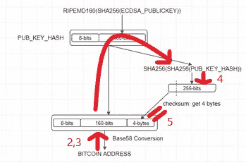

# Python 上的比特币地址验证

> 原文：<https://medium.com/coinmonks/bitcoin-address-validation-on-python-a0123ba3adb8?source=collection_archive---------1----------------------->


Ttransactions 提供在保存私钥和比特币地址的[比特币钱包](https://blog.coincodecap.com/tag/bitcoin-wallet/)之间转移资产。私钥确保交易来自钱包的所有者。你也可以在这里 ***查看比特币地址和私钥是如何从 [***生成的。***](https://github.com/burakcanekici/BitcoinAddressGenerator)***

> 另读:[Python 上的比特币地址生成](/coinmonks/bitcoin-address-generation-on-python-e267df5ff3a3)

有几种钱包类型，如冷钱包和热钱包。冷藏钱包意味着你保持你的私人钥匙和比特币地址离线。由于保持它没有网络，比特币地址所有者负责保持它的安全。纸质钱包被认为是冷藏钱包的一种。基本上，它保持比特币地址和私钥独立于任何数字环境或计算机。因此，它是用来长期持有你的资产，而不是用于即时买卖活动。

生成[比特币](https://blog.coincodecap.com/tag/bitcoin/)地址和私钥的客户端比特币钱包生成器有很多。一般来说，记住比特币地址和私钥并不容易，因为它们是由各种数字和字符组成的。因此，它将二维码保存在纸上，并通过移动应用程序或此类应用程序轻松读取二维码。

生成区块链地址后，您可以从这里查询属于该地址的余额和交易；[https://www . block chain . com/BTC/address/【bitcoindaddress】](https://www.blockchain.com/btc/address/%5BBitcoinAddress%5D)。虽然客户端页面或其他来源会生成比特币地址，而不会向外部发送任何信息，但我们可以查看我们的余额和交易，余额显示为 0 BTC。此外，我们得到一个错误，如“校验和不存在！”，当我们改变我们的比特币地址的一个字符。这个例子解释了如何确保我们的比特币地址有效。您可以在下图中看到步骤；



让我们开始研究如何验证比特币地址；

*   **第一步:**获取我们要检查是否有效的值。

```
bitcoinAddress = input("Enter a bitcoin address:")
print("--------------------------------------")
print("Bitcoin Address: ", bitcoinAddress)
```

*   **步骤 2:** 我们将 Base58 解码应用于在步骤#1 获得的值。

```
base58Decoder = base58.b58decode(bitcoinAddress).hex()
print("Base58 Decoder: ", base58Decoder)
```

*   **步骤 3:** 在*步骤 2* 创建的值保存网络&散列和校验和值。我们尝试检查这个校验和值来验证比特币地址。

```
prefixAndHash = base58Decoder[:len(base58Decoder)-8]
checksum = base58Decoder[len(base58Decoder)-8:]
print("\t|___> Prefix & Hash: ", prefixAndHash)
print("\t|___> Checksum: ", checksum)
print("--------------------------------------")
```

*   **第 4 步:**根据上图，我们将 SHA256 哈希应用于从*第 3 步*创建的值，作为前缀&哈希。

```
hash = prefixAndHash
for x in range(1,3):
    hash = hashlib.sha256(binascii.unhexlify(hash)).hexdigest()
    print("Hash#", x, " : ", hash)
print("--------------------------------------")
```

*   **步骤 5:** 在*步骤 4* 中创建的值的前 4 个字节被命名为校验和。因此，在*步骤 3* 中创建的校验和值必须等于该值。

```
if(checksum == hash[:8]):
    print("[TRUE] checksum is valid!")
else:
    print("[FALSE] checksum is not valid!")
```

最后，结果被包含，源代码在这里[可用](https://github.com/burakcanekici/BitcoinAddressValidator)；

```
**Enter a bitcoin address:**1Lw5rqh94dWzArQ9tDY6Ucswxo3Ums7VWi
--------------------------------------
**Bitcoin Address:**  1Lw5rqh94dWzArQ9tDY6Ucswxo3Ums7VWi
**Base58 Decoder:**  00daa4e87dcb30d406d24f76bcc2afe2ef550c9068b0a511fb
	|___> **Prefix & Hash:**  00daa4e87dcb30d406d24f76bcc2afe2ef550c9068
	|___> **Checksum:**  b0a511fb
--------------------------------------
**Hash 1**  :  1d7d571d176f378eabd73b1e3ac0fb5a688855d41ae5ee8956afb9c13b5c7027
**Hash 2 ** :  b0a511fb05bcf1872be44d98dad592c9641fe47ee7f48f1ecee18b6805bd4ba4
--------------------------------------
[TRUE] checksum is valid!
```

> 另读:[最佳比特币硬件钱包](/coinmonks/the-best-cryptocurrency-hardware-wallets-of-2020-e28b1c124069)
> 
> [直接在您的收件箱中获得最佳软件交易](https://coincodecap.com/?utm_source=coinmonks)

[](https://coincodecap.com/?utm_source=coinmonks)