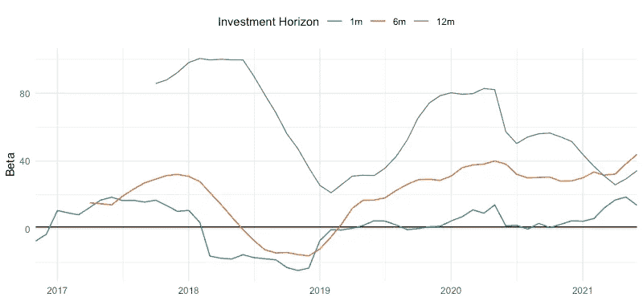

# 比特币——通胀对冲？定量的观点

> 原文：<https://medium.com/coinmonks/bitcoin-an-inflation-hedge-a-quantitative-perspective-49b6d4fed66b?source=collection_archive---------6----------------------->

随着美国在 2020 年新冠肺炎的背景下关闭和经济萎缩，联邦政府迅速采取了一系列财政和货币刺激措施。很快，利率下调了，量化宽松开始了，刺激计划的支票发出了，数万亿美元被印了出来。一年过去了，现在这个国家基本上重新开放了，看起来最糟糕的时期已经过去了。

不幸的是，另一个问题正在酝酿之中——通货膨胀。就在我写这篇文章的过去两个月里，通胀率分别为 [4.2%](https://www.bls.gov/news.release/archives/cpi_05122021.htm) 和 [5.0%](https://www.bls.gov/news.release/cpi.nr0.htm) ，这是自 2008 年金融危机以来的最高值。随着消费者需求开始增加，全球供应链仍然中断，这些指标重新引发了对通胀失控的担忧。这引发了向优质资产的转移，投资者开始将他们的财富转移到黄金和/或其他通胀保值证券，如 [TIPS](https://www.treasurydirect.gov/indiv/products/prod_tips_glance.htm) 。但随着加密热潮的同时发生，投资者开始怀疑比特币是否会成为黄金之外的另一种(也可能是更好的)通胀对冲工具。

在本文中，我们将简要回顾什么是通胀，评估黄金和比特币与通胀的关系，并讨论比特币是否实际上是一种通胀对冲。

# **充气 101**

美联储将通货膨胀定义为“经济中商品和服务的总体价格水平的普遍上涨”由于供求基本面驱动商品价格，通货膨胀通常是因为消费者需求增加和/或生产成本增加(即供应减少)。尽管可控的通胀水平有利于推动经济增长，但当通胀失控时，人们就会感到担忧。随着通货膨胀变得不可控制，日常商品的价格越来越贵，而工资却跟不上，购买力大幅度下降。因此，投资者需要一种保值的方式。由于黄金是一种供应有限的自然资源，这种贵金属具有内在价值，历史上一直是一种价值储存手段。

为了量化通货膨胀，使用了两个常用的[指标](https://www.stlouisfed.org/publications/regional-economist/july-2013/cpi-vs-pce-inflation--choosing-a-standard-measure)——消费价格指数(CPI)和个人消费支出价格指数(PCE)。这两个指数是通过对一篮子不同的商品和服务进行定价而构建的。所以自然地，如果篮子的价格上升，价格指数上升，通货膨胀就发生了。尽管 CPI 和 PCE 都衡量通货膨胀，并且彼此非常接近，但这两个指数是使用稍微不同的篮子和加权方法创建的，关于差异的更多细节可以在[这里](https://www.clevelandfed.org/newsroom-and-events/publications/economic-trends/2014-economic-trends/et-20140417-pce-and-cpi-inflation-whats-the-difference.aspx)找到。在本文的其余部分，任何提及通货膨胀或具体通货膨胀措施的地方都将使用标题 CPI。

# **黄金作为通胀对冲**

为了量化通胀对冲意味着什么，需要解决两个问题——1)黄金回报和通胀变化之间的关系有多强，以及 2)通胀变化对黄金回报的影响有多大。为了回答上述问题，我们将使用 1985 年以来的月度 CPI 和黄金期货数据来计算不同投资周期的相关性和贝塔系数。在下面的分析中使用的方法背后的细节在“附加注释”部分中描述。

Figure 1: Correlation of gold returns vs. CPI changes over different investment horizons

在图 1 中，黄金回报和 CPI 水平之间的相关性表明，黄金的对冲属性可能没有最初认为的那么强。从短期和长期投资来看，相关性接近于零或略微为负。

Figure 2: Rolling correlation of gold returns vs. CPI changes over different investment horizons

然而，由于资产之间的关系随着宏观经济环境的变化而变化，分析滚动相关性实际上更有洞察力。图 2 说明了过去 21 年黄金和 CPI 之间的时变关系。在较短的投资期限内，黄金和 CPI 之间有微弱的负相关关系，而在较长的投资期限内，黄金和 CPI 之间有很强的正相关关系。在高通胀时期尤其如此，如 08 年金融危机，这支持了黄金是对冲通胀的信念。然而，研究结果表明，黄金是一种强大的长期通胀对冲工具，而短期通胀对冲工具较弱。

Figure 3: Rolling beta of gold returns vs. CPI changes over different investment horizons

为了评估黄金回报随 CPI 变化的幅度，图 3 表明 CPI 对黄金的影响在短期投资范围内是有限的，但在长期投资范围内会显著增加。特别是在 08 年危机期间，黄金的长期投资的贝塔系数高达 15！这进一步支持了长期来看黄金是一种强有力的通胀对冲工具的观点。

 [## 最佳免费加密交易机器人——前 16 名比特币交易机器人[2021]

### 2021 年币安、比特币基地、库币和其他密码交易所的最佳密码交易机器人。四进制，位间隙…

medium.com](/coinmonks/crypto-trading-bot-c2ffce8acb2a) 

# 比特币作为通胀对冲工具

目前，关于比特币是否真的是一种通胀对冲工具，还存在争议。目前，在精通经济的比特币社区，这种加密货币将在未来几个月/几年内充当通胀对冲工具，这是一个信仰问题。类似于黄金的有限供应，比特币的上限是 2100 万个硬币，这是比特币作为通胀对冲工具的背后的一个驱动力。然而，到目前为止，支持这种说法的定量分析非常有限。为了评估比特币是否真的是一种通胀对冲工具，我们将分析针对黄金和 CPI 的类似问题。然而，由于比特币有限的历史和相对较新的采用，将使用从 2013 年底开始的历史数据。

Figure 4: Correlation of BTC/USD returns vs. CPI changes over different investment horizons

在图 4 中，在短期和长期投资范围内，比特币和 CPI 之间的相关性通常具有中度到强烈的正相关关系。仅此一点就表明了比特币作为通胀对冲工具的可能性。

Figure 5: Rolling correlation of BTC/USD returns vs. CPI changes over different investment horizons

与黄金类似，比特币和 CPI 之间的相关性在不同的投资期限内表现出时变属性。图 5 说明了比特币与 CPI 在短期内具有弱/中等关系，但在长期内具有中等/强正关系，这表明比特币可以更好地用作中长期通胀对冲。

Figure 6: Rolling beta of BTC/USD returns vs. CPI changes over different investment horizons

查看图 6 中的滚动 beta，在中长期投资范围内，比特币通常相对于 CPI 具有较大的正 beta。与黄金的贝塔系数相比，比特币的贝塔系数要大几个数量级，这表明比特币可能是比黄金更好的通胀对冲工具。

# 结论

尽管比特币有望成为强大的通胀对冲工具，但现在下结论还为时过早。尽管比特币已经存在了大约 13 年，但仍然没有足够的历史数据来有效分析加密货币与通货膨胀的关系。

目前，比特币的价格仍然由投机和人们持有它的意愿决定。随着通胀上升，比特币的价值完全有可能上升，但比特币和通胀完全无关的可能性也不应打折扣。随着数字资产空间的不断增长和成熟，跟踪所研究的关系在未来几年内如何变化将是令人着迷的。

 [## 加密税务软件——五大最佳比特币税务计算器[2021]

### 不管你是刚接触加密还是已经在这个领域呆了一段时间，你都需要交税。

medium.com](/coinmonks/best-crypto-tax-tool-for-my-money-72d4b430816b) 

# **附加说明—滚动相关性&测试方法**

**数据:**

*   [CPI](https://fred.stlouisfed.org/series/CPIAUCNS)
*   [黄金期货价格](https://www.investing.com/commodities/gold-historical-data)
*   [BTC/美元](https://www.coindesk.com/price/bitcoin)

**返回计算:**

*   R = ln(P_t/P_t-1) =对数回报(或百分比变化)
*   P_t =时间段 t 的值
*   t-(t-1) =以月为单位的时间范围(1M、6M、12M 等)

**黄金—相关性&贝塔:**

*   窗口大小= 180 个月
*   滚动周期= 1 个月
*   相关性=皮尔逊相关性
*   β=黄金回报与 CPI 百分比变化的回归系数

**比特币—相关性& Beta:**

*   窗口大小= 36 个月
*   滚动周期= 1 个月
*   相关性=皮尔逊相关性
*   Beta =美元回报率与 CPI 百分比变化的回归系数

> 加入 [Coinmonks 电报频道](https://t.me/coincodecap)，了解加密交易和投资

## 另外，阅读

*   [什么是保证金交易](https://blog.coincodecap.com/margin-trading) | [美元成本平均法](https://blog.coincodecap.com/dca)
*   [BigONE 交易所评论](/coinmonks/bigone-exchange-review-64705d85a1d4) | [电网交易 Bot](https://blog.coincodecap.com/grid-trading)
*   [3 商业评论](/coinmonks/3commas-review-an-excellent-crypto-trading-bot-2020-1313a58bec92) | [Pionex 评论](/coinmonks/pionex-review-exchange-with-crypto-trading-bot-1e459d0191ea) | [Coinrule 评论](/coinmonks/coinrule-review-2021-a-beginner-friendly-crypto-trading-bot-daf0504848ba)
*   [莱杰 vs Ngrave](/coinmonks/ledger-vs-ngrave-zero-7e40f0c1d694) | [莱杰 nano s vs x](/coinmonks/ledger-nano-s-vs-x-battery-hardware-price-storage-59a6663fe3b0) | [币安评论](/coinmonks/binance-review-ee10d3bf3b6e)
*   [Bybit Exchange 审查](/coinmonks/bybit-exchange-review-dbd570019b71) | [Bityard 审查](/coinmonks/bityard-review-7d104239be35) | [CoinSpot 审查](https://blog.coincodecap.com/coinspot-review)
*   [3 commas vs crypto hopper](/coinmonks/3commas-vs-pionex-vs-cryptohopper-best-crypto-bot-6a98d2baa203)|[赚取加密利息](/coinmonks/earn-crypto-interest-b10b810fdda3)
*   最好的比特币[硬件钱包](/coinmonks/the-best-cryptocurrency-hardware-wallets-of-2020-e28b1c124069?source=friends_link&sk=324dd9ff8556ab578d71e7ad7658ad7c) | [BitBox02 回顾](/coinmonks/bitbox02-review-your-swiss-bitcoin-hardware-wallet-c36c88fff29)
*   [BlockFi vs 摄氏](/coinmonks/blockfi-vs-celsius-vs-hodlnaut-8a1cc8c26630) | [Hodlnaut 点评](/coinmonks/hodlnaut-review-best-way-to-hodl-is-to-earn-interest-on-your-bitcoin-6658a8c19edf) | [KuCoin 点评](https://blog.coincodecap.com/kucoin-review)