# 比特币和区块链:你想知道但从未问过的一切

> 原文：<https://medium.com/coinmonks/bitcoin-and-blockchain-everything-you-wanted-to-know-but-never-asked-4d09d59d3eae?source=collection_archive---------4----------------------->

比特币是一种建立在区块链上的数字货币。比特币和其他货币通常被称为加密货币，因为它们利用加密算法来确保交易的完整性。

加密数字货币代表了货币的下一次演变，因为它们易于存储、接收和发送，同时比现代法定货币更安全，更不易被操纵。

在这篇文章中，我将解释什么是比特币，以及它如何利用密码学和区块链来工作。本文将包括各种技术细节的概述，这些细节有时会让外行人感到困惑。我会尽力假设你什么都不知道。如果你觉得这个内容很有趣，但想了解更多，我强烈推荐在 Udemy 上找到的由柯尔特·斯蒂尔和凯文·卡茨教授的[比特币和加密货币训练营](https://www.udemy.com/bitcoin-and-cryptocurrency-bootcamp)。

让我们从回答以下问题开始我们的讨论:比特币到底是什么？？

# 金钱简史

在回答上述问题之前，我需要快速浏览一下货币的历史，以展示我们是如何产生娱乐分散的、纯数字货币的想法的。

很久以前，在一个遥远的大陆上，人类生活在小而相邻的社区里。在那个时候，人们没有货币来交换，因为货币的概念还没有形成。相反，人类生产其他人想要的东西。这是物物交换的时代。如果你是一个农民，你需要一双新鞋，你会把一些多余的食物卖给当地的鞋匠。

物物交换系统在小而紧凑的社区运作良好，但是随着村庄规模的扩大，很快就产生了障碍。如果鞋匠对麸质过敏，而农民只有小麦可以交易，那会怎样？而且，想想看，一个人如何评价一双鞋和一袋小麦和一个医生的服务呢？一旦一个经济体的增长超过了生存水平，计算什么是公平就变得势不可挡。

人们很快意识到他们需要一种方法来以统一的方式对不同的商品和服务进行估价。但是，人们可以用什么来代替其他人会接受并同意有价值的实际商品和服务呢？答案是使用人们已经发现有价值的东西。像贝壳、黄金、白银、鸟毛、香料、茶叶等东西都曾一度充当过货币，因为所有相关方都认为这些物品有价值。

除了有价值之外，货币还需要易于分割，便于运输，并能长期保值。

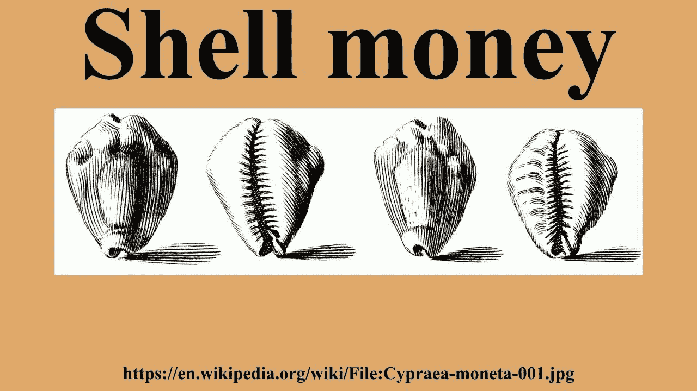

Shells used as money

通过多年的反复试验，黄金成为货币的首选，因为它符合好货币的所有要求。黄金是一种软金属，这使得它不适合工业用途，但是，它的延展性非常适合铸造新硬币。此外，由于它是一种金属，相对于脆弱或易腐的物品，如贝壳、茶叶或香料，它可以随着时间的推移保持其价值。

因此，黄金成为了金本位制。但是，重要的是要认识到金钱不是黄金。钱是一种观念。一种在经济中所有商品和服务之间交换价值的方式。在当时的历史上，黄金恰好符合好货币的必要条件。

数百年来，人们继续用黄金直接交换商品和服务，但随着世界经济的增长，人们最终意识到携带金属袋既麻烦又不安全。

银行成立了，它们的主要服务之一就是为人们储存黄金。出具的收据证明了个人对黄金的所有权，并证明黄金被安全储存。渐渐地，人们对收据有了足够的信心，他们不再费事去赎回金库里的黄金，相反，他们只是来回交易纸片。

随着国家和经济的发展，人们开始在越来越远的地方与他们从未见过的人和企业进行商业交易。此外，每个地区都有自己的货币，因此很难确定它们之间的汇率。各国成立了中央银行，它们创造了一种统一的货币，这种货币可以在任何一家地区性银行进行交易。

最终，政府意识到将货币与特定商品挂钩会限制货币供给的弹性。让更多的钱进入这个系统的唯一方法是从地下挖出越来越多的金子。政客们不喜欢被告知没有钱用于他们的战争或新的社会政策，因此，金本位被放弃了。

这导致了我们现代的法定货币体系。法定货币是一种货币本身没有内在价值的货币。美钞只是一张纸。它们有价值的唯一原因是因为我们都同意它们有价值。这就是为什么央行和政府会竭尽所能地给本国货币注入信心。

在现代，两个驱动力导致数字货币的采用增加。首先，我们生活在一个数字时代。在过去的三十年里，我们绝大多数的货币供应都是以数字形式存在的。下图显示了美国 M1 与 M2 的货币供应量。M1 是流通中的所有实物货币，而 M2 是以数字形式储存的货币。

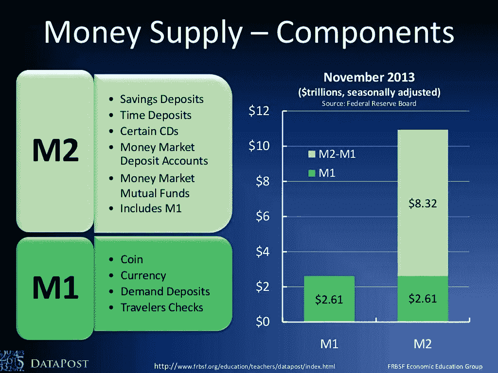

M1 vs M2 money supply

虽然这是美国货币供应的图表，但同样的原则适用于世界上所有国家——货币的数字表现远远超过流通中的实物货币。

当我们开始思考今天我们如何与金钱互动时，这是有意义的。

以直接存款的形式从工作中获得薪水？邀请朋友共进晚餐？把一笔钱电汇到另一家银行？网上交话费？对于所有这些行为以及其他一百万种行为，银行和公司只是将数字从一个账户转移到另一个账户——实物货币并没有转手。

需要注意的是，这并不是一件坏事。请记住，好钱的标志是容易储存，可分割和运输，同时稳定和值得信赖。

正是这最后两项，稳定性和可信度，目前困扰着现代法定货币。请记住，政治家不喜欢被告知他们没有预算来资助他们的政策，公民也不喜欢支付越来越高的税收。结果是世界各地的政府都在不断干预他们的货币供应。这种操纵的结果是，随着信贷宽松程度的上升和下降，经济中不断出现繁荣和萧条周期。

下图显示了自 1975 年以来美国的主要衰退。联邦基金利率是货币的利率。随着借入新资金的成本降低，越来越多的贷款被借出。绝大多数新资金就是这样进入经济的。

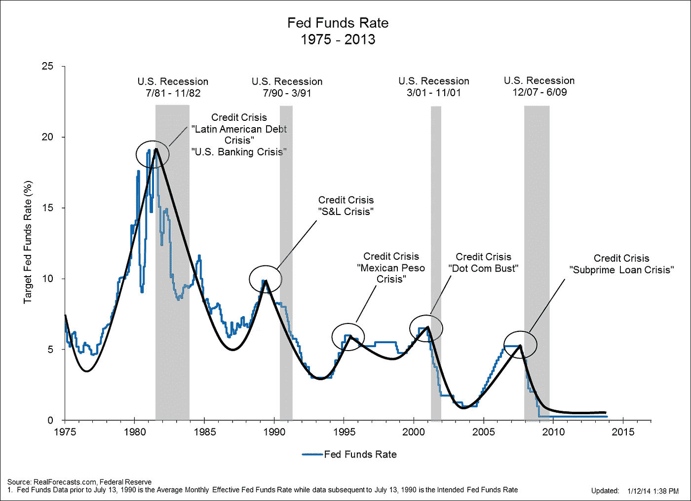

随着最近一次 2008/09 年的崩盘，人们对当前的银行体系变得非常不满，开始寻找不同的途径。比特币就是通过这种动荡诞生的。比特币的承诺是，通过分散货币管理，我们可以创造更稳定、本质上更值得信赖的经济。

为什么会这样呢？

因为比特币不受任何一个政府或央行控制。每一笔比特币交易都是公开的，这创造了透明度和问责制。比特币不靠人的善意。取而代之的是，它利用加密技术在系统中建立固有的信任。最后，新的比特币以预定的、一致的方式加入流通，这避免了比特币被任意膨胀或收缩的能力。

所以，要回答本节开头的问题，什么是比特币？

比特币只是货币的数字表示。它易于转移、储存和安全——这是好钱的所有特征。正如我们现在所知道的，货币不一定是实物，货币是一种思想——一种统一评估经济中所有商品和服务价值的方式。

比特币如何能够在一个没有政府或央行的系统中建立信任，这是下一节的主题。

# 在不信任的系统中建立信任

从一开始，比特币的创造者就知道，要让一种去中心化的数字货币获得成功，人们需要信任它。这种货币需要刀枪不入，以防黑客和欺诈者故意试图利用这个系统。这样，比特币需要一种方法来保护每一笔交易，也需要一种方法来保护所有交易的历史。

我们先来讨论一下比特币是如何保证发送给你的交易只有你自己能接触到的。

要获得比特币，你需要一个钱包。钱包允许你发送、接收和访问你存储的比特币。在[比特币基金会网站](https://bitcoin.org/en/choose-your-wallet)上快速搜索会显示出超过 30 个钱包！如何挑选钱包，为什么会有这么多？

嗯，钱包很像电子邮件客户端。它们都实现了比特币协议，但根据创建它们的每家公司所做的决定，它们在外观和功能上略有不同。对于这篇文章，你需要知道的是，钱包让你获得比特币，你可以通过三种方式之一获得比特币。

1.  你可以从交易所购买比特币
2.  你可以收到比特币作为商品或服务的付款
3.  你可以参加比特币挖矿网，用新的比特币奖励用电脑运行比特币软件的人。

对我们大多数人来说，我们通常通过从工作中获得报酬来获得新的金钱。我们不会把黄金从地下挖出来然后卖给美元，我们大多数人也不会在 T2 外汇市场买卖货币。

因此，出于我们的目的，让我们假设你开始为一个新雇主工作，他们提供了接受比特币付款的选项。要想在你的雇主给你送比特币时成功交易，你需要了解钱包是如何运作的。

一笔新的比特币交易有以下三条数据:

1.  ***地址:*** 表示比特币的走向
2.  ***来源地址:*** 表示比特币的来源
3.  ***金额:*** 表示有多少比特币被转移

我们大多数人都熟悉拥有网上银行账户的想法。这个帐户是您安全收发资金的地方。虽然钱包达到了同样的效果，但在引擎盖下，它们的功能却大不相同。使用比特币时，你没有一个账户。相反，新交易中的每个接收者都会创建一个新的加密地址，比特币将被发送到这个地址。

把比特币的新地址想象成一个安全的保险箱，放在你的草坪中间。你的雇主把钱加进去，但只有你能把钱取出来。保险箱在众目睽睽之下并不重要，因为它是无法破解的。只有你能动用资金。

每两周，你的雇主会给你寄更多的比特币。每一次，他们都会创建一个新的保险箱来存放你的资金。你的草坪上现在堆满了只有你能打开的保险箱。

你的钱包应用程序会跟踪打开每个保险箱的密码以及每个保险箱的位置。这一切都发生在引擎盖下。对你来说，当查看你的钱包应用程序时，似乎你有一个账户，账户中有 *X* 个比特币。

比特币为什么会这样运作？为什么不拥有一个安全的账户来存放你的资金呢？这种设置的原因是因为没有一个人、公司、政府或央行控制比特币。没有一个集中的地方可以去注册账号。记住，你用的钱包 app 不是安全存放你资金的银行。它只是一个允许你与比特币网络互动的软件。

下一个要回答的问题是，比特币如何可能创造出无法破解的保险箱？保险箱非常安全，可以放在公共场所，让所有人都看到，而不用担心未经授权的人能够打开它们。

这可以通过一种叫做公钥加密的技术来实现。对于每一笔新交易，收款人的钱包应用程序都会创建一个公钥和私钥。公钥用作加密保险箱在比特币网络上的地址，私钥允许接收者打开保险箱。

从概念上讲，您可以将此想象为:

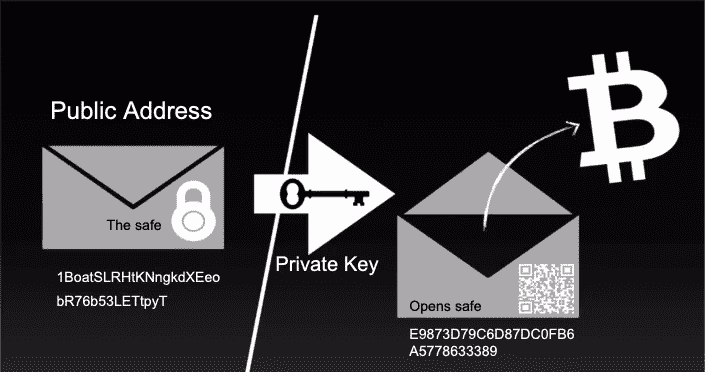

Bitcoin transaction

在上面的例子中，我们说每个新的公共地址都是一个新的保险箱，只有你有钥匙。这是真的。现在，你只需要明白我们用计算机代码把保险箱的位置表示成一个非常长的十六进制字符串。打开保险箱所需的钥匙也是如此。但是，不要让这一长串字符迷惑了你——从概念上讲，它只是一个锁着的保险箱，只有一把钥匙可以打开它。

## 公钥加密的魔力

确切地解释公钥加密的工作原理超出了本文的范围，但是我确实想为那些对这个领域完全陌生的人探索一下这个概念。

首先，密码学是一门对你的敌人隐藏信息内容的科学。它最初的用途是在战时，当将军们需要向他们的部队发送有关他们作战计划的信息时。在以前的时代，将军们担心他们的信息落入坏人之手，因为给定加密的信息，就有可能逆向破解它。

随着公钥加密技术的发明，这一切都改变了。公钥加密是不对称的，这意味着即使您有秘密消息和用于加密该消息的公钥，您也没有办法逆向解密该消息。只有拥有私人钥匙的人才能破解这条信息。

通过这种方式，比特币网络上的每一笔交易的细节都可以自由查看。下图显示了我在[区块链探险家](https://www.blockchain.com/btc/block-index/1197679)网站上发现的三个随机交易。

继续我们上面的例子，比特币从一个保险箱转移到另一个保险箱。“发件人”和“收件人”地址是一长串可怕的字符，但对电脑来说，这只是意味着将资金从一个保险箱转移到另一个保险箱。

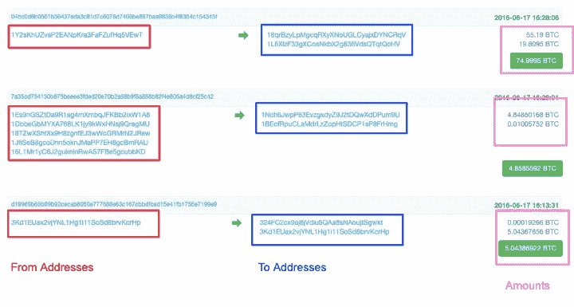

Bitcoin transactions on the blockchain

好了，现在我们知道了每一个交易都是以一个特定的地址为目的地的，只有交易的接收者可以访问这个地址。比特币实际上在此基础上增加了另一层安全性，要求交易的发送者证明他们实际上有权从他们发送的地址发送比特币。

这被称为[私钥签名](https://en.wikipedia.org/wiki/Digital_signature)，它的工作原理是公钥加密的一个有趣的特性。可以用私钥加密消息，用公钥解密——与上面描述的相反。通常，这是一个非常糟糕的想法，因为任何拥有公钥的人(也就是所有人)都可以解密消息。

在比特币网络上，这种怪癖被利用了，因此发送者必须用他们的私钥签署交易。通过这种方式，miner 将交易添加到区块链(稍后会有更多介绍)时，可以使用地址的公钥来验证发送者的身份。

下图概述了新交易的安全流程。

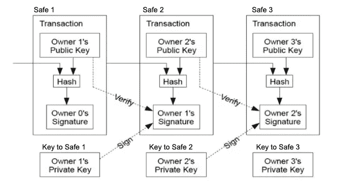

Chart of how transactions are secured within Bitcoin

如果你感到困惑，只要明白比特币采取预防措施，以确保正确的人发送资金，只有注定要接收这些资金的人才被允许访问它们。

# 公共分类账

既然我们已经了解了比特币是如何保护个人交易的，我们就需要探索它是如何保持过去交易的准确历史的。在没有第三方监督的情况下管理公共总账需要使用一种叫做区块链的新技术。但是，在解释区块链如何工作之前，让我们确保理解我们为什么需要它。

## 班克斯:我们需要它们吗？

正如本文前面提到的，我们中的绝大多数人已经在使用和依赖数字货币系统。我们与银行签约，获得一个网上账户，向账户注资，现在可以自由地转移资金，对吗？

嗯，几乎是真的。银行对他们的“账户服务”收取费用。想把钱汇到另一家银行？这是要收费的。想用信用卡买东西吗？这是要收费的。需要银行本票吗？这是要收费的。想在线自动支付账单还是使用直接存款？这是要收费的。

现在，银行对这些服务收取费用是合理的，毕竟他们提供的是想要的服务。但是，我们不情愿地支付这些费用，因为银行为我们的钱提供了安全和便利。例如，你不能登录你的银行账户，把你没有的钱汇给别人。银行确保我们只能花我们所有的钱，因为他们保留了我们所有交易的分类账——我们给谁汇了钱，谁给我们汇了钱。

通过这种方式，银行作为第三方中间人，在整个经济中确保资金的安全流动。但是，对于这项服务，我们受制于他们的费用，他们的条款和我们的资金容易受到攻击，这取决于银行的安全协议。

但是，有没有一种方法可以让我们在没有银行监督的情况下跟踪每个人的交易历史？

在人类历史的大部分时间里，答案都是响亮的“不”。但是，随着区块链的发明，我们可以保留所有交易的公共账本，同时确保人们只花他们拥有的东西。不再需要银行作为信托代理人。

## 区块链如何工作

最简单的定义是，区块链是一个由社区维护的交易数据库，它可以增长，但不能修改。这不同于可以自由改变的传统数据库。通过这种方式，当新的区块堆积在旧的区块上时，区块链的大小总是在增长。

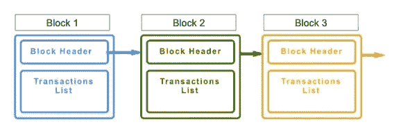

Basic Blockchain with Three Linked Blocks

区块链也是分散的，这意味着整个区块链存在于分布在世界各地的数千台计算机上。事实上，任何人都可以[注册成为矿工](https://bitcoin.org/en/full-node)并参与主办比特币区块链。

这与当前的集中式银行设置相反，在集中式银行设置中，公司将自己的数据库(可以随意更改)托管在运行于安全位置的服务器上，并严格控制谁可以访问它们。

但是，区块链到底是如何确保其不变性的呢？答案在于更多的密码学！

## 散列法

区块链用散列函数保护每个交易块。哈希函数可以用于任何数字文件，以创建固定大小的单向输出，称为指纹。每个指纹对其输入都是独一无二的。稍微改变任何输入，输出就会完全不同。

以下面的字符串为例:`"Hey don't mess with this string!”`。如果这根弦的任何一部分发生变化，指纹就会完全不同。下面，我展示了三个例子，在这些例子中，我对字符串做了微小的调整。结果是一个除了标准化长度之外完全不同的输出。重要的是，知道输出并不能让我们了解原始输入是什么。

SHA-256 是众多安全哈希协议之一。它在网络上被广泛用于加密信息，到目前为止，还没有已知的方法来破解它。比特币协议使用 SHA-256 标准。

```
Input 1: 
sha256("Hey don't mess with this string!")Output 1:
04484b79a8a796652e0858e5382f8a662a9d909417f7fd65b5eed31cbb47f100---Input 2: 
sha256("Hey don't mess with this string!!") // 1 additional "!"Output 2:
266a79d788385f168cb87de4c37effb2bd67c4055cdd71bc6c65e7594ae473d4---Input 3: 
sha256("Hey don't mess with this string !") // 1 added spaceOutput 3:
e1f879b7dec3655e6f88ff3a839df6e5e4412b329136045d4dc6dbe1c2f0d716 
```

哈希函数相当于药瓶上的防篡改封条。如果密封没有被破坏，我们可以放心，里面的药物从第一次装瓶时就没有改变过。

## 固定一个块

比特币区块链大约每 10 分钟查看一次发布到其网络上的所有新交易。使用哈希函数，比特币可以为整个账本创建一个独特的指纹，这是可行的，但是，每当有人发布新交易时，它很快就会变得过于计算密集型，无法查看所有交易。

请记住，区块链是不可变的，这意味着它们的大小总是在增长。事实上，截至 2019 年 1 月 19 日，比特币区块链的当前大小约为 200 GB。为了让这个去中心化的系统运行，每台运行比特币区块链的电脑都必须包含整个账本。

为了解决这个问题，区块链不会在每次需要添加新交易时都尝试为整个分类帐创建新的散列。相反，它将数据分解成块。**每个新块包括前一个块的散列输出，作为其散列函数**的输入。结果是相互连接的数据块。

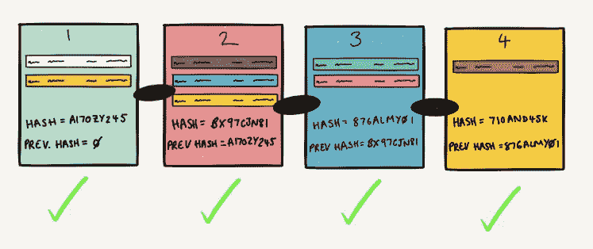

Blocks, connected by the previous block’s hash

如果前一个数据块中的任何数据被更改，其指纹将被更改，这将导致所有后续数据块变得无效。

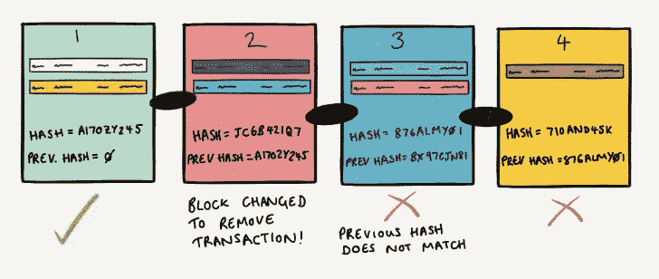

Block 2’s fingerprint changes, rest of block’s became invalid

这里有一个很棒的互动演示，展示了区块链如何连接新的有效区块:[https://anders.com/blockchain/blockchain.html](https://anders.com/blockchain/blockchain.html)

记住，区块的最终目的是效率。通过将一组加密的交易组合在一起，并在其上放置防篡改封条，网络只需关注保持每个块的安全，而不是每个底层交易。

## 添加新块

至此，您应该对比特币如何使用公钥加密来保护个人交易以及如何使用区块链来创建系统中所有交易的防篡改分类账有了很强的概念性理解。

现在，我们需要解释新的交易是如何发布到网络上的，以及运行在世界不同地方的成千上万台独立的计算机是如何就区块链的给定状态达成一致的。

## 介绍矿工

比特币区块链是分散的，它运行的唯一方式是让世界各地的其他电脑运行它的软件。通常情况下，一家希望向其客户提供软件的科技公司要么自己安装并运行一批服务器，要么向像 [AWS](https://en.wikipedia.org/wiki/Amazon_Web_Services) 这样的托管公司支付一定数量服务器的使用权。不管一家公司是拥有还是租用它的服务器，它仍然需要钱来运营，因为你必须支付电力、安全和物理硬件的费用。

现在，如果运行软件成本很高，为什么还会有人托管比特币软件呢？答案是比特币付钱给人们用新铸造的比特币来运行它。

这个系统的美妙之处在于它同时完成了两件事。挖掘比特币——也就是在电脑上托管比特币软件——既向系统添加了新的比特币，又确保了它的正常运行时间，从而允许新的交易发布。

加入系统的新比特币数量是预先确定的。最初的支付从每块 50 BTC 开始。每增加 210，000 个数据块，这个数量就会减半。目前的支付是每块 12.5 BTC。

当一个矿工成功地验证了一个新的区块，他们增加了一个额外的交易，以说明他们的采矿奖励。这个特殊的交易叫做[coin base 交易](https://bitcoin.org/en/glossary/coinbase-transaction)，没有 ***from*** 地址——因为比特币是凭空产生的——每个有效块都必须包含它。

可以开采的比特币总数是 2100 万。到那时，矿商将完全依靠交易费(稍后讨论)来维持这个网络。

## 确保达成共识

请记住，区块链是一个社区维护的数据库。世界各地有成千上万的矿工。当新交易提交到系统中时，离给定交易更近的矿工将首先看到它。

如下例所示，如果一项新交易发生在美国，它更有可能被美国的矿商而不是日本的矿商获得。

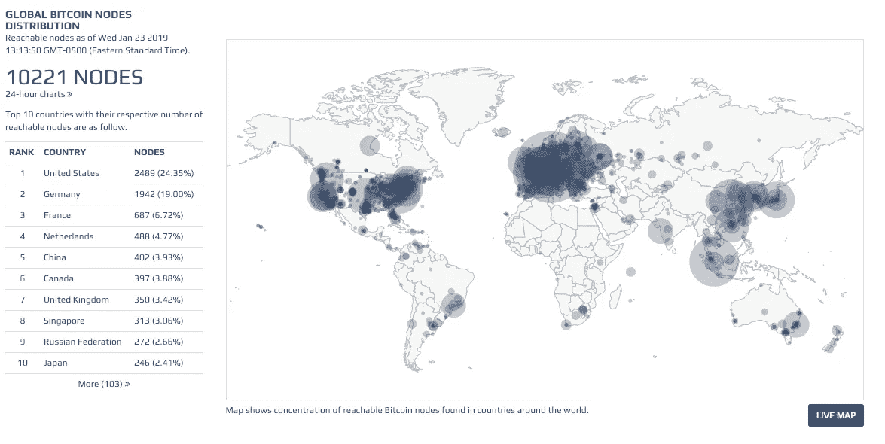

From Bitnodes — Map of Bitcoin Miners

但是，因为系统中的每个挖掘器都需要知道发生的所有事务，所以首先发现事务的挖掘器需要在系统中传播它。这需要时间。如果这种传播需要在每个新的交易中发生——每天有成千上万的交易——分类帐将永远无法达到一致同意的状态。如果分类账不能就其当前状态达成一致，那么它就永远不能增加新的交易。

因此，比特币的创造者需要一种方法来将滞后时间引入系统，以便新交易有足够的时间到达每个人，并且在添加新区块之前可以就分类账的状态达成一致。

选择了 10 分钟这个有点随意的时间。这个时间代表了速度和效率之间的折衷，其中速度是使所有挖掘器意识到新块所花费的时间，而效率限制了浪费的计算工作量，其中挖掘器将事务添加到已经被确认的链中(将很快解释放弃块)。

下图展示了这一过程。每 10 分钟，矿工抓取尽可能多的事务，这些事务可以容纳在 1 MB 的数据中，这是块的最大大小。矿工决定哪些事务进入他们的块，然后开始解决一个计算上具有挑战性但功能上无用的哈希问题，称为[工作证明](https://en.wikipedia.org/wiki/Proof-of-work_system)。


Miners attempting to add a new block

## 工作证明

重要的是要明白，要求矿工在能够将他们的区块添加到链中之前，为他们的区块找到“工作证明”,只是一种减慢系统速度的方法。很多时候，你会读到矿工在“验证交易”。虽然这是事实，但该任务与解决工作证明问题所需的时间无关。

解决工作证明问题就像中彩票一样。在一个工作证明问题中，一个矿工在一个块中得到散列以下六项的指纹:

1.  比特币协议的当前版本
2.  当前时间戳
3.  难度等级(解决工作证明问题)
4.  随机数(使用过一次的数字)
5.  前一个块的哈希
6.  块中所有事务的哈希

这六个输入创建了一个唯一的散列输出。例如，区块链中的[块 416，731](https://www.blockchain.com/btc/block-index/1197679) 具有以下有效散列:

```
[0000000000000000043d73959c1fd990d2a783b38c79e801ce9daab567446671](https://www.blockchain.com/btc/block/0000000000000000043d73959c1fd990d2a783b38c79e801ce9daab567446671)
```

注意到数字开始前的那些零了吗？工作证明要求挖掘器不断地改变 nonce(上面提到的输入之一),直到指定数量的零出现在散列的开始。给定输入，散列输出是完全随机的。矿工们组成巨大的池，这样他们每秒钟可以进行数万亿次猜测。

比特币希望每 10 分钟验证一次新的区块。因此，每两周它会检查解决一个块的平均时间，并相应地调整哈希问题的难度。较高的难度级别平均会增加找到有效散列输出所需的时间。

**这一过程如何运作的细节可在附录中找到。*

## 处理重复

一旦矿工找到一个有效的证明工作，块被添加到链。但是，重要的是，对于任何给定的工作证明问题，都有多个正确答案，并且多个矿工可能几乎同时找到一个有效区块。

添加哪个块？

一般来说，它是最先完成的区块。一旦其他矿工看到一个有效的区块，他们就开始下一个区块的工作。这是事实，因为一个更长的区块链是一个更安全的。请记住，如果您更改了先前完成的块中的一个位，它的哈希也会更改，这将使该块无效，并且堆叠在它上面的所有块也无效。

如果攻击者想要改变区块链的历史，他们需要解决给定区块以及堆叠在其上的所有区块的工作证明问题。他们需要以比添加到链顶端的新数据块更快的速度完成这项工作。实现这一点需要巨大的计算能力。因此，当寻求验证一个新区块时，矿工们总是倾向于在最长的链上工作。

在比特币区块链中，被放弃的有效区块的矿工奖励被拿走，他们的交易被放回未确认区块池。在区块链的其他地方，像以太坊，废弃街区的矿工仍然可以得到报酬。

下图显示了由于发现多个有效数据块而发生的区块链进程。但是，由于其中一个链更快地找到了下一个块，较小的链被放弃了。

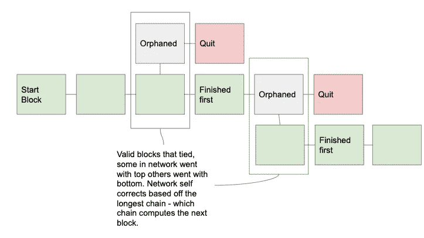

How multiple valid blocks are handled

只要人们还在网络上进行交易，积木式组装过程就会持续下去。目前的比特币区块链深度超过 50 万个街区。这使得比特币极具弹性，几乎不可能被黑客攻击。

# 比特币和区块链的未来

比特币证明了拥有一种安全且有价值的去中心化的纯数字货币是可能的。比特币的稳定性波动很大，因为绝大多数与比特币有关的人都将其视为投资(这导致了广泛的投机)，而不是将其作为货币使用。这主要是因为比特币不容易被许多公司接受为一种支付形式。

随着时间的推移，越来越多的企业将慢慢开始接受比特币作为一种支付选择，但政府不太可能正式批准比特币作为法定货币，因为它们无力控制比特币。最终，比特币的成功取决于政府对其资金管理的糟糕程度。如果像 2008/09 年那样发生另一次世界金融崩溃，比特币可能会通过全民投票被引入。

不管比特币的未来如何，区块链技术的效用将继续增长。它目前正处于一个炒作周期，人们过度渴望使用它，仅仅因为它是新的，然而，在房地产所有权管理、投票、保险和供应链管理等领域有真实的用例。

最终，这项技术的承诺是让我们的生活更轻松、更高效、更安全。

感谢阅读！🙏

— —

# 附录

## 比特币的工作证明解释

以下是对比特币工作证明算法(Hashcash)所涉及的机制的更深入的解释。

每个矿工都需要提供工作证明。当一个矿工散列一个新的块时，他们散列以下六项来创建该块的散列。

1.  比特币协议的当前版本
2.  当前时间戳
3.  难度等级(解决工作证明问题)
4.  随机数(使用过一次的数字)
5.  前一个块的哈希
6.  块中所有事务的哈希

每个矿工都在重复散列该块——只改变随机数——直到他们有一个低于指定数字的指纹。没有唯一正确的答案。

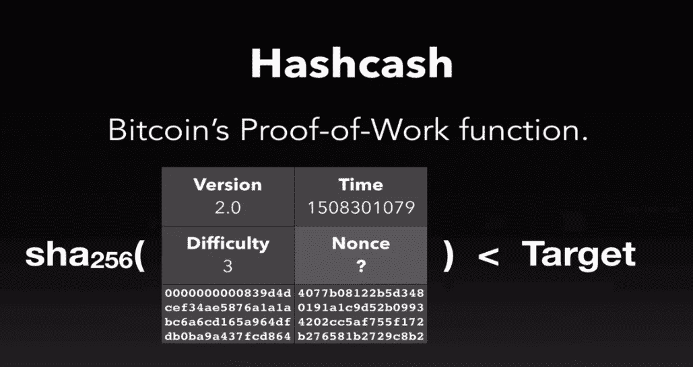

Hashcash — Bitcoin’s Proof of Work Problem

解决这个挑战的速度可以通过调整难度级别来改变，这实际上降低了可能的正确结果。随着越来越多的矿工上网，更快找到正确答案的可能性增加了。因为比特币希望每 10 分钟散列一个新块，所以它通过调整难度来控制完成速度。

难度增加会降低可接受值的范围。降低难度会增加可接受值的范围。

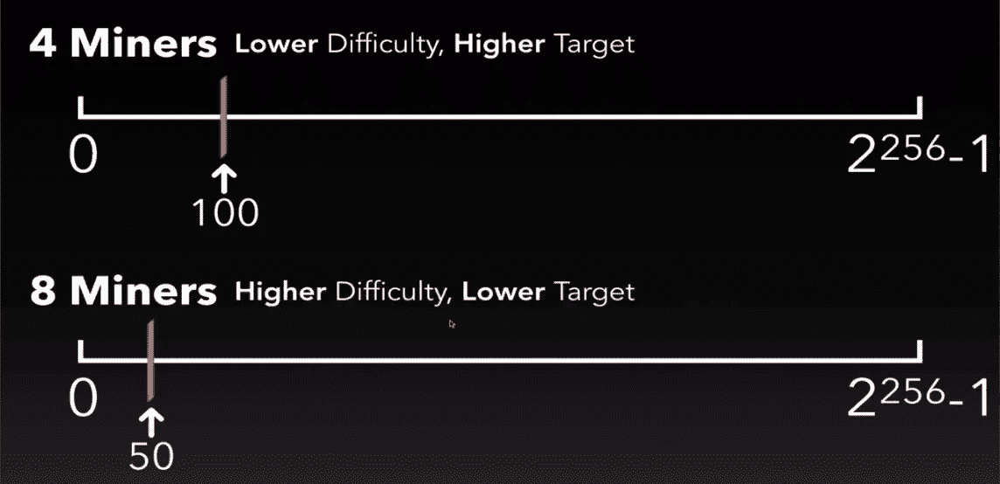

Controlling the rate of new blocks

下图试图形象地展示这一过程是如何进行的。顶部的两个字符代表矿工。每个数字代表他们猜测的一个随机随机数。彩色大头针代表最终的衍生指纹。一旦其中一个被猜测的指纹在目标设定的范围内，那个矿工就赢了。


那么，目标和难度实际上是如何确定的呢？

每两周，网络分析计算一个块的平均时间。如果超过 10 分钟，难度会降低。如果时间少于 10 分钟，难度会增加。

难度和目标成正比。寻找目标的公式是:

```
Target = N / Difficulty
```

其中`N`是比特币刚推出时创造的常数。计算出的第一个封锁的难度等级为 1。当前难度等级为 5883988430955.41。通过增加难度，您缩小了目标窗口，这实际上增加了计算正确答案的整体难度。

想象一下 N = 20。如果难度等级是 1，这意味着 0-20 都是有效的指纹。如果难度提高到 5，这意味着 0-4 都是有效的指纹。如你所见，难度级别的微小变化会使可能结果的总数变得更少。

这里有一个很棒的互动演示，展示了区块链是如何保护每个新街区的:[https://anders.com/blockchain/blockchain.html](https://anders.com/blockchain/blockchain.html)

## 双重花费

当有人给你寄钱，但同时又把钱寄到他们拥有的另一个地址时，就可能发生双重消费。他们可以更改该交易的时间戳，并让它出现在您的交易之前。区块链将接受第一笔交易，并将第二笔交易视为欺诈。

避免这种情况的最简单方法是等待至少三次确认，其中一次确认是添加一个新的有效块。

关于双倍消费的更完整描述，请参见本文:[https://medium . com/inner quest-online/how-do-a-区块链-prevent-double-spending-of-bit coins-fa 0 ECF 9849 f 7](/innerquest-online/how-does-a-blockchain-prevent-double-spending-of-bitcoins-fa0ecf9849f7)

## 矿工费用

向交易中添加费用是为了激励矿商更快地处理特定的交易。当发送者创建交易时，他们可以增加费用。当一个矿商赢得一个区块时，他们会收取与每笔交易相关的所有费用。矿业公司优先处理收费较高的交易。因此，如果你需要交易更快发生，你可以增加你愿意支付的金额。

## 区块链上如何处理变化

在查看交易时，很少会看到一个地址发送到另一个地址。这是因为在比特币中，发件人地址必须发送与之相关的所有比特币。交易的任何剩余部分都被发送到发送者拥有的另一个地址。

一个例子

人 A 想购买价值 10 BTC 的东西。个人 A 没有一个包含 10 个 BTC 的地址。相反，他们有 3 个地址，金额如下:

地址 1: 2 BTC

地址 2: 7 BTC

地址 3: 4 BTC

为了达到 10 BTC 的购买价格，发送者将创建一个从所有三个地址发送的新交易。寄件人需要 3 BTC 的零钱。他创建了自己拥有的另一个地址来发送额外的 3 个 BTC。幸运的是，大多数钱包应用程序都会自动处理变更管理。

> [在您的收件箱中直接获得最佳软件交易](https://coincodecap.com/?utm_source=coinmonks)

[](https://coincodecap.com/?utm_source=coinmonks)