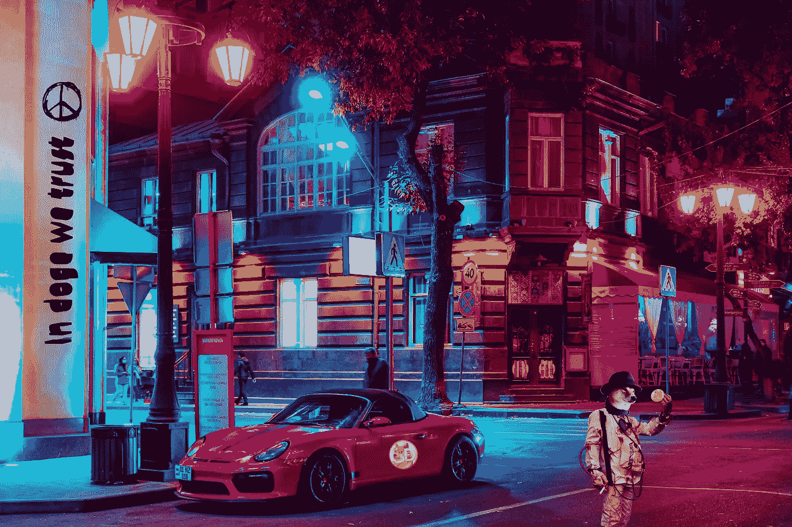
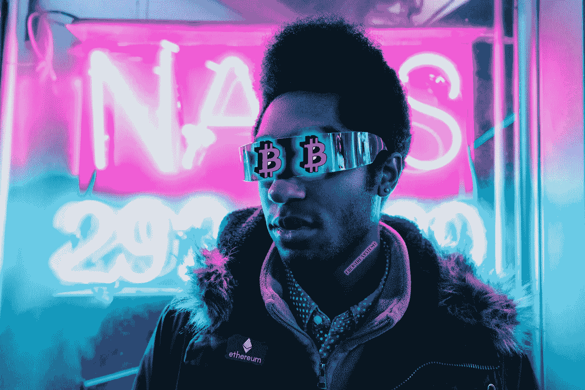
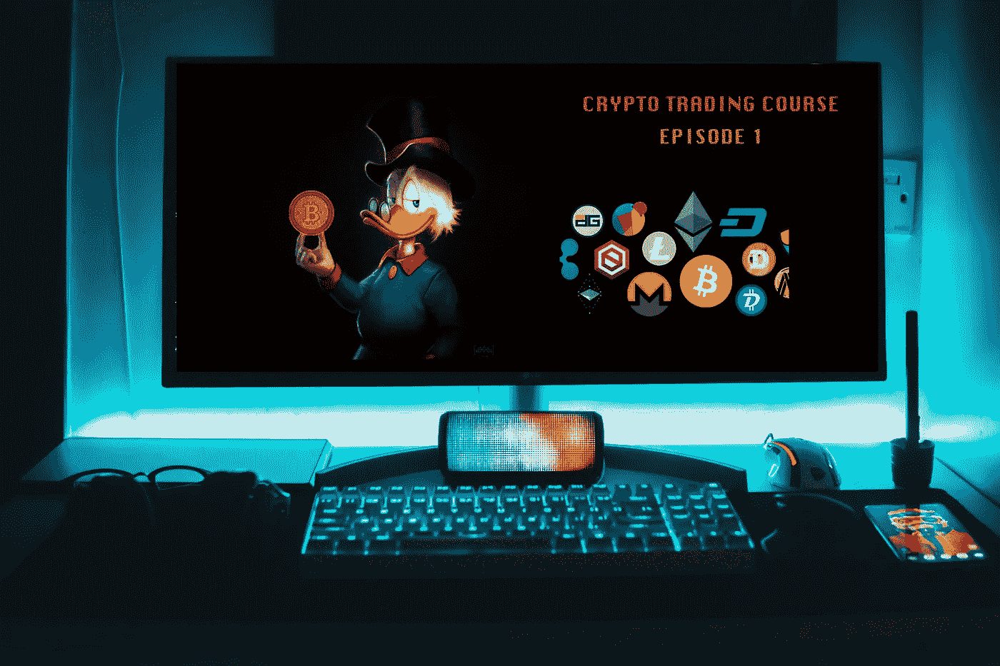
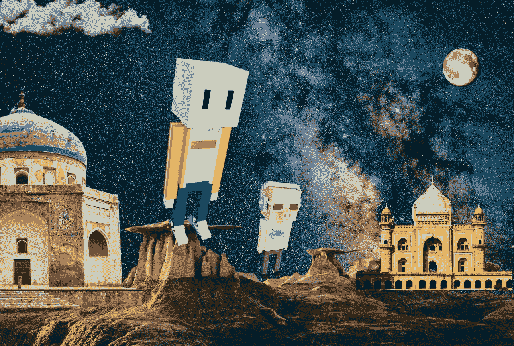

# 比特币和印度的城市贫民

> 原文：<https://medium.com/coinmonks/bitcoin-and-indias-urban-poor-8ac62c12ef9a?source=collection_archive---------2----------------------->

## 备受打击的一代人的最终反叛。

Bitcoin, often described as a cryptocurrency, a digital currency — is a type of money that is completely virtual.

在我居住的寂静的南德里郊区，午夜已过。
邻居阿姨已经吃完了每天的 covid news，我父亲刚刚结束了与所有亲戚的视频通话，谈论致命的黑木耳。这时，我的朋友***巴德**打来电话，他的声音颤抖着说:“已经 30 *了，大哥*。都他妈 30 了。”我还没来得及说什么，电话就断了。自从过去两年以来，每当巴德和我交谈时，都是关于比特币或者埃隆·马斯克的傲慢。我知道这是怎么回事，所以我打开了 Reddit、Telegram 和 Bitcointalk 上我常用的加密论坛。比特币大幅下跌(几乎 50%)，在几天内从 6 万美元跌至 3 万美元。印度交易所下跌。像“血洗”、“掘墓”、“麝香大屠杀”这样的词充斥了网络空间。

就在几天前，巴德从他母亲那里借了一笔钱买了半个比特币。这很严重。

当我驶过 Hauz Khas 曾经熙熙攘攘的街道时，一种熟悉的恐惧席卷了我。有一种置身于像《T2:我们最后的 T3》这样的电子游戏中的感觉——你曾经熟悉的世界被僵尸疫情永远改变了。新冠肺炎之前的城市、事业和朋友似乎完全成了别人的记忆。当我穿过[*Safdarjung’*s*墓*](https://www.youtube.com/watch?v=CoBHY6O4UBU) 的时候，我的脚踩油门的力度比预想的要大一些，也许是因为焦虑，也许是因为内心希望这辆车会变成一台时间机器。不过，如果我真的回到过去，我会储备两样东西——比特币和氧气瓶。具体来说，如果我在 2011 年只在比特币上投资 1 美元，我现在至少有 4 万美元。至于氧气..2021 年夏天，第二波新冠肺炎袭击了印度。首都德里完全崩溃了——感染激增，数千人因缺氧而死亡。几乎不可能进行检查，不可能得到氧气瓶或医院病床。火葬场外的长队意味着即使是死者也必须有耐心。太可怕了——我认识的每个人都失去了他们认识的人。驶过 Lodhi 火葬场时，我感激地看到有人站在警察的栅栏前，奇怪的是，当几个警察用手电筒照着我的脸，点头表示同意看到我的面具时，我还活着。

我在 Nizamuddin Dargah 附近黑暗的小巷里等着，巴德低着头，紧张地踱着步，咬着烟。一群熟悉的街头儿童跟在后面，但他没有赶走他们，而是给了他们一大笔零钱。“很快，我也会上街的。什么都没有了。不妨交几个朋友。”一位年轻的企业家开着本田轿车，住在南德里的一个高档社区，他把自己比作尼扎姆丁的无家可归的街头儿童，这种荒谬的行为并没有让我失去兴趣。尽管有着极端的对比——我知道这辆车是他父亲的，他已经 32 岁了，仍然和父母住在一起，那天晚上他银行账户里的钱比₹500 还少。擦去手机上的汗水，他向我展示了他在“[**Wazir X**](https://wazirx.com/)**”**上的作品集——这是一款在印度年轻人中很受欢迎的加密交易应用。在应用程序上，各种加密货币的名称被涂上血红色，表示价格下降。

“我像德拉库拉..我触摸的一切都变成了血..”巴德呜咽着。

但我们不是吸血鬼。也许更糟糕的是——巴德和我一直被印度父母无情地称为“大器晚成者”。我们是印度**‘工程一代’**的一部分——这一代人盲目追求工程学位，然后花数年时间去追求他们真正想做的事情。最终，在 2020 年初，巴德正处于改造他沉睡的 IT 业务的边缘，而我正处于制作我的第一部故事片的边缘。但是新冠肺炎成功了，剩下的就是历史了。巴德最大的项目被取消，全国各地的电影制作被无限期推迟。在我们的父母都从 Covid 中幸存下来后，一种末日感促使我们寻找替代的收入来源。毕竟，电影或安卓应用现在并不是真正的热门市场。“这只是一个熊市。会过去的..”我打趣地说，给他一些消毒剂。“我的整个人生就是一个熊市*公元前*。这些是我母亲的积蓄。我不能失去它..我不能..”他开始拨号码时，声音越来越小。

> “我的整个人生就是一个熊市*公元前*。这些是我母亲的积蓄。我不能失去它..我不能..”

Bitcoiners call government issued currency such as ₹ or $ ‘Fiat’ currency.

我们在古尔冈的一家酒吧里遇见了 ***Baba** (34 岁)，那是一个罕见的夜晚，全世界都相信我们打败了疫情。爸爸那天晚上是 DJ——音乐介于[的低保真度](https://www.youtube.com/watch?v=GfIvfO9o6lo&t=10s)和 high 之间。免费的饮料也是为了庆祝他花了一大笔钱在古尔冈买下了他的第一套公寓——有传言说那都是比特币的钱。我和巴德在大学时代就认识了爸爸，那时他是一个安静、内向的瘾君子——经常花时间听 dubstep 或者传播关于罗斯柴尔德家族的阴谋论。不久后，他搬到伦敦，攻读通信设计学位。现在他在这里——穿孔，纹身(*去他妈的制度！脖子上挂着一件超大的军用帽衫，在他的赛博朋克框架里装着秘密世界的秘密。巴德还没来得及说一句话，他就坐在我们旁边，开始说了半句话。“哦，那谁被毁了？”他利索地压碎一罐红牛，继续说道。“没有哥哥。你没有失去任何东西。你买了半个比特币。你还有半个比特币。停止用法定货币来计算你的财富。”他的声音带着牧师的信念咆哮着。“这没什么。我在 2017 年、2018 年和 2019 年的下跌中损失了 5 万美元。我不在乎。我还留着我的比特币。谁会在乎失去十年后不再重要的货币呢？事实上这是非常好的。这次崩盘会吓跑所有的弱者和骗子。这些只是超级气旋。”巴德看上去很困惑，而我仍在努力计算 50000 美元在印度卢比里有多少。“我想说的是，我们在这里是因为我们相信权力下放。我们相信，我们的钱应该是我们自己的，而不是政府的，更不是该死的银行的。加密货币只是一个开始——我们这一代人被互联网提供的所有这些信息淹没了，现在区块链在这里组织它。想想看——一个去中心化的 YouTube，一个去中心化的亚马逊。每个人都拥有它。每个人都用它。太美了。每个人都算数..”他的声音在卡夫卡式的叹息中变小了。*

> 我们相信，我们的钱应该是我们自己的，而不是政府的，更不是该死的银行的。加密货币只是一个开始——我们这一代人被互联网提供的所有这些信息淹没了，现在区块链在这里组织它。

“超级周期？”巴德打断了他。巴巴点点头，从他发光的蒸发器里吸了一大口。“那不是在印度被禁止了吗？”我喃喃自语，指着他的 vape。爸爸突然从椅子上跳起来，碰掉了我们的啤酒。“这个，*这个*就是我说的兄弟。就因为政府禁止了什么……”几个女人在控制台上对他吹口哨。爸爸热情地向他们致谢，然后转向我们。“得回去了兄弟们。我的建议是——如果你是来赚快钱的——把你的时间投入到学习基础知识上。白皮书。超级旋风。指标。你不会光着脚走进金融业的狂野西部。”说完，他把一堆啤酒优惠券扔在我们的桌子上，扬长而去。巴德仍在他的 iPhone 上疯狂地记着笔记，就像一个受了启发的新生。我对免费啤酒很满意。

那天晚上晚些时候，当我们所有人都离开酒吧时，我走向爸爸说再见。我问他，如果 crypto 真的只是一个泡沫，世界被迫回归传统的金融方式，他会怎么做。他看着我，非常严肃。“我可能会成为一个连环杀手哥哥。如果这个世界可以拒绝如此美丽、有用和民主的东西，那么这个世界就应该在火焰中燃烧。”他摇下他的掀背车的窗户，撞了我的拳头。“蓝宝或连环黑仔。这些是我的赔率。”他笑了笑，然后迅速离开，对' [*大男孩托伊兹*](https://www.bigboytoyz.com/) '我希望。

E-courses for cryptocurrencies have flooded the Indian market in 2021.

接下来的一周，我发现自己报名参加了加密货币交易的电子课程。教练，***普拉卡什** (45 岁)是一个讨人喜欢的家伙，有时这就是一切。他有着在企业界历尽沧桑的人的泰然自若的风度——推销、销售、传销、房地产、股票。他介绍自己是一名对加密货币充满热情的金融技术顾问。在他加入之前，一位同学告诉我们，普拉卡什是英国和澳大利亚使用加密购买房产[业务的先驱之一，自 2011 年以来一直热衷于比特币。然而，他的定制缩放背景什么也没透露——一张斯克罗吉叔叔跳入比特币海洋的照片。打破沉默，他以一个可爱的](https://edm.com/lifestyle/david-guetta-accepting-cryptocurrency-for-miami-condo) [*doge* 粉碎比特币](https://www.reddit.com/r/dogecoin/comments/n5oclk/bitcoin_vs_eth_ddddd_doge_wins/)的迷因开始了课程。几个学生打开他们的视频大笑起来，然后很快又关掉了。此时，我惊讶地发现，这可能是我在一个班级里接触过的最多样化的一群人。在₹12,000 各地付费参加这个证书课程的六十多名学生中，有一位来自卡纳塔克邦的中年家庭主妇，一位来自阿布山的商人，一位来自阿姆斯特丹的青少年和一位来自恰尔肯德邦的学校老师。在一堂非常好的第一堂课结束时，大多数学生只有一个迫切的问题。“如果印度政府禁止加密货币会怎样？”

‘Dogecoin’ was created as a joke cryptocurrency and took it’s name from our beloved Shiba Inu meme.

通过我经常光顾的 reddit 论坛之一， [r/cryptocurrency](https://www.reddit.com/r/CryptoCurrency/) ，我找到了一个答案。“如果印度禁止加密，我将把我所有的比特币转移到一个硬件钱包里，并前往对加密友好的国家，直到所有比特币都用完。你知道美国有 18000 台比特币自动取款机吗？我绝不会把我所有的数字黄金给一个只对审查感兴趣的政府。他们禁止一切好的东西——*PE hele ganja，fir 色情，ab 比特币..*“如果我们用用户名 ***@ashunotout** 来称呼他，这位无名氏同意和我说话。@ashunotout 漫不经心地告诉我，去年 12 月，他的父亲被 Covid 夺走了。这也不是一个容易的退出——这是一场旷日持久的战斗，医院的账单耗尽了他家庭未来的所有积蓄。@Ashunotout 放弃了追求 M.Tech 的计划，转而接管了他父亲在巴特那开的小网吧。接下来的日子——他说，谈起来太压抑了。一次又一次的封锁，没有生意。他白天给学生上数学课，晚上潜伏在 4chan & reddit 论坛上。这是他偶然发现加密货币这个概念的时候。在卖掉他咖啡馆里的一些电脑后，他心血来潮买了一种叫做“Dogecoin”的网络货币。“我甚至没有告诉我的母亲或姐姐..这就像是我对自己开的自杀玩笑。”但在两个月内，他的投资增加了 5000%。在这一点上，他的声音中断了，像两个普通的印度男人一样，我们开始谈论今年的 IPL。他停顿了一秒钟，犹豫是否继续。“有时候..我觉得我们生活在一本漫画书里。病毒不在人群中传播，也不在人群中传播。你们要去哪？(一个小小的病毒毁了我的整个人生，一个笑话——货币救了它。如果这不是天启，那是什么？我还没来得及问更多的问题，电话就挂断了。

> “如果印度禁止加密，我将把我所有的比特币转移到一个硬件钱包里，并前往对加密友好的国家，直到所有比特币都用完。你知道美国有 18000 台比特币自动取款机吗？我绝不会把我所有的数字黄金给一个只对审查感兴趣的政府。他们禁止一切好的东西——Pehele ganja，fir 色情，ab 比特币..”

India is all set to introduce a cryptocurrency bill in 2021 which might see an absolute ban on crypto assets.

回到尼扎姆丁，一种不安的平静笼罩了整个夜晚。一只愤怒的雄猫大声嚎叫，一辆救护车划破了周围坟墓的寂静。天空下着蒙蒙细雨，迫使熟睡的农民工用防水油布盖住身体。就在 [*胡马云墓*](https://theprint.in/pageturner/excerpt/first-woman-builder-in-mughal-rule-who-gave-delhi-humayuns-tomb/327121/) 的旁边，巴德的车在不停地绕圈，他相信这是一种迷信，可以避邪。在他身后，几个街头儿童大声叫嚷着，挥舞着一捆捆包装好的面具，他们将在早上出售。看到尼扎姆丁周围的坟墓，以及巴德的车在它们之间兜圈子，我不禁觉得我们是一个大旋涡的一部分。不只是我们两个，而是整个城市似乎正在被一个巨大的，看不见的天坑吞噬。在那个漩涡中有小餐馆、办公室、学校、电影拍摄地、我们爱的人、我们的计划、我们计划去的地方..我发现自己希望加密货币不会在其中消失。也许这些神奇的硬币会以某种方式拯救我们——这是饱受摧残的一代人的最后一次反抗。巴德的车带着一种不寻常的尖叫飞驰而去，打断了我的思路。远处，在 [*尼拉·冈巴德*](http://www.thedelhiwalla.com/2011/03/24/city-monument-%E2%80%93-nila-gumbad-nizamuddin-east/) 的上方，一团比特币形状的云慢慢退去，也许是巴德成功逃脱的*人精*。

结束了。

> 加入 [Coinmonks 电报频道](https://t.me/coincodecap)，了解加密交易和投资

 [## 最佳加密交易所| 2021 年十大加密货币交易所

### 加密货币交易所的加密交易需要了解市场，这可以帮助你获得利润…

blog.coincodecap.com](https://blog.coincodecap.com/crypto-exchange)  [## 2021 年 9 大最佳加密借贷平台

### 当谈到加密货币贷款时，大量因素等同于良好的收入状况。此外，借款的一部分…

blog.coincodecap.com](https://blog.coincodecap.com/crypto-lending)  [## 2021 年最佳加密交易机器人(免费和付费)

### 2021 年币安、比特币基地、库币和其他密码交易所的最佳密码交易机器人。四进制，位间隙…

medium.com](/coinmonks/crypto-trading-bot-c2ffce8acb2a)