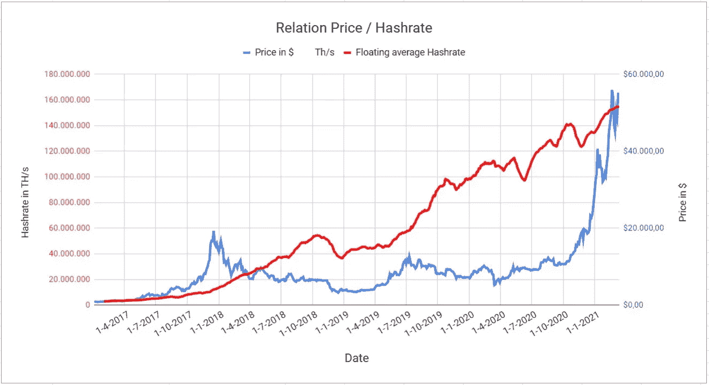
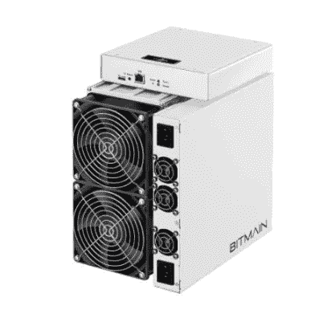
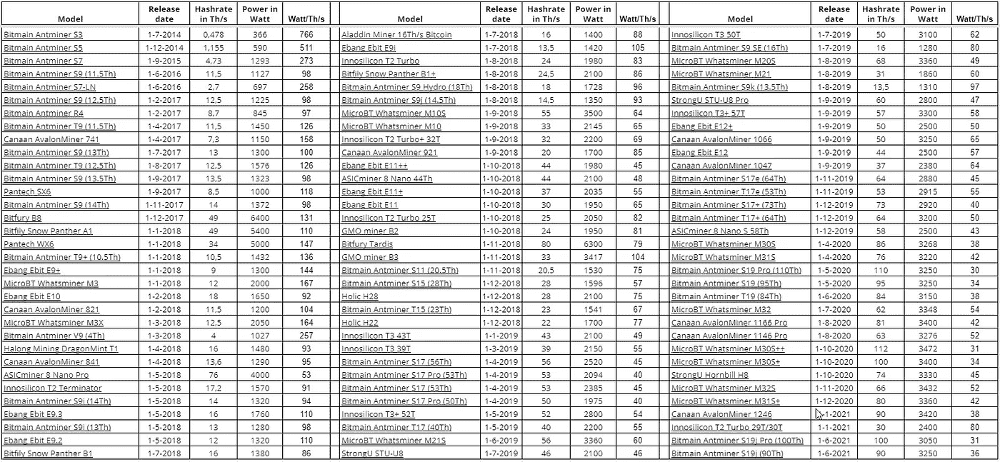
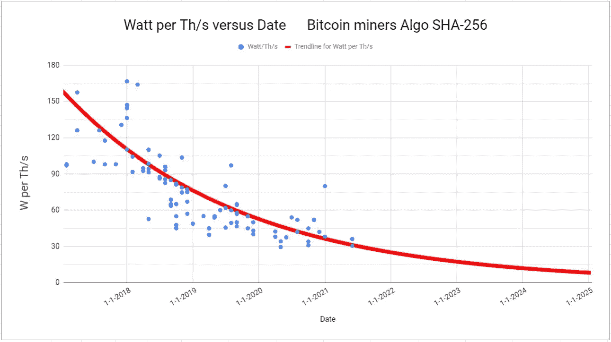
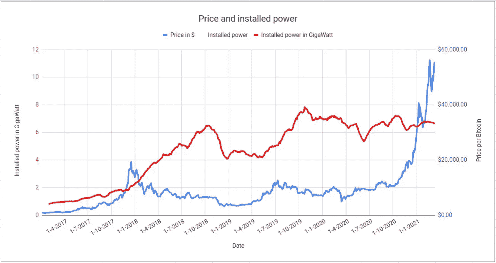
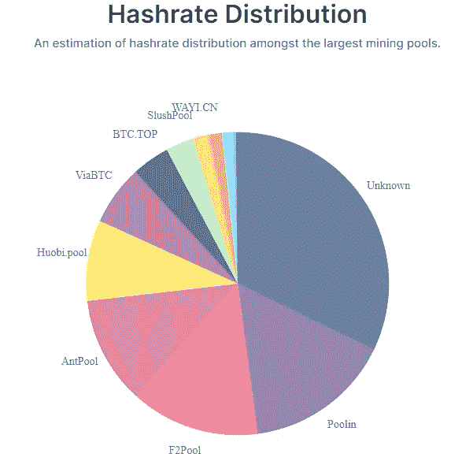

# 比特币及其能源消耗

> 原文：<https://medium.com/coinmonks/bitcoin-and-its-energy-consumption-ed0b27017345?source=collection_archive---------9----------------------->

# 介绍

关于比特币的能耗，有很多可以说的，而且正在做。这个故事也想对讨论有所贡献。有两个阵营。反对者认为花在比特币上的每千瓦时显然都太多了，支持者则试图证明任何消费都是合理的，不管多高，他们认为比特币网络的安全有必要使用这么多，否则都是绿色能源，不会被利用。值得注意的是，没有人计算出建立一个安全的比特币网络至少需要多少能量。有没有可能对此说些有意义的话？

# 当前情况(2021 年 3 月)

人们常说，比特币网络的安全性是所有加密货币中最好的。安全性基于挖掘比特币所需的巨大挖掘能力(Hashrate ),以及通过超过 50%的攻击以这种方式攻击比特币的可能性。
hashrate 的数量以及比特币网络的安全性取决于矿商能够获得的利润。
矿工的利润和损失由许多因素决定:

1.  比特币的价值，即比特币汇率的更高价值，对矿商的利润有积极作用。
2.  total hashrate，即蛋糕应该分配给多少矿工。
3.  单位时间内可以挖掘的比特币数量。现在是每 10 分钟 6.25 BTC。
4.  采矿设备的哈希表。它越高，找到区块的机会就越大，因此产量也就越高。
5.  一个矿工必须付出的代价。成本包括能源成本、托管成本、运营成本和折旧。
6.  采矿设备的效率。采矿设备越现代化，垃圾/能源成本比率越高，因此采矿设备的盈利能力也越高。

因为可以假设，一旦矿工投资了采矿设备，这些成本必须在设备可以再次被替换之前收回，所以点 4、5 和 6 实际上是固定数据。除了每 4 年减半一次之外，第 3 点也是固定的。这意味着一个矿工的利润高度依赖于比特币价格和总 hashrate。

我们可以看到价格和 hashrate 之间的联系，如果比特币价格上涨，hashrate 就会增加，因为更多的矿工看到了开采比特币的利润，如果价格低，总 hashrate 就会减少，因为矿工不会亏本开采。在每个价格水平，在 hashrate(矿工数量)和价格之间会有一个稳定点。但是它总是在运动，因为采矿设备变得越来越好，因此新的矿工将能够开采更多的利润，这是转变发生的结果。另外，在一个上涨的市场中，价格的发展总是滞后于价格。毕竟，购买和安装采矿设备需要时间。关闭采矿设备可以很快完成，所以我们看到价格的(可观的)下降也会导致总价格的直接下降，但是价格的上升会导致总价格的缓慢上升

graph 1

我们看到，在 2017 年 12 月价格见顶后，越来越多的矿工开始采矿。作为最大的供应商之一，比特大陆无法应对订单的涌入，6-8 个月的交货时间是正常的，这就是为什么 hashrate 在 10 个月后才达到顶部。比特币的价格已经开始下跌，以至于 2018 年 12 月的汇率从 8000 美元跌至 4000 美元，对 hashrate 产生了直接影响。从 2019 年 4 月到 5 月，我们再次看到价格上涨，不久之后是 hashrate 的上涨。2019 年 7 月将再次达到价格顶部，而 hashrate 要到 9 月底才会达到顶部。【2019 年 11 月后，我们看到价格将稳定至 2020 年 10 月，但 hashrate 的增长将进一步扩大，这是由于进入市场的采矿设备的效率不断提高，如下所示。2020 年 10 月后，我们看到 hashrate 的价格快速上涨，只有稳步增长，因为矿业市场滞后，正如我们在 2017 年 12 月看到的那样。

# 高效采矿设备

为了检查采矿设备的效率，过去和现在市场上出现的所有设备都被放在一个表中。这些都是 Asic SHA256 矿工。效率用实现 1 万亿哈希/秒的哈希速率需要多少瓦特功率来表示

Table 1

我们看到，2014 年发布的矿工需要超过 750 瓦来开发 1ta hash/s 的网络活动。而最现代的设备需要大约 30 瓦的功率才能达到 1 Terahash/s。这些采矿设备的效率数据在图表中显示为点云，2017 年之前的矿工除外，以提供更好的可读性，并排除了极端情况。

Graph 2

还增加了一条指数趋势线，这样我们可以预测未来。根据图表，到 2024 年 4 月，也就是下一个减半日期，如果采矿技术以同样的速度发展，我们的平均效率将达到约 12 瓦特/Th/s。

有了以上所有的数据，我们就可以说一说采矿设备的装机功率和与之相关的能源消耗了。应该指出的是，并非所有的矿工都使用最现代化的设备，因为这些设备在购买后当然要使用一段时间，以控制折旧成本。该计算基于采矿设备在 2 年内折旧的假设，因此整个采矿园区的设备平均使用年限为 1 年。这意味着每天都要对整个采矿园区的装机容量进行有根据的估计。这些值也显示在价格背景的图表(3)中。

Graph 3

从图 3 中我们可以看出，在过去的两年中，装机容量的增长速度没有图 1 中的速度快。但它稳定在 70 亿瓦左右。装机功率稳定时，Hashrate 上升。这是因为采矿设备的效率更高。但截至 2020 年 10 月，我们预计随着比特币价格的爆炸式增长，装机容量也会增长得更快。事实并非如此，因为采矿设备供应商再次无法像 2018 年初那样应对需求。所有的矿工都急切地等待着他们的新设备。大概从 2021 年中期开始，我们将看到装机容量的快速增长。

# 未来能源消耗

从上图 3 也很容易得出比特币的能耗。比特币的装机容量为 70 亿瓦，每年消耗约 60 亿瓦时。这些数量或多或少与基于其他推理的其他研究相同，如 [Digiconomist 的](https://digiconomist.net/bitcoin-energy-consumption)计算。
从 2019 年 7 月到 2020 年 10 月，比特币价格徘徊在 10000 美元左右。在这种情况下，矿商每年可以消耗大约 60 千瓦时的电量，但仍然可以盈利，否则他们就会停止生产。 ***基于采矿设备的安装基数将总是接近从成本角度来看合理的最大值的理论，因此可以预计，随着当前比特币价格的 6 倍上涨(2021 年 3 月 60，000 美元)，未来一年的能源消耗也将增加 6 倍，达到约 350 千瓦时/年的水平。*** 如果比特币价格进一步上涨，耗电量也会相应上升。如果 PlanB 的价格预测成为 thruth(1 BTC = 288，000 美元)，那么我们将在 2022 年达到超过 1 PETA watt-hour/年的巨大电力消耗。当然，尽管它可能会因为供应商问题或简单的发电问题而放缓，因此采矿活动的电力只会变得更加昂贵。

# 网络安全性

比特币最大主义者并不介意这一点，因为这是网络安全的必要条件，这是一句广为流传的格言。但是真的需要这么多能量来保证比特币网络的安全吗？

很难确定什么时候采矿 hashrate 足以免受 51%的攻击。因此，我的下一个建议，我们将接下来检查可行性。
***每年 1gb 或 9TWh 的装机容量足以确保网络安全。*** (我们假设装机功率，而不是哈希值，因为哈希值取决于技术水平。)

逻辑推理:人们可以问一个简单的问题:在第一次飙升之前，2017 年的比特币网络是否不安全？如果答案是否定的，一个比特币最大化主义者自然不会说其他的话，那么显然 10 亿瓦的装机容量就足够安全了。

从数学上来说:要对 10 亿瓦的矿工进行 51%的攻击，必须再安装 10 亿瓦的设备。对于最现代化的矿工，这可以通过超过 305，000 台比特大陆 antminer S19 pro 来实现。比特大陆每年可以生产大约 10 万台采矿钻机。换句话说，行不通。

经济推理:如果比特大陆可以交付或与所有其他采矿钻机供应商一起可以完成，那么一个犯罪组织将不得不投资超过 50 亿美元在采矿钻机/房屋/工厂等方面，以执行一个简单的 51%的攻击。

在租赁的基础上:租赁设备根本不行。甚至连租赁所需设备量的 5%都没有。

在贿赂的基础上:犯罪分子可以试图贿赂现有的矿池，并将它们用于自己的目的。为了实现这一目标，至少 4 个最大的资金池必须合作。这是一个不太可能发生的情况，因为很难保守这个秘密，如果类似的事情曝光，管理该池的个体矿工可能会转向其他池。
顺便说一句，这种情况与总哈希值或装机功率基数的高度无关，因此不能证明比特币开采的电力消耗是合理的

# 结论

我希望借此表明，比特币目前的能耗远远不能保证网络的安全，因此目前的能耗是不合理的。以目前的形式，比特币消耗了太多能源，不幸的是，在不久的将来，这种情况可能会更严重。如果开发人员想出一些不同于标准 PoW 系统的东西来降低能耗，那就太好了。

> 加入 Coinmonks [Telegram group](https://t.me/joinchat/EPmjKpNYwRMsBI4p) 并了解加密交易和投资

## 另外，阅读

*   最好的[密码交易机器人](/coinmonks/crypto-trading-bot-c2ffce8acb2a) | [网格交易](https://blog.coincodecap.com/grid-trading)
*   [3 商业评论](/coinmonks/3commas-review-an-excellent-crypto-trading-bot-2020-1313a58bec92) | [Pionex 评论](/coinmonks/pionex-review-exchange-with-crypto-trading-bot-1e459d0191ea) | [Coinrule 评论](/coinmonks/coinrule-review-2021-a-beginner-friendly-crypto-trading-bot-daf0504848ba)
*   [AAX 交易所评论](/coinmonks/aax-exchange-review-2021-67c5ea09330c) | [德里比特评论](/coinmonks/deribit-review-options-fees-apis-and-testnet-2ca16c4bbdb2) | [FTX 交易所评论](/coinmonks/ftx-crypto-exchange-review-53664ac1198f)
*   [n ave 零点回顾](/coinmonks/ngrave-zero-review-c465cf8307fc) | [Phemex 回顾](/coinmonks/phemex-review-4cfba0b49e28) | [PrimeXBT 回顾](/coinmonks/primexbt-review-88e0815be858)
*   [Bybit Exchange 审查](/coinmonks/bybit-exchange-review-dbd570019b71) | [Bityard 审查](/coinmonks/bityard-review-7d104239be35) | [CoinSpot 审查](https://blog.coincodecap.com/coinspot-review)
*   [3 commas vs crypto hopper](/coinmonks/3commas-vs-pionex-vs-cryptohopper-best-crypto-bot-6a98d2baa203)|[赚取加密利息](/coinmonks/earn-crypto-interest-b10b810fdda3)
*   最好的比特币[硬件钱包](/coinmonks/the-best-cryptocurrency-hardware-wallets-of-2020-e28b1c124069?source=friends_link&sk=324dd9ff8556ab578d71e7ad7658ad7c) | [BitBox02 回顾](/coinmonks/bitbox02-review-your-swiss-bitcoin-hardware-wallet-c36c88fff29)
*   [莱杰 vs n rave](/coinmonks/ledger-vs-ngrave-zero-7e40f0c1d694)|[莱杰 nano s vs x](/coinmonks/ledger-nano-s-vs-x-battery-hardware-price-storage-59a6663fe3b0)
*   [密码本交易平台](/coinmonks/top-10-crypto-copy-trading-platforms-for-beginners-d0c37c7d698c)
*   [沃德评论](/coinmonks/vauld-review-2021-lend-trade-and-buy-bitcoin-in-india-e37a96374961) | [尤霍德勒评论](/coinmonks/youhodler-4-easy-ways-to-make-money-98969b9689f2) | [区块链评论](/coinmonks/blockfi-review-53096053c097)
*   最好的[加密税务软件](/coinmonks/best-crypto-tax-tool-for-my-money-72d4b430816b) | [硬币追踪评论](/coinmonks/cointracking-review-a-reliable-cryptocurrency-tax-software-5114e3eb5737)
*   最佳[密码借贷平台](/coinmonks/top-5-crypto-lending-platforms-in-2020-that-you-need-to-know-a1b675cec3fa) | [杠杆令牌](/coinmonks/leveraged-token-3f5257808b22)
*   [block fi vs Celsius](/coinmonks/blockfi-vs-celsius-vs-hodlnaut-8a1cc8c26630)|[Hodlnaut Review](/coinmonks/hodlnaut-review-best-way-to-hodl-is-to-earn-interest-on-your-bitcoin-6658a8c19edf)
*   [Bitsgap 审查](/coinmonks/bitsgap-review-a-crypto-trading-bot-that-makes-easy-money-a5d88a336df2) | [Quadency 审查](/coinmonks/quadency-review-a-crypto-trading-automation-platform-3068eaa374e1) | [Bitbns 审查](/coinmonks/bitbns-review-38256a07e161)
*   [埃利帕尔泰坦评论](/coinmonks/ellipal-titan-review-85e9071dd029) | [赛克斯斯通评论](/coinmonks/secux-stone-hardware-wallet-review-15-discount-coupon-2020-7577032faa6e)
*   [本地比特币评论](/coinmonks/localbitcoins-review-6cc001c6ed56)
*   最佳[区块链分析](https://bitquery.io/blog/best-blockchain-analysis-tools-and-software)工具| [赚比特币](/coinmonks/earn-bitcoin-6e8bd3c592d9)
*   [加密套利](/coinmonks/crypto-arbitrage-guide-how-to-make-money-as-a-beginner-62bfe5c868f6)指南| [如何做空比特币](/coinmonks/how-to-short-bitcoin-568a2d0b4ae5)
*   最佳[加密制图工具](/coinmonks/what-are-the-best-charting-platforms-for-cryptocurrency-trading-85aade584d80) | [最佳加密交易所](/coinmonks/crypto-exchange-dd2f9d6f3769)
*   [如何在印度购买比特币？](/coinmonks/buy-bitcoin-in-india-feb50ddfef94) | [瓦济克斯审查](/coinmonks/wazirx-review-5c811b074f5b)
*   [印度比特币交易所](/coinmonks/bitcoin-exchange-in-india-7f1fe79715c9) | [比特币储蓄账户](/coinmonks/bitcoin-savings-account-e65b13f92451)
*   [CoinDCX 评论](/coinmonks/coindcx-review-8444db3621a2)

> [直接在您的收件箱中获得最佳软件交易](/coinmonks/newsletters/coinmonks)

