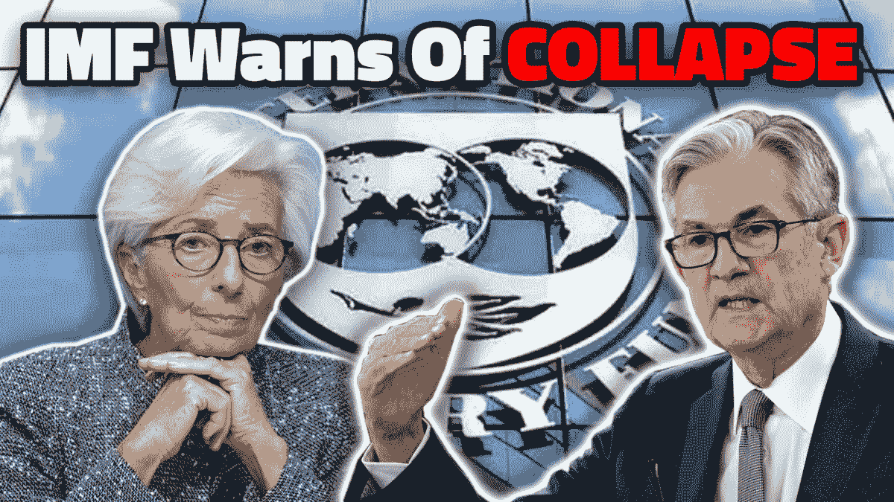

# 比特币和宏观经济:鲍威尔退休“短暂”，国际货币基金组织警告崩溃

> 原文：<https://medium.com/coinmonks/bitcoin-and-macroeconomics-powell-retires-transitory-imf-warns-of-collapse-48890d6831a0?source=collection_archive---------13----------------------->

[**在 YouTube 上看这一集**](https://youtu.be/ZfQ5ILISI5Q)

听听这一集:

*   [BitcoinTV](https://bitcointv.com/w/5WNprGfsXQtt3yu5Nh5jCg)
*   苹果
*   [Spotify](https://open.spotify.com/episode/6Jgn1n0BGIN6iRv5x87Ff9?si=bd0bRMGsTrWeFKyXGOdvgA&nd=1)
*   [谷歌](https://podcasts.google.com/feed/aHR0cHM6Ly9mZWR3YXRjaC5saWJzeW4uY29tL3Jzcw==/episode/MzcxOWI4NTUtOGQwNC00M2E4LTkyY2UtYjI0ZDZlYzFhZGEx)
*   [Libsyn](http://fedwatch.btc.libsynpro.com/powell-retires-transitory-imf-warns-of-collapse-fed-73)
*   [阴天](https://overcast.fm/+m2aetanIo)
*   [隆隆声](https://rumble.com/vqfwbs-powell-retires-transitory-imf-warns-of-collapse-fed-73.html)

在这一集《比特币杂志》的“美联储观察”播客中，作为《比特币杂志》新一期《T21》直播节目的一部分，我和克里斯蒂安·克罗勒首次进行了现场直播。今后，我们将在东部时间每周二下午 2:00 左右进行现场直播。来加入我们吧，当我们掌握了它的窍门，我们也许能够回答来自聊天的现场问题。

本周，我们进行了一次宏观经济学的旋风之旅。首先，我们听了美联储主席杰罗姆·鲍威尔在国会作证的三个片段，并对其做出了回应，他在证词中放弃了“暂时”一词接下来，我们快速阅读了国际货币基金组织关于低收入国家债务危机的博客文章。第三，我们讨论了中国央行(PBoC)将其存款准备金率(RRR)下调 50 个基点(bps)以及恒大的违约。最后，我们讨论了比特币，并涵盖了我们正在进行的几个关于宏观和地缘政治的主题，以及我们为什么看好美国、看跌欧洲。这是一场盛大的现场演出，我想你们都会喜欢的。

# 美联储的鲍威尔“暂时”退休

我们听了鲍威尔的三个片段。每篇文章都让我们能够讨论美联储及其货币政策的不同方面，或许还能梳理出它的内心想法。如此多的美联储专家和分析师甚至不看实际的证词。他们被头条新闻或一些记者对鲍威尔所说的话的理解激怒了。普通的、以金钱为导向的公众有一种偏见，认为这些人是邪恶的。我们认为央行行长是被误导的和不公正的，但我们实际上观看了证词以形成我们自己的观点，并带着你们与我们同行。

我们的讨论包括以下部分:过渡或非过渡、全球低利率环境、基于非线性供应副作用的通胀预测问题，以及缩减购债规模是否会加快。

# 国际货币基金组织认为低收入国家经济崩溃

在 12 月 2 日的一篇博客文章中，国际货币基金组织总裁克里斯塔琳娜·格奥尔基耶娃写道，“我们可能会看到一些国家的经济崩溃，除非 20 国集团的债权人同意加快债务重组，并在重组谈判期间暂停偿债。”

这是非常令人担忧的。这些国家的国际贷款已经延期了 12 到 18 个月，但它们仍然无力偿还？如果他们在延期一年后仍无力偿还，谁会认为重组会有帮助呢？

这些国家真的遇到了麻烦，这符合我们的论点，即新兴市场受益于过去 50 年宽松的信贷环境。既然宽松的信贷环境已经结束，他们在继续保持之前的经济活动水平时将面临极大的压力。

# 中国削减 RRR 银行和恒大违约

我们的最后一站是中国。我们报道了美联储，我们把欧洲带入了我们的讨论，然后我们报道了中国人民银行。本周，它宣布[将其存款准备金率(RRR)下调 50 个基点](https://archive.ph/1KRUJ)，释放 1.2 万亿美元，希望银行能够出去放贷。

这是继今年 7 月早些时候类似的降息之后的又一次降息，据称此举释放了 1 万亿欧元。它一定没有达到预期的效果，或者经济比先前估计的要糟糕得多，因为它为什么要再做一次，和/或为什么这次它会期望更好的结果？

如果银行不放贷，那不是因为它们没有准备金。有关于 RRR 的实证研究——银行先放贷，然后出去寻找所需的储备。在 RRR 给银行空间并不会让它们愿意出去放贷。

这也发生在恒大即将面临离岸债务违约的时候，如果在撰写本文时恒大尚未违约的话。有报道称，恒大将拖欠 190 亿美元的国际债券，其房地产行业的第二大国际债务人凯撒也拖欠了 120 亿美元的离岸债务。传染仍在继续。

最后，我们对比了中国人民银行和美联储最近声明中的观点。对于这两个国家来说，全球金融现实非常相似，事实上它们非常紧密地交织在一起，但鲍威尔描绘的经济表现非常好，存在过度增长和通胀的危险，中国人民银行表示，央行需要提前向经济注入流动性支持，以应对潜在的挑战。

对比是明显的。美联储正在提供积极的前瞻性指引，而中国央行则是消极的。

如果您喜欢此内容，请在 iTunes 上订阅并查看，以帮助其他人找到该节目。

# 链接

*   鲍威尔证词剪辑一:[T3【https://youtu.be/JJxqiyKIEW8?t=1937】T5](https://youtu.be/JJxqiyKIEW8?t=1937)
*   鲍威尔证词剪辑二:[*https://youtu.be/JJxqiyKIEW8?t=3596*](https://youtu.be/JJxqiyKIEW8?t=3596)
*   鲍威尔证词剪辑三:[*https://youtu.be/JJxqiyKIEW8?t=4092*](https://youtu.be/JJxqiyKIEW8?t=4092)
*   国际货币基金组织博客:[*https://blogs . IMF . org/2021/12/02/the-G20-common-framework-for-debt-treatments-must-up/*](https://blogs.imf.org/2021/12/02/the-g20-common-framework-for-debt-treatments-must-be-stepped-up/)
*   中国 https://archive.ph/1KRUJ[*中国 RRR*](https://archive.ph/1KRUJ)

*恒大默认:*[*https://www . Reuters . com/world/China/developer-China-ever grandes-shares-set-rise-66-重组-织机-2021-12-07/*](https://www.reuters.com/world/china/developer-china-evergrandes-shares-set-rise-66-restructuring-looms-2021-12-07/)

*原载于 2021 年 12 月 8 日 https://bitcoinmagazine.com**[*。*](https://bitcoinmagazine.com/markets/bitcoin-and-macroeconomics-imf-warns-of-collapse)*