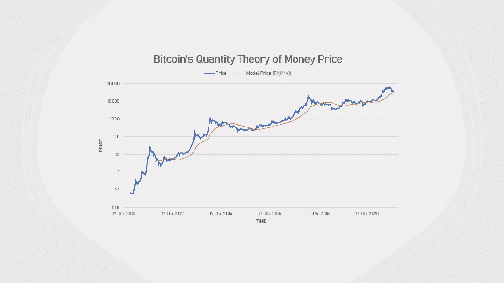
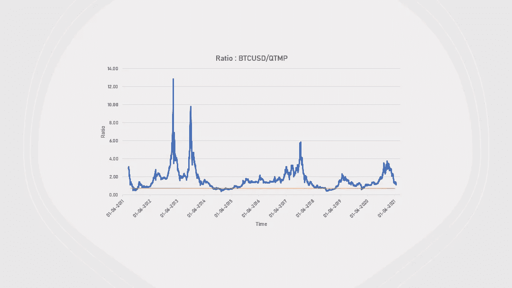
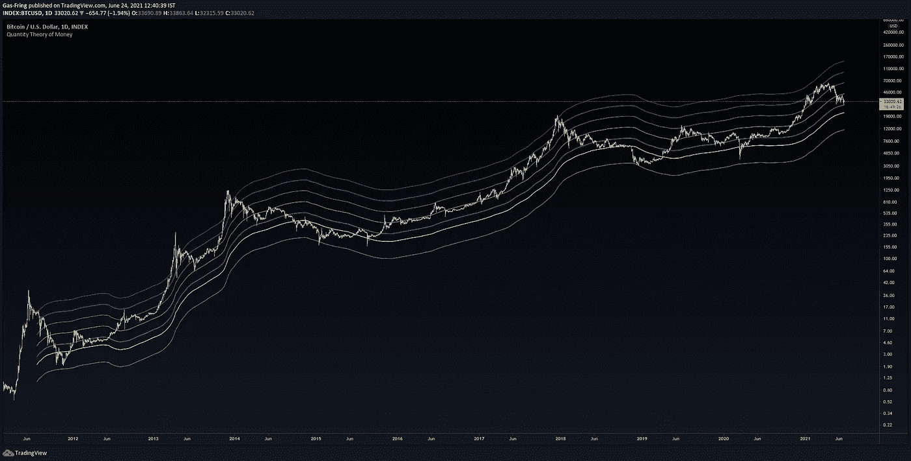
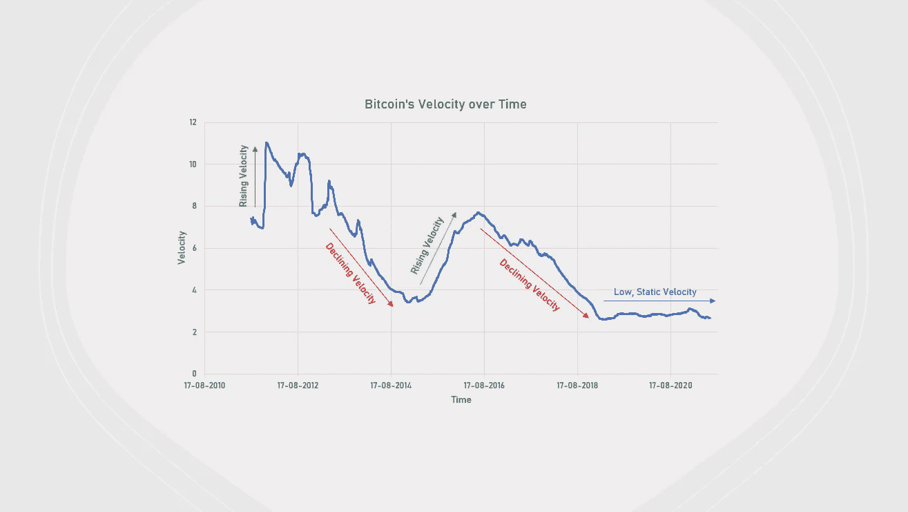

# 比特币与货币数量理论

> 原文：<https://medium.com/coinmonks/bitcoin-and-quantity-theory-of-money-7f6c0b20b183?source=collection_archive---------6----------------------->

Photo by [Bermix Studio](https://unsplash.com/@bermixstudio?utm_source=medium&utm_medium=referral) on [Unsplash](https://unsplash.com?utm_source=medium&utm_medium=referral)

# 货币数量论

在货币经济学中，货币数量理论(以下简称 QTM)指出，商品和服务的一般价格水平与流通中的货币量成正比。

在其现代形式中，它建立在以下定义关系上:

***M * V = P * Y***

其中，
M =货币供应量
P =物价水平
V =货币流通速度
Y =总产出(收入)

# 比特币和 QTM

如果我们要评估一枚比特币的价格，考虑到它同时是一种商品和货币，我们可以通过进行相关的替代将数量理论应用于它。

m = BTC 流通供应量
Y =年交易额(滚动 365 天交易额总和)
V =年交易额/BTC 年平均市值，其中市值:流通供应量*价格

通过使用 QTM 等式，我们现在可以得出每个 BTC 的合理价格，如下所示:

***P = (M * V) / Y***

下图显示了比特币的实际价格相对于理论价格的表现:

BTCUSD vs QTM Price

更深入地观察实际价格和理论价格之间的比率的时间序列，我们看到 BTCUSD 在其理论模型价格的某个倍数处触底。

Ratio between BTCUSD and QTM Price

BTCUSD 的历史最低点是理论价格的 0.4 倍。还建立了一个 TradingView 指标来检测理论价格倍数附近的价格行为。

BTCUSD vs QTM Price Levels

该带由对 BTCUSD 提供显著支撑或阻力的层制成。每个级别都是理论价格的倍数:

1.  红色:0.4 倍
2.  白色:0.75 倍
3.  蓝色:1x
4.  橙色:1.5 倍
5.  绿色:2.25 倍
6.  紫色:3.33 倍
7.  蓝绿色:5 倍

每个周期的绝对顶部是理论价格的 5 倍，而 wicks 的价格高达理论价格的 9-10 倍。然而，这种扩展可能是由于模型数据的低样本量，以及随着时间的推移它的强度。

随着时间的推移，比特币的速度也趋于稳定。在成立后迅速增长后，它在生命的前四年有所下降，随后在 2018 年年中有所上升。自那以后，它下降到了价格周期底部结束以来的当前水平。

Bitcoin Velocity over Time

这可以被解释为从作为货币的感知/效用到更多的价值储存或商品的转变。Satoshi 可能将它作为一种点对点数字现金推出，但人们很快意识到它作为一种商品的价值。我还没有形成一个角度来看它从 2015 年到 2016 年的攀升(也许机器人先生影响了它的观众加入反对 Ecoin 的革命？:-D)。

# 个人观点

作为一个高时间框架的摆动交易者，我发现这个理论在检测市场底部，或重大 HTF 反转方面很有用。BTCUSD 从 28.9 美元的理论价格反弹，标志着 2021 年牛市电影的间歇可能结束。是时候付钱给卖爆米花的人了，然后走上灯光昏暗的楼梯，回到我们的剧院座位上。

> 加入 Coinmonks [电报频道](https://t.me/coincodecap)和 [Youtube 频道](https://www.youtube.com/c/coinmonks/videos)了解加密交易和投资

# 另外，阅读

*   [交易信号是什么？](https://coincodecap.com/trading-signal) | [Bitstamp vs 比特币基地](https://coincodecap.com/bitstamp-coinbase) | [买索拉纳](https://coincodecap.com/buy-solana)
*   [ProfitFarmers 回顾](https://coincodecap.com/profitfarmers-review) | [如何使用 Cornix Trading Bot](https://coincodecap.com/cornix-trading-bot)
*   [十大最佳加密货币博客](https://coincodecap.com/best-cryptocurrency-blogs) | [YouHodler 评论](https://coincodecap.com/youhodler-review)
*   [my constant Review](https://coincodecap.com/myconstant-review)|[8 款最佳摇摆交易机器人](https://coincodecap.com/best-swing-trading-bots)
*   [MXC 交易所评论](/coinmonks/mxc-exchange-review-3af0ec1cba8c) | [Pionex vs 币安](https://coincodecap.com/pionex-vs-binance) | [Pionex 套利机器人](https://coincodecap.com/pionex-arbitrage-bot)