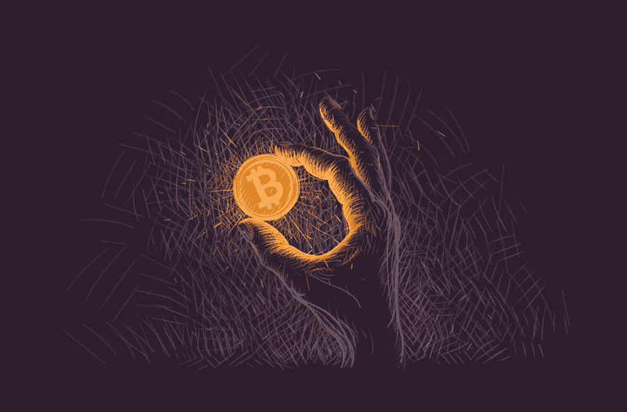

# 比特币和稳定币

> 原文：<https://medium.com/coinmonks/bitcoin-and-stablecoins-9097fcba2de1?source=collection_archive---------2----------------------->

## 现在每个人都知道比特币，但什么是稳定币，它们有什么用？

A hand holding one Bitcoin, from [Shutterstock](https://www.shutterstock.com/)

## 背景

比特币是 2009 年 1 月制造的第一种加密货币。据说比特币的发明者是中本聪，但这个人一直没有找到。所以我们可以假设他想对自己的身份保密。