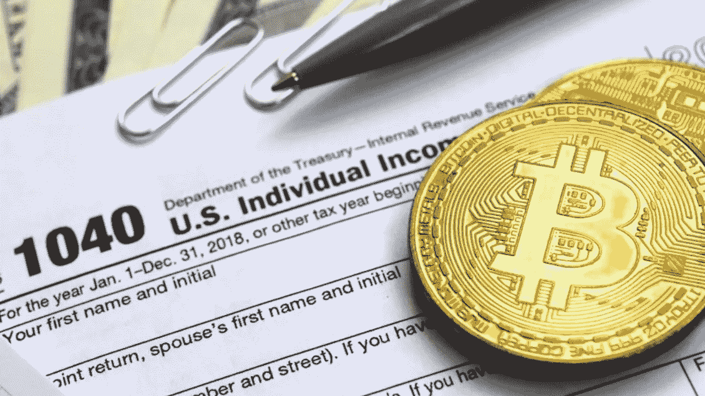

# 比特币与逃税、避税和加密的黄铜税

> 原文：<https://medium.com/coinmonks/bitcoin-and-tax-evasion-tax-avoidance-and-the-brass-tax-of-crypto-2a162a882b8b?source=collection_archive---------4----------------------->

~dwulf

以下内容并非税务或法律建议；而且仅仅是为了教育目的，实际上是骗税。如果你被抓住，你会进监狱。

这个主题是关于税收的。如果你用比特币支付，并用比特币养活自己，国家对你的经济活动的了解是有限的，这意味着他们没有任何指数将进出你加密钱包的交易与你的个人身份联系起来。如果你可以利用这种有限的可见性来避免和不逃避纳税……那么比特币是跳入加密生态系统的一个真正强大的激励。

如果你花时间思考比特币和美国国税局从加密生态系统中收取的税款，你就会开始意识到，这并不像“用比特币支付，不用缴税”那么简单。事实上，在法律理论上，税务部门非常擅长处理比特币的征税问题。

问题是税法在技术实践中的适用程度如何。

让我们看一些例子。

## **未报告的资本收益**

假设你一年前购买了价值 1 万美元的比特币。今天，这些硬币价值超过 50 万美元。

现在让我们假设你花了 10，000 美元的这些增值的比特币在一些好东西上。在法律理论上，你应该为你刚刚实现的 9800 美元的资本收益缴税。

但是，在技术实践中，IRS 很难实际执行这一规则，因为他们依赖于 KYC/AML 提交，他们要求所有受监管的中央交易所将您的身份与加密钱包的所有权联系起来。商家通常没有建立，或者没有基础设施，或者想要通过花费来获得基础设施以向税务机关报告谁花费了什么。

受监管的公司被夹在魔鬼、监管者和立法者以及来自消费者的诉讼的深海之间。他们不得不权衡是被官僚关闭还是被起诉破产，然后被不满的顾客关闭。

## **保持收入不入账**

一些工作(如园丁、服务员、女佣、理发师和门卫)的薪酬中有很大一部分是现金。对于这些工作的现金部分，很容易“忘记”申报所有现金收入，因为小费和小费通常不会通过 W2 或 1099 工资单。

比特币扩大了这类工作的财务灵活性，因为它允许远距离支付，没有 W2 或 1099 税单的额外复杂性，发票由你创建和控制，你不必处理获得大量实物法定现金的问题。

如果你是一名自由职业者，你可以很容易地接受来自世界上任何人的比特币，并且很容易忘记或者干脆不申报。

你仍然可以低报通过书面钞票和/或支票收到的收入，但被发现的风险更大，因为传统银行的托管性质允许国税局通过你开户时向银行提供的社会安全号码或税务 id 来查看你的银行账户交易。

## **公司行贿基金**

现在想象一下，你做了一些有利可图的加密交易。通过巧妙的会计和讲故事，你可以转移一些钱给自己，并从公司收入中作为“费用”扣除。

你可以要求你的朋友离开这个国家，住在另一个国家，比如说香港，用他们的合法名字开一个银行账户，并给你开出费用发票。但你必须相信你的朋友会继续提供这个账户的访问权限(这个账户合法地在他们的名下，而不是你的)。

或者，你可以尝试一些更复杂的方法，提供一个在法律上更优雅的解决方案，比如创建一个拥有银行账户的外国实体，然后创建一个拥有该实体的信托，你直接控制财富，但信托拥有所有权。

这一切都不容易，也不便宜，因为有太多的全球银行规则和地方法规旨在防止这种操纵，但如果团队中有足够多的高素质律师和会计师，这是可以实现的。

但有了加密货币和比特币，你可以创建一张假发票，然后把你的硬币寄到一个你声称属于外国承包商的地址。但实际上，它是你的，现在你可以把它当作免税的钱来花。

## **但是比特币不能被追踪吗？**

是的，政府和任何人都可以追踪比特币从一个地址到另一个地址的流动。这使得比特币对于传统洗钱来说不切实际。洗钱几乎是逃税的反义词(申报非法收入或隐藏合法收入)，比特币交易的公开性和永久性使得区块链很难“清理”或“抹去”余额。

但要成功避税，你只需要对收入进行可信的否认。在上述三种情况中，唯一一种不可否认的情况是花掉已知属于你的硬币，并且不报告已实现的资本收益。

然而，有许多方法可以打破和抵消所有权链。例如，假设你通过合法渠道购买了一批比特币，货币传输和 KYC 规则意味着你的购买已经被交易所记录下来。

你们可以在 DeFi 平台上匿名交易密码货币；没有监管，运行密码货币交易所所需的技术基础设施非常简单，任何人都不可能监管它。所以你可以在中国交易所用你的 BTC 换成 LTC，然后在俄罗斯交易所用你的 LTC 换成 BTC。IRS 将很难获得跟踪这些交易所需的记录，更不用说不存在的 KYC/AML。

如果这听起来像是太多的工作，对于这个民族国家来说，只需要等待几年，真正的匿名协议就会成形。

## **更好的新交易？**

我怀疑一小部分经济活动将转向比特币和加密，以此作为一种避税方式，这将足以证明购买比特币是一种良好的投机性投资，可以隔离个人财富，并成为比目前市场上的传统金融工具(如 401k、Roth RIAs 等)更好的避税天堂。税务机关只有征税的权力，但是如果用户正确处理比特币和加密财富并将其输入加密生态系统，税务机关就会屈服于技术能力。

考虑到这一点，人们很难相信政府会将比特币合法化。但这将迫使他们承认，现在税收必须对选择为其提供服务的人负责。

但就目前而言，很明显，税务当局将继续照常行事，并通过恐惧、恐吓和强制手段迫使公民向国税局如实披露(如果他们曾与加密或比特币交易，将受到伪证罪的处罚)，永远将他们标记为嫌疑人。

当然，如果一个人明显生活入不敷出，他可能会被国税局抓住。或者如果一个人花钱购买可以与其合法身份相关联的物品。它甚至可能达到为知道你在做什么并告诉 IRS 的税务机关告密的地步(并且，作为一个告密者，得到 30%的欠税减免)。

大公司不太可能积极参与将收入从账面上抹去，或建立行贿基金。有太多的人在看数字，以至于无法隐藏这种活动，在一个中央银行机构里，每一美元都是有关联的。

但是，如果更多的人意识到这一点，并将他们的财富与中央集权制度脱钩，随着比特币继续融入新的全球经济，这些避税技巧将增加人们在传统制度之外工作的动机，并鼓励人们成为个体自由职业者，或者创办小型 DAO，一个分散的自治组织，拥有可信赖的朋友、商人和供应商的公司。

有效地允许密码持有者将他们自己与系统分离。比特币可能带来的避税将迫使政府放弃低效和扭曲的税收形式(收入税、企业利润税、资本利得税等)。)和更有效的税收(消费、土地)。

## **结束游戏**

政府在枪口下强迫其公民接受“服务”。当然，聪明有效地减轻你的税负是聪明的。但是人们应该永远记住,“法律”并不等同于“道德”。

许多拒绝纳税的人越来越反感，因为如果他们这样做了，那么他们的钱将被用于资助不道德的行为——如战争和其他反自由的邪恶行为，这些行为已经在新闻和网络上公开展示。如果一个人不能在道德上认可“以他们的名义”纳税来资助这些事情。

比特币可能为那些希望将自己从纳税人的“奴隶身份”转变为自由王国的人提供了实现这一目标的绝佳机会，那就是将他们的货币资产 100%转移到比特币(或另一种去中心化的密码)中。

当然，现在很难做到这一点，但随着越来越多的选择出现在网上，使用比特币购买、支付和生活，这将为“选择退出”和生活提供更多选择，而不会被人的资本扣押。

> “自由永远不会通过投票箱，通过投票，也不会通过抗议或暴乱来实现——而是通过市场。自由将以产品和服务的形式到来，为使用者提供真正的自由。”
> 
> ~安德鲁·J·加兰博斯

很明显比特币和 Crypto 完全符合描述:)

> 加入 Coinmonks [电报频道](https://t.me/coincodecap)和 [Youtube 频道](https://www.youtube.com/c/coinmonks/videos)了解加密交易和投资

## 也阅读

 [## 杠杆代币[多头代币]终极指南

### 杠杆化令牌是具有杠杆化风险敞口的 ERC20 令牌，不考虑保证金、要求、管理…

medium.com](/coinmonks/leveraged-token-3f5257808b22)  [## 最佳加密交易所| 2021 年十大加密货币交易所

### 编辑描述

blog.coincodecap.com](https://blog.coincodecap.com/crypto-exchange)  [## 2021 年最佳加密借贷平台| 6 大比特币借贷平台

### 获得比特币和其他加密货币的最佳贷款利率

medium.com](/coinmonks/top-5-crypto-lending-platforms-in-2020-that-you-need-to-know-a1b675cec3fa)  [## 2021 年最佳免费加密交易机器人

### 2021 年币安、比特币基地、库币和其他密码交易所的最佳密码交易机器人。四进制，位间隙…

medium.com](/coinmonks/crypto-trading-bot-c2ffce8acb2a)  [## 最佳 4 个加密交易信号电报通道

### 这是乏味的找到正确的加密交易信号提供商。因此，在本文中，我们将讨论最好的…

medium.com](/coinmonks/best-crypto-signals-telegram-5785cdbc4b2b)  [## 5 个最佳社交交易平台[2021] | CoinCodeCap

### 编辑描述

blog.coincodecap.com](https://blog.coincodecap.com/best-social-trading-platforms)  [## BlockFi 评论 2021:利弊和利率| CoinCodeCap

### 编辑描述

blog.coincodecap.com](https://blog.coincodecap.com/blockfi-review)  [## 如何在印度购买比特币？2021 年购买比特币的 7 款最佳应用[手机版]

### 如何使用移动应用程序购买比特币印度

medium.com](/coinmonks/buy-bitcoin-in-india-feb50ddfef94)  [## 加密税务软件——五大最佳比特币税务计算器[2021]

### 不管你是刚接触加密还是已经在这个领域呆了一段时间，你都需要交税。

medium.com](/coinmonks/best-crypto-tax-tool-for-my-money-72d4b430816b)  [## 存储比特币的最佳加密硬件钱包[2021] | CoinCodeCap

### 编辑描述

blog.coincodecap.com](https://blog.coincodecap.com/best-hardware-wallet-bitcoin)  [## Pionex 评论 2021 |免费加密交易机器人和交换

### Pionex 是为交易自动化提供工具的后起之秀。Pionex 上提供了 9 个加密交易机器人…

medium.com](/coinmonks/pionex-review-exchange-with-crypto-trading-bot-1e459d0191ea)