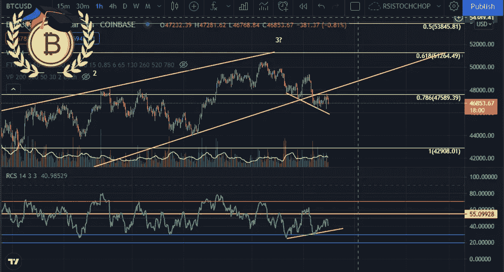
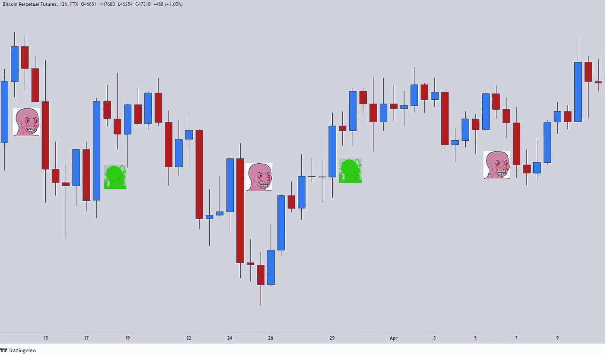
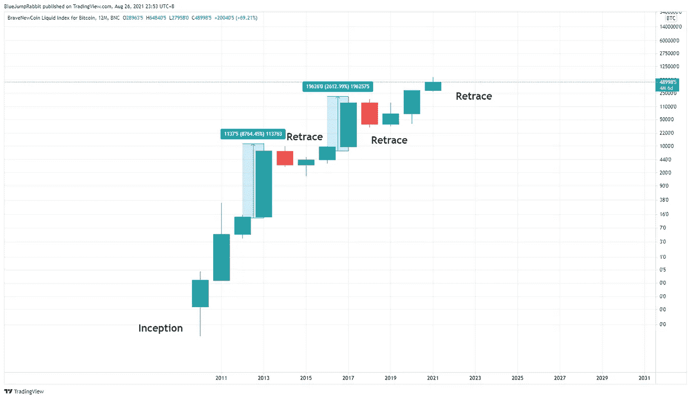
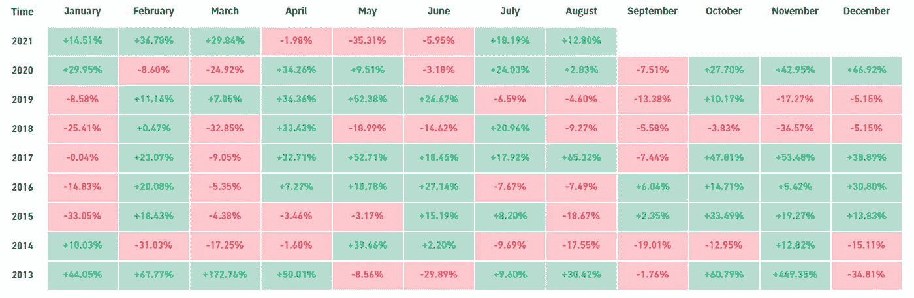
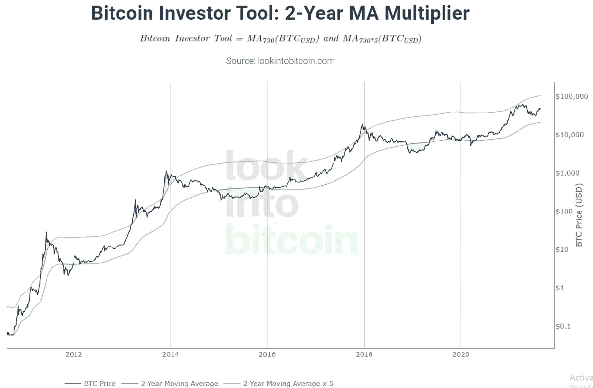
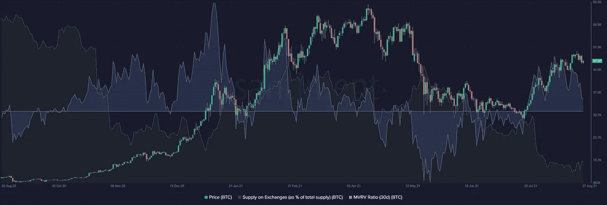

# 比特币和 2021 年的 4 个月

> 原文：<https://medium.com/coinmonks/bitcoin-and-the-4-months-of-2021-9086c47ad2f8?source=collection_archive---------3----------------------->

Bitcoin Price Update

市场情绪有时会很荒谬。去年 7 月，我们看到了一条末日般的推文，呼吁基于 5 月份的修正，比特币价格将出现 2 万甚至 12 万的回撤。谁能责怪他们呢，因为回调幅度比历史高点高了惊人的 55%，但现在人们似乎已经忘记了市场的周期性波动会带来 10 万比特币的回调。我并不是说这是不可能的，但在这之前肯定会有回撤，当市场上没有经验的人看到 12 小时图上的大红烛时，他们会喊投降。

Market sentiment per 12Hrs of price action

有鉴于此，我们可以期待 2021 年的最后 4 个月会发生什么？这里的关键词是寻找**汇合点。**

在价格分析中,**是将多种策略和想法组合成一个完整的策略，以获得未来价格的高可能性。**这是交易员通常做的事情，尤其是在期权或期货上(点击这里了解更多关于衍生品的信息(【https://www.investopedia.com/terms/d/derivative.asp】T4)

有不同类型的分析来实现融合，但现在让我们重点关注以下四种:

1.  **历史价格行为** —了解与当前价格相比的过去价格变动
2.  **技术分析** —通过技术工具、指标和价格行为了解当前价格
3.  **新闻和更新** —通过新闻、更新、基础研究等了解当前价格。
4.  **连锁指标** —通过连锁交易和网络活动了解当前价格

链上指标/分析是加密货币的理想选择，因为可以利用区块链中的数据。从这个公共分类账中浓缩这些信息创造了一个全新的分析领域，并为 confluence 提供了额外的信息。让我们深入到每一个比特币

**历史价格行为**

自比特币诞生以来，它经历了牛市和熊市，在上涨趋势中以**10 倍的回报吸引了投资者，但在下跌趋势中却给他们的投资组合带来了巨大打击。基于历史，比特币一直在形成一种被称为 4 年周期的模式**

****

**Yearly Price growth for Bitcoin**

**要点是比特币的价格将在第四年达到顶峰，然后市场会出现巨大的降温/回撤。这可以从去年 2013 年和 2017 年看出来。**

1.  **2013 年是高峰，也是从 2010 年开始的第 4 年。随后是 2014 年的熊市**
2.  **2017 年是高峰，也是从 2014 年开始的第 4 年。随后是 2018 年的熊市**
3.  **2021 年是从 2018 年开始的第四年，看起来历史会重演**

**现在我们知道牛市有可能在今年结束，让我们放大月线图。**

****

**Monthly ROI per month courtesy of bybt.com**

**根据月度回报，9 月份对比特币来说是一个糟糕的月份，只有 8 分之 2(25%)的投资回报率为正。另一方面，第四季度有更好的机会获得 67%的正回报。唯一一次为负是在熊市期间(如上所述的 2014 年、2018 年和 2019 年)。鉴于这些数据，我们可能预计 9 月份会出现负回报，但第四季度会有所回升。**

****技术分析****

**技术分析(TA)是一种通过研究市场数据来预测价格方向的方法，主要是价格和交易量，结合技术工具来进一步明确其分析，如移动平均线或相对强弱指数(RSI)。让我们利用下图作为 TA 的例子来衡量比特币**

****

**2-Year MA Multiplier courtesy of lookintobitcoin.com**

**2 年移动平均线乘数是 2 年移动平均线(MA)和同样的 2 年移动平均线乘以 5 的组合。比特币自然会周期性波动，这一工具提供了过度兴奋或过度悲观的指标。历史上，当价格跌破 2 年均线(绿线)时购买比特币是积累的最佳机会，而价格高于 2 年均线 x 5(红线)时，历史上可以有效获利。**

**基于这个工具，我们可以看到去年 4 月和 5 月比特币的价格触及红线，因此是市场过热的信号。随后，随着比特币在区间内稳步移动，回撤呈现为一种健康的修正。很快达到红线的顶部，最终将是获利了结的最佳时机**

****新闻和更新****

**新闻和更新关注影响价格行为的外部因素，如全球利益、机构采纳等。Microstrategy 的联合创始人迈克尔·塞勒(Michael Saylor)就是一个例子，他在科技领域有着强大的影响力。他在整个采访过程中都是比特币的倡导者，今年一直在持续积累比特币。根据目前的水平，他现在拥有 108，992 个比特币或 53 亿美元的净值。这影响了投资者获得购买比特币的兴趣，因为这符合“富人买什么就买什么”的说法。其他可能影响价格上涨的消息是采用，如萨尔瓦多最近实施比特币成为法定货币或灰度比特币信托的更新。**

****链上指标****

**最后，我们讨论链上指标。这可以与基本面分析联系起来，基本面分析被定义为投资者用来确定资产或业务的“内在价值”的一种方法。比特币是区块链技术带来的公开账本。区块链内的数据可以被提取和分析，以创建当前价格与其网络的全新视角。一些关键指标可以是交易所的流入/流出、开发活动或市场价值与已实现价值(MVRV)的比率。为了使事情更简单，这里有一个链上指标的例子**

****

**On-chain Analysis using Sanbase**

**这张图表显示了与 BTC 价格相比的两个指标，交易所的供应量(BTC 总供应量的%)和 MVRV 比率(30D)。图表显示，与引发抛售的 3 月至 5 月水平相比，交易所的供应正开始枯竭。一旦交易所的 BTC 供应量开始增加，投资者就应该开始在交易所卖出。现在似乎没有人想卖。**

**MVRV 比率(30D)的计算方法是将市值除以已实现的市值，并估计市场参与者是否盈利。简而言之，MVRV 高于 1 表明大多数比特币持有者处于盈利状态，反之亦然。当前的 MVRV 比率显示高于 1 的值，这也可能表明比特币持有者倾向于出售以实现他们的收益。**

**比特币肯定是一种长期投资，但在运行过程中会出现下跌的情况。**

**TL；速度三角形定位法(dead reckoning)**

**从这些，我们将从上面的分析中总结出比特币的价格。历史价格显示，今年将是比特币增长最好的一年，月度图表上会出现短期下跌。这与 2 年 MA 乘数范围内的稳定增长相关。最近的消息，如机构兴趣，Microstrategy 首席执行官迈克尔·塞勒积累比特币和萨尔瓦多批准法定货币显示出积极的反应。最后，链上指标表示长期供应短缺，但在接下来的几天或几周内会获利回吐。总而言之，比特币看起来是看涨的，下跌是买入的**

**https://www.facebook.com/MeshReport**

**推特:【https://twitter.com/Rightsideonly **

> **加入 [Coinmonks 电报频道](https://t.me/coincodecap)，了解加密交易和投资**

## **另外，阅读**

*   **[网格交易机器人](https://blog.coincodecap.com/grid-trading) | [Cryptohopper 审查](/coinmonks/cryptohopper-review-a388ff5bae88) | [Bexplus 审查](https://blog.coincodecap.com/bexplus-review)**
*   **[加密复制交易平台](/coinmonks/top-10-crypto-copy-trading-platforms-for-beginners-d0c37c7d698c) | [如何在 WazirX 上购买比特币](/coinmonks/buy-bitcoin-on-wazirx-2d12b7989af1)**
*   **【Crypto.com 评论】|[|](/coinmonks/crypto-com-review-f143dca1f74c)|[信用交易](/coinmonks/huobi-margin-trading-b3b06cdc1519)**
*   **[Bookmap 评论](https://blog.coincodecap.com/bookmap-review-2021-best-trading-software) | [美国 5 大最佳加密交易所](https://blog.coincodecap.com/crypto-exchange-usa)**
*   **[如何在 FTX 交易所交易期货](https://blog.coincodecap.com/ftx-futures-trading) | [OKEx vs 币安](https://blog.coincodecap.com/okex-vs-binance)**
*   **[OKEx vs KuCoin](https://blog.coincodecap.com/okex-kucoin) | [摄氏替代品](https://blog.coincodecap.com/celsius-alternatives) | [如何购买 VeChain](https://blog.coincodecap.com/buy-vechain)**
*   **[币安期货交易](https://blog.coincodecap.com/binance-futures-trading)|[3 commas vs Mudrex vs eToro](https://blog.coincodecap.com/mudrex-3commas-etoro)**
*   **[如何购买 Monero](https://blog.coincodecap.com/buy-monero) | [IDEX 评论](https://blog.coincodecap.com/idex-review) | [BitKan 交易机器人](https://blog.coincodecap.com/bitkan-trading-bot)**
*   **[尤霍德勒 vs 科恩洛 vs 霍德诺特](/coinmonks/youhodler-vs-coinloan-vs-hodlnaut-b1050acde55a) | [Cryptohopper vs 哈斯博特](https://blog.coincodecap.com/cryptohopper-vs-haasbot)**
*   **[顶级付费加密货币和区块链课程](https://blog.coincodecap.com/blockchain-courses) | [币安评论](/coinmonks/binance-review-ee10d3bf3b6e)**
*   **[MXC 交易所评论](/coinmonks/mxc-exchange-review-3af0ec1cba8c) | [Pionex vs 币安](https://blog.coincodecap.com/pionex-vs-binance) | [Pionex 套利机器人](https://blog.coincodecap.com/pionex-arbitrage-bot)**
*   **[如何在印度购买比特币？](/coinmonks/buy-bitcoin-in-india-feb50ddfef94) | [WazirX 评论](/coinmonks/wazirx-review-5c811b074f5b) | [BitMEX 评论](https://blog.coincodecap.com/bitmex-review)**
*   **[印度的加密交易所](/coinmonks/bitcoin-exchange-in-india-7f1fe79715c9) | [比特币储蓄账户](/coinmonks/bitcoin-savings-account-e65b13f92451) | [HitBTC 评论](/coinmonks/hitbtc-review-c5143c5d53c2)**
*   **[币安收费](/coinmonks/binance-fees-8588ec17965) | [Botcrypto 审查](/coinmonks/botcrypto-review-2021-build-your-own-trading-bot-coincodecap-6b8332d736c7) | [Hotbit 审查](/coinmonks/hotbit-review-cd5bec41dafb) | [KuCoin 审查](https://blog.coincodecap.com/kucoin-review)**
*   **[我的密码交易经验](/coinmonks/my-experience-with-crypto-copy-trading-d6feb2ce3ac5) | [AAX 交易所评论](/coinmonks/aax-exchange-review-2021-67c5ea09330c)**
*   **[逐位融资融券交易](/coinmonks/bybit-margin-trading-e5071676244e) | [币安融资融券交易](/coinmonks/binance-margin-trading-c9eb5e9d2116) | [超位审核](/coinmonks/overbit-review-9446ed4f2188)**
*   **[有哪些交易信号？](https://blog.coincodecap.com/trading-signal) | [比特斯坦普 vs 比特币基地](https://blog.coincodecap.com/bitstamp-coinbase)**
*   **[ProfitFarmers 点评](https://blog.coincodecap.com/profitfarmers-review) | [如何使用 Cornix 交易机器人](https://blog.coincodecap.com/cornix-trading-bot)**
*   **[加密货币储蓄账户](/coinmonks/cryptocurrency-savings-accounts-be3bc0feffbf) | [YoBit 审核](/coinmonks/yobit-review-175464162c62) | [Bitbns 审核](/coinmonks/bitbns-review-38256a07e161)**
*   **[Botsfolio vs nap bots vs Mudrex](/coinmonks/botsfolio-vs-napbots-vs-mudrex-c81344970c02)|[gate . io 交流回顾](/coinmonks/gate-io-exchange-review-61bf87b7078f)**
*   **[CoinFLEX 评论](https://blog.coincodecap.com/coinflex-review) | [AEX 交易所评论](https://blog.coincodecap.com/aex-exchange-review) | [UPbit 评论](https://blog.coincodecap.com/upbit-review)**