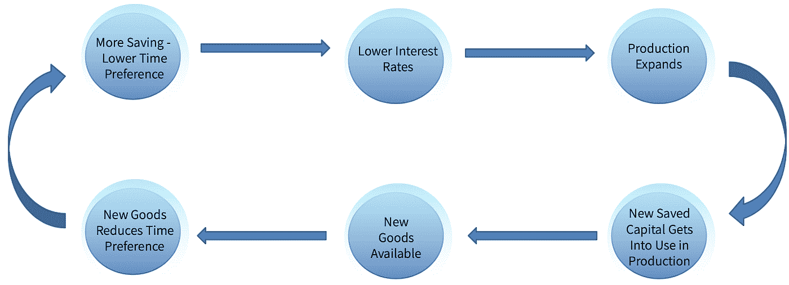

# 比特币和商业周期

> 原文：<https://medium.com/coinmonks/bitcoin-and-the-business-cycle-7aee280721c4?source=collection_archive---------0----------------------->

几个世纪以来，资本主义国家的生产似乎在某种“循环”中发展。每隔几年，美国经济都会经历一段经济快速增长的时期，随后会受到企业倒闭和高失业率的影响，这就是经济衰退。这种市场的周期性运动，反复从经济繁荣走向萧条，被称为“商业周期”。多学科的社会科学家对这一现象提出了许多解释，从“消费不足”到一些心理倾向。然而，到目前为止，还没有流行的对策来解决这个问题。央行显然未能“治愈”这种所谓的“市场失灵”，尽管它们的权力和影响力持续大幅增长，但我们似乎又一次处于毁灭性衰退的开端。

尽管央行行长对他们处理这一问题的能力充满信心，但似乎，特别是自 2008 年上次危机以来，公众正在对当前体系失去耐心。人们已经厌倦了为金融系统的错误买单，这是理所当然的。运作中的计划已经清晰可见。经济学家严重失败，而纳税人支付了成本(和他们的薪水)。很明显，这个系统不能继续下去了。然而，正确的替代方案——解决方案——仍然不明显。然而，主流和大多数学术界似乎同意一件事，即货币必须由政府管理，即通过中央计划。

他们倾向于将经济视为一台机器——某种运行在金钱驱动的引擎上的黑匣子。你投入的“燃料”越多，引擎就会运转得越快，经济就会运行得越快。虽然不同的经济学派和学说通常提供不同的理论和解释，但他们的实际争议和分歧主要围绕着注入更多“燃料”会导致“机器”运行过快、过热并最终爆炸的点。也就是说，多少钱对经济来说太多了，会导致问题甚至恶性通货膨胀。不管流行的教义之间有多少不同，在钱的问题上你会发现他们最热情的一致。货币供应量必须一直增加！印刷，银行信贷扩张，“流动性注入”，“量化宽松”，公共赤字支出，甚至是直接的施舍——只要有必要就从直升机上扔出去——但是你绝不能让资金流入放缓！

这种货币“工程”方法无疑是最受欢迎的，并且指导了一个多世纪的政策。但是，考虑到其未能兑现任何 promises⁴，质疑这一方针似乎是有充分理由的。事实上，如果说过去一百年有什么教训的话，那就是政府对货币的控制，即中央银行，并没有促进繁荣。扩大货币和信贷并不能解决商业周期的问题(或任何其他问题)——这种方法每次都失败了。一个常见的类比是，经济就像一台由政府运转的机器，政府为其注入资金，这听起来很合理，但这真的合适吗？我们已经学会接受的理论，相当默认，实际上是正确的吗？

在这篇文章中，我将介绍“奥地利学派”经济学的“非正统”方法。奥地利学派从个人行为和激励的角度来研究经济学问题，把经济看作是由许多个人行为产生的“有机”复合体。其商业周期理论可能是其核心成就之一，尽管也是最具争议的。然而，本文的目的不仅仅是解释奥地利学派的商业周期理论(ABCT)，当然也不是证明它的有效性。许多其他书籍已经提供了如此精彩的 expositions⁵.本文的目的是讨论建立在奥地利学派理论基础上的经济改革的可能性。我在这里的目的是为比特币如何成为防止商业周期的关键——实现更大和更可持续的经济增长——奠定基础。

# 经济增长

因此，在开始我们的讨论之前，我们首先来看看一个健康的经济是如何增长的。“经济学之父”亚当·斯密将经济增长主要归因于劳动分工，也就是说，个体在完成特定任务时的专业化。然而，人类进步还有一个更重要的方面被斯密忽略了。正如奥地利学派创始人卡尔·门格尔所解释的，经济增长所依赖的是“生产要素”，即资本的可获得性，而资本也为劳动分工设定了界限。⁶

资本或资本货物是不用于直接消费的货物，但在生产其他货物的过程中使用，最终作为“消费品”到达消费者手中门格尔通过提及不同的商品“订单”解释了这种差异。消费者直接使用的商品，如食物、衣服和汽车，是“最低一级”商品。以面包为例，我们可以说面粉在生产过程中是一种“二等品”。小麦可以被称为三等商品，而小麦生长的土地是四等商品。一件商品的顺序并不是内在的，而是基于一个人打算如何使用它的“推理的产物”。因此，同样的货物在不同的生产阶段使用时可以有不同的订单。当然，这里的重点不是分配具体的货物订单，而是理解生产是一种具有不同“深度”的结构。此外，正如我们现在将看到的，我们在生产过程中使用的商品订单越多，也就是说，我们的生产结构越“深入”，我们能够生产的就越多。

作为一个例子，考虑一个伐木工人用斧头砍柴，与另一个使用电锯的伐木工人相比。显然，后者的工作效率会高得多，因为他使用的资本货物要比前者使用的好得多。但是，同样清楚的是，链锯需要雇佣更高级的货物来组装，其生产过程更长且更复杂。虽然斧头甚至可以由原始人用非常简单的原材料制造，但链锯需要使用工业设备，如发动机和电源，它们本身需要使用许多其他物品，等等。换句话说，链锯需要积累(多得多)的资本，并使用更高订单的商品来生产——它需要一个“更深层次”的生产结构。

门格尔的学生、经济学家欧根·冯·博姆-巴韦克(Eugen von bhm-Bawerk)将这种生产长度和复杂性不断增加的特性称为生产过程的“循环”。一个生产过程越“迂回”,它意味着使用更多更高级的资本货物。他选择“迂回”这个术语，试图表明一个至关重要的概念。为了生产更多更好的消费品，我们必须首先花时间创造更多的资本货物。通过“偏离”我们希望达到的生产最终消费品(如木柴)的主要目标的直线，付出额外的努力并首先生产其他东西(所需的资本，如斧头或电锯)，我们可以生产出更好或更多的最终产品。人类进步的过程，即改善人民福利和物质条件的过程，可以最恰当地描述为资本积累的过程。我们的发展和经济增长依赖于生产资本货物的供应，并受其限制。因此，要理解经济增长的实际过程，下一步要看的是资本积累是如何运作的。

积累资本意味着增加一个人的储蓄水平。这意味着停止消费商品，而是把它们存起来，用于进一步的生产。当考虑一个单独工作的个体时，就像一个渔夫给自己造一根鱼竿一样，资本积累的过程相当简单。渔夫现在推迟了他的鱼的“生产”,而是花时间去造一根鱼竿。他需要在生产鱼竿的时候推迟吃鱼的时间，但是以后他可以用鱼竿钓更多的鱼。最终，他会有更多的资本储蓄(鱼竿)，并能够更有效地生产(鱼)。然而，当在市场经济的框架下讨论时，这一过程突然变得更加“抽象”和难以遵循。因此，了解市场经济中资本积累的具体情况至关重要。

市场经济是一个分工体系。它是一个“框架”,私人拥有资本，交换商品和服务，并合作实现其目标。它最重要的属性是所有交易产品和服务的定价系统的存在，以一种共同的交换媒介——货币来命名。因此，市场经济中的资本配置大多是通过使用商品的货币价格来完成的。

大多数人倾向于混淆货币和货币价格。例如，当我们说我们的伐木工人通过生产木柴节省了 100 美元时，我们的意思是他创造了在市场上标价为 100 美元的东西。如果他决定用木柴来消费，他可以直接这样做——例如用它来生火，也可以间接这样做，以 100 美元的现金出售，把钱花在他实际会消费的东西上。然而，如果他喜欢增加他的储蓄，他可以避免消耗木材，储存木材以备后用，或者用它来制造新的工作工具(资本)。或者，按照市场经济的通常过程，他可以把它卖掉换成现金，然后要么把钱存起来以后用，要么现在就花在购买更多的资本品上，要么借给或投资于某个企业。人们积累的资本货物越多，不管是直接拥有还是间接通过储蓄、借贷和投资积累，经济就越进步。⁷

正如我们现在所看到的，经济增长最重要的力量是储蓄和积累资本，这需要推迟对所生产商品的消费。因此，我们现在面临一个新的问题。为了先积累更多的资本，一个人愿意推迟消费多久？换句话说，一个人，乃至整个经济，是如何决定生产时间的？也就是说，是更快地专注于相对较少的消费品的短期生产，还是更长期的生产，采用更多的“迂回”过程以在以后生产更多(或更好)的消费品。

答案是人们根据自己的[时间偏好](https://wiki.mises.org/wiki/Time_preference)来决定。这是一个普遍的 accepted⁸，在其他条件相同的情况下，一个人总是更喜欢尽快满足自己的需求(对每个人来说，时间是有限的，未来是不确定的)。这意味着，为了让人们推迟目前的消费，通过采取更长时间(更迂回)的生产努力而预期的未来产出必须足够高，以补偿消费的这种延迟。简而言之，人们重视时间，他们更喜欢早一点而不是晚一点达到目的，他们对现在的重视程度超过对未来的重视程度就是他们对时间的偏好程度。

具有高度时间偏好的人将更不愿意推迟他的消费，并且在他的经济活动中将更加面向现在。相比之下，时间偏好较低的人更愿意等待更长时间，采取更迂回的过程，因为这将充分补偿他生产长度的增加。我们可以说，人们的时间偏好决定了经济中生产的时间长度。

**时间偏好越低，越是面向未来的人，他们储蓄和积累的资本越多，以提高生产率和发展经济。⁹**

同样，在单个个体的孤立经济的情况下，这个过程如何进行将不会有太多进一步的问题。在这种情况下，同一个人自己做所有的事情。只是澄清一下，再举一个渔夫的例子，如果他的时间偏好比较高，我们不会愿意推迟他的消耗先做鱼竿。然而，如果他的时间偏好足够低，他会更喜欢这种更“迂回”的制作鱼竿的过程，开始时没有钓到鱼，然后用它来提高他的生产率。但正如我们之前所说，当我们引入市场经济的分工时，这一过程看起来有所不同。在市场上，生产是根据消费者的需求⁰，通过价格系统反映出来。

时间是一种生产要素。事实上，它是唯一的生产要素，没有它就没有生产。因此，时间，即消费者的时间偏好，在市场上也有其货币价格，即利率。利率是在一定时间内向他人扣留资本所需的价格。随着人们储蓄更多，从而降低他们的时间偏好，这意味着他们愿意推迟消费，以获得比过去更低的“补偿”，并相应地以更低的成本(利率)提供资金。

随着利率越来越低，企业家获得资本的成本也越来越低。**由于可以以更低的成本获得更多的资本，以前时间太长或资本密集而无利可图的项目突然变成了可行的投资。**因此，企业家会发现扩大业务和开创新的计划是有利可图的，因此会通过采取更迂回的生产流程来扩大和深化生产结构。实际情况是，通过从储户那里获得更多的贷款(或投资)，企业家将能够购买那些降低了时间偏好的人所节省的资本(因为更低的时间偏好意味着更多的储蓄)。这就是积累的新资本如何进入市场经济的生产结构，资源如何动员，劳动分工如何发生。价格是市场经济中生产者的指导指标，而时间价格，即利率，是一个特别重要的指标，因为它存在于所有可以想象的生产过程中，并调节着生产过程的长度和对可用资源的使用。

随着这些更迂回的生产过程的成熟，经济中将会有更多的商品供应(可以是资本和消费品)。人们将能够降低他们的时间偏好，增加他们的储蓄，而不减少(甚至增加)消费。在某种意义上，这是一个正反馈循环，更低的时间偏好和更长远的观点允许生产扩张，最终使更多的商品可用，允许进一步减少时间偏好，等等。这是文明的进程，通过这一进程，人类从贫穷和匮乏走向了现代繁荣，相对于过去几代人来说，我们今天拥有了现代繁荣。

# 商业周期

到目前为止，我们还没有看到任何会导致商业周期出现的问题——周期性的经济大繁荣，然后是整个经济中项目的崩溃。所以现在我们将转向我们的主要问题，商业周期的真正原因是什么？

根据最初由博姆-巴维克的学生、经济学家路德维希·冯·米塞斯提出的奥地利学派理论，问题的根源在于政府和央行对货币供应的干预，更准确地说，在于它们增加货币供应和扩大信用的努力。简单来说，这里的信用扩张指的是凭空创造货币。⁴今天，政府有许多方法来扩大信贷，如量化宽松、部分储备银行⁵——由纳税人(或明或暗)担保，并由国家完全监管，以及各种其他会计计划和金融“工具”尽管如此，所有这些计划的本质是增加经济中的货币和信贷供应，本质上是无中生有。

那么，到目前为止，这种信贷扩张对我们所讨论的经济发展过程有什么影响呢？这种信贷扩张的最初效果将是利率下降。随着新的资金进入(或者像通常发生的那样，来源于)银行系统，银行将能够提供更便宜的贷款，这仅仅是因为有更多的资金供应。长期以来，降低利率一直是政府追求信贷扩张的主要(公开)目标。

正如我们所见，较低的(自然)利率确实与经济增长相关，因为它反映了较低的时间偏好。由此，许多经济学家得出结论:较低的利率会促进经济增长，因此政府有责任将利率推得尽可能低。然而，我们知道利率不像机器上的度量，它是人们时间偏好的反映。试图通过信贷扩张降低利率来促进经济增长，就像试图通过压低晴雨表上的指针来“促进”降雨。你只会让气压计变得有缺陷，让那些依赖它的人做出错误的预测。这正是利率的变化。正如我们所说，企业家和商人依靠利率来决定他们生产努力的长度和复杂性。利率表明有多少资本可用于生产。随着央行降低利率，它会诱使企业家扩大生产，并采取比其他方式更迂回的过程。它扭曲了指导企业家的经济数据，导致他们犯系统性错误，最终错配资本。

首先，生产的扩张将导致明显的经济繁荣，更多的企业开业，新建筑开工，工资上涨，经济活动普遍增加。然而，这种经济繁荣必然是不可持续的，因为它依赖于资本可用性的缺陷指标——人为的低利率。

人为的低利率造成的根本问题是，它造成了一种幻觉，即可用于生产的资本比实际资本多。利率的“实际”下降来自于人们时间偏好的下降，来自于资本积累和储蓄的增加。价格系统是市场经济的信息系统，利率是通知企业家储蓄变化的指标，可用于生产的资本。然而，当政府人为降低利率时，可用资本没有变化。人们没有减少消费，也没有以任何其他方式增加储蓄。没有新的资本用于生产，但随着人为降低利率，企业家已经依赖于这种额外资本的存在，以完成其扩大的生产过程。换句话说，繁荣时期开始的生产增长是不可持续的，不可能完成，因此将以崩溃告终。

但是让我们花一点时间来看看这个过程实际上会是什么样子。正如我们所说，随着利率降低，企业家将扩大生产。他们将接受新的贷款，并用它们来购买更多的资本货物。现在，由于资本供给没有增加，但企业家对资本的需求增加了，资本品的价格将不得不上涨以满足新的需求。随着高阶商品价格的上涨，企业家将被迫接受新的贷款，以获得完成生产所需的资本。贷款需求将会增加，而仍被人为压低的利率将会被推回到与人们真实的时间偏好相对应的水平。随着利率回升，随着资本品价格适应新的货币供给，完成所有生产的资本短缺变得明显。在繁荣时期开始的次边缘项目，或者米塞斯称之为不正当投资，将再次显示为无利可图，将不得不被清算。这一过程的最终结果是整个经济中企业的大规模崩溃和随之而来的高失业率，即经济衰退。

在衰退期间，不当投资被清算，投入其中的资本要么损失掉，要么被重新分配给更有利可图的项目。衰退在某种意义上是市场对人的真实资本和时间偏好的重新调整。它是市场自我治愈和恢复，消除基于扭曲信息的错误，停止将稀缺资本浪费在不可实现的项目上，并根据正确的信息重新分配资本。

简而言之，商业周期是一个不可持续的生产扩张期，由低利率引发，随后认识到生产扩张是不可持续的，随之而来的是企业的崩溃。

那么，我们能做些什么来阻止衰退呢？不幸的是，一旦信贷扩张开始导致虚幻的经济繁荣，最终的泡沫破裂是不可避免的。资本正在被浪费，而且没有办法让这种不当投资真正可持续。然而，基于不同的理论，各国政府和央行仍然相信，通过进一步加速信贷扩张，人为地“抗击”衰退是可能的。然而，他们处理这些周期的反复失败给我们留下了一个很好的理由来质疑他们的理论和方法。

如果政府进一步推动信贷扩张，它将能够再次降低利率，本质上让我们回到周期的第一步，但错误的投资继续浪费额外的资本。尽管如此，理解他们不能永远这样做是至关重要的。繁荣是不可持续的，保持加速降息所导致的不当投资不会改变这一事实，只会推迟暴露这一事实，进一步推迟放大和不可避免的市场调整。最终，要么资本耗尽，要么恶性通胀随之而来。⁶推迟泡沫破裂只会加剧问题，导致更大的泡沫破裂，因为它允许错误的投资继续浪费稀缺的资本。

一旦利率被扭曲，这个周期就不可避免，因此阻止商业周期的唯一方法就是防止利率操纵。也就是说，我们必须防止信贷扩张。这是奥地利经济学家所采取的方法，其中许多人，包括米塞斯本人，建议进行此类改革以防止信贷扩张。这些建议通常是回归严格的金本位制，货币自由市场竞争，或者进行大规模的银行改革，但是在他们所有的建议中，有两个很不幸地相互矛盾的东西是共同的。

首先是他们的目标——他们的本质是限制政府的权力和他们对货币和信贷的控制。其次是他们的实际做法，这实质上相当于通过要求政府自我约束来限制政府的权力。这样的事情是前所未有的。政府不会自愿减少他们在任何事情上的权力，也不会承认犯了如此巨大的错误，导致了这么多年的商业周期，而采纳任何此类建议必然意味着这一点。

许多奥地利经济学家已经意识到了他们的工作中的这一缺点，以达到任何实际的结果，这使得米塞斯最著名的学生弗里德里希·a·哈耶克得出如下结论:

> “我不相信在我们把它从政府手中拿走之前，我们会再有一大笔钱，也就是说，我们不能粗暴地把它从政府手中拿走，我们所能做的就是通过某种狡猾的迂回方式引进一些他们无法阻止的东西。”哈耶克

这正是比特币的用武之地。虽然哈耶克的引用来自 1984 年，比比特币发明早了大约 25 年，但几乎没有人能比这更好地描述比特币。正如 Satoshi 所写，比特币的理念是创造“一个点对点的电子现金系统”。即由一个全球性的开放网络运作的货币，不依赖于任何中央权力机构。没有一个单独的参与者或特定的团体是操作比特币所必需的——没有人能关闭它，因为没有一个人是比特币继续运转所依赖的。正如哈耶克所说，这是一个从政府手中拿走“东西”(钱)的系统，他们不能停止。⁷

这是比特币和黄金之间最重要的区别，目前大多数奥地利人仍然认可比特币。金本位是由政府和银行操作的，如果没有这样一个由少数几个持有大部分黄金储备的中央机构组成的系统，金本位就无法运作。如果没有这样一个系统，所有的黄金支付都必须通过实物交付。这种选择在几十年前已经不切实际，但在数字支付大行其道的今天，这简直不可想象。这意味着金本位只有在得到政府批准的情况下才能发挥作用，但一旦政治态度发生不利变化，金本位就注定要失败。正是金本位的这一弱点使得政府能够有效地没收它([第 6102](https://en.wikipedia.org/wiki/Executive_Order_6102) 号行政命令)，并最终完全取消它([第 11615](https://en.wikisource.org/wiki/Executive_Order_11615) 号行政命令)。黄金的这一弱点正是比特币旨在修复的。这是“[一股不可阻挡的力量](https://cointelegraph.com/news/bitcoin-an-unstoppable-force-us-congressman-tells-crypto-hearing)”——不需要政客许可就能运作的资金。

# 比特币和商业周期

但假设把比特币用作货币，问题仍然是它将如何有助于防止商业周期？在这方面，比特币有几个值得注意的属性。

第一，比特币有预先确定的固定供应限额。它是由一种工作证明机制产生的，一种类似数字“金矿”的过程，并且被限制在 2100 万个单位内。这与黄金略有不同，黄金开采可以持续到未知的程度，但它们共有的重要属性是它们的供应不能由政府法令操纵。与我们今天的法定货币体系不同，没有政治家签署的文件可以让更多的比特币或黄金出现。这意味着，有了比特币，政府将无法扩大基础货币供应量。这是限制经济中信贷扩张的必要的第一步。但是，尽管是必要的，但这本身是不够的，因为它仍然没有直接限制银行扩大信贷的能力。

这让我们想到了比特币有助于阻止商业周期的第二种重要方式，这一点我们已经简单谈过了。事实是，比特币不需要中介，它是点对点的现金。它允许人们自己持有他们的钱，而不必把钱交给(更准确地说，借给)⁸银行来进行交易。这将确保个人持有的用于日常开支的资金(如现金余额)与他们希望储蓄并可以通过银行系统有效投资于经济的资金之间的明确区分。换句话说，它可以限制银行持有的那部分货币，即准备金，从而限制它们过度扩张信贷的权力。当人们可以使用他们的钱——而不依赖金融机构进行交易——他们可以选择他们希望自己持有的交易金额，以及他们更喜欢储蓄和投资于经济的东西，并委托银行管理后者。这样的系统将确保流通中的货币和货币替代品(信用)的供应保持稳定，防止信用扩张和随之而来的商业周期。

即使面向“活期存款”(即用于日常开支的资金)的银行业务继续存在，比特币具有刚性供应的事实将迫使银行对其信贷发行负责，否则它们将面临银行挤兑的风险。此外，由于比特币是一种数字资产，其存储、验证和转移成本远低于实物资产。也就是说，比特币不需要诺克斯堡来从存储和处理比特币的规模经济中获益。因此，新竞争银行的准入门槛将会降低，自由竞争银行业将会有更好的基础。这种竞争的改善可能会迫使银行在管理⁹储备时更加负责，从而更有效地限制信贷扩张，即便是在这种“自由银行业”的情况下。

# 前方的路

既然我们看到了向比特币过渡的主要经济原因，我们可以讨论这种过渡如何发生。事实上，我认为这种转变已经开始了。短短十年间，比特币已经从邮件列表上的一个概念发展成为服务于数百万人的全球网络，完成了价值数万亿美元的交易。许多企业已经开始接受它，人们正在使用它，我们甚至可以说，有一个新的，替代的，金融系统已经在围绕它发展。尽管一些人对比特币的短期价格波动有所印象，但趋势是明确的，比特币正在向前发展。它不是等待政治家批准(像黄金或天秤那样)，或等待央行行长采纳，或等待“经济学家”接受——尽管他们目前反对，它仍在增长。

然而，目前的趋势绝不是不可避免的。虽然比特币本身不太可能被阻止，但它的采用很有可能被阻止。最终，比特币只是一个可供人们使用的工具，但公众可以决定他们是否愿意捡起它并使用它。像所有其他经济和政治变革一样，比特币的成功取决于公众舆论。如果人们看不到比特币的好处，或者拒绝使用它，我们拥有比特币是不够的。不幸的是，当今最流行的观点，无论是在经济还是政治领域，都认为比特币无用、有害，甚至是“[邪恶](https://twitter.com/paulkrugman/status/417016484599431168)”。货币不受国家控制的观点被当今所有流行的学说所拒绝，唯一稍微接受这一观点的观点，即奥地利学派，几十年来一直站在公众舆论的对立面。

然而，通过将奥地利经济学作为理论框架，将比特币作为实践方法结合起来，我们似乎有了一个影响公众舆论的绝佳机会。奥地利学派的框架为拥有可靠的硬货币的好处提供了理论解释，而比特币则在现实中证明了这一点。尽管尚不清楚采用比特币会带来什么样的进一步后果，但奥地利学派的经济学方法可以澄清这一点。奥地利学派的观点是唯一能够解释比特币成功的观点，甚至是对其存在的简单解释。换句话说，比特币让公众看到了拥有一种不受国家控制的不同货币的可能性，而奥地利学派的理论解释了为什么这种货币如此有益和令人向往。比特币继续运行的每一天都是对主流经济学家的一记耳光。这是一个活生生的证据，证明他们的理论可能终究是不对的。自由市场不需要国家来设定和管理货币，它可以自己创造一个更好的货币体系。

# 结论

简而言之，比特币的独特属性——数字化、点对点、不可阻挡的硬通货——有可能真正改变经济，防止商业周期，实现可持续的经济增长。

几千年来，政府被委托为其公民管理资金，但历史上充斥着滥用这一权力的例子。⁰在过去，这种虐待是统治者对其公民秘密实施的可耻行为(如剪硬币)，而今天——在民粹主义时代——统治者不再为此感到羞耻，相反，他们自豪地宣布这些行为，并得到“知识分子”的支持，为如何“为人民”这样做提供借口，以“刺激经济”。

正如米塞斯对健全货币本质的解释:

> “如果一个人没有意识到健全货币是作为一种保护公民自由免受政府专制侵犯的工具而设计的，那么就不可能理解健全货币的含义。在意识形态上，它与政治宪法和权利法案属于同一类。对宪法保障和权利法案的要求是对专制统治和国王不遵守旧习俗的反应。健全货币的假设首先被提出来，作为对降低铸币价值的王室惯例的回应。后来，在这个时代——通过美国大陆货币、法国大革命纸币和英国限制时期的经历——它得到了精心的阐述和完善，学会了一个政府可以对一个国家的货币体系做些什么。”—路德维希·冯·米塞斯

货币是市场经济的支柱，它协调每个人的行动，这就是为什么它必须是中立的——抵制操纵和被迫贬值。现在是我们把这个东西从国家手中拿回人民手中的时候了。是时候转战比特币了。

[1]:此类案例有可列举的例子，仅举一例:美国前美联储主席耶伦矛盾的说法: [1](https://www.reuters.com/article/us-usa-fed-yellen/feds-yellen-expects-no-new-financial-crisis-in-our-lifetimes-idUSKBN19I2I5,) 、 [2](https://www.cnbc.com/2018/12/11/yellen-warns-of-another-potential-financial-crisis.html) 经济学家斯蒂格利茨(J. Stiglitz)看不到房利美和房地美的[问题](https://www.businessinsider.com/how-joseph-stiglitz-blew-it-on-fannie-and-freddie-2009-12)、
【2】:最广义上既包括货币，也包括[货币替代品](https://wiki.mises.org/wiki/Money_substitutes)。
【3】:这可能会被争议为过于简单化，但我坚持认为这并没有扭曲流行经济学派(新/后/凯恩斯主义者，芝加哥，MMT)实用建议的本质
【4】:参见[这篇文章](https://www.forbes.com/sites/markhendrickson/2013/12/20/100-years-later-the-federal-reserve-has-failed-at-everything-its-tried/#5d6463652a60)关于美联储体系未能实现其目标。
[5]:一些著名的例子是:路德维希·冯·米塞斯的《人类行动》、弗里德里希·哈耶克的《价格和生产》、默里·罗斯巴德的《经济萧条:其原因和治疗》以及赫苏斯·韦尔塔·德索托的《货币、银行信贷和经济周期》。
[6]:“人类福利进步的原因”——卡尔·门格尔，《经济学原理》71–74。
【7】:关于储蓄作为“囤积”和储蓄作为借贷和投资资金之间的区别的评论，见[https://mises . org/library/analysis-relationship-betting-investment-and-economic-growth](https://mises.org/library/analysis-relationship-between-hoarding-investment-and-economic-growth)
【8】:或者至少是公理化的假设，因为时间对于任何行动都是稀缺和必要的。
【9】:这并不表示任何价值判断，一个具有高时间偏好的人与另一个具有较低时间偏好的相同的人相比，从长远来看会产生较少，但这是他的偏好，是他认为对他更好的选择。
【10】:为了避免在需求与生产这件事上产生混淆，请看下面这篇文章:[https://medium . com/@ Ben _ Kaufman/Keynesian-errors-on-time-and-demand-80 eeae2c 7110](/@ben_kaufman/keynesian-errors-on-time-and-demand-80eeae2c7110)
【11】:值得一提的是，市面上看到的利率，包含的不仅仅是纯粹的时间偏好的“反映”。例如，利率的其他组成部分中最值得注意的是违约风险溢价。然而，对实际市场利率的所有其他影响都是次要的，因为它们不是利率现象的必要组成部分。当人们设定利率时，只有时间偏好的纯粹“反映”(“原始”利率)才必须被考虑。我所说的“补偿”并不是指仅仅因为延迟消费而得到的某种有保证的回报。补偿是通过抑制消费，而不是有效利用资源(直接或通过借贷/投资)从而获得更高产出的预期价值。
【13】:注意，信用扩张，我指的是超过自愿储蓄限额发放的信用，不是指任何形式的信用。我将不再讨论货币和货币替代品的问题，因为这两者的区别在今天的金融形势下已经变得无关紧要了。
【15】:我也将省略对 FRB 影响的具体讨论。尽管有充分的理由说明自由市场中的 FRB 不会导致信用扩张，但如今银行业离自由市场如此之远，几乎已经国有化，这使得讨论变得无关紧要。以下是争议中支持和反对的主要案例:3 part serious 作者乔治·塞尔金:[https://www . alt-m . org/2018/08/16/fractional-reserve-banking-and-Austrian-business-cycles-part-I/](https://www.alt-m.org/2018/08/16/fractional-reserve-banking-and-austrian-business-cycles-part-i/)。Jesús Huerta de Soto 的论文:[https://mises . org/library/critical-note-fractional-reserve-free-banking-0](https://mises.org/library/critical-note-fractional-reserve-free-banking-0)
【16】:[https://mises.org/wire/era-boom-and-bust-isnt-over](https://mises.org/wire/era-boom-and-bust-isnt-over)
【17】:比特币的整个思想都是基于这个假设，这个公理:[https://github . com/lib bit coin/lib bit coin-system/wiki/Axiom-of-of-Resistance](https://github.com/libbitcoin/libbitcoin-system/wiki/Axiom-of-Resistance)
【18】:自
【19】:为了不被自己的客户或者其他银行榨干。
【20】:你可以在埃米尔·桑斯泰特的《[金钱被废黜:一段历史旅程](https://www.amazon.com/dp/B0848PWW3K/)》中找到多个此类案例的描述。

本文基于 2020 年 3 月在维也纳举行的比特币价值研讨会上的演讲。讲座完整视频可在 [***这里***](https://www.youtube.com/watch?v=MDH2kJ_MIjA&feature=youtu.be)

特别感谢 Ben Prentice ( [mrcoolbp](https://twitter.com/mrcoolbp) )、David Lawant([David Lawant _ BTC](https://twitter.com/DavidLawant_BTC))、Emil Sandstedt([bezantdenier](https://twitter.com/bezantdenier))、Keyvan Davani([keyvandavani](https://twitter.com/keyvandavani))、thi baud Marechal([thibm _](https://twitter.com/thibm_))和斯蒂芬妮·冯·扬( [stefanievjan](https://twitter.com/stefanievjan) )从他们的评论、评论和建议中给我提供的所有反馈

> [直接在您的收件箱中获得最佳软件交易](https://coincodecap.com/?utm_source=coinmonks)

