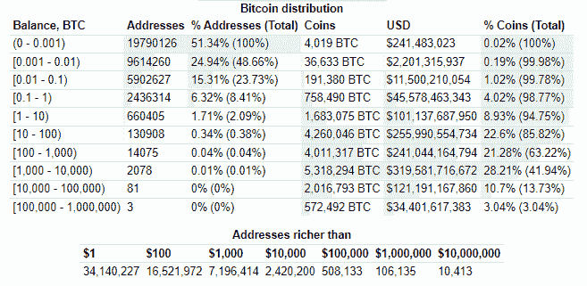

# 比特币与财富和权力的集中

> 原文：<https://medium.com/coinmonks/bitcoin-and-the-concentration-of-wealth-and-power-eef6296a8df4?source=collection_archive---------4----------------------->

## 作者:吉姆·克雷格——2021 年 10 月 29 日

《时代》杂志最近发表了一篇题为 [*比特币仍集中在少数人手里，研究发现*](https://time.com/6110392/bitcoin-ownership/) 。其中他们描述了一小部分个人投资者控制着流通中的大部分硬币，以及大部分的矿业力量。这几点值得担心吗？在这里，我们将检查这一点。

首先是矿业力量的集中。《时代》在他们的文章中这样说

*数据显示，矿工的集中程度更为深远。NBER 发现，前 10%的矿工控制着比特币 90%的开采能力，而只有 0.1%(约 50 名矿工)控制着 50%的开采能力。*

让我们赶紧结束这个话题，告诉大家，在设计比特币时，satoshi 就预料到了矿权的集中，这不一定会引起网络的担忧。Coindesk 在 2020 年 2 月 20 日发表了一篇 Hasu 的文章，题为 [*不，矿工的集中不会打破比特币*](https://www.coindesk.com/tech/2020/02/20/no-concentration-among-miners-isnt-going-to-break-bitcoin/) ，该文章直接引用了 Satoshi 在比特币白皮书中的说法

*激励可能有助于鼓励节点保持诚实。如果一个贪婪的攻击者能够聚集比所有诚实节点更多的 CPU 能力，他将不得不选择用它来通过偷回他的付款来欺骗人们，或者用它来产生新的硬币。他应该发现，遵守规则比破坏系统和他自己财富的有效性更有利可图，这些规则给了他比其他人加起来还多的新硬币。*

Hasu 接着说*这是比特币安全的关键，同时也是比特币设计中最容易被误解的方面。*

我们认为，在这种情况下，我们认为矿业力量的集中不会给网络带来很大的风险。

现在，让我们把比特币持有者的集中度作为一个潜在问题来考察。在谷歌上快速搜索“比特币富豪榜”,我们会看到一个关于 bitinfocharts 的页面，上面有一个很棒的图表，展示了比特币是如何集中在持有者手中的。

该图显示，约 2%的比特币持有者持有约 94%的代币供应。最顶层的 0.04%拥有其中的 63%。

我们还会注意到，比特币可能比这张图描绘的更分散。因为大部分最大的比特币账户都属于中央交易所。这些交易所为尚未决定自行保管其代币的投资者保管比特币。

比特币是一种相对较新的技术。自 2008 年发布以来，比特币已经成为采用任何新技术最快的一种。我们的结论是，因为投资者发现比特币具有一些令人难以置信的货币属性，随着时间的推移，这将使其有能力成为一种伟大的价值储存手段，并有可能在某一天成为一种有用的货币。

与任何技术一样，您会经历[‘技术采用生命周期’](https://en.wikipedia.org/wiki/Technology_adoption_life_cycle)，在这个生命周期中，您会看到正态分布(钟形曲线)的采用现象。创新者首先进入，早期采用者紧随其后，以此类推。我们认为，我们仍然处于这个生命周期的早期采用者阶段，如果不是创新者的话。

现在，回到正题，**目前比特币代币的财富分配是否过于集中，这可能是件坏事吗？**我们不这么认为。

比特币的独特之处在于它的货币政策是众所周知的。只有 2100 万枚比特币会被发行，它们进入市场的时间表可以随着时间的推移进行测量。没有人能够影响比特币的供应，因为网络永远不会同意改变它。政府、企业和全球精英希望他们能够改变这一事实，但这几乎是不可能的。

随着时间的推移，比特币的大持有者将有动机(增加其持有的价值)出售他们的比特币，以在现实世界中做事情，并以某种方式为整体经济做出贡献。无论是买房，创业，还是购买自己喜欢的东西。没关系。随着比特币价格的上涨，人们会希望出售部分持股，以实现更大的目标。比特币系统被设计成允许他们这么做。NGU，“数字上升”。

这就是为什么我们预计比特币财富的分布会随着时间的推移变得更加分散。当最大的持有者体验到最大和最早的收益时，他们会想要实现收益，并会卖出一些硬币。从而将他们的财产分配给那些拥有较少而想要更多的人。

这与历史上其他货币体系不同，在这些体系中，货币被集中控制，从而被操纵，让少数人拥有大部分货币。有了比特币，少数人拥有大部分比特币的原因是，他们比任何人都更早地看到了机会，并决定冒险一试。这与操纵资金没有任何关系，只是与良好的时机和高风险容忍度有关，让他们能够尽早进入。

比特币不断受到主流媒体的攻击，因为它试图改变目前掌握权力的基础系统。它的审查阻力不变的公共账本不能被任何人欺骗，随着广泛采用，可以允许一个更公平的经济体系。

我们并没有试图忽略这一点，没错，如今大部分比特币都被少数人持有。我们只是相信，由于比特币明确的货币政策，这种财富分配将随着时间的推移而分散开来，并成为一种货币为人们服务而不是反对他们的系统。

> 加入 Coinmonks [电报频道](https://t.me/coincodecap)和 [Youtube 频道](https://www.youtube.com/c/coinmonks/videos)了解加密交易和投资

## 也阅读

 [## 最佳加密交易所| 2021 年十大加密货币交易所

### 编辑描述

blog.coincodecap.com](https://blog.coincodecap.com/crypto-exchange)  [## 2021 年 10 大最佳加密贷款平台| CoinCodeCap

### 编辑描述

blog.coincodecap.com](https://blog.coincodecap.com/crypto-lending)  [## 2021 年最佳免费加密交易机器人

### 2021 年币安、比特币基地、库币和其他密码交易所的最佳密码交易机器人。四进制，位间隙…

medium.com](/coinmonks/crypto-trading-bot-c2ffce8acb2a)